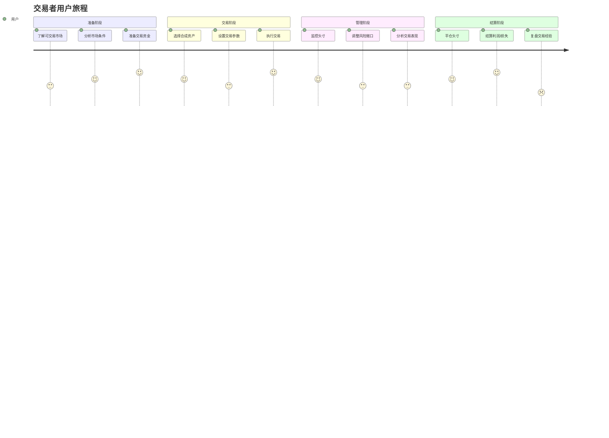
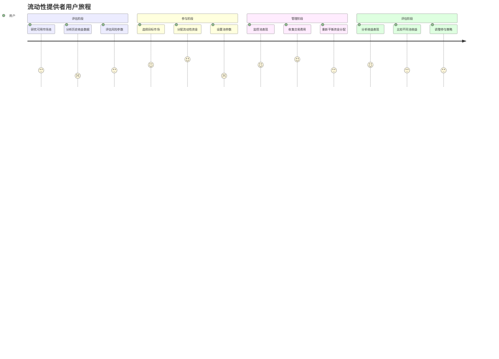
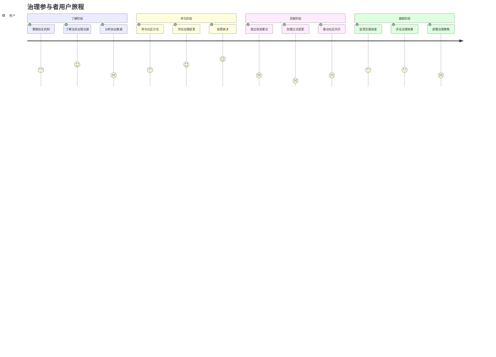
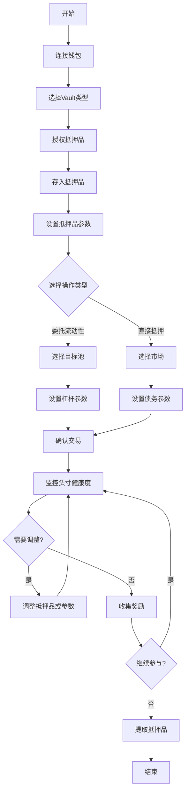
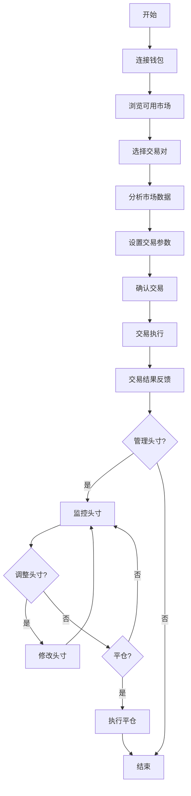

# Synthetix V3 用户体验分析

## 目录

1. [概述](#概述)
2. [用户角色分析](#用户角色分析)
3. [交互流程分析](#交互流程分析)
4. [界面与交互设计建议](#界面与交互设计建议)
5. [用户旅程优化](#用户旅程优化)
6. [教育与培训资源](#教育与培训资源)
7. [社区反馈分析](#社区反馈分析)
8. [竞争对手比较](#竞争对手比较)
9. [改进建议与路线图](#改进建议与路线图)

## 概述

本文档对Synthetix V3协议的用户体验进行全面分析，旨在识别当前设计中的优势和挑战，并提出具体的改进建议。分析基于不同用户角色的需求、交互流程的复杂性以及当前DeFi行业的最佳实践。

### 分析方法

本分析采用以下方法：

1. **用户角色划分**：识别并分析Synthetix V3的主要用户群体
2. **交互流程图**：可视化用户与协议的关键交互路径
3. **痛点识别**：确定各角色在使用过程中的主要障碍
4. **满意度评估**：分析用户满意和不满意的关键因素
5. **竞争对比**：与类似DeFi协议的用户体验进行对比
6. **改进建议**：基于分析提出具体的改进措施

### 分析重点

本文档特别关注以下方面：

- 抵押品管理体验
- 流动性池参与流程
- 风险管理工具的可用性
- 奖励机制的透明度和可理解性
- 用户教育和入门体验
- 高级用户的优化操作流程

## 用户角色分析

Synthetix V3的用户可以分为几个主要角色，每个角色有不同的需求、期望和使用模式。

### 1. 抵押品提供者

**角色描述**：
提供抵押品到系统中以获取收益的用户，是协议的核心流动性来源。

**主要目标**：
- 优化抵押品收益率
- 最小化清算风险
- 灵活管理抵押品头寸

**关键指标**：
- 收益率（APY）
- 资本效率（抵押品利用率）
- 清算风险暴露
- 操作成本（Gas费用）

**用户旅程地图**：

**体验痛点**：
1. **复杂性障碍**：理解各种Vault和Pool的风险收益特性困难
2. **监控挑战**：缺乏直观的仪表板监控抵押品健康状态
3. **参数调整**：优化杠杆和抵押品配置需要专业知识
4. **清算担忧**：对清算机制和风险的不确定性
5. **Gas费用敏感**：频繁调整抵押品的高Gas成本

**满意度因素**：
1. **收益率竞争力**：与其他DeFi协议相比的收益吸引力
2. **资产安全感**：智能合约安全性和抵押品保护措施
3. **操作灵活性**：调整抵押品和策略的自由度
4. **透明度**：奖励计算和风险暴露的清晰说明
5. **工具支持**：辅助决策和风险管理的工具可用性

### 2. 交易者

**角色描述**：
使用Synthetix V3平台进行合成资产交易的用户，寻求有效的价格发现和交易执行。

**主要目标**：
- 最小化滑点和交易成本
- 访问多样化的合成资产
- 执行各种交易策略
- 高效的头寸管理

**关键指标**：
- 执行价格与预期价格的偏差
- 交易深度和流动性
- 交易确认时间
- 费用结构透明度

**用户旅程地图**：

**体验痛点**：
1. **流动性分散**：跨不同Pool的流动性分散可能导致滑点
2. **交易延迟**：在高波动期交易确认时间长
3. **界面复杂性**：高级交易功能的导航和使用难度
4. **费用预测**：难以准确预估交易的总成本
5. **市场数据**：实时市场数据和分析工具的局限性

**满意度因素**：
1. **执行质量**：交易的准确性和可靠性
2. **资产多样性**：可交易合成资产的范围
3. **费用竞争力**：与中心化交易所相比的成本效益
4. **工具集成**：交易工具和分析功能的全面性
5. **移动体验**：在移动设备上监控和执行交易的能力

### 3. 流动性提供者

**角色描述**：
为特定市场池提供流动性的用户，赚取交易费用和激励，是市场深度的重要贡献者。

**主要目标**：
- 最大化流动性提供收益
- 管理无常损失风险
- 选择最优市场进行参与
- 优化资本配置

**关键指标**：
- 费用收益率（交易量和费率）
- 池特定奖励
- 资本利用率
- 市场风险敞口

**用户旅程地图**：

**体验痛点**：
1. **信息不对称**：难以获取全面的池表现历史数据
2. **复杂的收益结构**：多种收益来源计算复杂
3. **再平衡成本**：调整不同池资金分配的高Gas成本
4. **风险评估困难**：缺乏统一的风险评分系统
5. **市场变化响应**：对市场条件变化的延迟感知

**满意度因素**：
1. **收益透明度**：清晰展示和预测收益构成
2. **自动化工具**：优化资金分配的辅助功能
3. **风险洞察**：对不同市场风险特性的深入分析
4. **灵活性**：进入和退出流动性池的便捷性
5. **奖励机制**：额外激励的吸引力和可预测性

### 4. 治理参与者

**角色描述**：
参与协议治理决策的用户，通常持有治理代币并对协议发展方向有发言权。

**主要目标**：
- 影响协议参数和发展方向
- 保护和增强协议价值
- 推动创新和改进
- 代表社区利益

**关键指标**：
- 提案参与率
- 治理决策影响力
- 治理代币价值
- 社区共识水平

**用户旅程地图**：

**体验痛点**：
1. **信息负载**：处理大量治理相关信息的困难
2. **技术门槛**：参与某些高级治理活动需要技术背景
3. **时间投入**：有效参与需要大量时间跟踪和研究
4. **治理复杂性**：多层次治理结构的导航挑战
5. **结果可见性**：治理决策效果的延迟反馈

**满意度因素**：
1. **透明度**：决策过程和结果的公开透明
2. **包容性**：不同规模持币者的意见被重视
3. **响应性**：治理系统对社区反馈的响应速度
4. **教育资源**：帮助理解复杂议题的辅助材料
5. **实施效率**：通过的提案被有效实施的程度

### 5. 开发者和集成商

**角色描述**：
基于Synthetix V3构建应用或将其集成到现有系统中的技术用户。

**主要目标**：
- 理解和利用协议API
- 构建可靠的集成
- 探索新的应用场景
- 优化用户体验

**关键指标**：
- API文档完整性
- 集成所需时间
- 技术支持响应速度
- 开发者工具可用性

**用户旅程地图**：

**体验痛点**：
1. **文档不足**：某些高级功能缺乏详细文档
2. **示例稀缺**：复杂集成场景的工作示例不足
3. **测试环境限制**：测试网环境与主网差异
4. **版本兼容性**：协议更新对现有集成的影响
5. **调试难度**：复杂操作的错误追踪和调试挑战

**满意度因素**：
1. **文档质量**：文档的全面性、准确性和更新及时性
2. **SDK可用性**：易用的开发工具包和库
3. **社区支持**：活跃的开发者社区和支持渠道
4. **向后兼容性**：协议更新中的兼容性考虑
5. **灵活性**：API的灵活性和可扩展性

## 交互流程分析

本节分析用户与Synthetix V3交互的关键流程，识别流程中的优势和潜在改进点。

### 抵押品管理流程

抵押品管理是用户与协议交互的核心流程之一，涉及存入、管理和提取抵押品。

#### 流程图

#### 流程优势

1. **模块化设计**：
   - 将抵押品和债务管理分离，提高灵活性
   - 支持不同类型的抵押品和多种用途

2. **风险管理控制**：
   - 用户可以设置个性化风险参数
   - 提供实时健康度监控

3. **多场景支持**：
   - 适应不同用户需求的多种抵押方式
   - 支持从保守到激进的各种策略

#### 流程痛点

1. **决策复杂性**：
   - 选择合适的Vault和Pool需要专业知识
   - 参数设置对新用户难以理解

2. **多步骤流程**：
   - 完成抵押过程需要多次交易确认
   - 增加了用户操作时间和Gas成本

3. **反馈延迟**：
   - 交易确认后状态更新有延迟
   - 参数调整效果不能立即可见

#### 改进建议

1. **简化入口流程**：
   - 提供引导式抵押流程，减少决策点
   - 开发"一键优化"功能自动设置参数

2. **增强可视化**：
   - 添加实时模拟器预览参数变更效果
   - 提供风险评估视觉仪表板

3. **批处理操作**：
   - 实现多步骤操作的批处理，减少交易次数
   - 开发Gas优化策略减少操作成本

### 交易体验流程

交易体验涉及用户如何在Synthetix V3平台上交易合成资产。

#### 流程图

#### 流程优势

1. **市场多样性**：
   - 支持多种合成资产和交易对
   - 提供不同风险特性的市场选择

2. **流动性整合**：
   - 汇集多个Pool的流动性提高深度
   - 降低大额交易的滑点

3. **透明定价**：
   - 基于预言机的透明价格发现
   - 减少价格操纵风险

#### 流程痛点

1. **市场分散**：
   - 不同池的流动性分散影响深度
   - 用户需要比较多个池的条件

2. **交易执行延迟**：
   - 区块确认时间导致的交易延迟
   - 价格波动期间的执行不确定性

3. **高级功能复杂**：
   - 条件单和止损等高级功能学习曲线陡峭
   - 缺乏交易策略模板

#### 改进建议

1. **智能路由系统**：
   - 开发自动路由系统优化交易执行路径
   - 跨池流动性聚合提高整体深度

2. **预执行模拟**：
   - 提供交易前的执行模拟和成本预估
   - 显示不同执行策略的对比分析

3. **策略模板库**：
   - 创建预设交易策略模板供用户选择
   - 提供策略绩效分析和比较工具
