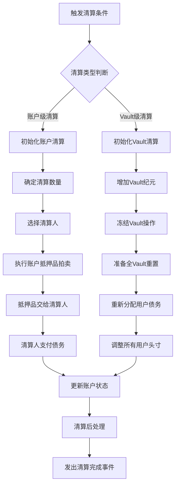
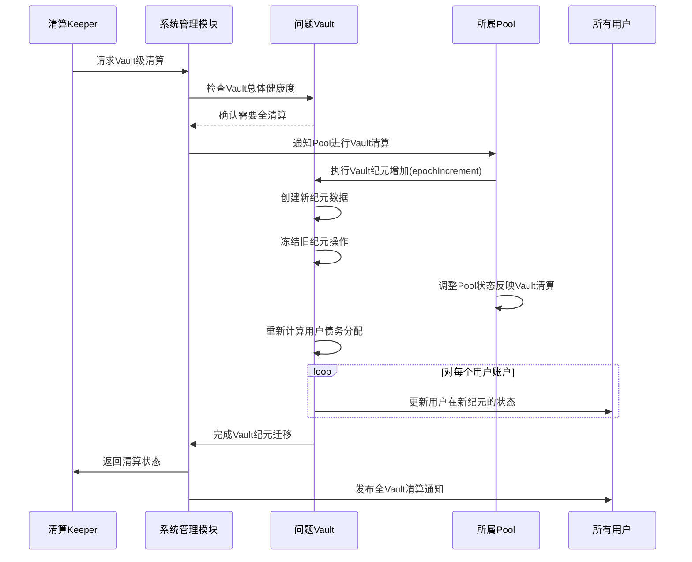
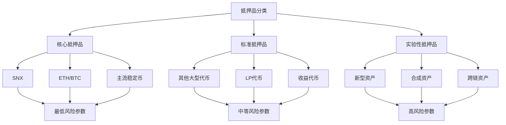
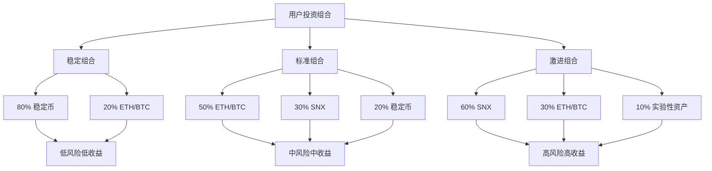
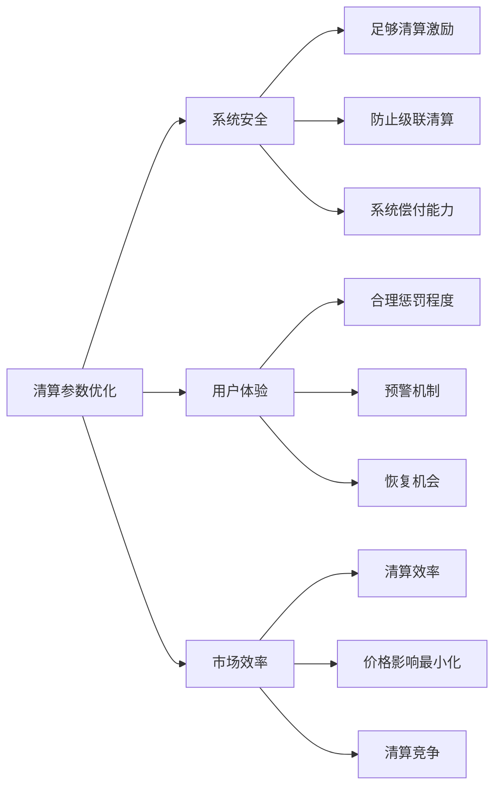

# Synthetix V3 抵押品管理流程（二）

## 清算流程与高级抵押品管理

*接续《抵押品管理流程》文档第一部分*

## 4. 清算流程

当抵押品价值下降或债务价值上升导致抵押率(C-Ratio)低于最低要求时，将启动清算流程：



### 4.1 账户级清算

当单个账户抵押率不足时触发：

```solidity
// 伪代码展示账户清算流程
function liquidateAccount(
    uint128 accountId,
    uint128 poolId,
    address collateralType
) external nonReentrant {
    // 获取账户当前状态
    AccountPosition memory position = vaults[poolId][collateralType].getAccountPosition(accountId);
    
    // 验证是否可清算
    require(isLiquidatable(position), "Account not liquidatable");
    
    // 计算清算金额和奖励
    (uint256 debtToLiquidate, uint256 collateralToLiquidate, uint256 liquidatorReward) = 
        calculateLiquidationAmounts(position);
    
    // 执行清算操作
    vaults[poolId][collateralType].liquidateAccount(
        accountId, 
        debtToLiquidate, 
        collateralToLiquidate,
        msg.sender
    );
    
    // 转移抵押品给清算人
    IERC20(collateralType).safeTransfer(msg.sender, collateralToLiquidate);
    
    // 更新系统债务状态
    poolModule.updatePoolDebt(poolId, -int256(debtToLiquidate));
    
    emit AccountLiquidated(
        accountId, 
        poolId, 
        collateralType, 
        debtToLiquidate, 
        collateralToLiquidate, 
        liquidatorReward,
        msg.sender
    );
}
```

#### 账户清算参数

Synthetix V3使用以下参数控制清算过程：

| 参数 | 典型值 | 描述 |
|-----|-------|-----|
| 清算阈值 | 120-150% | 触发清算的最低C-Ratio |
| 清算惩罚 | 5-10% | 清算人获得的额外抵押品比例 |
| 最大清算比例 | 50% | 单次可清算的最大债务比例 |
| 清算冷却期 | 1小时 | 同一账户连续清算的最小间隔 |

### 4.2 Vault级清算

当整个Vault健康状况严重恶化时，触发全Vault清算：



#### Vault纪元系统设计

Vault纪元系统是V3清算机制的关键设计：

```solidity
// 简化的Vault纪元数据结构
struct VaultEpoch {
    uint256 id;                 // 纪元ID（递增）
    uint256 startTime;          // 纪元开始时间
    uint256 totalCollateralValue; // 纪元开始时总抵押品价值
    uint256 totalDebtValue;     // 纪元开始时总债务价值
    
    mapping(uint128 => AccountPosition) accountPositions; // 用户头寸
    
    uint256 collateralLiquidated; // 已清算抵押品数量
    uint256 debtLiquidated;     // 已清算债务数量
    bool isActive;              // 纪元是否激活
}
```

纪元切换的优势：
1. **清晰的状态分隔**：每个纪元独立存储状态，便于追踪
2. **原子性清算**：整个Vault状态同时更新，减少不一致性
3. **历史记录保留**：旧纪元数据保留，支持审计和分析

## 5. 抵押品种类与风险模型

### 5.1 抵押品分类

Synthetix V3支持多种抵押品类型，每种都有特定风险配置：



### 5.2 抵押品风险参数矩阵

Synthetix V3根据抵押品特性设置不同的风险参数：

| 抵押品类型 | 最低C-Ratio | 清算阈值 | 价格考虑因素 | 最大容量 | 抵押品系数 |
|-----------|-----------|----------|------------|---------|----------|
| SNX | 300% | 150% | 低波动性优先级 | 高 | 1.0 |
| ETH/BTC | 130% | 120% | 流动性最高 | 高 | 0.9 |
| 主流稳定币 | 110% | 105% | 稳定性优先 | 中 | 0.95 |
| 其他大型代币 | 150% | 130% | 市值和波动性 | 中 | 0.8 |
| LP代币 | 200% | 150% | 底层资产和协议风险 | 低 | 0.7 |
| 收益代币 | 200% | 160% | 底层资产和收益率 | 低 | 0.6 |
| 新型资产 | 400% | 300% | 高波动性风险 | 极低 | 0.5 |

### 5.3 动态参数调整

系统根据市场条件动态调整抵押品参数：

```javascript
// 示例：动态风险参数计算
function calculateDynamicRiskParams(collateralType) {
  // 基础参数
  const baseParams = getBaseRiskParams(collateralType);
  
  // 市场条件调整因子
  const volatilityAdjustment = getVolatilityAdjustment(collateralType);
  const liquidityAdjustment = getLiquidityAdjustment(collateralType);
  const correlationAdjustment = getCorrelationAdjustment(collateralType);
  
  // 系统状态调整因子
  const systemUtilizationAdjustment = getSystemUtilizationAdjustment();
  const marketStressAdjustment = getMarketStressIndex();
  
  // 计算最终参数
  return {
    minimumCRatio: baseParams.minimumCRatio * 
                  (1 + volatilityAdjustment + systemUtilizationAdjustment),
    
    liquidationThreshold: baseParams.liquidationThreshold *
                         (1 + volatilityAdjustment * 0.5 + marketStressAdjustment),
    
    maxCapacity: baseParams.maxCapacity * 
                (1 - marketStressAdjustment) * 
                (1 - systemUtilizationAdjustment * 2),
    
    collateralFactor: baseParams.collateralFactor *
                     (1 - volatilityAdjustment * 0.3) *
                     (1 + liquidityAdjustment * 0.2)
  };
}
```

## 6. 高级抵押品策略

### 6.1 多抵押品组合策略

用户可以实施多抵押品策略优化风险和收益：



### 6.2 抵押品效率优化策略

高级用户可以使用以下策略优化抵押品效率：

#### 动态平衡策略

```javascript
// 伪代码：动态平衡策略
function dynamicRebalanceStrategy(portfolio, marketConditions) {
  // 分析当前市场状况
  const volatilityIndex = marketConditions.volatilityIndex;
  const trendDirection = marketConditions.trendDirection;
  const liquidityConditions = marketConditions.liquidityConditions;
  
  // 确定理想抵押品分布
  let idealDistribution = {};
  
  if (volatilityIndex > 0.7) { // 高波动性环境
    // 转向防御性配置
    idealDistribution = {
      stablecoins: 0.6,
      ethereum: 0.3,
      snx: 0.1,
      experimental: 0
    };
  } else if (volatilityIndex < 0.3) { // 低波动性环境
    // 更激进的配置
    idealDistribution = {
      stablecoins: 0.2,
      ethereum: 0.4,
      snx: 0.3,
      experimental: 0.1
    };
  } else { // 中等波动性
    idealDistribution = {
      stablecoins: 0.4,
      ethereum: 0.4,
      snx: 0.2,
      experimental: 0
    };
  }
  
  // 根据趋势调整
  if (trendDirection > 0.5) { // 上升趋势
    idealDistribution.snx += 0.1;
    idealDistribution.stablecoins -= 0.1;
  } else if (trendDirection < -0.5) { // 下降趋势
    idealDistribution.stablecoins += 0.1;
    idealDistribution.snx -= 0.1;
  }
  
  // 计算需要的调整
  const adjustments = calculateAdjustments(portfolio.currentDistribution, idealDistribution);
  
  // 执行再平衡（如果调整足够大）
  if (isSignificantAdjustment(adjustments)) {
    executeRebalance(portfolio, adjustments);
  }
  
  return {
    newDistribution: calculateNewDistribution(portfolio, adjustments),
    expectedRisk: calculateRiskLevel(idealDistribution, volatilityIndex),
    expectedReward: calculateRewardProjection(idealDistribution, marketConditions)
  };
}
```

#### 收益最大化抵押品策略

```javascript
// 伪代码：收益最大化策略
function yieldOptimizationStrategy(availableCollateral, marketData) {
  // 分析各池和Vault的收益数据
  const vaultYieldData = marketData.vaultYields; // 包含各Vault的收益率
  const poolWeights = marketData.poolWeights; // 包含各Pool的权重分配
  const marketPerformance = marketData.marketPerformance; // 市场表现预测
  
  // 计算风险调整后收益率
  const riskAdjustedYields = {};
  
  for (const vaultId in vaultYieldData) {
    const baseYield = vaultYieldData[vaultId].baseYield;
    const volatilityFactor = vaultYieldData[vaultId].volatility;
    const collateralFactor = vaultYieldData[vaultId].collateralFactor;
    
    // 风险调整后收益率计算
    riskAdjustedYields[vaultId] = baseYield * (1 - volatilityFactor * 0.5) * collateralFactor;
  }
  
  // 优化抵押品分配
  const optimalAllocation = linearOptimization(
    riskAdjustedYields,
    poolWeights,
    marketPerformance,
    {
      totalCollateral: availableCollateral,
      minAllocation: availableCollateral * 0.1, // 最小分配
      maxAllocation: availableCollateral * 0.4, // 最大分配
      riskTolerance: 0.7 // 风险承受能力
    }
  );
  
  return {
    allocation: optimalAllocation,
    projectedYield: calculateProjectedYield(optimalAllocation, vaultYieldData),
    rebalanceFrequency: determineOptimalRebalanceFrequency(optimalAllocation, marketData)
  };
}
```

## 7. 抵押品管理最佳实践

### 7.1 个人用户最佳实践

#### 风险管理检查清单

- **定期监控**：
  - 设置C-Ratio监控提醒（建议至少每日检查）
  - 监控抵押品价格波动趋势
  - 跟踪市场波动性指标

- **缓冲策略**：
  - 维持10-20%的C-Ratio缓冲区
  - 准备应急抵押品以应对波动
  - 实施分级响应计划

- **多样化**：
  - 分散抵押品类型降低相关性风险
  - 分散跨多个池和Vault
  - 平衡稳定性资产与高收益资产

#### 优化策略样本

| 策略类型 | 适用场景 | 关键指标 | 实施要点 |
|---------|---------|---------|----------|
| 保守策略 | 风险厌恶用户 | 稳定C-Ratio，低波动 | 大比例稳定币，高缓冲区，低杠杆 |
| 标准策略 | 平衡型用户 | 中等收益，可控风险 | 混合抵押品，中等缓冲，定期再平衡 |
| 积极策略 | 风险承受型用户 | 高收益，接受波动 | 高比例SNX和波动资产，积极调整，高杠杆 |

### 7.2 协议级最佳实践

#### 抵押品接受标准

1. **核心标准**：
   - 市场流动性阈值要求
   - 价格发现机制质量
   - 智能合约风险评估
   - 相关性分析与系统影响

2. **持续评估框架**：
   - 定期风险参数审查（至少季度）
   - 市场条件触发的动态调整
   - 压力测试场景和响应计划

#### 清算参数优化



## 8. 抵押品管理工具与接口

### 8.1 监控仪表板

理想的抵押品监控仪表板应包含：

- **账户健康度视图**：
  - 实时C-Ratio监控与历史趋势
  - 清算风险预警系统
  - 价格波动影响模拟器

- **市场环境指标**：
  - 全系统抵押状况概览
  - 特定抵押品类型风险指标
  - 清算活动监控和分析

- **优化建议引擎**：
  - 基于当前状态的行动建议
  - 收益优化机会提示
  - 再平衡时机建议

### 8.2 自动化工具

推荐的抵押品管理自动化工具：

1. **安全守卫工具**：
   - 自动添加抵押品防止清算
   - 基于规则的C-Ratio维护
   - 紧急脱仓保护机制

2. **收益优化器**：
   - 自动收益收集和复投
   - 跨池抵押品再平衡
   - 基于市场条件的策略调整

## 结论

抵押品管理是Synthetix V3协议中至关重要的组成部分，直接影响系统的安全性、资本效率和用户体验。通过理解抵押品生命周期、风险模型和优化策略，用户可以更有效地参与协议并管理风险。

协议的多层次风险管理机制，包括动态参数调整、清算流程和纪元系统，共同确保了系统在各种市场条件下的稳健性。随着V3的发展，抵押品管理机制将继续优化，支持更广泛的资产类型和更复杂的金融策略。
