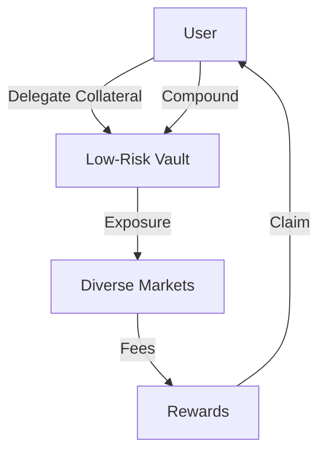

# Vaults in Synthetix V3

## Overview

Vaults are a fundamental component of the Synthetix V3 protocol, responsible for managing collateral and debt distribution for specific collateral types within a pool. Each vault is associated with a particular collateral type (e.g., SNX, ETH, stablecoins) and maintains a record of all accounts that have delegated that collateral to the pool.

Vaults serve as the primary mechanism for users to interact with the Synthetix ecosystem, allowing them to provide collateral, manage risk exposure, and earn rewards. They enable the protocol to efficiently allocate collateral to different markets while maintaining appropriate risk parameters.

## Key Functions

### Collateral Delegation

Vaults enable users to delegate their collateral to pools through the `VaultModule.delegateCollateral()` function. When users delegate collateral, they:

1. Specify the amount of collateral to delegate
2. Set a leverage value (currently limited to 1.0)
3. Gain exposure to markets supported by the pool
4. Potentially earn staking rewards

```solidity
function delegateCollateral(
    uint128 accountId,
    uint128 poolId,
    address collateralType,
    uint256 newCollateralAmountD18,
    uint256 leverage
) external
```

### Debt Management

Vaults track and distribute debt among participants using a sophisticated debt distribution system:

- `distributeDebtToAccounts()`: Distributes debt changes to all accounts proportionally
- `consolidateAccountDebt()`: Calculates the total debt for a specific account
- `updateCreditCapacity()`: Updates the vault's capacity to back markets based on collateral value

### Epoch System

Vaults implement an epoch-based system to handle liquidations cleanly:

- Each vault maintains its data in "epochs"
- When a vault-level liquidation occurs, the epoch is incremented
- This creates a clean state for all data after a liquidation event
- Historical data is preserved in previous epochs

```solidity
struct Data {
    uint256 epoch;
    mapping(uint256 => VaultEpoch.Data) epochData;
    // Other fields...
}
```

### Rewards Distribution

Vaults integrate with reward distributors to manage staking rewards:

- `updateRewards()`: Updates an account's claim on rewards based on their debt shares
- Rewards are distributed proportionally to collateral and debt positions
- Multiple reward types can be supported simultaneously

## Technical Implementation

### Storage Structure

The Vault library defines a sophisticated data structure to track collateral and debt:

```solidity
struct Data {
    uint256 epoch;
    bytes32 __slotAvailableForFutureUse;
    int128 _unused_prevTotalDebtD18;
    mapping(uint256 => VaultEpoch.Data) epochData;
    mapping(bytes32 => RewardDistribution.Data) rewards;
    SetUtil.Bytes32Set rewardIds;
}
```

The `VaultEpoch.Data` structure handles:
- Collateral amounts for each account
- Debt distribution among accounts
- Last delegation timestamp for minimum time enforcement
- Consolidated debt amounts

### Position Management

Account positions within a vault are managed through:

1. **Position Updates**: When an account delegates or withdraws collateral
2. **Debt Consolidation**: When calculating an account's debt for liquidation checks
3. **Reward Distribution**: When distributing rewards based on collateral and debt

## Integration with Other Components

### Pool Integration

Vaults exist within pools and:
- Provide collateral information to pools
- Receive debt allocation instructions from pools
- Contribute to a pool's overall collateralization ratio

#### Market Integration

Vaults provide the backing for markets through pools:
- Markets draw debt capacity based on vault collateral value
- Market performance affects debt distribution back to vaults
- Vaults enforce market-specific collateralization requirements

## Practical Use Cases

### Case 1: Liquidity Provision Strategies

#### Passive Yield Generation

Users can delegate collateral to vaults to earn passive yields without active trading:

1. **Implementation**:
   - Delegate stable assets (ETH, stablecoins) to low-risk vaults
   - Set conservative leverage (1.0x)
   - Earn rewards from market fees and protocol incentives

2. **Optimization Strategy**:
   - Monitor and compare yields across different pools
   - Balance collateral between multiple vaults to diversify exposure
   - Regularly claim and compound rewards



#### Maximizing Returns with Multi-Vault Strategy

Advanced users can optimize returns by distributing collateral across multiple vaults:

1. **Implementation**:
   - Delegate high-quality collateral (e.g., ETH) to vaults backing volatile markets
   - Delegate stablecoins to vaults with more stable market exposure
   - Use SNX in specialized vaults to maximize protocol rewards

2. **Risk Management**:
   - Set collateralization alerts based on market volatility
   - Implement a contingency plan for rapid debt adjustment
   - Use debt hedging across vaults when possible

### Case 2: Market-Making & Arbitrage

Vaults enable sophisticated market-making strategies through their debt system:

1. **Delta-Neutral Market Making**:
   - Use vault collateral to gain exposure to synthetic assets
   - Hedge positions in external markets
   - Profit from trading fees and rewards while minimizing directional risk

2. **Cross-Market Arbitrage**:
   - Leverage vault positions to capture price discrepancies
   - Between Synthetix V3 markets and external DEXs/CEXs
   - Across different vaults with varying debt compositions

```solidity
// Pseudo-code for an arbitrage strategy using vaults
function executeArbitrage(
    uint128 accountId,
    uint128 poolId,
    address collateralType,
    uint256 opportunitySize
) external {
    // 1. Delegate collateral to vault
    vault.delegateCollateral(
        accountId,
        poolId,
        collateralType,
        opportunitySize,
        1.0 // Leverage
    );
    
    // 2. Use debt capacity to execute trades
    perpsMarket.submitOrder(/* order params */); 
    
    // 3. Capture arbitrage in external market
    externalExchange.executeTrade(/* trade params */);
    
    // 4. Realize profit and adjust position
    perpsMarket.closePosition(/* position params */);
    
    // 5. Optionally withdraw profits
    vault.withdrawCollateral(
        accountId,
        poolId,
        collateralType,
        profitAmount
    );
}
```

### Case 3: Governance & Economic Participation

Vaults serve as entry points for protocol governance participation:

1. **Staking for Protocol Influence**:
   - Delegate SNX to governance-eligible vaults
   - Earn voting rights proportional to staked amount
   - Participate in key protocol decisions

2. **Economic Policy Participation**:
   - Exposure to protocol debt provides alignment with economic policies
   - Incentivizes participation in debt management decisions
   - Creates natural stakeholders for protocol improvements

## Best Practices

### Optimizing Collateral Efficiency

1. **Collateral Selection Strategy**:
   - Match collateral type to intended market exposure
   - Higher quality collateral (ETH, BTC) for volatile markets
   - Stablecoins for lower-volatility market exposure
   - SNX for maximum protocol rewards

2. **C-Ratio Management**:
   - Maintain target C-ratio with 10-15% buffer above minimum
   - Set up monitoring tools for real-time C-ratio tracking
   - Implement gradual adjustments rather than large position changes

```javascript
// Example collateral efficiency monitoring logic
function calculateOptimalBuffer(marketVolatility, collateralType) {
  const baseBuffer = 0.15; // 15% baseline buffer
  const volatilityFactor = marketVolatility * 0.5; 
  const collateralRiskFactor = getCollateralRiskFactor(collateralType);
  
  return baseBuffer + volatilityFactor + collateralRiskFactor;
}

function monitorPosition(accountId, vaultId, targetBuffer) {
  const currentCRatio = getCurrentCRatio(accountId, vaultId);
  const minimumCRatio = getMinimumCRatio(vaultId);
  const targetCRatio = minimumCRatio * (1 + targetBuffer);
  
  if (currentCRatio < targetCRatio * 0.95) {
    // Alert user to add collateral
    notifyUser("C-ratio approaching minimum threshold");
  } else if (currentCRatio > targetCRatio * 1.25) {
    // Alert user about inefficient collateral usage
    notifyUser("C-ratio significantly above target");
  }
}
```

### Risk Management Framework

1. **Diversification Across Vaults**:
   - Spread collateral across multiple vaults to diversify risk
   - Balance exposure between high-yield and conservative vaults
   - Consider correlations between different market exposures

2. **Hedging Strategies**:
   - External market hedges to offset vault debt exposure
   - Cross-vault hedging using negatively correlated debt profiles
   - Partial debt hedging during high volatility periods

3. **Liquidation Avoidance**:
   - Set up collateral addition automations at predetermined thresholds
   - Maintain emergency collateral reserves for rapid deployment
   - Define clear de-risking procedures for extreme market conditions

### Reward Optimization

1. **Reward Harvesting Strategy**:
   - Claim rewards at optimal gas cost intervals
   - Compound rewards based on market conditions
   - Reinvest for long-term exponential growth

2. **Tax Efficiency**:
   - Consider harvest timing for tax reporting
   - Track reward types separately (fees vs. inflation)
   - Maintain detailed records for compliance

## Advanced Vault Operations

### Vault Migration Strategies

When better vaults become available or risk profiles change, users may want to migrate positions:

1. **Gradual Migration**:
   - Withdraw collateral in phases to maintain overall C-ratio
   - Transfer to new vault gradually to average market entry conditions
   - Monitor debt redistribution impact during migration

2. **Flash Migration**:
   - Use flash loans to temporarily cover debt during migration
   - Simultaneously withdraw from one vault and delegate to another
   - Optimize for minimum debt redistribution impact

```solidity
// Pseudo-code for flash migration between vaults
function flashMigrateVault(
    uint128 accountId,
    uint128 sourcePoolId,
    uint128 targetPoolId,
    address collateralType,
    uint256 amount
) external {
    // Borrow temporary liquidity
    flashLoan.borrow(amount, collateralType);
    
    // Withdraw from source vault
    sourceVault.withdrawCollateral(
        accountId,
        sourcePoolId,
        collateralType,
        amount
    );
    
    // Delegate to target vault
    targetVault.delegateCollateral(
        accountId,
        targetPoolId,
        collateralType,
        amount,
        1.0 // Leverage
    );
    
    // Repay flash loan
    flashLoan.repay();
    
    // Reconcile debt position if needed
    if (debtMismatch > threshold) {
        rebalanceDebt(accountId, sourcePoolId, targetPoolId);
    }
}
```

### Cross-Vault Debt Optimization

Advanced users can optimize debt distribution across vaults:

1. **Debt Rebalancing**:
   - Monitor debt distribution across vaults
   - Redistribute collateral to optimize debt exposure
   - Time rebalancing during low volatility periods

2. **Strategic Debt Positioning**:
   - Increase collateral in vaults expecting positive market performance
   - Reduce exposure to vaults with markets in downtrends
   - Strategically time debt redistribution events

## Vault Performance Metrics

### Key Performance Indicators

1. **Return on Collateral (RoC)**:
   - Total rewards divided by collateral value over time
   - Comparison across different vault types
   - Risk-adjusted return calculations

2. **Debt Efficiency**:
   - Ratio of debt utilization to maximum capacity
   - Optimal range typically 70-85% of maximum
   - Historical debt efficiency trends

3. **Liquidation Risk Score**:
   - Probability of liquidation based on market volatility
   - Historical C-ratio volatility
   - Stress test scenarios

```javascript
// Example Liquidation Risk Score calculation
function calculateLiquidationRiskScore(accountId, vaultId) {
  const currentCRatio = getCurrentCRatio(accountId, vaultId);
  const minimumCRatio = getMinimumCRatio(vaultId);
  const buffer = (currentCRatio / minimumCRatio) - 1;
  
  const marketVolatility = getHistoricalVolatility(vaultId, 30); // 30-day vol
  const debtComposition = getDebtComposition(accountId, vaultId);
  
  let riskScore = 0;
  
  // Buffer factor (lower buffer = higher risk)
  riskScore += (0.5 - Math.min(buffer, 0.5)) * 50;
  
  // Volatility factor
  riskScore += Math.min(marketVolatility * 5, 30);
  
  // Debt composition factor
  for (const market of debtComposition) {
    riskScore += market.weight * market.riskFactor;
  }
  
  return Math.min(riskScore, 100); // 0-100 scale, higher = more risky
}
```

Vaults indirectly support markets by:
- Providing collateral backing for market activities
- Absorbing debt changes from market operations
- Maintaining solvency for market activities

### Liquidation System

The vault system is designed to handle both:
- **Position Liquidations**: Liquidating individual under-collateralized positions
- **Vault Liquidations**: Full liquidation of an entire vault when system solvency is at risk

## Risk Considerations

1. **Collateralization Ratios**: Vaults enforce minimum collateralization ratios to ensure system solvency
2. **Minimum Delegation Time**: Enforces a minimum time between delegation changes to prevent front-running
3. **Epoch System**: Provides clean accounting during liquidation events
4. **Position Size Limits**: Sets minimum and maximum collateral amounts to mitigate risk

## Technical Challenges and Solutions

1. **Debt Distribution Complexity**: Solved with a sophisticated debt distribution system that tracks shares
2. **Collateral Value Volatility**: Addressed through regular price updates and liquidation mechanisms
3. **Reward Accounting**: Managed with specialized data structures for efficient reward calculations
4. **Position Management**: Implemented with gas-efficient position updates using scale factors
