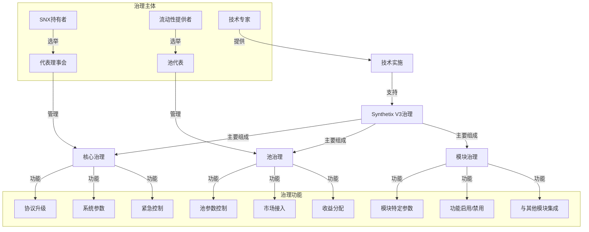
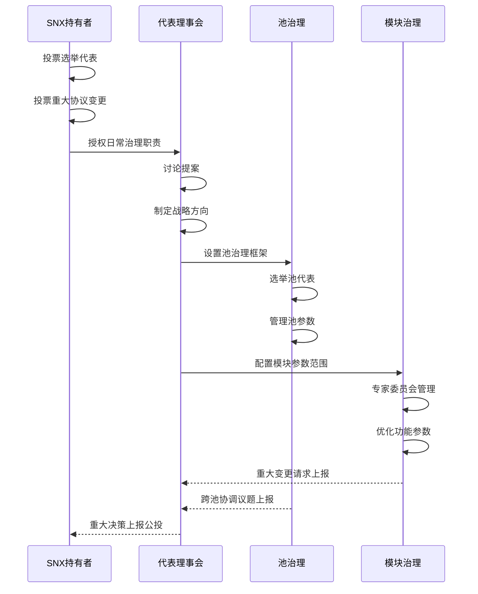
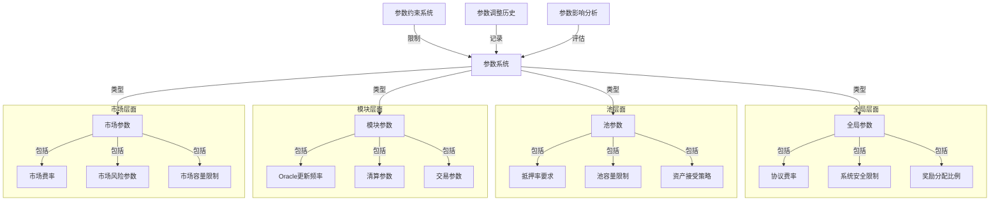
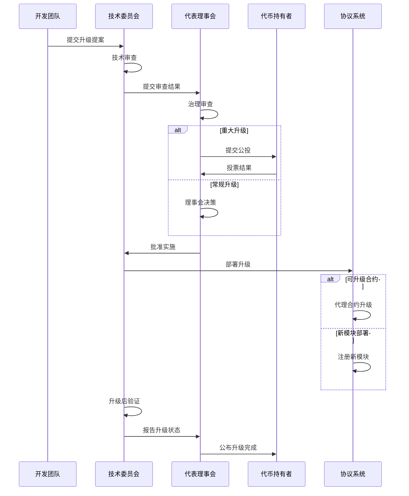
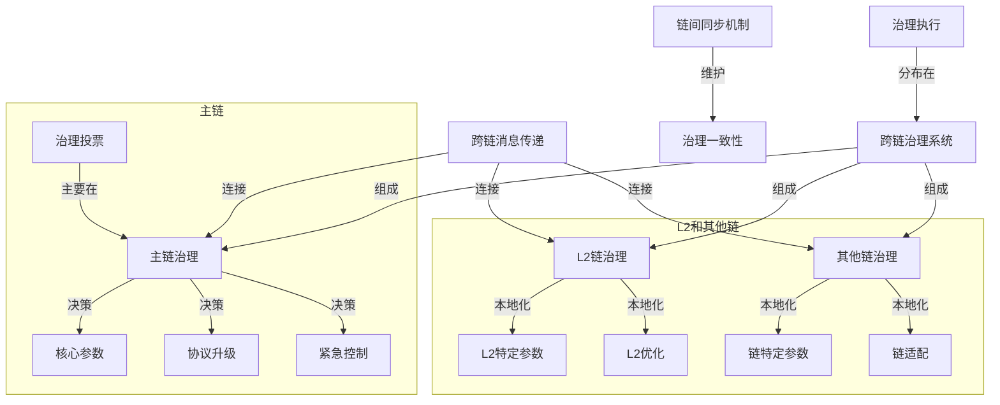
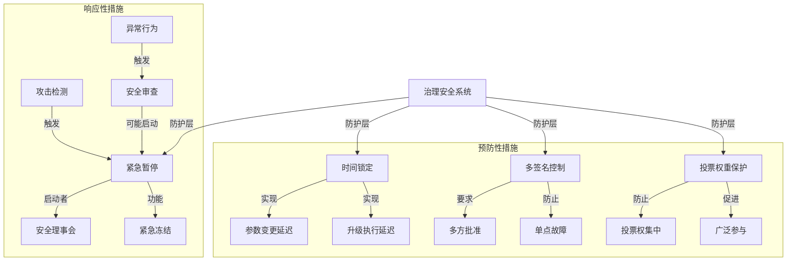

# Synthetix V3 系统治理与参数控制分析

本文档详细分析Synthetix V3的治理系统与参数控制机制，包括治理结构、参数管理和升级流程。

## 目录

1. [治理系统概述](#治理系统概述)
2. [多层次治理架构](#多层次治理架构)
3. [参数配置管理](#参数配置管理)
4. [协议升级机制](#协议升级机制)
5. [跨链治理协调](#跨链治理协调)
6. [安全防护机制](#安全防护机制)

## 治理系统概述

Synthetix V3实现了复杂而高效的治理系统，用于管理协议的运行、演进和风险控制，结合了链上投票、代表制和技术自动化。

### 治理目标与原则

Synthetix V3治理系统的设计目标：

1. **去中心化决策**
   - 分散权力避免中央控制
   - 利益相关者广泛参与
   - 透明的决策过程

2. **效率与安全平衡**
   - 及时响应市场变化
   - 确保系统安全
   - 维护协议长期稳定性

3. **适应性与可扩展性**
   - 支持系统持续演进
   - 适应不同市场条件
   - 可扩展到新链和新模块

### 治理角色与责任

Synthetix V3治理系统中的关键角色：

1. **SNX持有者**
   - 投票基本协议变更
   - 选举代表理事会
   - 批准重大系统升级

2. **代表理事会(spartan council)**
   - 执行日常治理决策
   - 提议和实施参数变更
   - 监督系统运行

3. **池代表**
   - 管理特定流动性池
   - 控制池参数和市场接入
   - 优化收益分配策略

4. **技术委员会**
   - 提供技术实施指导
   - 审核代码变更
   - 协助紧急响应

### 治理工具与基础设施

支持治理活动的技术工具：

1. **链上投票系统**
   - 基于代币的投票机制
   - 投票委托功能
   - 投票历史公开透明

2. **提案管理系统**
   - 标准化提案流程
   - 多阶段提案评审
   - 提案状态追踪

3. **治理数据分析**
   - 参数影响模拟
   - 历史决策分析
   - 治理参与度指标

## 多层次治理架构

Synthetix V3采用多层次治理架构，在不同级别实现特定的治理职能，平衡了集中决策和分散自治。

### 核心治理层

管理整个协议的基础治理结构：

1. **代币持有者投票**
   - 投票权与SNX持有量成比例
   - 支持投票委托机制
   - 投票期限和法定人数要求

2. **代表理事会运作**
   - 定期选举委员会成员
   - 理事会提案讨论流程
   - 决策执行和监督

3. **理事会权限范围**
   - 全局参数调整
   - 资金分配决策
   - 安全参数控制

### 池级治理层

特定流动性池的自治管理：

1. **池代表选举**
   - 基于LP代币持有量投票
   - 定期重新选举机制
   - 代表绩效评估

2. **池级决策权限**
   - 池特定参数控制
   - 市场接入批准
   - 收益分配策略

3. **池治理约束**
   - 受核心治理层参数限制
   - 透明决策记录要求
   - 冲突解决机制

### 模块级治理

特定功能模块的专业化管理：

1. **专家委员会**
   - 技术专家组成
   - 对特定领域负责
   - 提供技术实施建议

2. **模块参数管理**
   - 模块内部参数优化
   - 细粒度功能控制
   - 与其他模块协调

3. **模块治理范围**
   - 界定清晰的权限边界
   - 上报机制处理越界问题
   - 模块间治理协调

## 参数配置管理

Synthetix V3实现了精细的参数配置管理系统，确保协议能够适应不同的市场条件并优化其运行。

### 参数分类与结构

系统参数的组织与分类：

1. **参数分层**
   - 全局参数：影响整个系统
   - 池级参数：特定池配置
   - 模块参数：功能模块配置
   - 市场参数：特定市场控制

2. **参数元数据**
   - 参数描述和用途
   - 默认值和推荐范围
   - 调整频率指导
   - 参数依赖关系

3. **参数访问控制**
   - 基于角色的参数访问权限
   - 参数变更审批流程
   - 参数历史版本控制

### 参数变更流程

系统参数的调整与更新过程：

1. **提案初始化**
   - 参数变更提案创建
   - 提供变更理由和预期影响
   - 附加数据支持决策

2. **审查与讨论**
   - 公开讨论期
   - 技术可行性评估
   - 风险分析和模拟

3. **实施与监控**
   - 参数变更执行
   - 变更结果监控
   - 必要时回滚机制

### 参数优化策略

确保系统参数保持最优状态：

1. **数据驱动调整**
   - 基于历史性能数据
   - 市场条件适应性调整
   - A/B测试评估变更

2. **自动调整机制**
   - 某些参数实现自动调整
   - 基于预定规则和触发条件
   - 人工监督自动调整

3. **重大参数调整**
   - 重大变更的分阶段实施
   - 平滑过渡减少市场冲击
   - 全面沟通和文档

## 协议升级机制

Synthetix V3设计了安全可靠的协议升级机制，确保系统能够持续发展并适应新的需求。

### 升级类型与策略

Synthetix V3支持多种升级方式：

1. **合约升级模式**
   - 代理合约升级：UUPS或透明代理
   - 模块替换：替换现有模块
   - 新功能添加：添加新模块

2. **升级分类**
   - 紧急修复：安全漏洞和关键问题
   - 功能升级：增加新功能
   - 性能优化：改进系统性能
   - 架构变更：基础设施升级

3. **升级策略**
   - 渐进式部署：分阶段推出
   - 可选功能切换：允许平滑过渡
   - 版本兼容性管理：确保向后兼容

### 升级提案与审批

协议升级的治理流程：

1. **提案流程**
   - 标准化提案模板
   - 技术规格与影响分析
   - 安全考虑和风险评估

2. **审查流程**
   - 技术委员会代码审查
   - 外部安全审计要求
   - 社区反馈收集

3. **批准机制**
   - 基于升级影响的批准级别
   - 重大变更的投票门槛
   - 紧急升级的快速通道

### 升级实施与验证

协议升级的技术实施：

1. **部署准备**
   - 预部署测试和验证
   - 部署脚本和回滚计划
   - 升级时间窗口选择

2. **升级执行**
   - 升级交易提交
   - 升级状态监控
   - 紧急响应准备

3. **升级后验证**
   - 功能验证测试
   - 性能和安全监控
   - 升级成功确认和公告

## 跨链治理协调

Synthetix V3设计了创新的跨链治理协调机制，确保在多链部署中维持一致的治理决策。

### 跨链治理模型

多链环境下的治理架构：

1. **主导链模型**
   - 主链(如以太坊)作为治理中心
   - 主要治理决策在主链发生
   - 其他链执行主链决策

2. **联邦治理模型**
   - 各链有一定自治权
   - 全局决策需跨链共识
   - 本地决策由本地治理管理

3. **混合治理模型**
   - 分层治理责任
   - 全局参数集中管理
   - 链特定参数本地管理

### 治理决策传播

跨链治理决策的同步与执行：

1. **消息传递机制**
   - 使用跨链消息桥
   - 治理决策序列化传输
   - 消息验证与确认

2. **执行协调**
   - 同步执行时间窗口
   - 执行确认回报
   - 执行失败处理策略

3. **版本控制**
   - 跨链治理决策版本跟踪
   - 确保按序执行
   - 防止重放和遗漏

### 链特定治理自治

各链本地治理的自治范围：

1. **本地参数自治**
   - 链特定性能参数
   - 资源使用优化
   - 用户体验调整

2. **紧急响应自治**
   - 本地链紧急情况处理
   - 临时参数调整权限
   - 与全局治理同步要求

3. **自治权限边界**
   - 明确定义本地自治范围
   - 冲突解决机制
   - 上报流程和决策

## 安全防护机制

Synthetix V3实现了多层次的治理安全防护机制，保护系统免受治理攻击和错误影响。

### 时间锁定机制

延迟执行以增加安全性：

1. **参数变更时间锁**
   - 关键参数变更延迟实施
   - 时间锁长度基于变更影响
   - 公开公示期间允许检查

2. **升级时间锁**
   - 协议升级的强制延迟
   - 延迟期间代码公开审查
   - 发现问题可取消升级

3. **时间锁例外**
   - 紧急修复快速通道
   - 例外使用的严格控制
   - 例外使用后的审查流程

### 多签名安全

关键操作的多方批准要求：

1. **多签名钱包**
   - 协议资金的多签控制
   - 重要操作的多签批准
   - 签名者多样性和独立性

2. **多签门槛设置**
   - 基于操作敏感度的不同门槛
   - 最小签名者数量要求
   - 签名者轮换和备份机制

3. **多签审计**
   - 多签操作公开透明
   - 签名者责任追踪
   - 定期安全审查

### 紧急响应系统

应对突发安全事件：

1. **紧急暂停功能**
   - 选择性功能暂停能力
   - 严格的启动条件和权限
   - 暂停后的恢复流程

2. **安全理事会**
   - 专门负责安全事件的团队
   - 快速响应授权
   - 与技术团队的协调

3. **事件响应流程**
   - 标准化响应程序
   - 沟通和报告机制
   - 事后分析和改进
