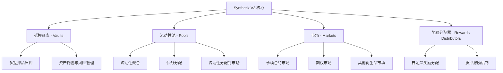

# Synthetix V3 项目架构与业务流程概览

Synthetix V3 是一个去中心化的衍生品流动性协议，它在以太坊和其他EVM兼容链上提供了一个模块化的架构和灵活的流动性提供系统。本文档将详细分析Synthetix V3的系统架构、核心组件以及业务流程。

## 目录

1. [Synthetix V3 简介](#synthetix-v3-简介)
2. [系统架构概览](#系统架构概览)
3. [核心组件详解](#核心组件详解)
4. [业务流程分析](#业务流程分析)
5. [跨链功能](#跨链功能)
6. [生态系统参与者](#生态系统参与者)
7. [技术实现与创新](#技术实现与创新)
8. [治理机制](#治理机制)
9. [总结](#总结)

## Synthetix V3 简介

Synthetix 从2017年的Havven项目开始，经历了从提供稳定币到衍生品交易平台的转变，最终演变为V3版本，成为去中心化金融(DeFi)生态系统中的基础流动性层。Synthetix V3不再是一个面向用户的衍生品平台，而是转变为其他衍生品市场的流动性提供者，为整个DeFi生态系统提供了更加灵活和强大的基础设施。

Synthetix V3的核心目标是解决传统链上衍生品平台面临的流动性获取和基础设施扩展等挑战，通过其模块化的架构和跨链功能，为衍生品市场提供深度流动性，同时降低交易成本并增强系统的可扩展性。

## 系统架构概览

Synthetix V3的架构由四个核心组件组成：抵押品库(Vaults)、流动性池(Pools)、市场(Markets)和奖励分配器(Rewards Distributors)。这些组件协同工作，形成了一个高度模块化和可扩展的系统。

## 核心组件详解

接下来的章节将详细分析每个核心组件的功能、技术实现以及它们在整个系统中的角色。
