# Synthetix V3 & 420 Pool 合约架构分析

## 任务使命 (Mission)

深入了解Synthetix V3和420 Pool的智能合约架构、核心合约结构和组件间关系，为后续的接口学习和功能开发奠定基础。

## 背景上下文 (Context)

Synthetix V3采用模块化设计，将系统功能分解为多个相互协作的合约组件。420 Pool基于Synthetix V3的核心架构构建，实现了特定的质押功能。理解这些合约的架构设计和交互方式对于有效开发和扩展相关功能至关重要。

## 执行计划 (Plan)

本文档将系统分析Synthetix V3的核心合约架构，以及420 Pool的合约结构和集成方式，包括关键合约的功能、架构模式和交互流程。

## 1. Synthetix V3 合约架构概览

### 1.1 整体架构

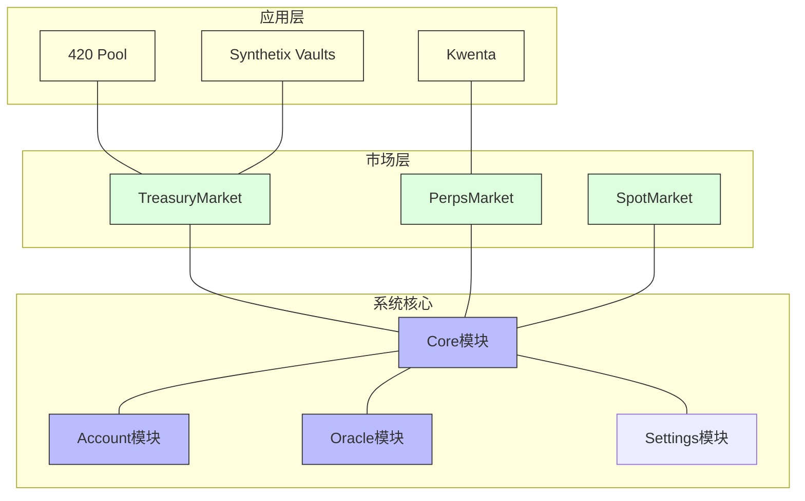

Synthetix V3的合约架构采用分层设计，主要包括以下几个层次：

1. **系统核心层**:
   - **Core模块**: 管理系统核心功能，如抵押品和债务
   - **Account模块**: 管理NFT账户和权限
   - **Oracle模块**: 提供价格预言机服务
   - **Settings模块**: 管理系统参数和配置

2. **市场层**:
   - **TreasuryMarket**: 管理质押池和流动性
   - **PerpsMarket**: 管理永续合约市场
   - **SpotMarket**: 管理现货交易

3. **应用层**:
   - **420 Pool**: 基于TreasuryMarket的特定质押池
   - **其他集成应用**: 如Kwenta、Synthetix Vaults等

### 1.2 合约模块关系

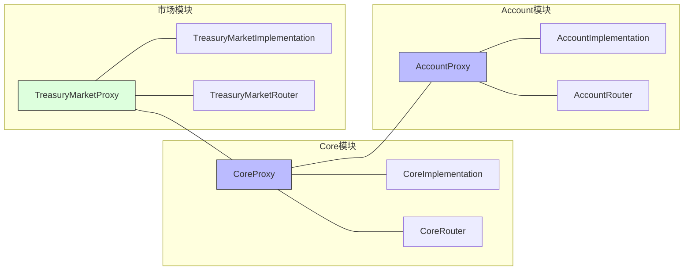

Synthetix V3的每个主要模块都遵循代理模式设计，包括以下组件：

- **Proxy合约**: 作为不变的入口点，所有外部调用通过此合约
- **Implementation合约**: 包含实际功能实现，可升级
- **Router合约**: 管理模块间的调用路由

这种设计使得系统可以保持高度模块化和可升级性，同时保持稳定的外部接口。

## 2. Core模块详解

### 2.1 Core模块结构

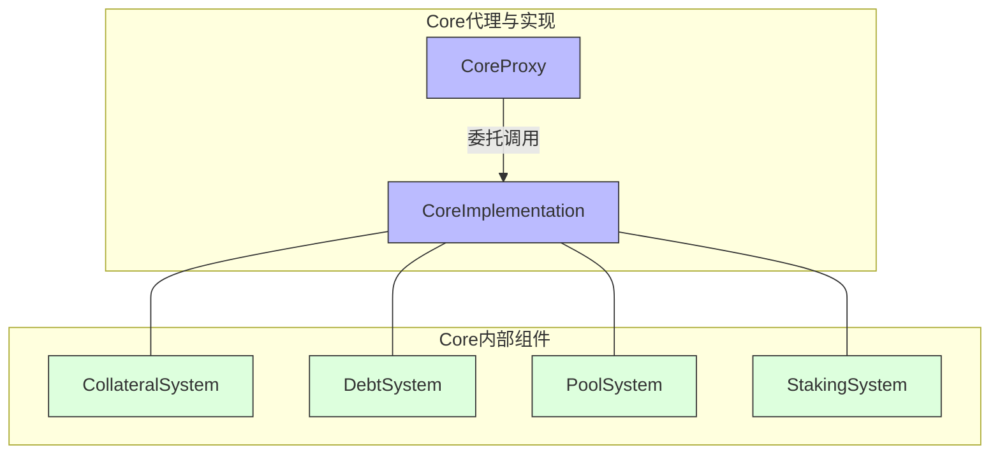

Core模块是Synthetix V3的核心组件，负责管理系统的抵押品、债务和质押逻辑。主要包括：

- **CollateralSystem**: 管理抵押品的存入和提取
- **DebtSystem**: 管理系统债务和用户债务
- **PoolSystem**: 管理质押池和流动性
- **StakingSystem**: 管理质押奖励和规则

### 2.2 Core模块主要功能

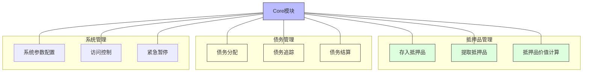

Core模块提供的主要功能包括：

**抵押品管理**:
- 支持多种抵押品类型
- 存入和提取抵押品
- 计算抵押品价值和抵押率

**债务管理**:
- 分配和追踪系统债务
- 管理用户的债务份额
- 处理债务清算和结算

**系统管理**:
- 配置系统参数
- 管理访问控制
- 提供紧急暂停功能

### 2.3 Core合约接口示例

```solidity
// Core接口示例（简化版）
interface ICore {
    // 抵押品管理
    function deposit(uint128 accountId, address collateralType, uint256 amount) external;
    function withdraw(uint128 accountId, address collateralType, uint256 amount) external;
    
    // 债务管理
    function getCollateralValue(uint128 accountId) external view returns (uint256);
    function getDebtValue(uint128 accountId) external view returns (uint256);
    
    // 系统参数
    function issuanceRatio() external view returns (uint256);
    function liquidationRatio() external view returns (uint256);
}
```

## 3. Account模块详解

### 3.1 Account模块结构

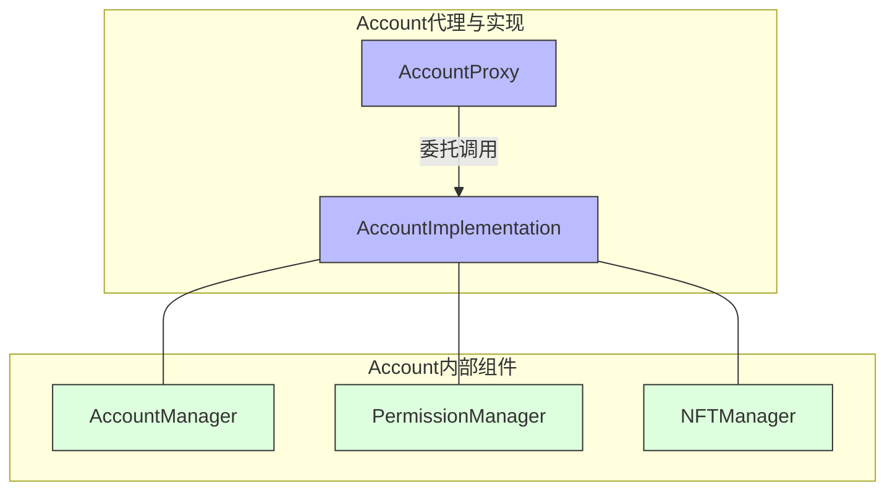

Account模块负责管理用户账户和权限，采用NFT表示账户，主要包括：

- **AccountManager**: 管理账户创建和配置
- **PermissionManager**: 管理账户权限和授权
- **NFTManager**: 管理NFT账户的铸造和转移

### 3.2 NFT账户模型

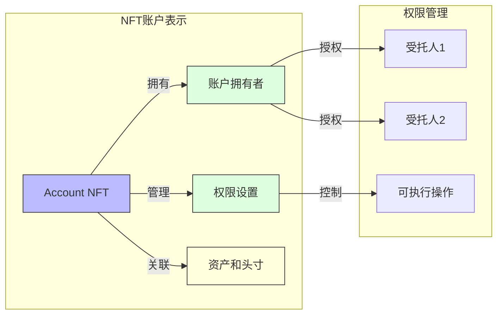

Synthetix V3的一个关键创新是NFT账户模型：

- 每个账户表示为一个唯一的NFT
- 账户拥有者可以转移账户所有权
- 支持细粒度的权限管理
- 允许账户授权给多个受托人
- 所有资产和头寸与NFT关联，而非地址

这种设计提供了更灵活的账户管理和权限控制，特别适合DeFi应用和机构用户。

### 3.3 Account合约接口示例

```solidity
// Account接口示例（简化版）
interface IAccount {
    // 账户管理
    function createAccount() external returns (uint128 accountId);
    function getAccountOwner(uint128 accountId) external view returns (address);
    
    // 权限管理
    function grantPermission(uint128 accountId, address delegate, bytes32 permission) external;
    function revokePermission(uint128 accountId, address delegate, bytes32 permission) external;
    function hasPermission(uint128 accountId, address delegate, bytes32 permission) external view returns (bool);
    
    // 临时授权
    function authorize(uint128 accountId, address authorized) external;
    function isAuthorized(uint128 accountId, address authorized) external view returns (bool);
}
```

## 4. TreasuryMarket模块详解

### 4.1 TreasuryMarket模块结构

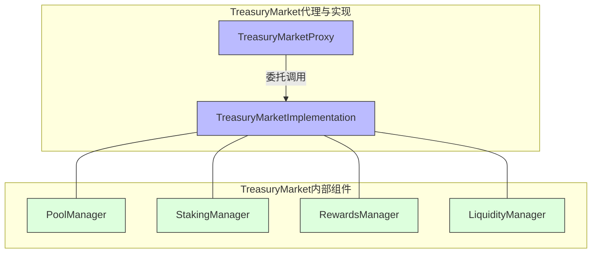

TreasuryMarket模块是420 Pool的基础，负责管理质押池和流动性。主要包括：

- **PoolManager**: 管理质押池的创建和配置
- **StakingManager**: 管理质押逻辑和规则
- **RewardsManager**: 管理奖励分配
- **LiquidityManager**: 管理流动性配置

### 4.2 TreasuryMarket主要功能

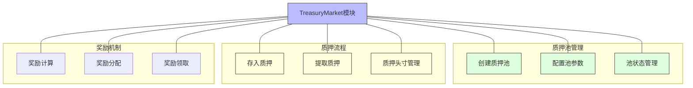

TreasuryMarket模块提供的主要功能包括：

**质押池管理**:
- 创建和配置质押池
- 管理池参数和状态
- 支持多种资产类型

**质押流程**:
- 处理质押资产的存入
- 处理质押资产的提取
- 管理质押头寸和抵押率

**奖励机制**:
- 计算和分配质押奖励
- 管理奖励发放规则
- 支持自定义奖励策略

### 4.3 TreasuryMarket合约接口示例

```solidity
// TreasuryMarket接口示例（简化版）
interface ITreasuryMarket {
    // 池管理
    function createPool(bytes32 poolId, address collateralType) external;
    function configurePool(bytes32 poolId, bytes32 parameter, uint256 value) external;
    
    // 质押操作
    function deposit(uint128 accountId, bytes32 poolId, uint256 amount) external;
    function withdraw(uint128 accountId, bytes32 poolId, uint256 amount) external;
    
    // 奖励管理
    function distributeRewards(bytes32 poolId, uint256 amount) external;
    function claimRewards(uint128 accountId, bytes32 poolId) external returns (uint256);
}
```

## 5. 420 Pool 合约架构

### 5.1 420 Pool 核心合约

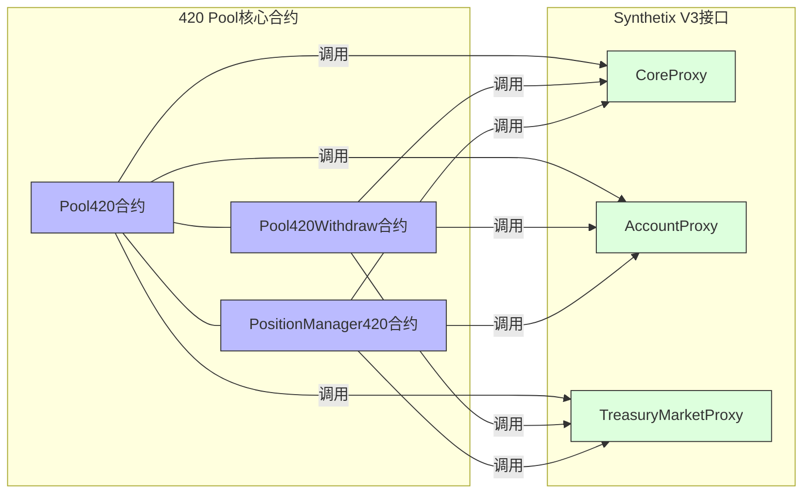

420 Pool由三个主要合约组成：

- **Pool420合约**: 处理SNX质押操作和质押池管理
- **Pool420Withdraw合约**: 处理提款流程和债务赦免逻辑
- **PositionManager420合约**: 管理用户的质押头寸和权限

这些合约通过调用Synthetix V3的核心接口（CoreProxy、AccountProxy和TreasuryMarketProxy）来实现质押功能。

### 5.2 合约间交互流程

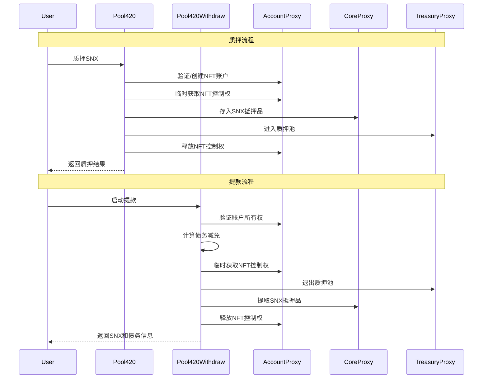

420 Pool的合约间交互遵循一致的模式：

1. 用户与Pool420或Pool420Withdraw合约交互
2. 合约验证用户权限并临时获取NFT账户控制权
3. 合约调用Synthetix V3核心接口执行操作
4. 操作完成后释放NFT控制权
5. 返回操作结果给用户

这种模式确保了操作的安全性和原子性，同时保持了与Synthetix V3核心系统的兼容性。

### 5.3 Pool420合约详解

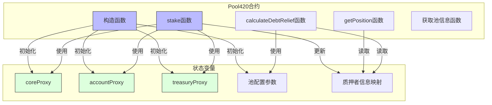

Pool420合约是420 Pool的核心，主要功能包括：

**状态变量**:
- 各种Proxy合约的引用
- 池配置参数
- 质押者信息映射

**主要函数**:
- **构造函数**: 初始化合约状态和配置
- **stake函数**: 处理SNX质押逻辑
- **getPosition函数**: 获取用户质押头寸信息
- **calculateDebtRelief函数**: 计算债务减免额度
- **池信息查询函数**: 获取池状态和配置

### 5.4 Pool420 合约接口示例

```solidity
// Pool420接口示例（简化版）
interface IPool420 {
    // 质押函数
    function stake(uint256 amount) external;
    
    // 查询质押信息
    function getPosition(address user) external view returns (
        uint256 stakedAmount,
        uint256 originalDebt,
        uint256 currentDebt,
        uint256 entryTimestamp
    );
    
    // 债务减免计算
    function calculateDebtRelief(address user) external view returns (uint256);
    
    // 池信息
    function getPoolInfo() external view returns (
        uint256 totalStaked,
        uint256 totalDebt,
        uint256 collateralizationRatio,
        uint256 jubileePeriod
    );
}
```

## 6. 合约设计模式与架构特点

### 6.1 主要设计模式

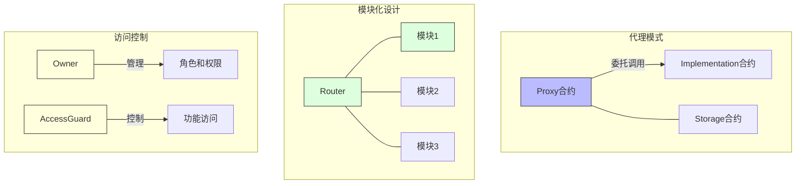

Synthetix V3和420 Pool采用了多种设计模式：

**代理模式**:
- 分离接口和实现
- 支持合约升级
- 保持状态存储

**模块化设计**:
- 将系统分解为独立模块
- 通过Router协调模块间调用
- 降低系统复杂性

**访问控制模式**:
- 基于角色的权限控制
- 细粒度的功能访问控制
- 多级权限管理

### 6.2 临时授权设计

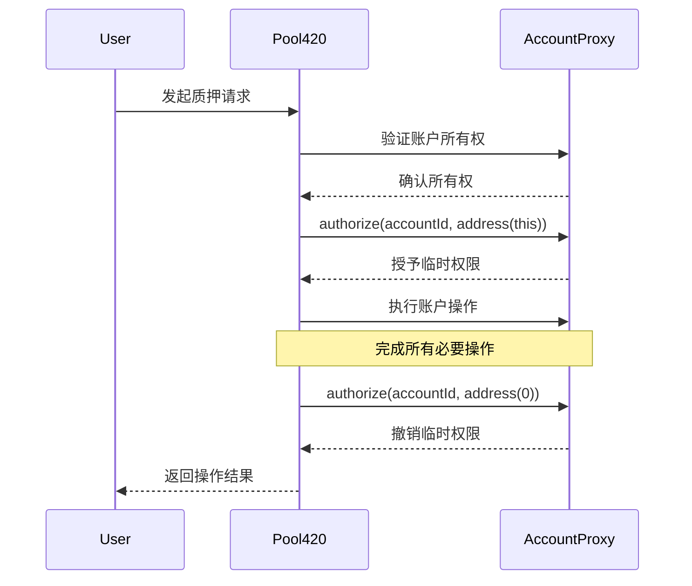

420 Pool的一个关键设计是临时授权机制：

1. 合约在操作开始时获取用户NFT账户的临时控制权
2. 执行所有必要的操作
3. 操作完成后释放账户控制权

这种设计确保：
- 操作的原子性（全部成功或全部失败）
- 高度的安全性（仅在必要时才有权限）
- 流程的简化（用户只需进行一次交易）

### 6.3 债务减免机制设计

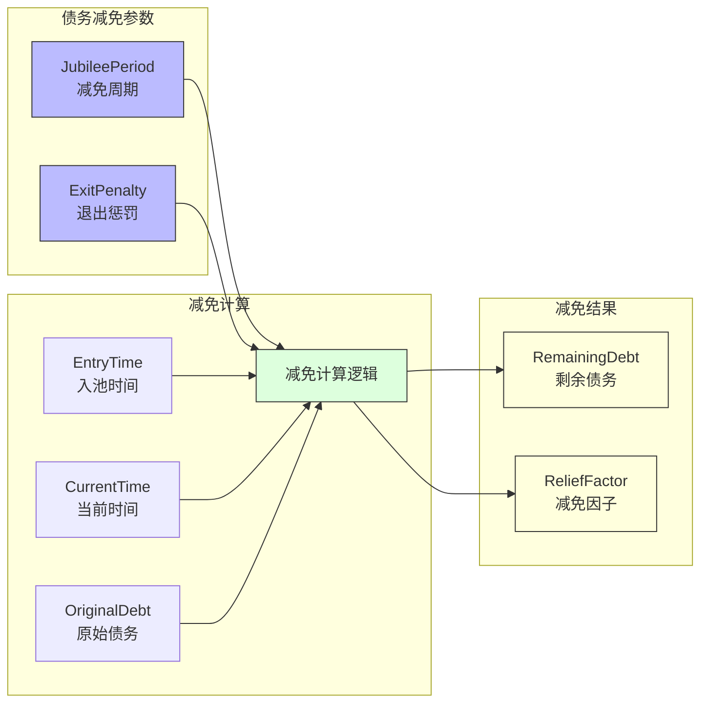

420 Pool的债务减免机制设计：

- 债务在12个月的周期内线性减少
- 减免因子 = min(1, (当前时间 - 入池时间) / 减免周期)
- 剩余债务 = 原始债务 * (1 - 减免因子)
- 提前退出时，应用退出惩罚
- 退出惩罚根据剩余债务和减免进度计算

这种设计鼓励长期质押，同时为提前退出提供合理的机制。

## 7. 合约安全特性

### 7.1 安全设计原则

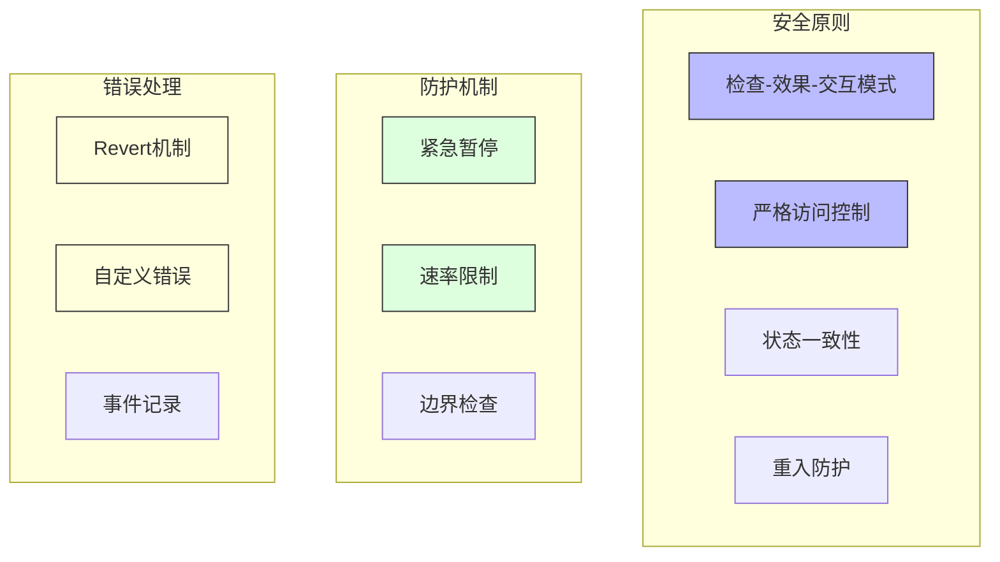

Synthetix V3和420 Pool采用了多种安全设计原则：

**安全原则**:
- **检查-效果-交互模式**: 先验证所有条件，然后修改状态，最后与外部合约交互
- **严格访问控制**: 精确定义谁可以调用每个函数
- **状态一致性**: 确保合约状态在任何条件下都保持一致
- **重入防护**: 防止重入攻击

**防护机制**:
- **紧急暂停**: 在发现问题时暂停系统
- **速率限制**: 限制操作频率和规模
- **边界检查**: 验证所有输入和状态变化

**错误处理**:
- **Revert机制**: 出现错误时撤销所有更改
- **自定义错误**: 详细的错误消息和代码
- **事件记录**: 记录重要操作和状态变化

### 7.2 审计和验证

Synthetix V3和420 Pool经过多重安全措施保障：

- **形式化验证**: 使用数学方法验证关键逻辑
- **多方审计**: 多家安全公司的全面审计
- **漏洞赏金**: 持续的漏洞赏金计划
- **模糊测试**: 自动化的模糊测试
- **阶段部署**: 逐步部署和测试

## 总结

Synthetix V3和420 Pool的合约架构采用模块化设计，通过代理模式实现可升级性，通过NFT账户模型提供灵活的权限管理。420 Pool基于Synthetix V3的核心组件构建，实现了特定的质押功能和债务减免机制。这种架构设计不仅提高了系统的可维护性和扩展性，还确保了操作的安全性和原子性。

了解这些合约的架构设计和交互方式是有效开发和扩展相关功能的基础，为后续深入学习接口细节和实现功能奠定了基础。

## 进一步学习

- 分析Synthetix V3和420 Pool的源代码
- 研究合约间调用的具体实现
- 探索债务减免算法的实现细节
- 了解合约的安全措施和审计报告
- 实践基于此架构的功能开发 