# snxUSD在Synthetix V3系统中的核心作用分析

## 1. 概述：系统核心稳定币

snxUSD作为Synthetix V3系统的核心合成美元稳定币，不仅是一种代币资产，更是整个系统功能的基础组件和价值流通的关键媒介。它与系统各模块深度集成，支撑着整个生态系统的运行。

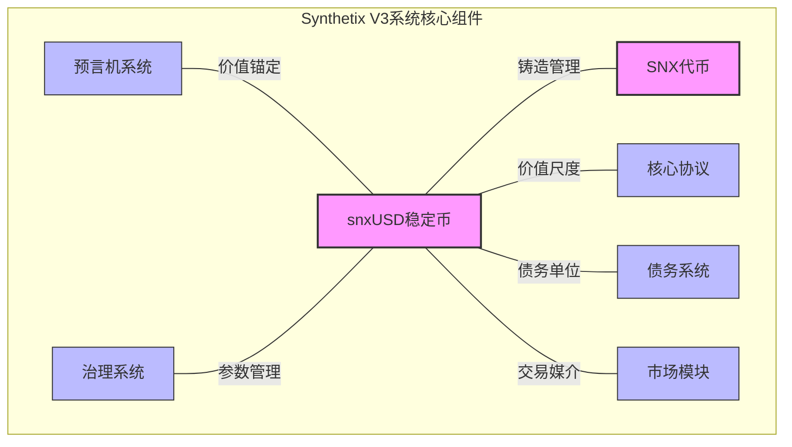

## 2. 系统功能支撑

### 2.1 债务会计单位

snxUSD是Synthetix V3中所有债务的统一计价单位，为系统提供了一致的价值尺度：

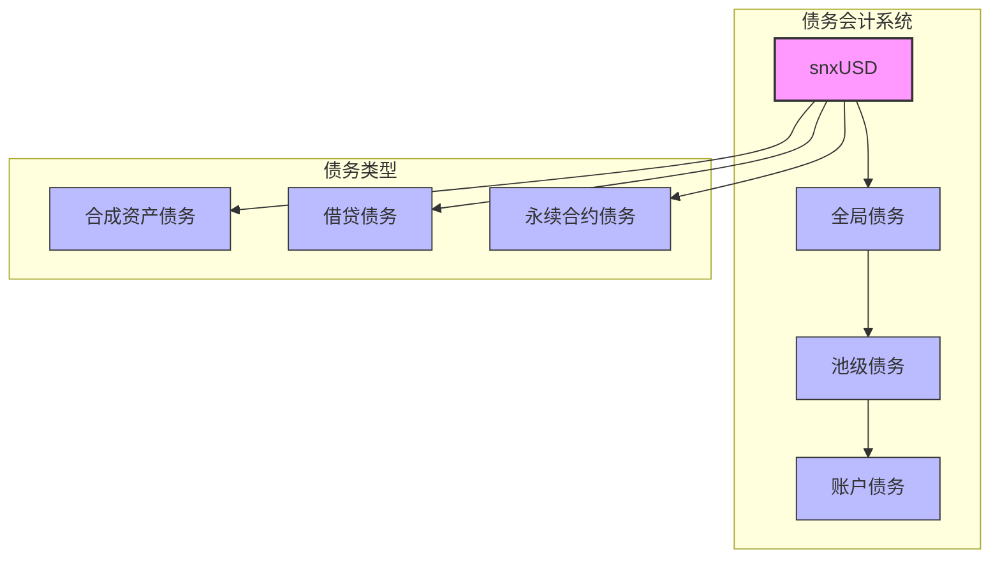

**关键功能**：
- 统一的债务度量单位，简化了跨市场债务的计算和管理
- 使不同抵押品和合成资产可以在同一会计框架下运作
- 支持多池债务隔离模型，同时保持系统整体债务的一致性

### 2.2 流动性中心枢纽

snxUSD连接系统内各个市场和功能模块，是价值在系统内高效流通的关键：

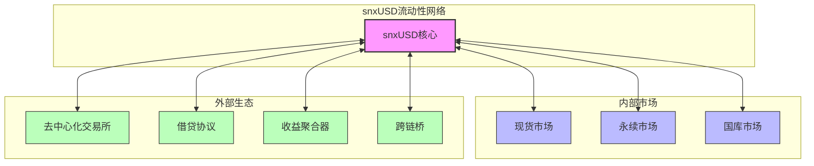

**系统价值**：
- 为各模块间的价值传递提供标准化媒介
- 降低系统内不同资产间的互操作复杂性
- 增强流动性整合和资本效率
- 简化用户跨市场操作的体验

### 2.3 合成资产基础

snxUSD是所有其他合成资产的基础和锚点：

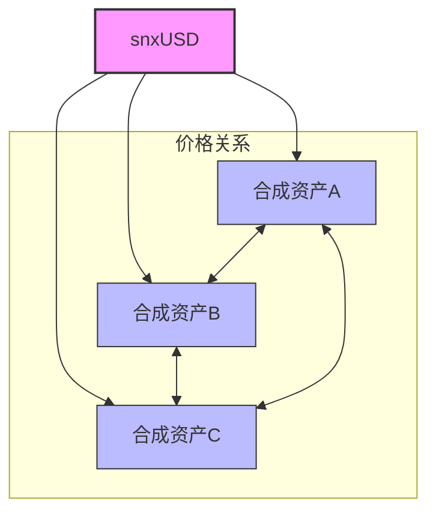

**重要性**：
- 作为所有合成资产定价和交易的参考基准
- 提供一致的标的物价格表示
- 简化合成资产间价格关系的计算

## 3. 市场模块互动

### 3.1 与各市场的互动关系

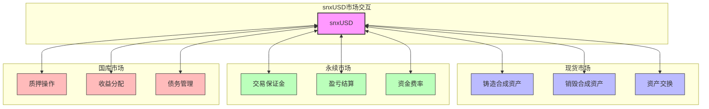

**具体交互方式**：

1. **现货市场**
   - 作为铸造/销毁合成资产的基础单位
   - 提供合成资产间交换的媒介
   - 为合成资产定价提供统一基准

2. **永续市场**
   - 充当交易保证金的主要形式
   - 用于结算交易盈亏
   - 资金费率以snxUSD计算

3. **国库市场**
   - 质押SNX后铸造的主要资产
   - 债务计量和跟踪的基本单位
   - 收益分配的标准媒介

### 3.2 操作流程示例

以下是一个综合性流程，展示snxUSD如何连接系统中的各个操作：

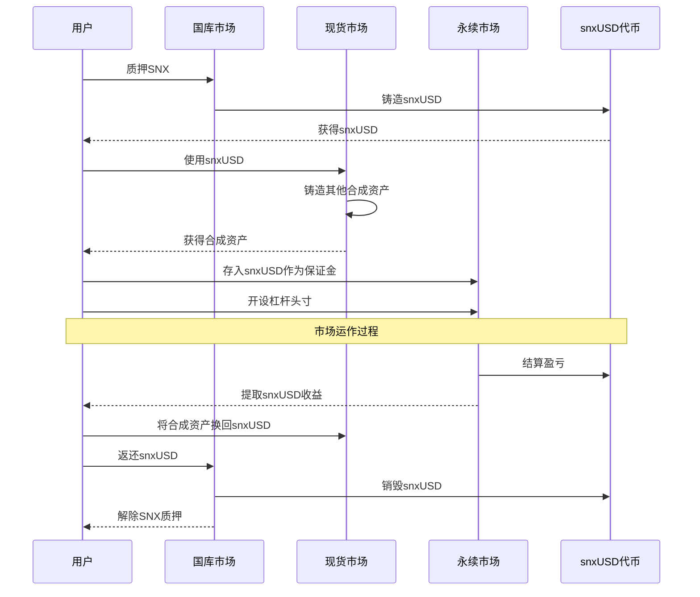

## 4. 系统稳定性与安全性

### 4.1 价格稳定性机制

snxUSD的稳定性对整个系统的安全至关重要：

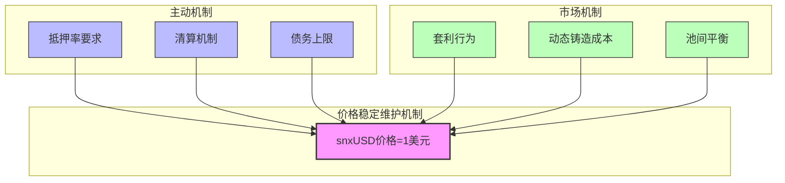

**关键机制**：
- 严格的抵押率要求确保足够的资产支撑
- 自动化清算机制防止欠抵押风险
- 债务上限控制系统风险规模
- 套利机制促使价格回归锚定值
- 池间平衡促进系统整体稳定性

### 4.2 系统健康指标

snxUSD的参数和状态是系统健康的核心指标：

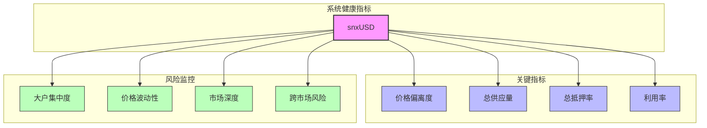

**监控重点**：
- 价格偏离度作为稳定性的直接指标
- 总供应量反映系统总杠杆水平
- 系统总抵押率指示整体安全边际
- 大户集中度用于评估鲸鱼风险
- 市场深度监控流动性健康程度

## 5. 系统扩展与创新

### 5.1 支持系统模块化

snxUSD的设计使Synthetix V3具备高度的模块化和扩展性：

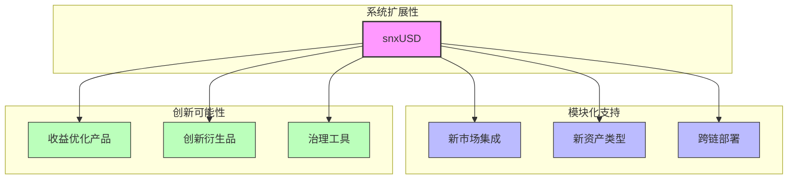

**扩展价值**：
- 标准化的稳定币接口简化新模块集成
- 统一债务单位使新市场能与现有市场无缝互操作
- 一致的价值标准允许跨链扩展
- 基于snxUSD的创新产品可以统一风险管理框架

### 5.2 与外部生态系统的桥接

snxUSD作为连接Synthetix与更广泛DeFi生态的关键桥梁：

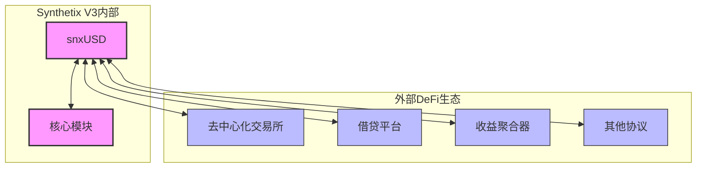

**外部整合优势**：
- 提供Synthetix系统与外部DeFi协议的标准化接口
- 拓展snxUSD的使用场景和流动性
- 创造更丰富的用户组合策略可能性
- 增加系统整体的资本效率

## 6. 多层架构视角

从系统架构视角看，snxUSD处于连接不同系统层级的核心位置：

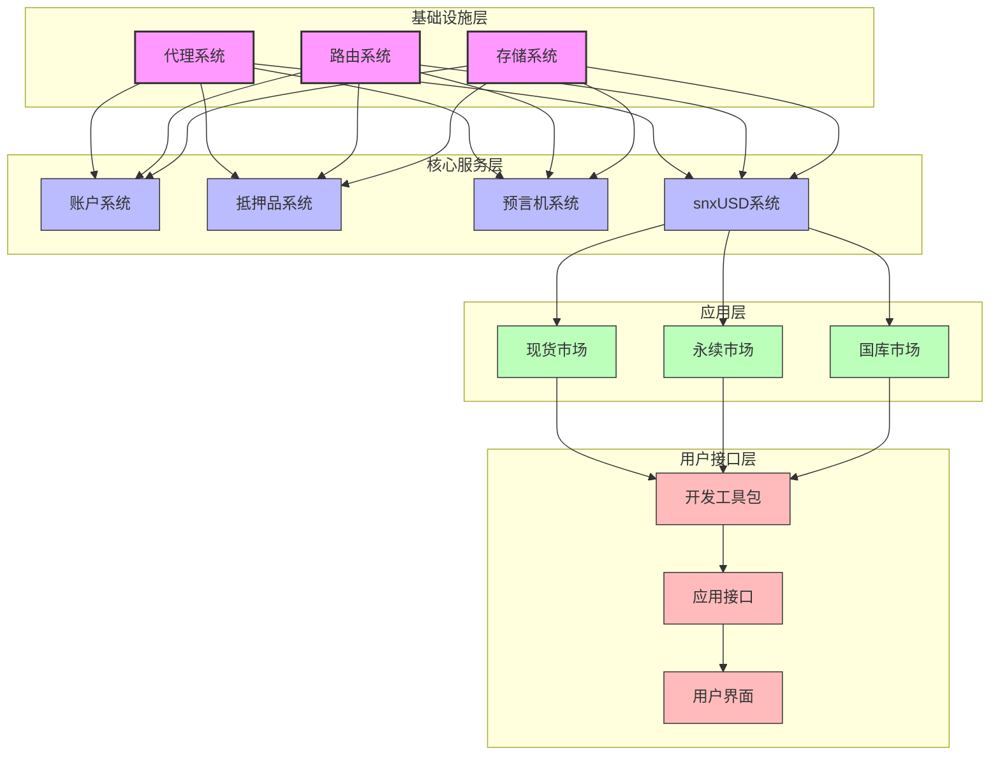

**架构意义**：
- 作为连接基础设施层与应用层的关键中间层
- 提供不同应用模块间的统一接口
- 简化系统各层间的交互复杂性
- 确保系统架构的一致性和可维护性

## 7. 关键指标与治理

snxUSD的健康与管理是系统治理的核心关注点：

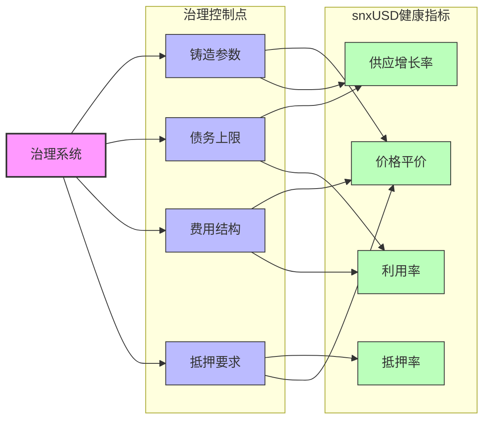

**治理重点**：
- 平衡铸造参数以维持snxUSD的稳定性
- 调整债务上限控制系统总风险
- 优化费用结构激励合理使用
- 设置适当抵押要求确保安全边际
- 密切监控关键健康指标

## 8. 生态系统整体价值

通过snxUSD，Synthetix V3实现了多种系统级价值创造：

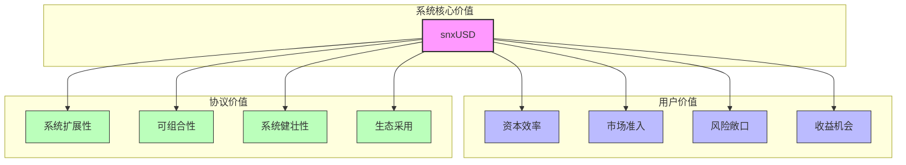

**价值贡献**：
- 提高用户资本效率和收益可能性
- 为多种市场风险敞口提供统一接口
- 增强系统整体可组合性和互操作性
- 支持协议向更多链和市场扩展
- 简化平台采用门槛提高生态发展

## 9. 与420项目的协同作用

snxUSD是连接Synthetix V3和420项目的关键纽带：

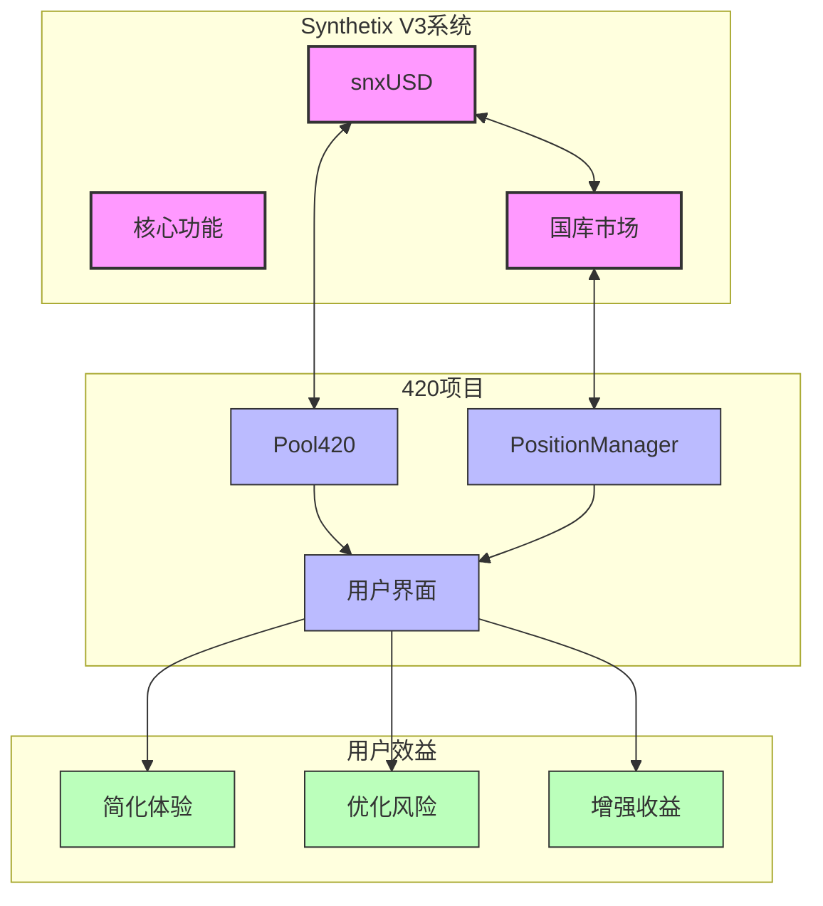

**协同关系**：
- 420项目通过snxUSD连接Synthetix V3的核心功能
- snxUSD作为420项目管理SNX质押和债务的核心媒介
- 420项目为用户提供简化的snxUSD获取和管理界面
- 共同为用户创造优化的风险-收益体验

## 10. 总结：系统支柱角色

snxUSD在Synthetix V3中扮演的核心角色可以总结为：

1. **统一价值标准**：作为整个系统的价值计量基础
2. **债务会计单位**：统一了多池模型下的债务计算
3. **流动性中心**：连接各模块和市场的价值流通媒介
4. **风险管理支柱**：抵押系统和清算机制的核心组件
5. **系统扩展基础**：支持模块化架构和生态扩展
6. **稳定性锚点**：维持系统整体价值稳定的关键
7. **互操作基础**：连接内部组件和外部生态系统的桥梁
8. **治理焦点**：系统参数调整和优化的核心目标

snxUSD不仅是一种稳定币资产，更是整个Synthetix V3系统架构、功能和价值流通的中枢神经，其稳定性和功能性直接影响着整个系统的健康与发展。 