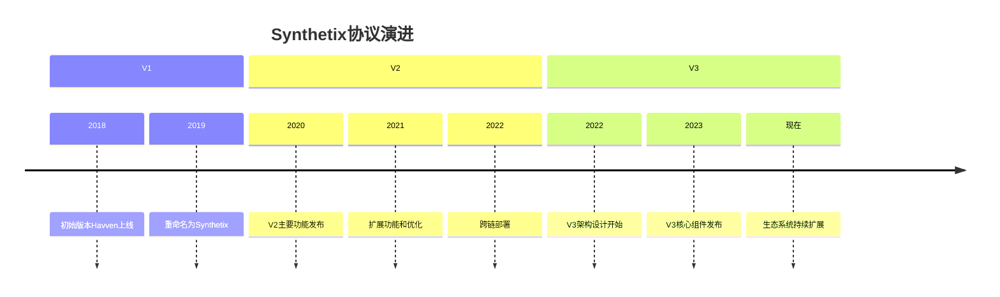
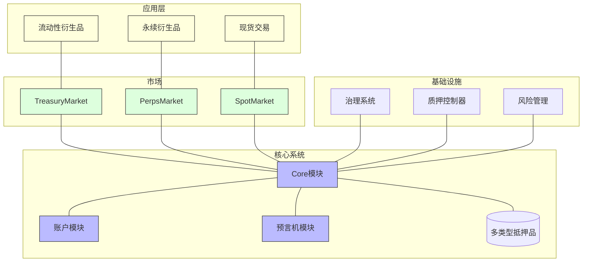
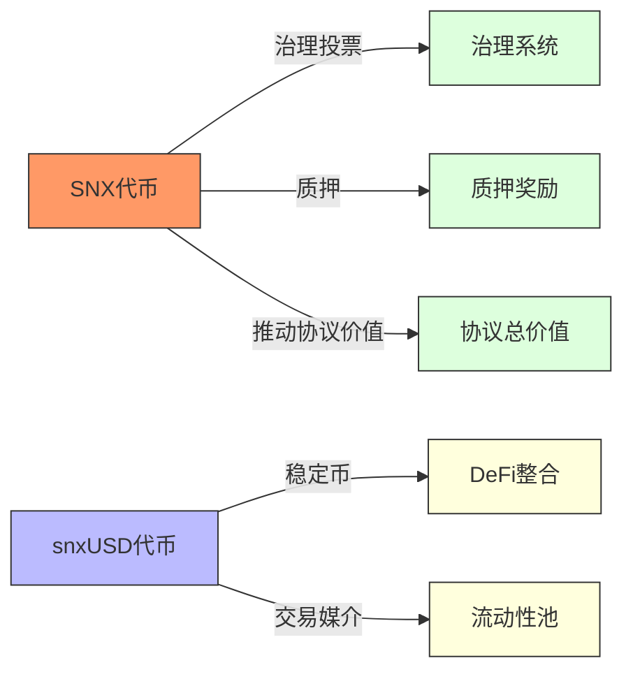
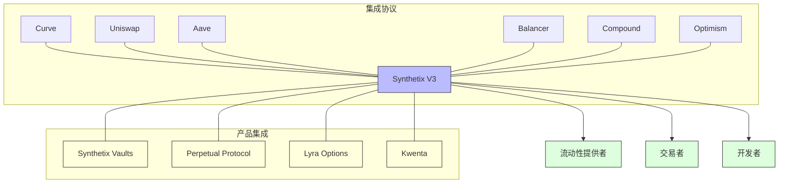
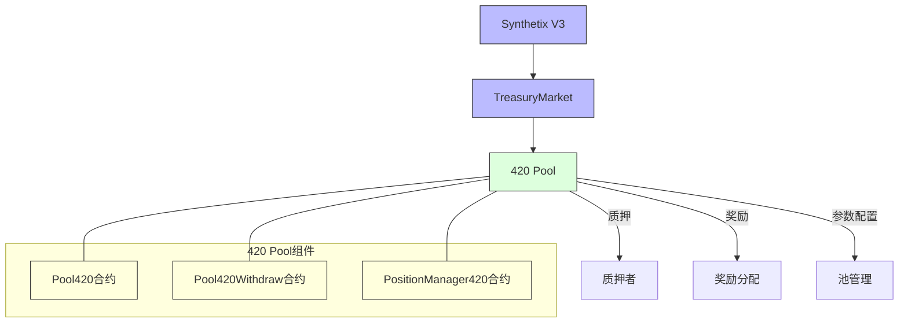
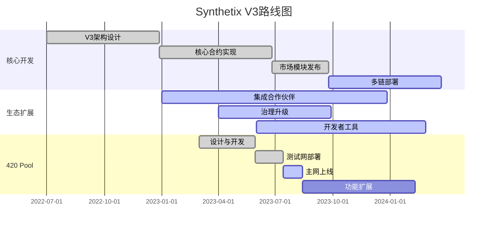

# Synthetix V3 生态概览

## 任务使命 (Mission)

理解Synthetix V3的生态系统架构、核心价值和主要组件，为深入学习其技术细节奠定基础。

## 背景上下文 (Context)

Synthetix是DeFi领域的领先协议，专注于创建各种合成资产。V3版本是对协议的重大重构，设计目标是提高可扩展性、模块化和灵活性。了解Synthetix V3的生态布局对于有效开发和集成至关重要。

## 执行计划 (Plan)

本文档将全面介绍Synthetix V3生态系统，包括其架构设计、核心组件、主要功能以及与其他DeFi协议的集成情况。

## 1. Synthetix V3 简介

### 1.1 什么是Synthetix

Synthetix是一个去中心化的合成资产协议，允许用户创建和交易各种合成资产（Synths）。这些Synths可以代表法币、加密货币、商品或其他金融资产，使用户能够在不持有实际资产的情况下获取对这些资产的价格敞口。

### 1.2 从V2到V3的演进



Synthetix V3相比V2的主要改进：

- **模块化架构**: 将系统拆分为多个独立模块，支持更灵活的升级和扩展
- **多抵押资产**: 支持多种抵押品类型，不再仅限于SNX代币
- **NFT账户模型**: 采用NFT表示用户账户，支持更复杂的权限管理
- **跨链部署**: 原生支持在多个区块链上部署和运行
- **Oracle改进**: 增强价格预言机的可靠性和灵活性
- **Gas优化**: 大幅降低交易成本，提高用户体验

## 2. 核心架构

### 2.1 系统架构概览



### 2.2 主要组件描述

| 组件名称 | 功能描述 | 关键特性 |
|---------|--------|---------|
| Core模块 | 系统核心，管理抵押品和债务 | 多抵押品支持、流动性管理 |
| 账户模块 | 用户账户管理，基于NFT | 权限管理、多签支持 |
| 预言机模块 | 价格信息提供 | 多源数据聚合、防操纵机制 |
| TreasuryMarket | 管理质押池和流动性 | 质押奖励、流动性调节 |
| PerpsMarket | 管理永续合约市场 | 杠杆交易、资金费率 |
| SpotMarket | 管理现货交易 | 即时交易、流动性池 |
| 治理系统 | 协议参数和升级管理 | 提案投票、时间锁 |
| 质押控制器 | 管理质押率和质押规则 | 动态质押率、激励机制 |
| 风险管理 | 系统风险监控和控制 | 清算机制、风险参数 |

## 3. Synthetix V3 生态系统

### 3.1 核心代币



**SNX**:
- Synthetix网络代币，用于治理和质押
- 为系统提供抵押品支持
- 质押者可获得协议费用和通胀奖励

**snxUSD**:
- Synthetix V3的主要稳定币
- 与美元保持1:1锚定
- 用于在生态系统内交易和结算

### 3.2 主要市场

Synthetix V3设计了三类主要市场，每类市场专注于不同的金融功能：

1. **TreasuryMarket (财政市场)**
   - 管理质押池和流动性
   - 处理snxUSD的铸造和销毁
   - 管理抵押品和债务比率

2. **PerpsMarket (永续合约市场)**
   - 提供去中心化永续合约交易
   - 支持高杠杆交易
   - 实现无滑点交易

3. **SpotMarket (现货市场)**
   - 提供合成资产的即时交换
   - 基于流动性池的价格发现
   - 低滑点交易体验

### 3.3 生态系统集成



Synthetix V3作为基础层协议，为多个生态系统项目提供支持：

- **Synthetix Vaults**: 自动化策略金库，用于优化收益
- **Kwenta**: 去中心化永续合约交易平台
- **Lyra Options**: 去中心化期权交易协议
- **Perpetual Protocol**: 永续合约交易平台
- **420 Pool**: 基于Synthetix V3构建的特定质押池产品

## 4. Synthetix V3 部署情况

### 4.1 多链部署

Synthetix V3当前部署在以下网络：

| 网络 | 状态 | 主要特点 |
|-----|-----|---------|
| Optimism | 生产环境 | 主要用户基础、完整功能集 |
| Base | 生产环境 | 扩展用户基础、特定市场 |
| Ethereum | 生产环境 | 安全性最高、主要治理功能 |
| Arbitrum | 开发中 | 低gas费用、高吞吐量 |

### 4.2 合约地址

主要网络上的核心合约地址：

```
// Optimism主网
CoreProxy: 0x32C222A9A159782aFD7529c87FA34b96CA72C696
AccountProxy: 0x0E429603D8Bbf384eE9A98D64e1D1F7ABFDcd3c7
TreasuryMarketProxy: 0x17AFD0263D6909Ba1F9a8EAC697f76532365Fb98

// Base主网
CoreProxy: 0x5b7d704B41076022592Aae3C975FD82d8a576599
AccountProxy: 0x62113041280DF979f84E8Ff77e4F7d837A0D3F77
TreasuryMarketProxy: 0x0BE9994912608ab0C4Ca6bf1C948f2D437b8D334
```

## 5. 420 Pool在Synthetix V3生态中的位置

420 Pool是基于Synthetix V3构建的特定质押池产品，专注于提供创新的质押方案。



### 5.1 420 Pool的主要特点

- 基于Synthetix V3的TreasuryMarket构建
- 简化的质押和提取流程
- 优化的奖励分配机制
- 特定资产的质押支持
- 专为420项目设计的功能和参数

## 6. 开发者资源

### 6.1 官方文档

- [Synthetix V3文档](https://docs.synthetix.io/v3/)
- [Synthetix V3 GitHub](https://github.com/Synthetixio/synthetix-v3)
- [Synthetix Vaults GitHub](https://github.com/Synthetixio/synthetix-vaults)

### 6.2 开发工具

- Synthetix V3 SDK
- Synthetix V3测试网部署
- 开发者Discord社区

### 6.3 学习资源

- Synthetix V3技术白皮书
- 社区教程和指南
- 视频演示和讲解

## 7. 生态系统路线图



## 总结

Synthetix V3代表了DeFi协议设计的重大进步，通过模块化架构、多抵押品支持和NFT账户模型等创新，为构建更复杂、更灵活的金融应用提供了基础。420 Pool作为Synthetix V3生态系统中的一个组成部分，展示了如何基于这一基础架构构建专业化的质押产品。

理解Synthetix V3的生态系统架构对于有效开发和集成相关功能至关重要，这将是我们后续深入学习技术细节的基础。

## 进一步学习

- 深入研究Synthetix V3白皮书
- 探索Synthetix V3 GitHub仓库代码
- 分析420 Pool与Synthetix V3的集成方式
- 了解Synthetix V3的治理机制和参数设置 