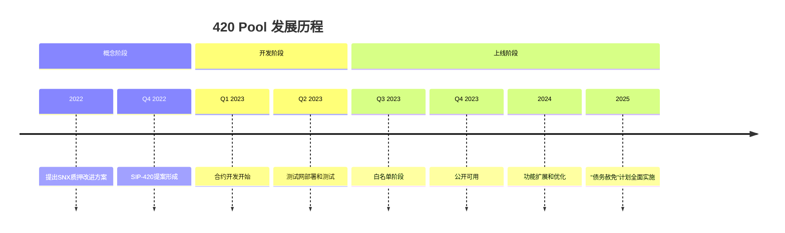
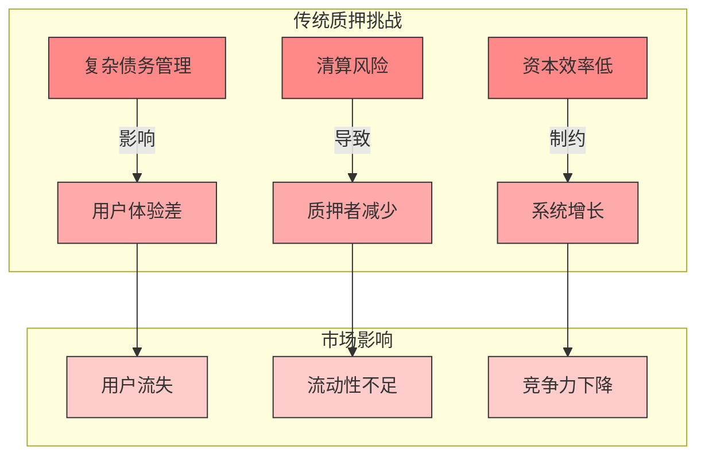
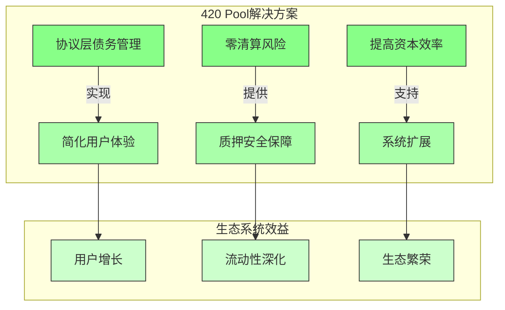
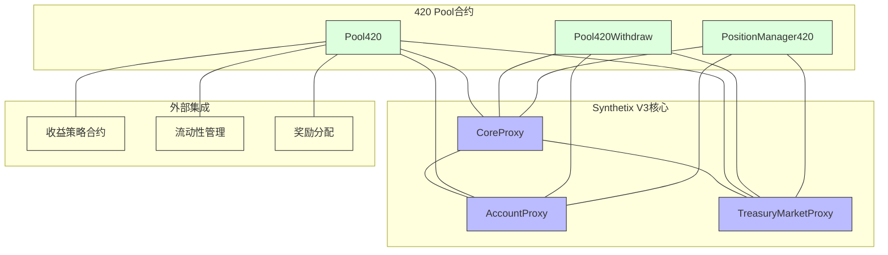
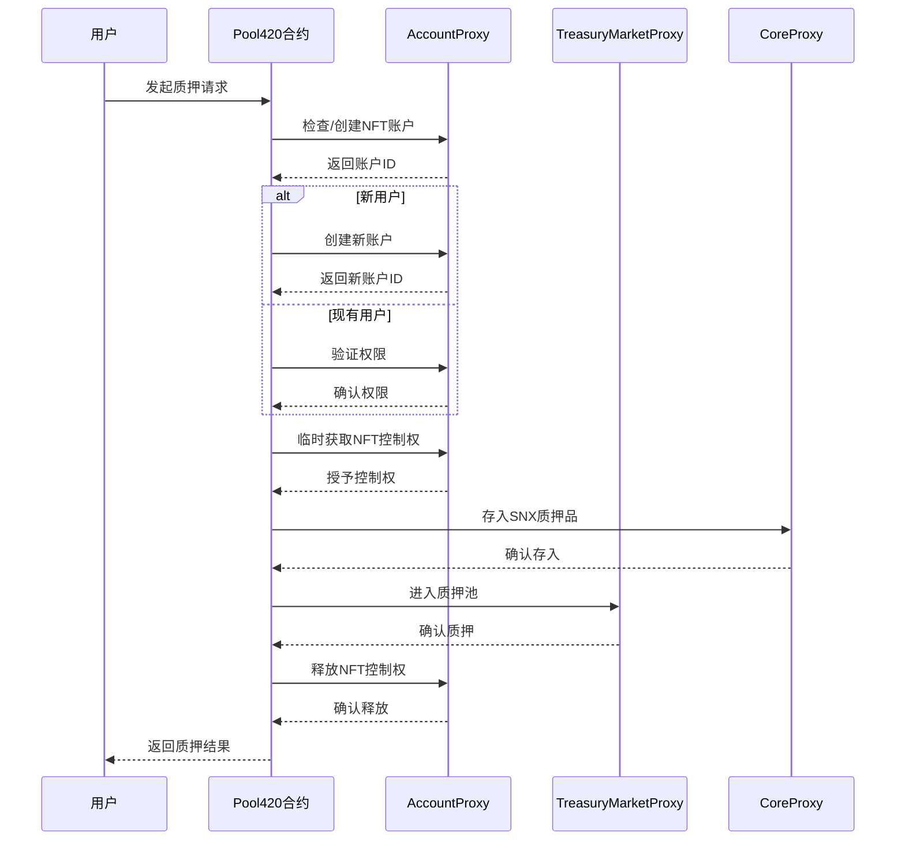
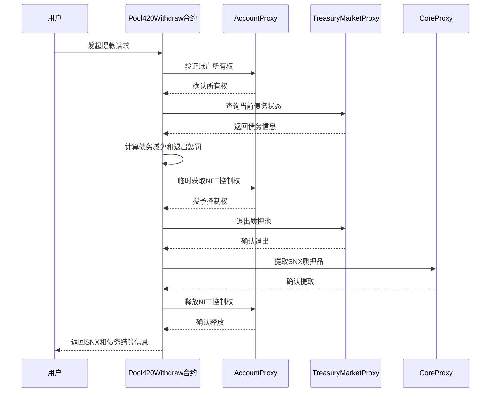
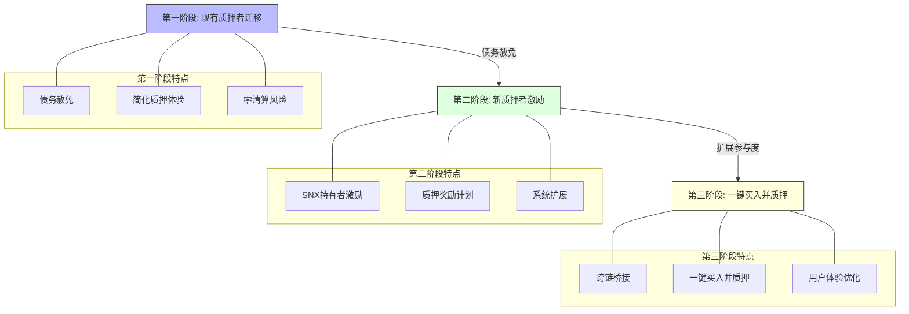
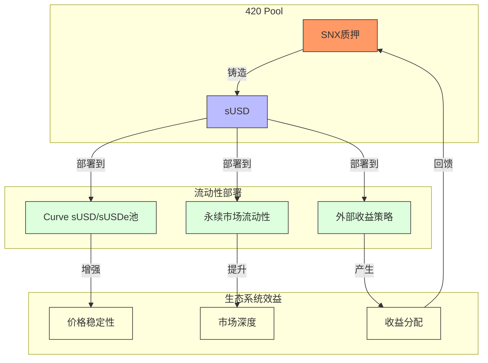
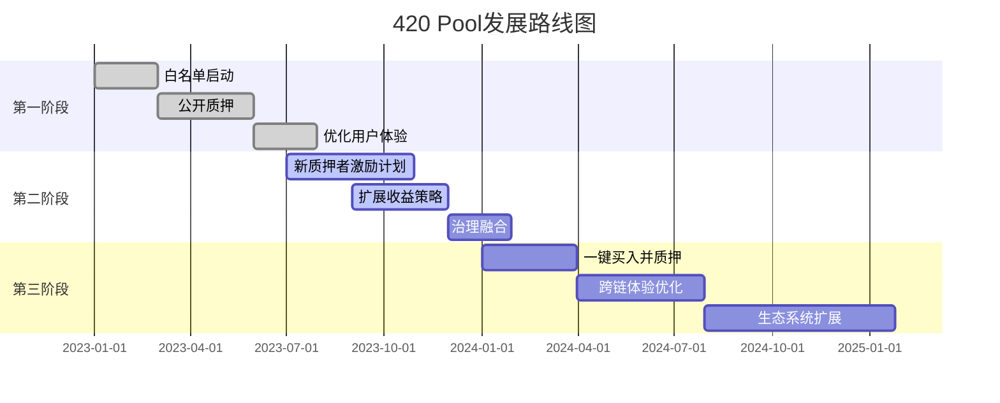

# 420 Pool 项目定位

## 任务使命 (Mission)

理解420 Pool在Synthetix V3生态系统中的定位、核心功能和技术特点，为后续开发和优化相关功能奠定基础。

## 背景上下文 (Context)

传统的SNX质押模式存在多项挑战，包括复杂的债务管理、清算风险和资本效率低下等问题。420 Pool作为Synthetix V3的创新组件，旨在彻底改变SNX质押体验，通过协议层面的债务管理和优化的资本分配，为用户提供更简单、更高效的质押解决方案。

## 执行计划 (Plan)

本文档将详细介绍420 Pool的项目定位、核心功能、技术架构以及与Synthetix V3其他组件的集成情况，帮助开发者全面了解该产品。

## 1. 420 Pool 概述

### 1.1 项目起源



420 Pool源于社区对传统SNX质押模式的反思和改进需求。随着Synthetix V3架构的成熟，该项目通过SIP-420（Synthetix改进提案）正式提出，旨在解决长期困扰SNX质押者的多项问题。

### 1.2 项目愿景

420 Pool的愿景是重新激活SNX质押，使sUSD成为DeFi生态系统中最具流动性和去中心化的稳定币。该项目通过彻底改变质押机制，使SNX质押变得简单、安全和高效。

## 2. 核心问题与解决方案

### 2.1 传统SNX质押面临的挑战



传统SNX质押模式存在三大核心问题：

1. **债务管理复杂性**：
   - 用户需要主动管理自己的债务
   - 复杂的过程可能导致资产损失
   - 需要持续监控和调整

2. **清算风险**：
   - 未能正确维持债务可能导致清算
   - 清算不仅影响被清算者，还将债务责任转移给其他SNX质押者
   - 市场波动时清算风险显著增加

3. **资本配置效率低下**：
   - 高抵押率（500%）限制了资本效率
   - 流动性依赖于个体质押者部署
   - 新产品或合作需要额外激励

### 2.2 420 Pool 解决方案



420 Pool通过三大创新解决这些问题：

1. **债务赦免（Debt Jubilee）**：
   - 迁移到420 Pool的SNX质押者将在12个月内获得债务减免
   - 债务线性减少，6个月后减少50%，一年后完全清除
   - 提前退出会有退出惩罚，但总是比原始债务少

2. **简化质押体验**：
   - 协议接管sUSD铸造和债务管理
   - 无需手动管理债务或维持健康的抵押率
   - 零清算风险，一旦进入420 Pool，SNX不再面临清算威胁

3. **提高资本效率**：
   - 将抵押率从500%降低到200%
   - 每个质押的SNX可以铸造2.5倍的sUSD
   - 协议可以战略性地分配流动性

## 3. 技术架构

### 3.1 合约组件



420 Pool由三个主要合约组成：

1. **Pool420合约**：
   - 处理质押操作和债务管理
   - 与收益策略交互
   - 协调奖励分配

2. **Pool420Withdraw合约**：
   - 管理提款流程
   - 处理退出惩罚
   - 确保安全的资产归还

3. **PositionManager420合约**：
   - 管理用户在池中的位置
   - 处理NFT账户交互
   - 协调跨合约操作

### 3.2 与Synthetix V3的集成

420 Pool深度集成了Synthetix V3的核心组件：

- 使用**CoreProxy**进行抵押品管理
- 使用**AccountProxy**进行NFT账户操作
- 使用**TreasuryMarketProxy**进行市场互动和流动性分配

这种集成确保了420 Pool可以利用Synthetix V3的全部功能，同时提供独特的用户体验。

## 4. 核心功能与用户流程

### 4.1 质押流程



质押流程的主要步骤：

1. 用户连接钱包并选择质押SNX到420 Pool
2. 系统验证用户的NFT账户或创建新账户
3. SNX被存入质押池，系统记录用户的债务情况
4. 开始债务赦免流程，债务在12个月内逐渐减少
5. 用户可以随时查看质押状态和债务减免进度

### 4.2 提款流程



提款流程的主要步骤：

1. 用户启动7天冷却期来退出池
2. 冷却期结束后，用户可以提取SNX
3. 系统计算剩余债务（已减少的部分已被免除）
4. 如果提前退出，将应用退出惩罚，但总是比原债务少
5. 用户支付剩余债务并收回SNX

### 4.3 收益分配

420 Pool为质押者提供多种收益来源：

1. **外部策略收益**：
   - 从Ethena、Aave和Morpho等平台获取收益
   - 协议管理的sUSD用于优化收益

2. **永续合约流动性收益**：
   - 深化链上市场的流动性
   - 分享交易费用和收入

3. **潜在的SNX回购和激励**：
   - 基于协议表现的SNX回购
   - 新的质押激励机制

## 5. 420 Pool的阶段性发展



420 Pool的发展分为三个主要阶段：

### 5.1 第一阶段：现有质押者迁移

- 开放白名单阶段，吸引初始质押者
- 实施债务赦免计划，鼓励现有质押者迁移
- 简化质押体验，消除清算风险

### 5.2 第二阶段：新质押者激励

- 为未质押的SNX持有者提供特殊激励
- 引入新的质押奖励机制
- 扩大参与度和池规模

### 5.3 第三阶段：一键买入并质押

- 允许用户从大多数EVM链直接桥接和兑换
- 简化入口流程，降低参与门槛
- 进一步优化用户体验

## 6. 420 Pool的优势与创新

### 6.1 用户优势

| 优势 | 传统SNX质押 | 420 Pool |
|-----|------------|----------|
| 债务管理 | 手动管理，复杂 | 协议自动管理，简单 |
| 清算风险 | 高，依赖市场条件 | 零，一旦质押无清算风险 |
| 用户体验 | 需要密切监控 | 质押后无需管理 |
| 债务减免 | 无 | 12个月内线性减少至零 |
| 退出机制 | 复杂，风险高 | 简单，7天冷却期 |

### 6.2 协议优势

| 优势 | 传统SNX质押 | 420 Pool |
|-----|------------|----------|
| 资本效率 | 500%抵押率 | 200%抵押率 |
| sUSD流动性 | 依赖个体质押者 | 协议战略分配 |
| 市场深度 | 有限，分散 | 更强，集中管理 |
| 新产品支持 | 需额外激励 | 协议可直接注入流动性 |
| 系统简化 | 复杂互动 | 统一流程 |

## 7. 420 Pool与sUSD生态系统

### 7.1 sUSD流动性增强

420 Pool显著增强了sUSD的流动性，特别是通过与sUSDe的Curve池集成：



通过战略性地分配sUSD，420 Pool能够：

- 深化Curve sUSD/sUSDe池的流动性
- 为永续合约市场提供更多流动性
- 在保持peg的同时优化收益

### 7.2 与其他DeFi协议的集成

420 Pool积极与其他DeFi协议集成，特别是：

- **Ethena的sUSDe**：作为收益策略和流动性对
- **Aave**：用于优化闲置sUSD的收益
- **Morpho**：用于增强借贷效率和收益
- **Curve**：深化sUSD/sUSDe流动性池

## 8. 开发者资源与接口

### 8.1 主要合约接口

```solidity
// Pool420接口示例
interface IPool420 {
    // 质押SNX到池中
    function stake(uint256 amount) external;
    
    // 查询用户质押信息
    function getUserPosition(address user) external view returns (
        uint256 stakedAmount,
        uint256 originalDebt,
        uint256 currentDebt,
        uint256 entryTimestamp
    );
    
    // 计算债务减免
    function calculateDebtRelief(address user) external view returns (uint256);
}

// Pool420Withdraw接口示例
interface IPool420Withdraw {
    // 启动提款冷却期
    function initiateWithdrawal() external;
    
    // 完成提款
    function completeWithdrawal() external;
    
    // 查询冷却期状态
    function withdrawalStatus(address user) external view returns (
        bool initiated,
        uint256 cooldownEnd,
        uint256 availableAmount
    );
}
```

### 8.2 开发者文档和资源

- **技术文档**：详细的API参考和集成指南
- **代码示例**：常见操作的示例代码
- **测试网环境**：用于开发和测试的测试网部署
- **开发者社区**：Discord和论坛支持

### 8.3 集成最佳实践

- 使用NFT账户模型进行权限管理
- 实现债务追踪和减免计算
- 监听相关事件进行前端更新
- 采用冷却期机制防止闪电贷攻击

## 9. 未来发展路线



420 Pool的未来发展方向包括：

1. **扩展收益策略**：集成更多DeFi协议，优化收益
2. **治理融合**：增强与Synthetix治理的集成
3. **用户体验优化**：简化入口流程，降低门槛
4. **跨链扩展**：支持更多链的用户参与
5. **生态系统建设**：开发更多基于sUSD的应用

## 总结

420 Pool代表了Synthetix质押机制的重大创新，通过债务赦免、简化质押体验和提高资本效率，解决了传统SNX质押面临的核心问题。作为Synthetix V3生态系统的关键组成部分，它展示了如何利用模块化架构构建专业化的金融产品，同时为用户和协议创造多重价值。

理解420 Pool的项目定位和技术架构对于开发者有效集成和扩展相关功能至关重要，这将是后续深入学习其内部工作原理的基础。

## 进一步学习

- 研究420 Pool的详细合约代码
- 实践质押和提款流程
- 分析债务赦免机制的具体实现
- 探索收益策略的优化可能性
- 参与社区讨论，了解用户需求和反馈 