# snxUSD分析报告

## 1. snxUSD概述

snxUSD是Synthetix V3的核心合成美元稳定币，作为系统中的基础单位和债务记账单位。相比V2的sUSD，snxUSD采用了全新的架构设计和经济模型，支持更灵活的铸造机制和多池债务模型。

### 1.1 基本架构

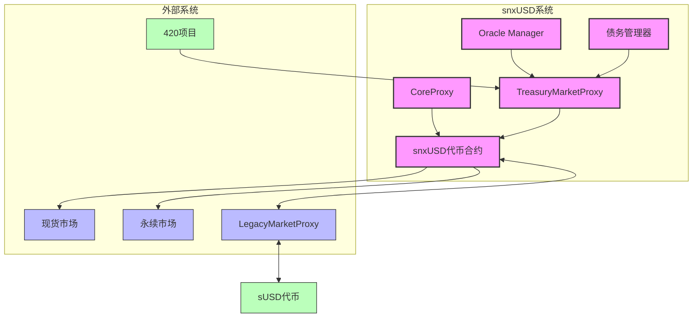

## 2. snxUSD与sUSD的区别

snxUSD作为V3中的核心稳定币，与V2中的sUSD存在多项重要区别：

| 特性 | snxUSD (V3) | sUSD (V2) |
|------|------------|----------|
| 账户模型 | NFT账户持有 | EOA直接持有 |
| 铸造机制 | 多种市场可铸造 | 仅通过质押SNX铸造 |
| 债务系统 | 多池分散债务 | 单一全局债务池 |
| 抵押品类型 | 支持多种抵押品 | 主要支持SNX |
| 池间流动性 | 隔离的风险池 | 共享风险池 |
| 升级机制 | 模块化升级 | 整体合约升级 |

### 2.1 兼容性桥接

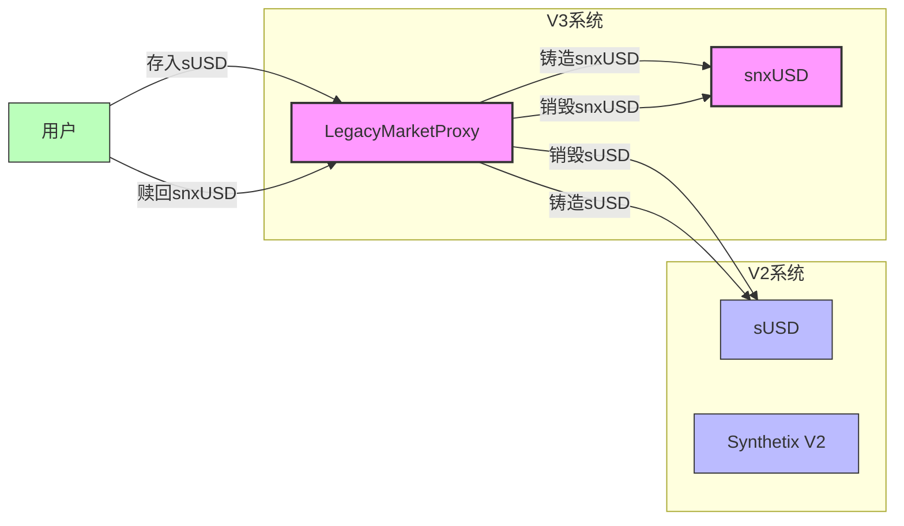

## 3. snxUSD铸造机制

snxUSD的铸造可通过多种途径实现，每种途径对应不同的市场和机制：

### 3.1 铸造流程

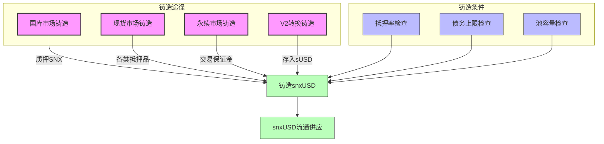

### 3.2 铸造代码实现

```solidity
// 国库市场铸造snxUSD简化示例
function mintUsd(uint accountId, uint amount) external whenNotPaused {
    // 验证账户所有权
    _validateAccountPermission(accountId);
    
    // 检查抵押率
    uint collateralValue = _getAccountCollateralValue(accountId);
    uint currentDebt = _getAccountDebt(accountId);
    uint newDebt = currentDebt + amount;
    
    uint minCollateralRatio = getMinCollateralRatio();
    require(
        collateralValue * 1e18 >= newDebt * minCollateralRatio,
        "Insufficient collateral ratio"
    );
    
    // 检查市场债务上限
    require(
        totalMarketDebt() + amount <= marketDebtCap(),
        "Market debt cap exceeded"
    );
    
    // 更新账户债务
    _updateAccountDebt(accountId, newDebt);
    
    // 铸造snxUSD
    snxUSD.mint(msg.sender, amount);
    
    emit UsdMinted(accountId, amount);
}
```

## 4. 债务系统与多池模型

snxUSD的债务管理是通过多池模式实现的，与V2单一债务池相比提供了更精细的风险隔离：

### 4.1 债务池架构

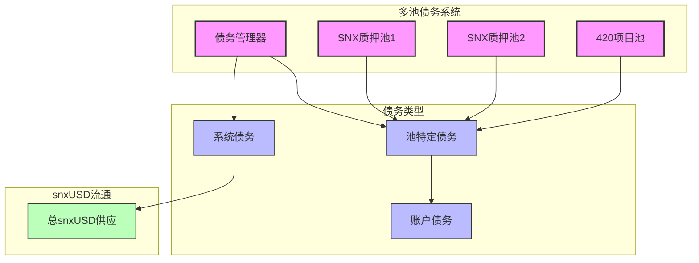

### 4.2 债务计算逻辑

snxUSD债务计算涉及多层级的分配和聚合：

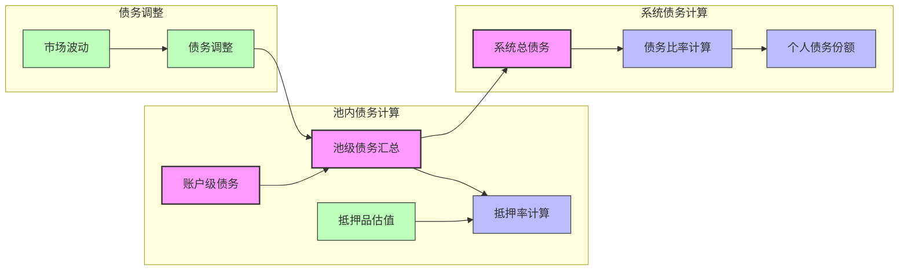

## 5. 价格稳定机制

snxUSD作为稳定币，维持与美元1:1挂钩的稳定机制包括：

### 5.1 稳定机制框架

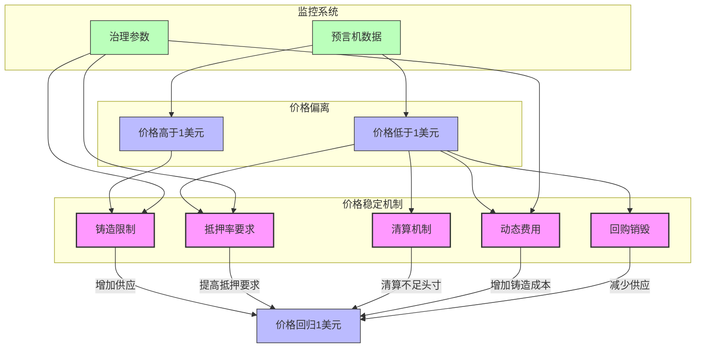

### 5.2 市场互动机制

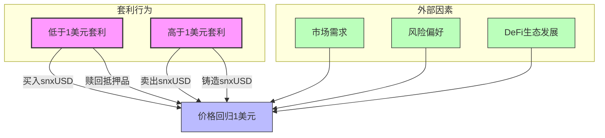

## 6. 420项目与snxUSD的集成

420项目与snxUSD的集成主要通过国库市场实现，提供了简化的用户体验：

### 6.1 集成架构

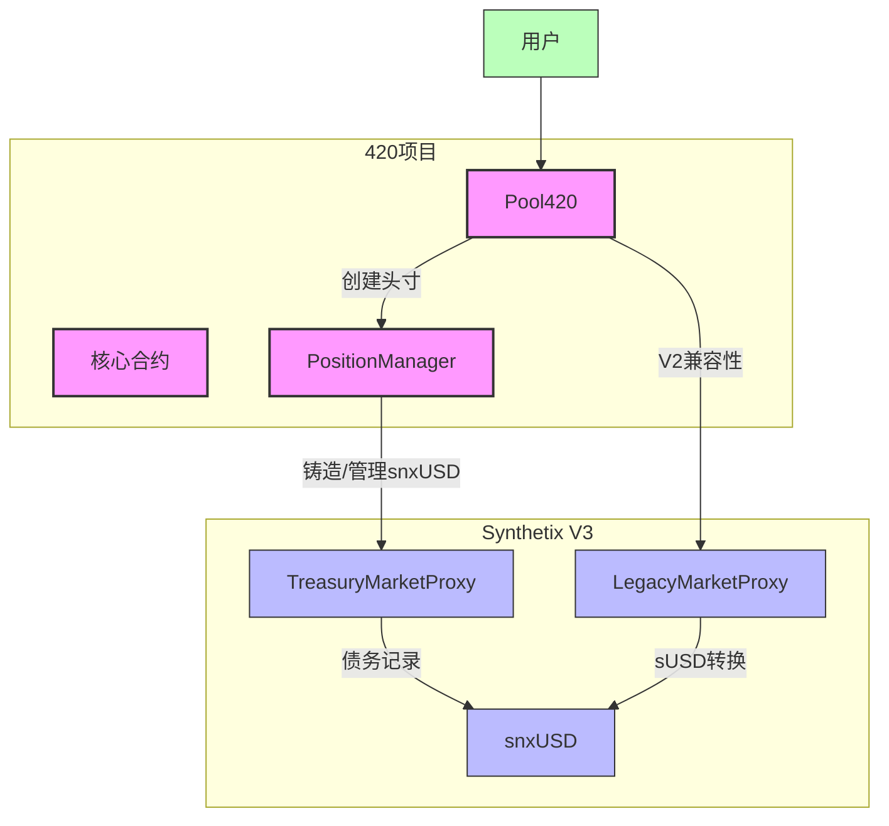

### 6.2 用户操作流程

```mermaid
sequenceDiagram
    参与者 U as 用户
    参与者 P as Pool420
    参与者 PM as PositionManager
    参与者 TM as TreasuryMarket
    参与者 S as snxUSD
    
    U->>P: 存入SNX
    P->>PM: 创建头寸
    PM->>TM: 委托SNX到池
    PM->>TM: 铸造snxUSD
    TM->>S: 铸造代币
    S-->>U: 接收snxUSD
    
    U->>P: 申请提取
    P->>PM: 处理提取请求
    PM->>TM: 返还snxUSD
    TM->>S: 销毁代币
    PM->>TM: 解除委托
    TM-->>U: 返还SNX
```

## 7. 技术实现细节

### 7.1 代币标准和扩展

snxUSD实现了ERC20标准，并具有额外的权限控制扩展：

```solidity
// snxUSD代币合约简化示例
contract SnxUSD is ERC20, OwnableUpgradeable {
    // 铸造权限控制
    mapping(address => bool) public marketContracts;
    
    // 初始化函数
    function initialize(string memory name, string memory symbol) 
        external 
        initializer 
    {
        __ERC20_init(name, symbol);
        __Ownable_init();
    }
    
    // 仅允许授权市场铸造
    function mint(address to, uint256 amount) 
        external 
        onlyMarket 
        returns (bool) 
    {
        _mint(to, amount);
        return true;
    }
    
    // 仅允许授权市场销毁
    function burn(address from, uint256 amount) 
        external 
        onlyMarket 
        returns (bool) 
    {
        _burn(from, amount);
        return true;
    }
    
    // 添加授权市场
    function addMarket(address market) 
        external 
        onlyOwner 
    {
        marketContracts[market] = true;
        emit MarketAdded(market);
    }
    
    // 移除授权市场
    function removeMarket(address market) 
        external 
        onlyOwner 
    {
        marketContracts[market] = false;
        emit MarketRemoved(market);
    }
    
    // 市场权限检查
    modifier onlyMarket() {
        require(
            marketContracts[msg.sender],
            "Only authorized markets can mint/burn"
        );
        _;
    }
}
```

### 7.2 预言机集成

snxUSD价格通过预言机系统获取和验证：

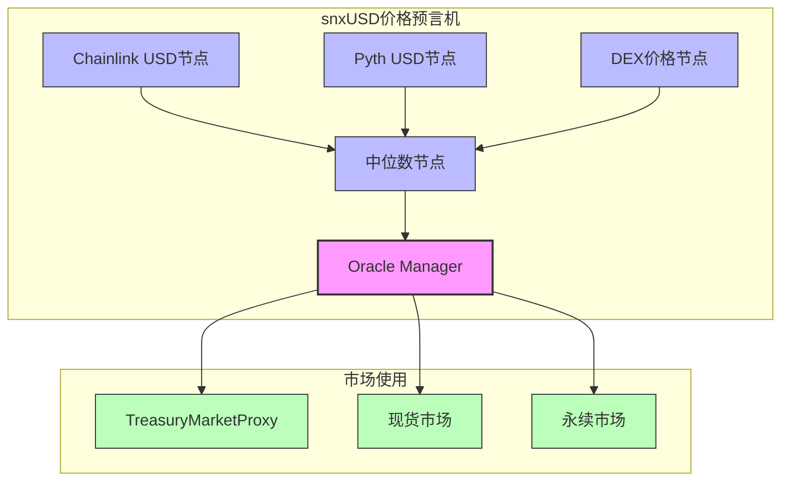

## 8. 系统风险分析

### 8.1 风险类型与缓解策略

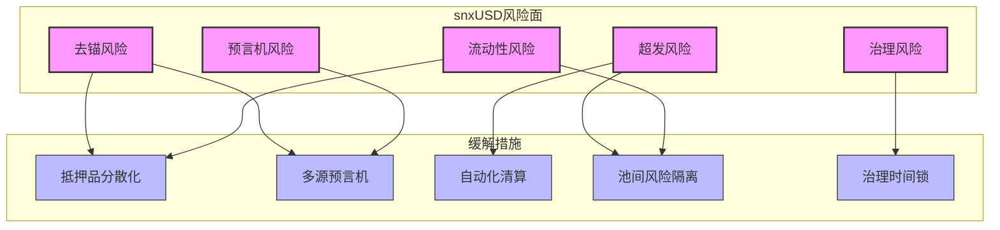

### 8.2 黑天鹅事件处理

```mermaid
sequenceDiagram
    参与者 OM as Oracle Manager
    参与者 G as 治理
    参与者 TM as 市场合约
    参与者 LM as 清算模块
    
    Note over OM,LM: 极端市场波动
    
    OM->>TM: 检测到价格异常
    TM->>TM: 启动价格延迟机制
    TM->>LM: 触发紧急清算程序
    LM->>LM: 优先清算高风险头寸
    G->>TM: 可能临时调整参数
    G->>TM: 可能暂停特定市场操作
    Note over OM,LM: 市场稳定后
    TM->>TM: 恢复正常操作
    G->>TM: 恢复原参数设置
```

## 9. 未来发展方向

### 9.1 snxUSD生态扩展路线图

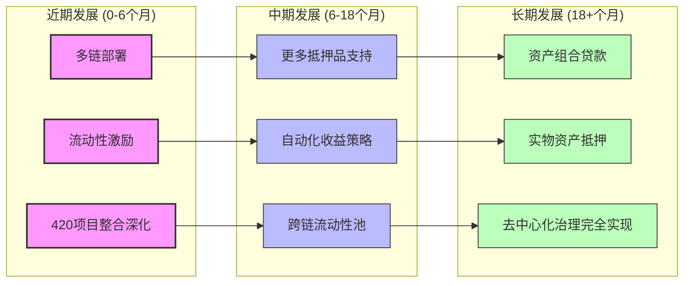

### 9.2 与420项目的协同发展

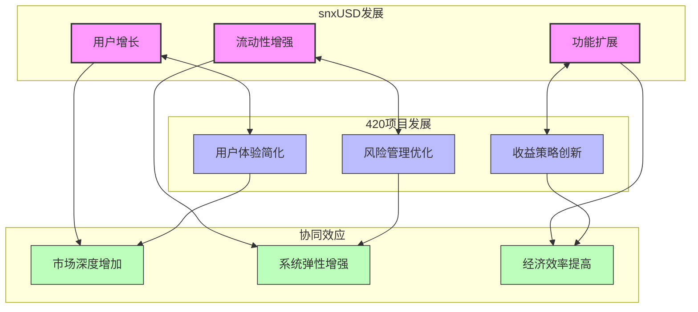

## 10. 总结

snxUSD作为Synthetix V3的核心稳定币，通过创新的多池设计、模块化架构和灵活的铸造机制，提供了比V2更强大的功能和更高的资本效率。与420项目的深度集成展示了snxUSD如何支持专业化的应用场景，简化用户体验并优化风险管理。预言机集成和债务管理系统确保了snxUSD的价格稳定性和系统安全性，为未来更广泛的DeFi生态应用奠定了基础。 
