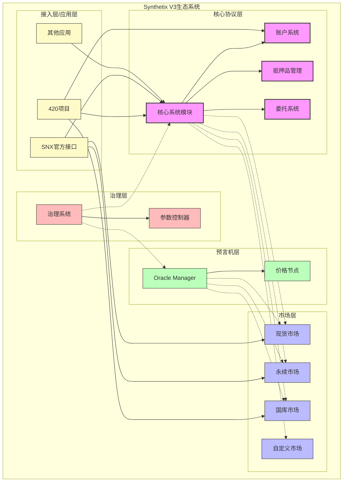
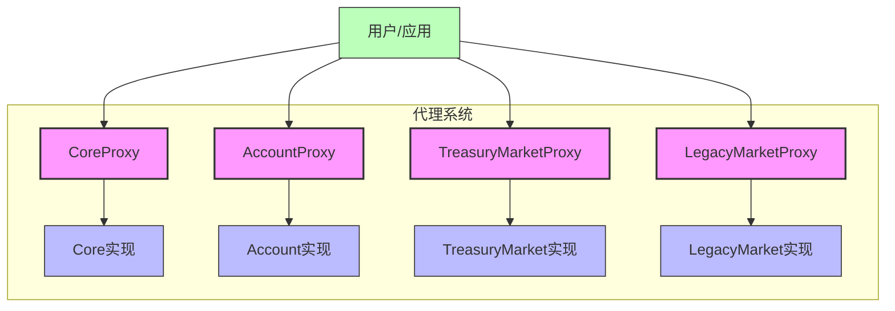
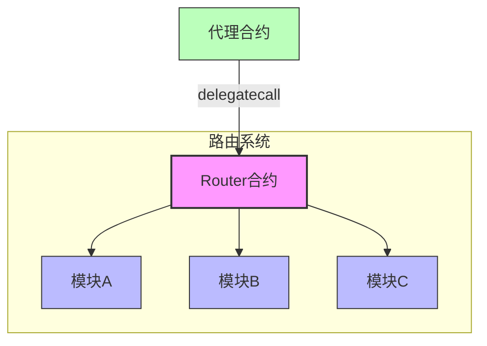
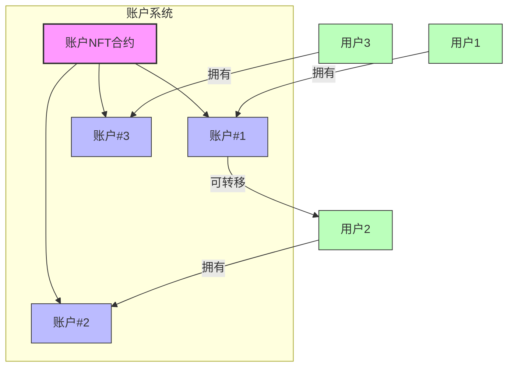
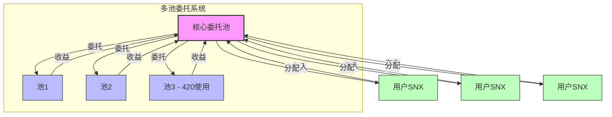
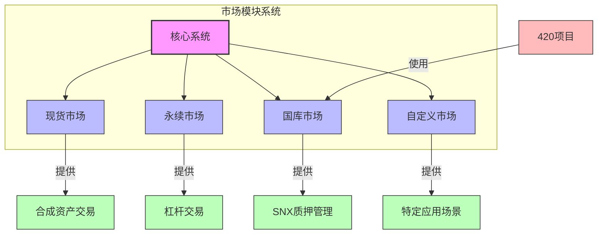
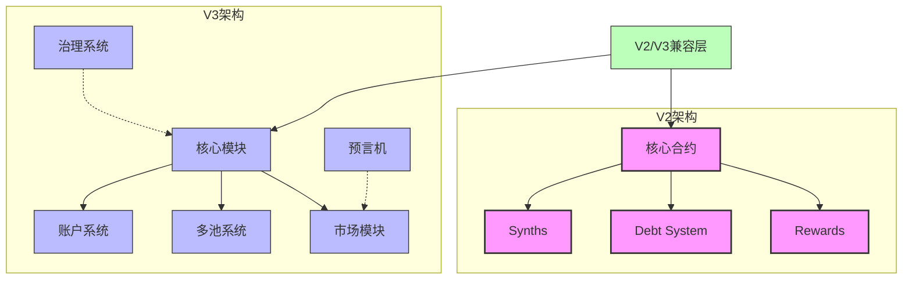
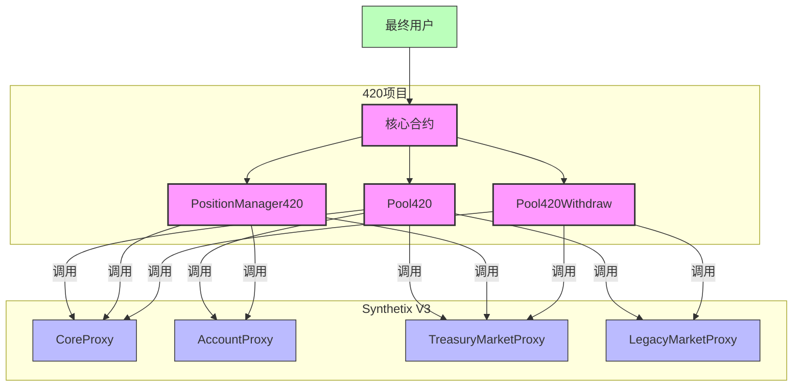

# Synthetix V3整体架构概览

## 1. 系统架构概述

Synthetix V3是一个高度模块化、可扩展的去中心化金融协议，采用分层设计实现了前所未有的灵活性和功能分离。通过对核心组件、市场模块、治理系统和预言机的清晰分离，V3能够支持多种金融产品，并允许开发者在其上构建专业化应用（如420项目）。

### 1.1 架构全景图



### 1.2 关键分层结构

Synthetix V3采用了严格的分层架构，每层具有明确的职责：

1. **核心协议层**：管理系统基础设施、账户、抵押品和委托机制
2. **市场层**：实现不同类型的金融市场（现货、永续、国库等）
3. **预言机层**：提供价格数据和验证服务
4. **治理层**：控制系统参数和升级决策
5. **接入层/应用层**：为用户和开发者提供接入点（如420项目）

## 2. 核心模块详解

### 2.1 代理合约结构



Synthetix V3采用代理合约设计实现可升级性，关键代理包括：

1. **CoreProxy**：核心系统功能的访问点
   - 管理系统配置和全局状态
   - 处理抵押品存取和委托
   - 提供系统关键查询接口

2. **AccountProxy**：账户系统的入口
   - 管理NFT形式的账户
   - 处理账户所有权和授权
   - 提供账户创建和查询功能

3. **TreasuryMarketProxy**：国库市场的接入点
   - 管理质押和贷款操作
   - 处理债务池和收益分配
   - 提供市场特定参数配置

4. **LegacyMarketProxy**：V2兼容层
   - 处理V2和V3之间的代币和数据转换
   - 连接V2系统组件和解析器
   - 确保向后兼容性

### 2.2 模块化路由系统



Synthetix V3内部使用模块化路由系统，根据函数选择器将调用路由到不同的实现模块：

```solidity
// 路由系统简化示例
contract Router {
    mapping(bytes4 => address) private implementations;
    
    function setImplementation(bytes4 selector, address implementation) external onlyOwner {
        implementations[selector] = implementation;
    }
    
    fallback() external payable {
        address implementation = implementations[msg.sig];
        require(implementation != address(0), "Function not found");
        
        (bool success, bytes memory data) = implementation.delegatecall(msg.data);
        require(success, "Module call failed");
        assembly { return(add(data, 32), mload(data)) }
    }
}
```

这种设计允许：
- 独立更新各个功能模块
- 灵活组合不同功能集
- 细粒度的权限控制

## 3. 关键组件详解

### 3.1 账户系统

Synthetix V3使用NFT代表用户账户，这是一项重要创新：



账户系统的主要特性：
- 账户由NFT表示，完全可转移
- 支持账户委托和权限管理
- 将用户身份与其资产和操作分离
- 支持复杂的多账户策略

### 3.2 多池委托模型

多池委托模型是V3的核心创新之一：



多池模型的关键特点：
- SNX持有者可以将代币委托给特定池
- 委托不转移所有权，只分配权益
- 不同池有独立的风险参数和收益结构
- 实现了风险隔离和资本效率优化

### 3.3 市场模块系统

V3支持多种市场类型，每种都有特定的实现和功能：



每种市场模块专注于特定需求：
- **现货市场**：传统合成资产交易
- **永续市场**：杠杆化衍生品交易
- **国库市场**：SNX质押和债务管理（420使用）
- **自定义市场**：特定应用场景的专用市场

## 4. V2与V3架构对比

Synthetix V3与V2相比有重大架构变化：



### 4.1 主要架构变化

1. **模块化程度**：
   - V2：单体架构，紧耦合组件
   - V3：高度模块化，松耦合组件

2. **可扩展性**：
   - V2：有限的扩展点
   - V3：设计用于支持多种市场和用例

3. **账户模型**：
   - V2：基于EOA直接操作
   - V3：NFT账户抽象

4. **池系统**：
   - V2：单一债务池
   - V3：多池委托模型

5. **升级机制**：
   - V2：有限的可升级性
   - V3：全面的代理和模块升级系统

## 5. 420项目的集成点

420项目主要通过以下方式与Synthetix V3集成：



主要集成点包括：

1. **账户管理**：
   - 创建和管理Synthetix V3账户
   - 处理临时账户转移进行复杂操作

2. **委托和质押**：
   - 将SNX委托到特定池
   - 管理质押状态和贷款

3. **V2/V3兼容性**：
   - 处理sUSD和snxUSD之间的转换
   - 桥接V2和V3的用户体验

4. **风险管理**：
   - 监控和调整抵押率
   - 提供优化的质押策略

## 6. 总结与关键洞见

### 6.1 架构特点总结

Synthetix V3的架构设计展现了以下关键特点：

1. **高度模块化**：功能明确分离，支持独立升级
2. **可扩展性**：设计支持新市场和功能的添加
3. **松耦合**：组件之间通过定义清晰的接口交互
4. **可升级性**：代理模式确保系统可持续发展
5. **资产抽象**：NFT账户和多池委托提供灵活性

### 6.2 设计决策洞见

1. **代理模式的权衡**：
   - 优势：灵活升级，无需数据迁移
   - 挑战：增加复杂性，潜在的代理风险

2. **模块化路由的影响**：
   - 优势：精细的功能控制，组件化升级
   - 挑战：调试复杂性，潜在的选择器冲突

3. **NFT账户的创新**：
   - 优势：可转移的账户，复杂的所有权模型
   - 挑战：用户体验复杂性，需要额外的教育

4. **多池模型的价值**：
   - 优势：风险隔离，资本效率，专业化市场
   - 挑战：流动性分散，治理复杂性

### 6.3 420项目的架构贡献

420项目在Synthetix V3基础上提供了：

1. **简化层**：抽象了V3的复杂性，提供简单界面
2. **整合层**：处理V2和V3的兼容性问题
3. **优化层**：为特定用户群提供专业化体验
4. **示范作用**：展示了如何在V3基础上构建应用

这一架构分析揭示了Synthetix V3作为一个高度模块化、可扩展的DeFi基础设施的潜力，以及420项目如何通过专业化应用拓展了这一生态系统。 