# Synthetix V3 & 420 Pool 技术栈概览

## 任务使命 (Mission)

全面了解Synthetix V3及420 Pool项目使用的技术栈，包括智能合约开发、前端实现、测试框架和开发工具，为深入学习相关技术细节奠定基础。

## 背景上下文 (Context)

Synthetix V3是一个复杂的DeFi协议，涉及多种技术组件和工具。420 Pool作为基于Synthetix V3构建的特定质押池产品，继承了其大部分技术栈，同时也有一些特有的技术选择。了解这些技术栈对于有效开发和集成相关功能至关重要。

## 执行计划 (Plan)

本文档将系统介绍Synthetix V3和420 Pool项目中使用的各种技术组件、框架和工具，包括合约开发环境、前端技术栈、测试框架和辅助工具等。

## 1. 技术栈概览

### 1.1 技术栈全景图

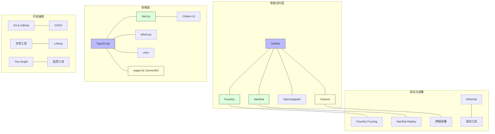

### 1.2 主要技术组件

| 技术类别 | 组件名称 | 用途描述 |
|---------|--------|---------|
| 智能合约语言 | Solidity | 主要智能合约开发语言 |
| 合约开发框架 | Hardhat & Foundry | 合约编译、测试和部署 |
| 合约库 | OpenZeppelin | 安全合约组件和标准实现 |
| 部署工具 | Cannon | 确定性部署和合约版本管理 |
| 前端框架 | Next.js | 构建用户界面的React框架 |
| 前端语言 | TypeScript | 类型安全的JavaScript超集 |
| 区块链交互 | ethers.js & viem | 与以太坊网络交互的库 |
| UI组件库 | Chakra UI | 构建用户界面的组件库 |
| 钱包连接 | wagmi & ConnectKit | 钱包连接和管理库 |
| 测试框架 | Foundry & Hardhat | 单元测试和集成测试 |
| 安全审计 | Slither & Mythril | 静态分析和形式验证工具 |
| 数据索引 | The Graph | 区块链数据索引和查询 |

## 2. 智能合约开发技术栈

### 2.1 开发语言与标准

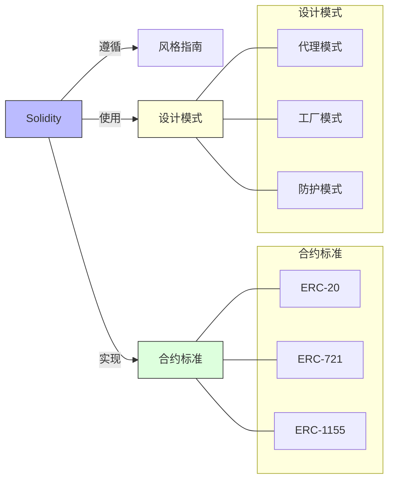

**Solidity版本与特性**:
- Synthetix V3使用Solidity ^0.8.18
- 利用最新的语言特性如自定义错误、不可变变量等
- 严格的类型检查和安全实践

**合约标准实现**:
- ERC-20: 用于代币合约如SNX和sUSD
- ERC-721: 用于NFT账户模型
- ERC-1155: 用于多资产管理

**主要设计模式**:
- **代理模式**: 实现可升级的合约架构
- **工厂模式**: 动态创建和管理合约实例
- **卫士模式**: 实现访问控制和安全检查
- **模块化设计**: 将系统拆分为独立模块
- **事件驱动**: 使用事件进行跨合约通信

### 2.2 开发框架与工具

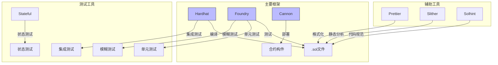

**Hardhat**:
- 灵活的Solidity开发环境
- 用于合约编译、部署和测试
- 支持TypeScript配置和插件
- 主要用于部署脚本和集成测试

**Foundry**:
- 基于Rust的快速测试框架
- 直接使用Solidity编写测试
- 优秀的模糊测试和符号执行
- 主要用于单元测试和安全测试

**Cannon**:
- Synthetix自研的确定性部署框架
- 确保跨网络一致的合约部署
- 支持复杂的依赖管理
- 促进模块化合约设计

**辅助工具**:
- **Slither**: 静态分析工具，检测安全问题
- **Mythril**: 形式化验证工具
- **Solhint**: Solidity代码规范检查
- **Prettier**: 代码格式化工具
- **EthTx**: 交易模拟和跟踪工具

### 2.3 主要依赖库

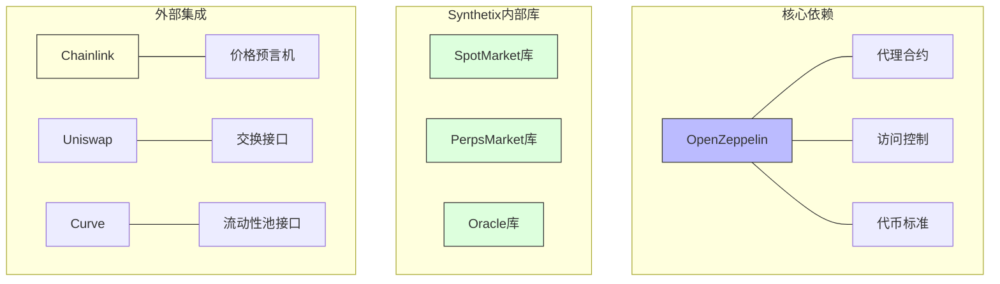

**OpenZeppelin合约**:
- **Proxy**: 标准代理合约实现
- **AccessControl**: 细粒度权限控制
- **SafeERC20**: 安全的ERC20交互
- **ReentrancyGuard**: 防止重入攻击
- **Pausable**: 紧急暂停功能

**Synthetix内部库**:
- **SpotMarket**: 现货市场功能
- **PerpsMarket**: 永续合约市场功能
- **TreasuryModule**: 质押和流动性管理
- **OracleManager**: 预言机数据管理

**外部集成库**:
- **Chainlink**: 价格预言机集成
- **Pyth Network**: 高频价格数据
- **Curve**: 流动性池集成
- **Uniswap**: 交换接口集成

## 3. 前端技术栈

### 3.1 前端框架与语言

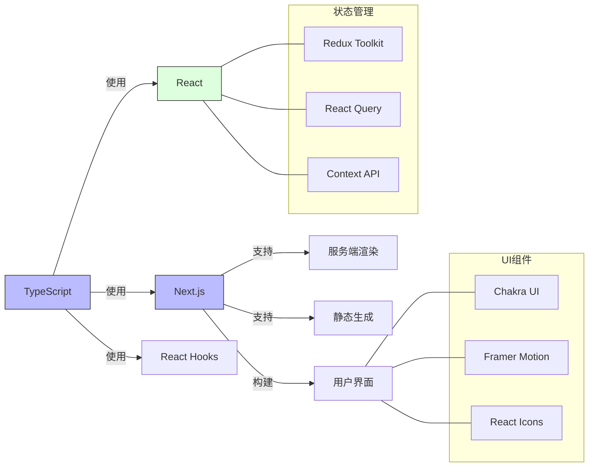

**TypeScript**:
- 静态类型检查提高代码质量
- 增强开发时的错误检测
- 改善代码的可维护性和文档性

**Next.js**:
- React框架，用于构建用户界面
- 支持服务端渲染和静态站点生成
- 提供优化的路由和图像处理
- 增强SEO和性能优化

**状态管理**:
- **Redux Toolkit**: 全局状态管理
- **React Query**: 服务器状态管理
- **Context API**: 组件树内状态共享

**UI组件库**:
- **Chakra UI**: 主要UI组件库
- **Framer Motion**: 动画和过渡效果
- **React Icons**: 图标库
- **React Hook Form**: 表单管理和验证

### 3.2 区块链交互技术

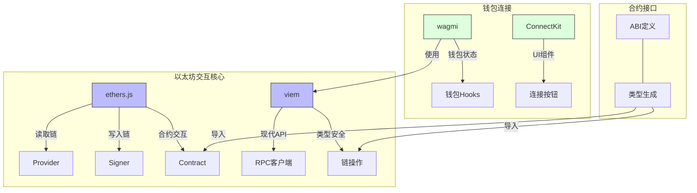

**以太坊交互**:
- **ethers.js**: 成熟的以太坊库
  - 提供Provider和Signer接口
  - 合约抽象和事件处理
  - 交易构建和签名

- **viem**: 现代轻量以太坊库
  - 类型安全的API设计
  - 高性能的RPC客户端
  - 模块化的链操作

**钱包连接**:
- **wagmi**: React Hooks库
  - 钱包连接和状态管理
  - 合约交互钩子
  - 自动重连和错误处理

- **ConnectKit**: 钱包连接UI
  - 现代化钱包连接界面
  - 多钱包支持
  - 响应式设计

**合约接口生成**:
- **TypeChain**: 从ABI生成TypeScript类型
- **GraphQL Codegen**: 从GraphQL模式生成类型
- **ABIType**: ABI类型定义和验证

### 3.3 数据获取与处理

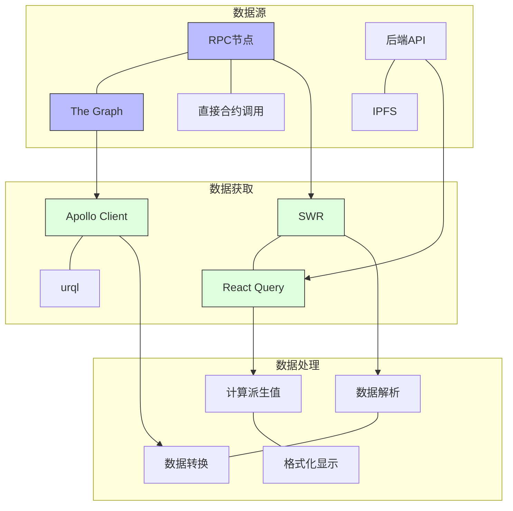

**数据源**:
- **RPC节点**: 直接与区块链通信
- **The Graph**: 索引和查询区块链数据
- **后端API**: 中心化数据和计算
- **IPFS**: 去中心化存储

**数据获取库**:
- **React Query**: 服务器状态管理和缓存
- **SWR**: 轻量级数据获取和缓存
- **Apollo Client**: GraphQL查询客户端
- **urql**: 灵活的GraphQL客户端

**数据处理工具**:
- **big.js**: 精确数学计算
- **date-fns**: 日期处理
- **lodash**: 通用数据操作
- **d3.js**: 数据可视化

## 4. 测试与部署技术栈

### 4.1 测试框架与策略

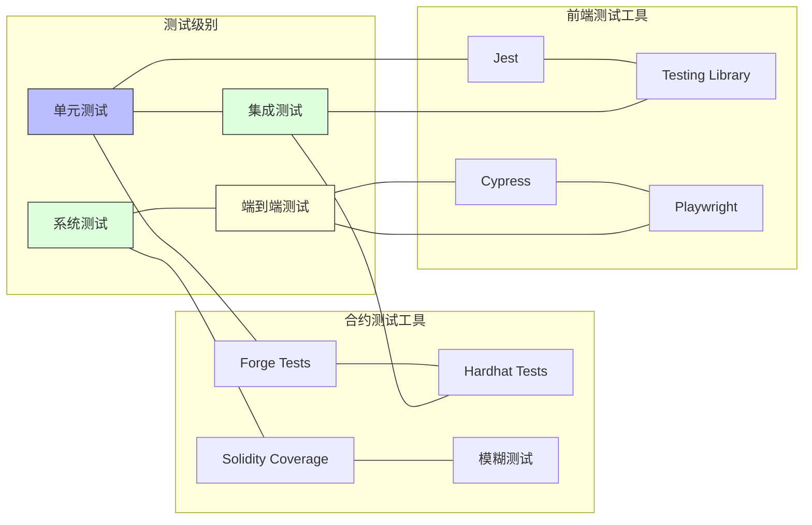

**合约测试策略**:
- **单元测试**: 测试单个合约功能
  - 使用Forge编写Solidity测试
  - 隔离测试特定逻辑

- **集成测试**: 测试合约间交互
  - 使用Hardhat编写TypeScript测试
  - 模拟完整的用户场景

- **模糊测试**: 自动生成测试输入
  - 使用Forge的内置模糊测试
  - 发现边界情况和异常

- **形式化验证**: 数学验证关键属性
  - 使用Certora Prover
  - 验证不变量和安全属性

**前端测试策略**:
- **单元测试**: 使用Jest和Testing Library
- **组件测试**: 测试UI组件渲染和交互
- **端到端测试**: 使用Cypress或Playwright
- **快照测试**: 防止UI意外更改

### 4.2 部署管理与DevOps

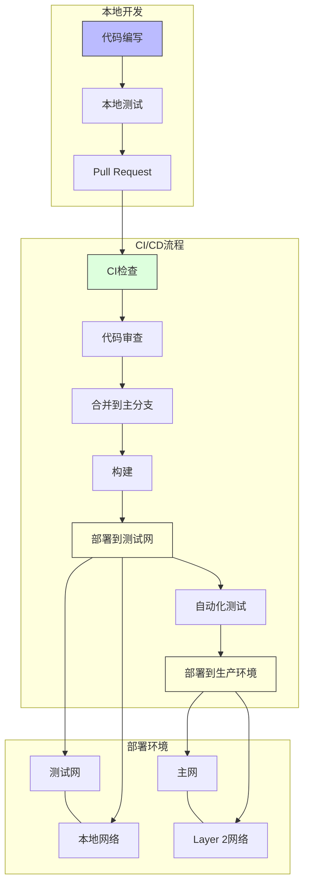

**版本控制与协作**:
- **Git**: 分布式版本控制
- **GitHub**: 代码托管和协作
- **Git Flow**: 分支管理策略
- **Conventional Commits**: 规范化提交信息

**CI/CD工具**:
- **GitHub Actions**: 自动化工作流
- **Hardhat部署脚本**: 自动化合约部署
- **Vercel**: 前端自动部署
- **Tenderly**: 合约监控和调试

**部署环境**:
- **测试网**: Goerli, Sepolia, Mumbai
- **主网**: Ethereum, Optimism, Base, Arbitrum
- **本地网络**: Hardhat Network, Anvil

**监控与分析**:
- **Tenderly Dashboard**: 合约监控
- **The Graph**: 数据索引和分析
- **Dune Analytics**: 链上数据分析
- **Sentry**: 错误跟踪和性能监控

## 5. 420 Pool 特有技术组件

### 5.1 Pool合约技术

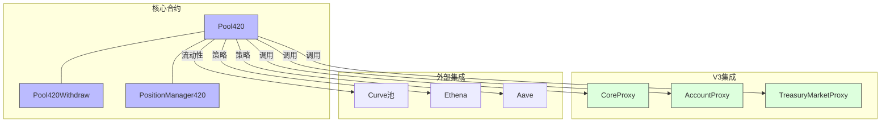

**合约特性**:
- 基于Synthetix V3的核心模块构建
- 实现NFT账户模型的质押管理
- 集成多种外部收益策略
- 实现债务赦免和7天冷却期
- 高度安全的合约间交互

**技术创新**:
- 临时账户控制设计
- 债务减免算法实现
- 流动性分配优化
- 多合约协调机制

### 5.2 前端特有组件

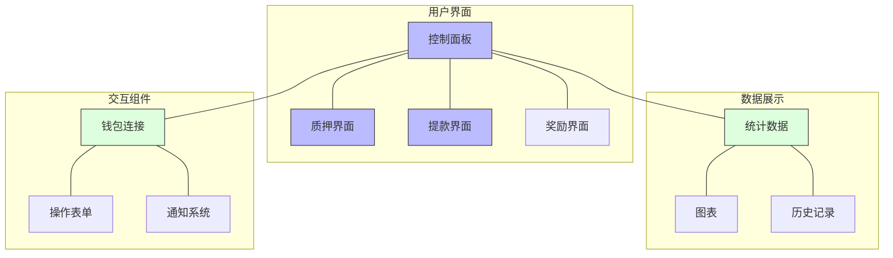

**UI特性**:
- 简化的质押和提款流程
- 债务减免进度可视化
- 实时池数据和统计
- 移动响应式设计
- 多主题支持

**前端技术选择**:
- Chakra UI作为主要UI框架
- React Query管理API状态
- wagmi处理链连接和交互
- Recharts实现数据可视化

## 6. 开发环境设置

### 6.1 本地开发环境

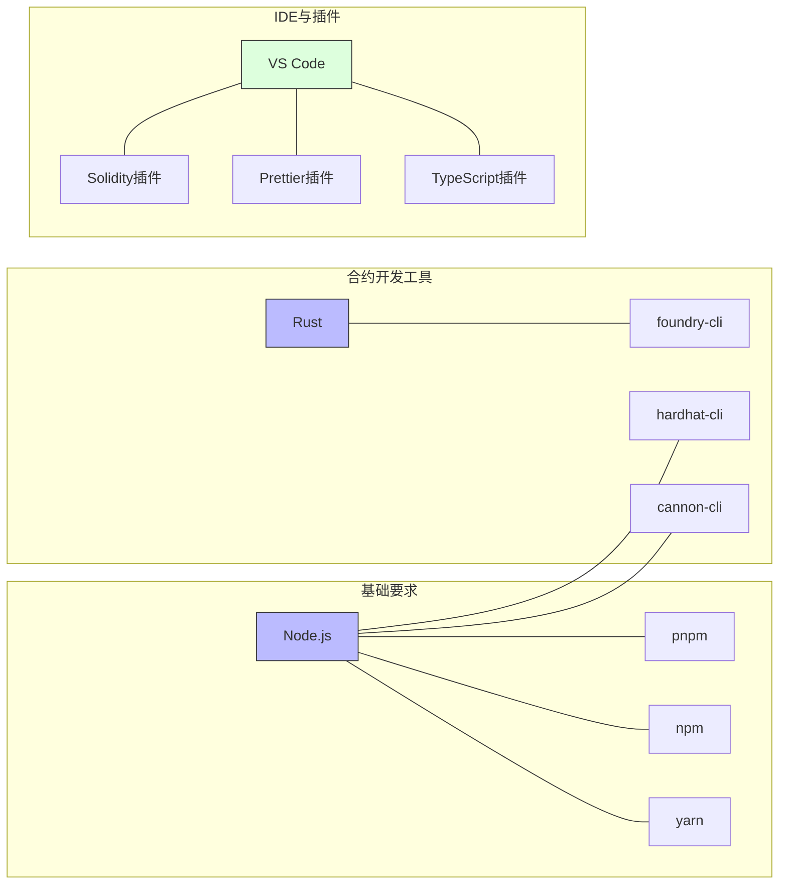

**基础环境要求**:
- **Node.js**: v16+
- **包管理器**: pnpm (首选), npm, yarn
- **Rust**: 用于Foundry
- **Git**: 版本控制

**开发工具安装**:
- **foundry-cli**: `curl -L https://foundry.paradigm.xyz | bash`
- **hardhat-cli**: `pnpm add -g hardhat`
- **cannon-cli**: `pnpm add -g @usecannon/cli`

**IDE配置**:
- **VS Code**: 推荐IDE
  - **Solidity插件**: Solidity语法和智能提示
  - **Prettier插件**: 代码格式化
  - **ESLint插件**: 代码规范检查
  - **Hardhat插件**: 合约编译和测试

### 6.2 项目设置与结构

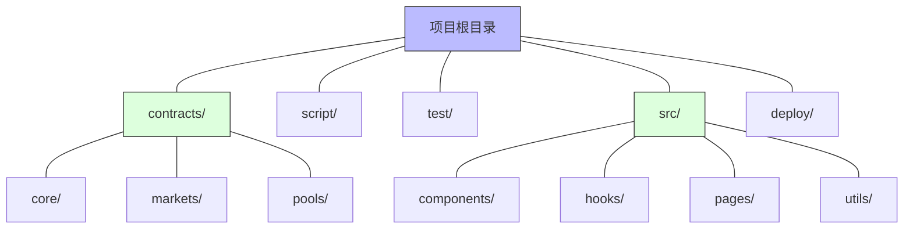

**项目结构**:
- **contracts/**: 智能合约代码
  - **core/**: 核心合约
  - **markets/**: 市场合约
  - **pools/**: 池合约和逻辑
- **script/**: 部署和管理脚本
- **test/**: 测试目录
- **src/**: 前端源代码
  - **components/**: UI组件
  - **hooks/**: 自定义React Hooks
  - **pages/**: 页面组件
  - **utils/**: 工具函数
- **deploy/**: 部署配置

**项目初始化**:
1. 克隆仓库: `git clone <repository-url>`
2. 安装依赖: `pnpm install`
3. 编译合约: `forge build` 或 `npx hardhat compile`
4. 运行测试: `forge test` 或 `npx hardhat test`
5. 启动前端: `pnpm dev`

## 7. 学习路径与资源

### 7.1 学习路线图

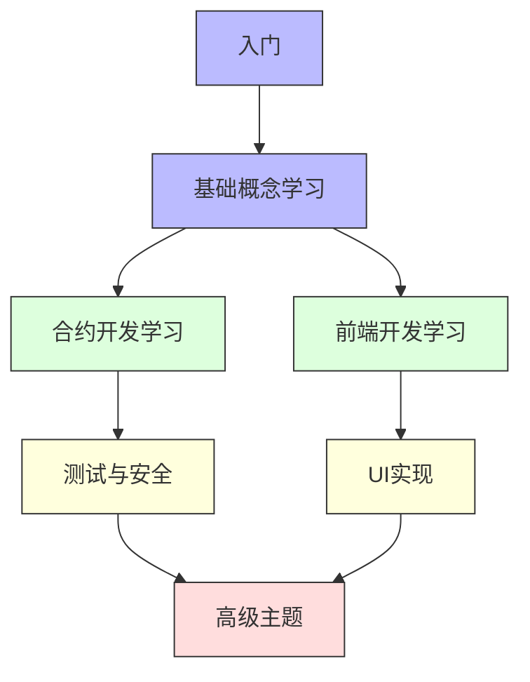

**学习阶段**:
1. **基础概念**: 区块链基础、Synthetix V3架构
2. **合约开发**: Solidity、合约交互模式
3. **前端开发**: React、TypeScript、Web3交互
4. **测试与安全**: 测试技术、安全最佳实践
5. **高级主题**: 性能优化、系统集成

### 7.2 推荐学习资源

**官方文档**:
- [Synthetix V3文档](https://docs.synthetix.io/v3/)
- [Synthetix GitHub仓库](https://github.com/Synthetixio/synthetix-v3)
- [Hardhat文档](https://hardhat.org/docs)
- [Foundry文档](https://book.getfoundry.sh/)

**技术学习资源**:
- **Solidity**:
  - [Solidity文档](https://docs.soliditylang.org/)
  - [CryptoZombies](https://cryptozombies.io/)
  - [Solidity by Example](https://solidity-by-example.org/)

- **前端开发**:
  - [Next.js文档](https://nextjs.org/docs)
  - [React文档](https://reactjs.org/docs/getting-started.html)
  - [TypeScript文档](https://www.typescriptlang.org/docs/)
  - [wagmi文档](https://wagmi.sh/)

- **Web3交互**:
  - [ethers.js文档](https://docs.ethers.org/)
  - [viem文档](https://viem.sh/)
  - [The Graph文档](https://thegraph.com/docs/)

**社区资源**:
- [Synthetix Discord](https://discord.gg/synthetix)
- [Ethereum Stack Exchange](https://ethereum.stackexchange.com/)
- [DeFi开发者论坛](https://forum.openzeppelin.com/)

## 8. 开发最佳实践

### 8.1 代码规范与风格

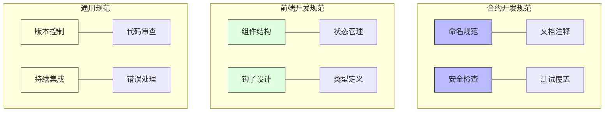

**Solidity代码规范**:
- 使用[Solidity风格指南](https://docs.soliditylang.org/en/latest/style-guide.html)
- 遵循[智能合约最佳实践](https://consensys.github.io/smart-contract-best-practices/)
- 使用NatSpec注释文档化合约
- 实现全面的错误处理

**前端代码规范**:
- 遵循React组件最佳实践
- 使用ESLint和Prettier确保代码质量
- 维护一致的文件和文件夹结构
- 使用TypeScript强类型

**通用开发规范**:
- 使用规范化的提交信息
- 进行详细的代码审查
- 维护全面的测试覆盖
- 文档化项目和API

### 8.2 安全最佳实践

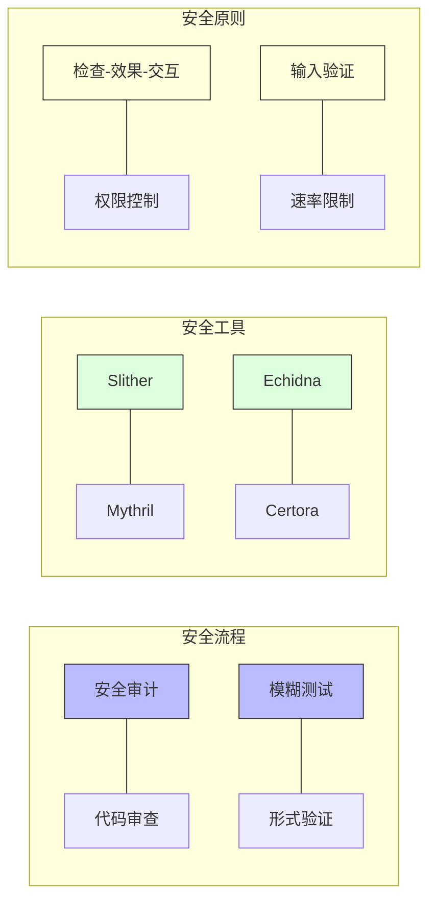

**智能合约安全实践**:
- 遵循检查-效果-交互模式
- 实施严格的访问控制
- 使用安全算术运算
- 防止重入攻击
- 避免时间戳依赖
- 限制函数可见性

**前端安全实践**:
- 安全处理用户输入
- 保护API密钥和敏感信息
- 实现适当的错误处理
- 避免客户端秘密

**安全工具与流程**:
- 使用静态分析工具
- 进行定期安全审计
- 实施漏洞赏金计划
- 维护事件响应计划

## 总结

Synthetix V3和420 Pool的技术栈涵盖了现代DeFi开发的多个方面，从智能合约开发到前端实现，从测试框架到部署工具。理解这些技术组件及其集成方式是成功开发和优化相关功能的基础。

通过本文档，你应该对Synthetix V3和420 Pool的技术架构有了全面的了解，能够识别各个组件的作用和相互关系，并为深入学习相关技术细节奠定基础。

## 进一步学习

- 深入研究Synthetix V3的合约实现
- 探索420 Pool的特有技术设计
- 学习前端与合约的交互模式
- 实践测试和部署流程
- 参与社区讨论和贡献 