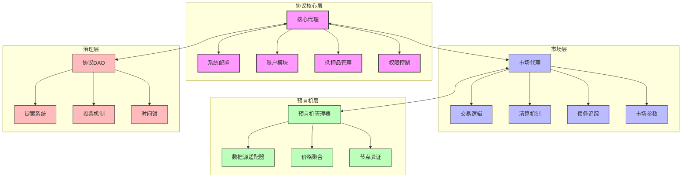
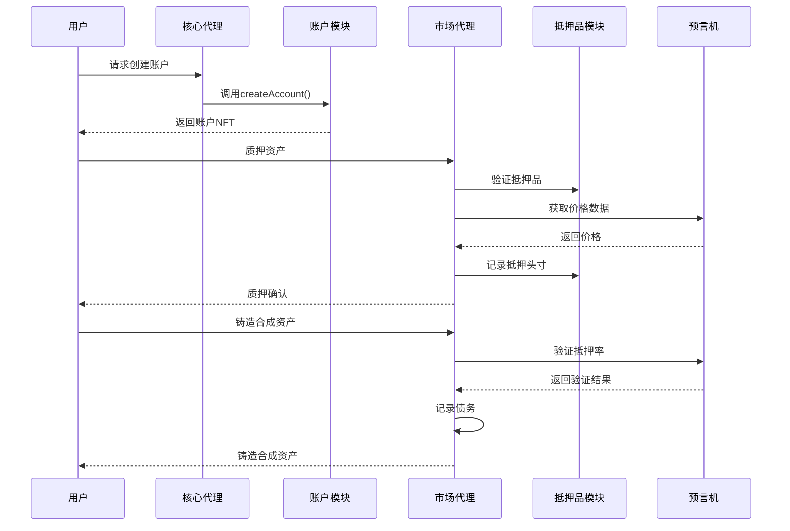
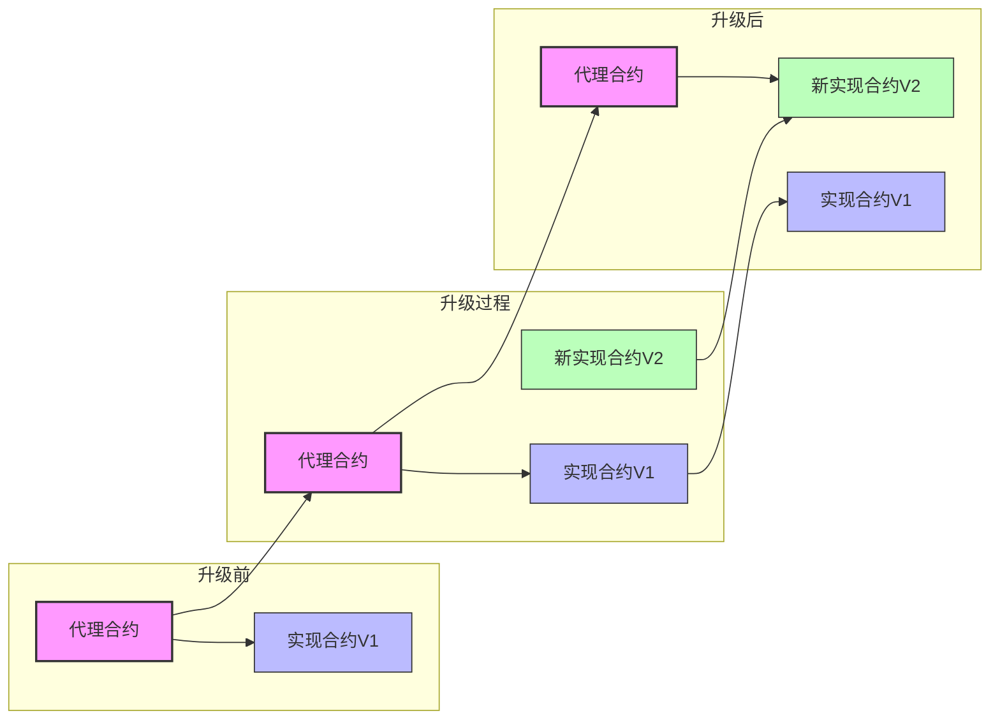
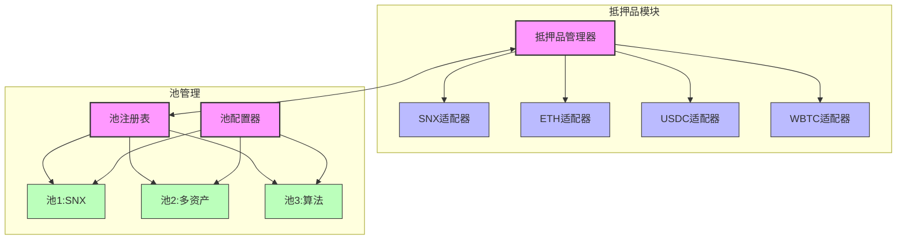
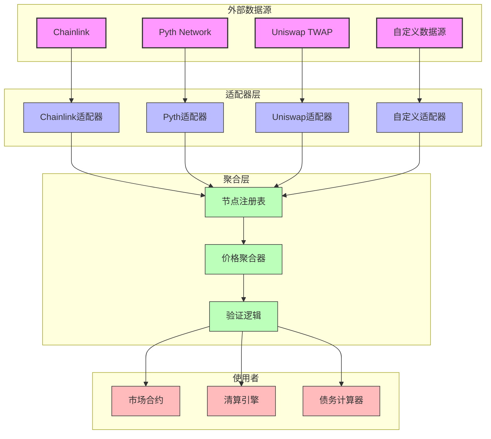
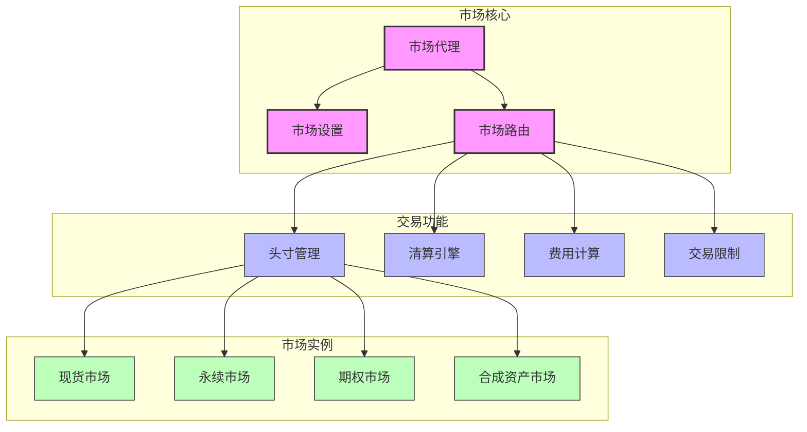
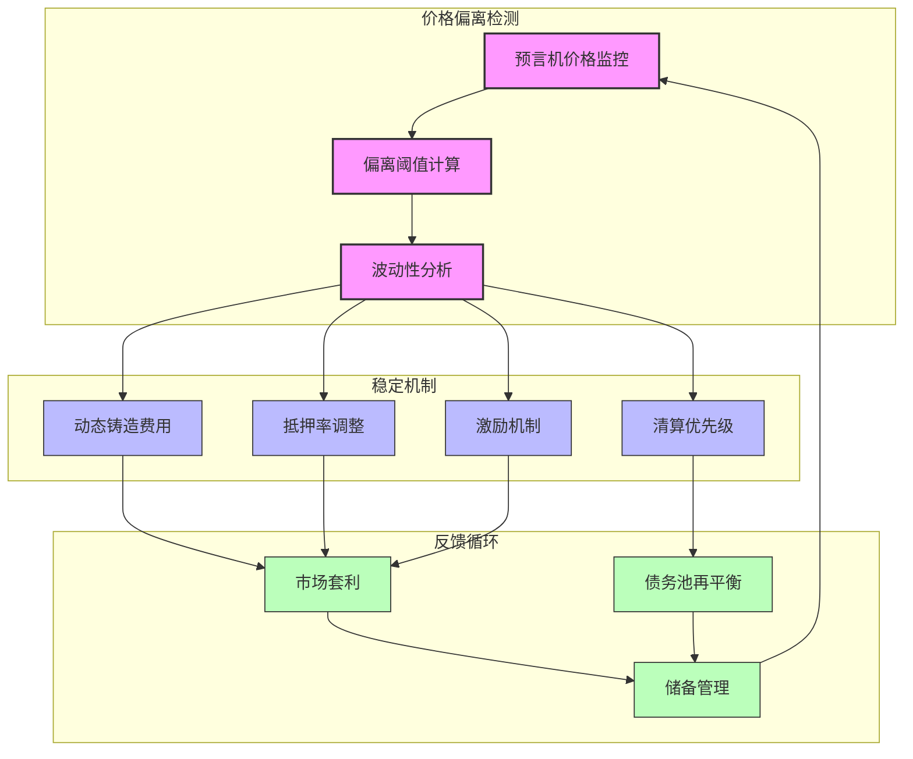
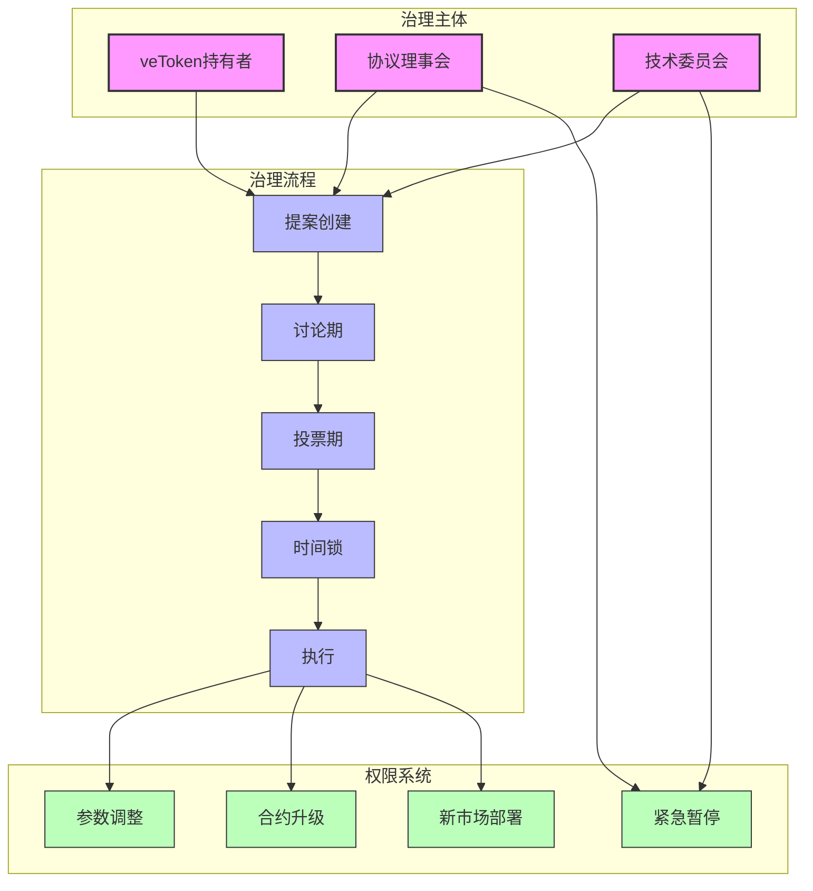
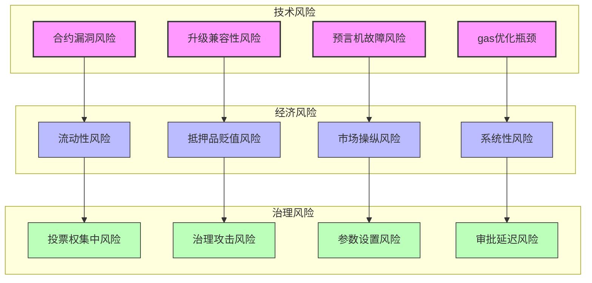
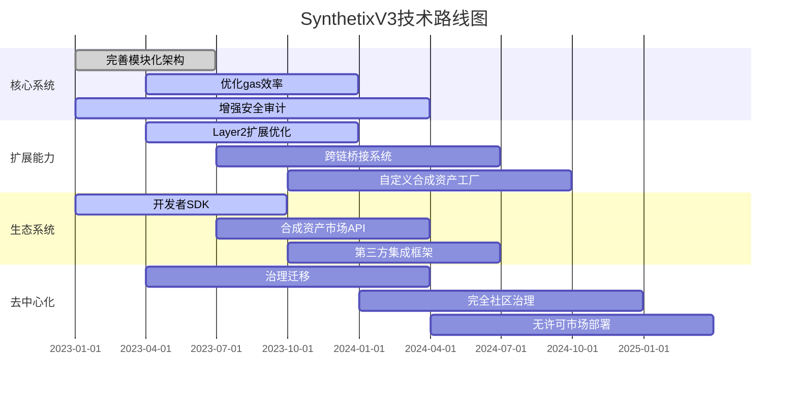

# SynthetixV3 核心架构深度剖析

## 1. 核心系统架构

SynthetixV3采用了全新的模块化架构设计，与V2相比有根本性的改进。这种模块化设计使系统各组件之间的耦合度降低，同时提高了可扩展性和可维护性。

### 1.1 整体架构层次



### 1.2 核心合约组件

SynthetixV3的核心系统由以下关键合约组成：

| 合约名称 | 功能描述 | 主要接口 |
|---------|---------|---------|
| CoreProxy | 系统入口点，代理模式实现可升级性 | initialize(), acceptOwnership() |
| SystemConfiguration | 全局系统参数管理 | setConfig(), getConfig() |
| AccountModule | NFT账户创建和权限管理 | createAccount(), setPermission() |
| CollateralManager | 管理系统支持的抵押品类型 | addCollateralType(), removeCollateralType() |
| PoolConfiguration | 配置和管理流动性池 | createPool(), setPoolParameters() |

## 2. 模块化设计深度解析

SynthetixV3采用了优雅的模块化设计模式，每个模块都有明确的职责范围和接口定义。

### 2.1 模块间交互流程



### 2.2 合约升级机制



SynthetixV3使用代理模式实现合约升级。所有用户交互都通过不变的代理合约进行，而实际逻辑则由可升级的实现合约提供。这种设计允许在保留状态和地址的同时更新系统逻辑。

## 3. 抵押品和债务系统剖析

### 3.1 多抵押品架构



SynthetixV3的抵押品系统通过适配器模式支持多种资产作为抵押品。每个抵押品适配器实现了统一的接口，但可以包含特定资产的逻辑。

### 3.2 债务计算机制详解

SynthetixV3的债务系统是其最复杂也最核心的组件之一。以下是核心债务计算算法的简化伪代码：

```
function calculateAccountDebt(accountId, poolId):
    // 获取账户在特定池中的抵押品价值
    collateralValue = getAccountCollateralValue(accountId, poolId)
    
    // 获取当前市场价格
    currentPrices = getOraclePrices()
    
    // 获取账户铸造的合成资产
    syntheticAssets = getAccountSyntheticAssets(accountId)
    
    // 计算合成资产的当前价值
    debtValue = 0
    for each asset in syntheticAssets:
        debtValue += asset.amount * currentPrices[asset.currencyKey]
    
    // 应用池特定的债务调整因子
    poolDebtFactor = getPoolDebtFactor(poolId)
    adjustedDebt = debtValue * poolDebtFactor
    
    // 计算健康因子
    healthFactor = collateralValue / adjustedDebt
    
    return {
        collateralValue: collateralValue,
        debtValue: debtValue,
        adjustedDebt: adjustedDebt,
        healthFactor: healthFactor
    }
```

## 4. 预言机架构深入分析

SynthetixV3的预言机系统是一个高度模块化的组件，支持多源数据聚合和定制的价格馈送逻辑。

### 4.1 预言机数据流



### 4.2 价格聚合算法

SynthetixV3采用了一种复杂的中值加权算法来聚合来自不同源的价格数据，以下是核心聚合逻辑的简化代码：

```solidity
// 价格聚合函数实现
function aggregatePrices(bytes32 currencyKey) public view returns (uint price, uint timestamp) {
    // 获取该货币的所有价格节点
    NodeDefinition[] memory nodes = getNodes(currencyKey);
    
    uint[] memory prices = new uint[](nodes.length);
    uint[] memory timestamps = new uint[](nodes.length);
    uint[] memory weights = new uint[](nodes.length);
    
    // 收集所有有效节点的价格
    uint validNodeCount = 0;
    for (uint i = 0; i < nodes.length; i++) {
        (uint nodePrice, uint nodeTimestamp) = nodes[i].adapter.getPrice();
        
        // 验证价格有效性和新鲜度
        if (isValidPrice(nodePrice) && isFreshPrice(nodeTimestamp)) {
            prices[validNodeCount] = nodePrice;
            timestamps[validNodeCount] = nodeTimestamp;
            weights[validNodeCount] = nodes[i].weight;
            validNodeCount++;
        }
    }
    
    // 确保有足够的有效节点
    require(validNodeCount >= minimumNodeCount, "Insufficient valid price nodes");
    
    // 按权重计算中值价格
    return computeWeightedMedian(prices, weights, validNodeCount);
}
```

## 5. 市场模块详解

### 5.1 市场合约架构



### 5.2 交易生命周期

```mermaid
sequenceDiagram
    参与者 用户
    参与者 市场代理
    参与者 头寸管理器
    参与者 费用计算器
    参与者 预言机
    参与者 清算引擎
    
    用户->>市场代理: 提交交易
    市场代理->>头寸管理器: 验证交易参数
    头寸管理器->>预言机: 获取价格数据
    预言机-->>头寸管理器: 返回价格
    头寸管理器->>费用计算器: 计算适用费用
    费用计算器-->>头寸管理器: 返回费用
    头寸管理器->>头寸管理器: 更新用户头寸
    头寸管理器-->>市场代理: 返回交易结果
    市场代理-->>用户: 确认交易
    
    loop 每个区块
        清算引擎->>预言机: 检查价格变动
        预言机-->>清算引擎: 返回最新价格
        清算引擎->>清算引擎: 识别不健康头寸
        清算引擎->>头寸管理器: 执行清算
    end
```

## 6. snxUSD稳定机制深度解析

### 6.1 价格稳定算法

snxUSD作为系统核心合成稳定币，其价格稳定性通过多重机制保障：



### 6.2 稳定算法核心代码

以下是snxUSD稳定机制的核心算法伪代码：

```solidity
// 动态调整铸造费率
function calculateMintingFee(uint usdPrice) public view returns (uint) {
    // 基础费率
    uint baseFee = getBaseFee();
    
    // 目标价格 (通常为1美元)
    uint targetPrice = getTargetPrice();
    
    // 价格偏离度
    int priceDelta = int(usdPrice) - int(targetPrice);
    
    // 当价格高于目标时减少费用，鼓励铸造
    // 当价格低于目标时增加费用，抑制铸造
    if (priceDelta > 0) {
        // 价格高于目标，减少费用
        uint discount = uint(priceDelta) * getDiscountCoefficient() / PRECISION;
        return baseFee > discount ? baseFee - discount : MIN_FEE;
    } else {
        // 价格低于目标，增加费用
        uint premium = uint(-priceDelta) * getPremiumCoefficient() / PRECISION;
        return baseFee + premium;
    }
}

// 动态调整抵押率要求
function calculateRequiredCollateralRatio(uint usdPrice) public view returns (uint) {
    // 基础抵押率
    uint baseRatio = getBaseCollateralRatio();
    
    // 目标价格
    uint targetPrice = getTargetPrice();
    
    // 价格偏离度
    int priceDelta = int(usdPrice) - int(targetPrice);
    
    // 当价格低于目标时增加抵押率要求，减少风险
    if (priceDelta < 0) {
        uint increase = uint(-priceDelta) * getCollateralAdjustmentFactor() / PRECISION;
        return baseRatio + increase;
    }
    
    return baseRatio;
}
```

## 7. 治理与安全机制

### 7.1 治理架构



### 7.2 安全措施详解

SynthetixV3采用了多层次的安全措施来保护系统资产和用户权益：

1. **形式化验证**：核心合约通过形式化验证工具验证逻辑正确性
2. **多重时间锁**：关键操作需要经过时间锁延迟，给予社区响应时间
3. **价值上限**：新部署的市场有价值上限，随着系统稳定性证明而逐步提高
4. **渐进式去中心化**：治理权限随时间推移逐步从核心团队转移到社区
5. **黑天鹅事件处理**：针对极端市场情况的专门处理机制
6. **预言机故障保护**：当预言机数据异常时的备用策略

## 8. 与V2的深度比较

| 特性 | SynthetixV3 | SynthetixV2 | 技术优势 |
|------|------------|------------|---------|
| 架构设计 | 模块化合约系统 | 单体合约设计 | 更高的灵活性和可升级性 |
| 账户模型 | NFT授权模型 | EOA直接持有 | 更强的可组合性和权限管理 |
| 抵押品系统 | 多抵押品支持 | 主要支持SNX | 更高的资本效率和风险分散 |
| 债务池模型 | 多池隔离模型 | 全局债务池 | 更精细的风险控制和风险隔离 |
| 预言机架构 | 多源聚合架构 | 单一预言机源 | 更高的数据可靠性和抗审查性 |
| 清算机制 | 分阶段自动清算 | 手动惩罚机制 | 更高的系统安全性和用户体验 |
| 治理系统 | 多层级DAO治理 | 简单提案治理 | 更深度的社区参与和权力分散 |
| gas效率 | 优化的存储模式 | 传统存储模式 | 更低的交易成本和更高的吞吐量 |
| 开发扩展性 | 插件化市场模型 | 中心化开发模式 | 更强的生态系统扩展能力 |

## 9. 技术风险与挑战

### 9.1 主要风险点



### 9.2 缓解策略

SynthetixV3采用以下策略来缓解主要风险：

1. **合约漏洞**：多轮审计、形式化验证和持续的漏洞奖励计划
2. **升级兼容性**：严格的测试流程和分阶段部署策略
3. **预言机故障**：多源数据聚合和异常检测机制
4. **流动性风险**：流动性激励计划和渐进式部署策略
5. **抵押品贬值**：多样化抵押品要求和动态调整机制
6. **市场操纵**：价格影响限制和滑点保护机制
7. **治理攻击**：多层级权限和时间锁保护机制

## 10. 未来技术路线图

### 10.1 技术演进计划



### 10.2 技术创新点

1. **自适应债务池**：根据市场条件动态调整债务池参数的算法
2. **智能清算机制**：使用机器学习优化清算时机和方式
3. **按需合成资产**：允许用户创建自定义合成资产的无需许可框架
4. **跨链合成资产**：在多条链上维持一致性的合成资产表示
5. **零知识证明集成**：为特定用例提供隐私保护的合成资产交易
6. **去中心化预言机网络**：完全由社区运营的专用预言机网络

## 总结

SynthetixV3代表了DeFi合成资产协议的新一代技术标准。其模块化架构、多抵押品系统、精细化风险管理和先进的预言机架构共同构成了一个强大而灵活的金融基础设施。与V2相比，V3在可扩展性、安全性和资本效率方面有了质的飞跃，为去中心化金融的下一阶段发展奠定了坚实基础。 