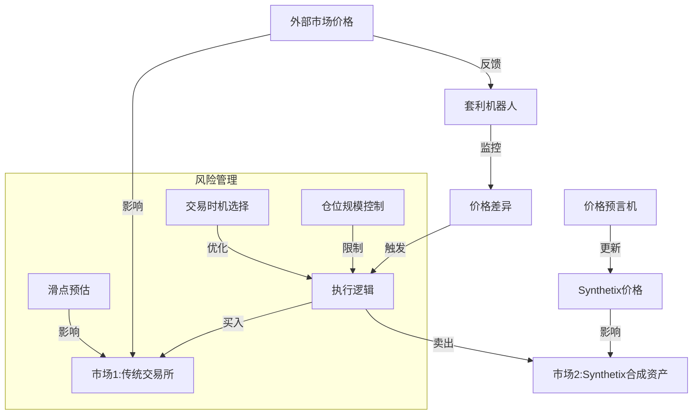
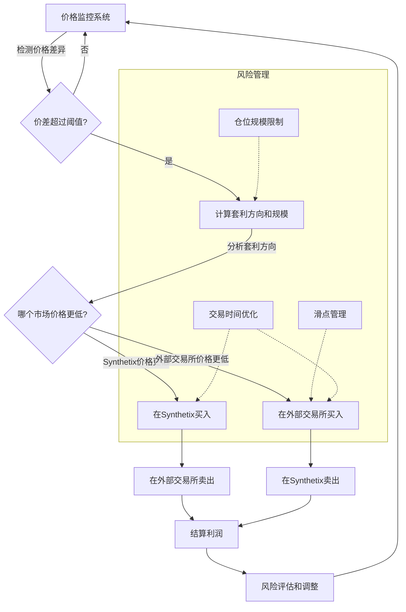

# Synthetix合成资产应用：跨市场套利策略

套利是金融市场中常见的交易策略，旨在利用不同市场之间的价格差异获利。Synthetix的合成资产系统为跨市场套利提供了独特的机会，尤其是其无滑点交易特性使得套利更加高效。

## 应用价值

跨市场套利策略在DeFi领域具有以下价值：

- **提高市场效率**：套利活动有助于消除市场价格差异，提高整体市场效率
- **增加流动性**：套利者在不同市场间的交易提高了市场流动性
- **风险中性收益**：相比单向投资，套利提供了较低风险的收益机会
- **改进价格发现**：通过套利，各市场价格趋于一致，促进准确的价格发现

## 实现方式

### 1. 无滑点套利

Synthetix的关键特性是无滑点交易，这为套利提供了巨大优势：

- 交易大小不影响执行价格
- 可以执行精确计算的套利
- 降低了套利失败的风险

### 2. 延迟套利

Synthetix使用Chainlink预言机更新价格，这存在一定延迟，可被套利：

- 监控价格走势
- 在预言机更新前建立头寸
- 价格更新后平仓获利

### 3. 跨链套利

随着Synthetix部署在多个链上，可以进行跨链套利：

- 利用不同链上合成资产的价格差异
- 降低跨链交易成本
- A链购买价格较低的合成资产，B链卖出价格较高的相同资产

## 系统架构



## 代码实现

### 基础套利机器人

```solidity
// SPDX-License-Identifier: MIT
pragma solidity ^0.8.0;

import "@openzeppelin/contracts/token/ERC20/IERC20.sol";
import "@openzeppelin/contracts/access/Ownable.sol";

interface ISynthetixExchange {
    function exchange(
        bytes32 sourceCurrencyKey,
        uint256 sourceAmount,
        bytes32 destinationCurrencyKey
    ) external returns (uint256);
    
    function effectiveValue(
        bytes32 sourceCurrencyKey,
        uint256 sourceAmount,
        bytes32 destinationCurrencyKey
    ) external view returns (uint256);
}

interface IDexRouter {
    function swapExactTokensForTokens(
        uint256 amountIn,
        uint256 amountOutMin,
        address[] calldata path,
        address to,
        uint256 deadline
    ) external returns (uint256[] memory amounts);
    
    function getAmountsOut(
        uint256 amountIn,
        address[] calldata path
    ) external view returns (uint256[] memory amounts);
}

contract SynthetixArbitrageBot is Ownable {
    // 合约地址
    address public synthetixExchangeAddress;
    address public dexRouterAddress;
    
    // 套利参数
    uint256 public minProfitThreshold = 2; // 0.2%的最小利润阈值
    uint256 public maxSlippage = 10;        // 1%的最大滑点
    uint256 public maxPositionSize;         // 最大仓位规模
    
    constructor(address _synthetixExchange, address _dexRouter) {
        synthetixExchangeAddress = _synthetixExchange;
        dexRouterAddress = _dexRouter;
    }
    
    // 设置最小利润阈值 (以千分之一为单位, 如 2 = 0.2%)
    function setMinProfitThreshold(uint256 _threshold) external onlyOwner {
        minProfitThreshold = _threshold;
    }
    
    // 设置最大滑点 (以千分之一为单位, 如 10 = 1%)
    function setMaxSlippage(uint256 _slippage) external onlyOwner {
        maxSlippage = _slippage;
    }
    
    // 设置最大头寸规模
    function setMaxPositionSize(uint256 _size) external onlyOwner {
        maxPositionSize = _size;
    }
    
    // 执行ETH-sETH套利
    function executeEthArbitrage(uint256 amount) external onlyOwner {
        require(amount <= maxPositionSize, "Position too large");
        
        // 检查套利机会
        (bool profitable, uint256 profitBps) = checkEthArbitrageOpportunity(amount);
        require(profitable, "No profitable opportunity");
        
        // 选择套利方向
        if (isSynthCheaper()) {
            // 方向1: DEX买入ETH, Synthetix卖出sETH
            executeSynthToExternalArbitrage(amount);
        } else {
            // 方向2: Synthetix买入sETH, DEX卖出ETH
            executeExternalToSynthArbitrage(amount);
        }
        
        // 记录套利执行
        emit ArbitrageExecuted("ETH", amount, profitBps);
    }
    
    // 检查ETH-sETH套利机会
    function checkEthArbitrageOpportunity(uint256 amount) public view returns (bool, uint256) {
        // 获取Synthetix上ETH价格
        ISynthetixExchange synthetixExchange = ISynthetixExchange(synthetixExchangeAddress);
        uint256 sethToEthValue = synthetixExchange.effectiveValue("sETH", amount, "sUSD");
        
        // 获取DEX上ETH价格 (简化示例)
        IDexRouter dexRouter = IDexRouter(dexRouterAddress);
        address[] memory path = new address[](2);
        path[0] = address(0); // ETH地址 (实际应用需要替换)
        path[1] = address(0); // sUSD地址 (实际应用需要替换)
        uint256 ethTosUSDValue = dexRouter.getAmountsOut(amount, path)[1];
        
        // 计算价格差异
        uint256 priceDiffBps;
        bool isSynthCheaper = sethToEthValue < ethTosUSDValue;
        
        if (isSynthCheaper) {
            // Synth价格低于DEX
            priceDiffBps = (ethTosUSDValue * 1000 - sethToEthValue * 1000) / sethToEthValue;
        } else {
            // DEX价格低于Synth
            priceDiffBps = (sethToEthValue * 1000 - ethTosUSDValue * 1000) / ethTosUSDValue;
        }
        
        // 考虑交易成本后是否仍有利可图
        uint256 tradingCostBps = 25; // 假设总交易成本为0.25%
        return (priceDiffBps > minProfitThreshold + tradingCostBps, priceDiffBps);
    }
    
    // 判断哪个市场价格较低
    function isSynthCheaper() public view returns (bool) {
        // 简化实现，实际应用需要比较价格
        return true; // 占位，实际实现需要替换
    }
    
    // 执行从Synth到外部交易所的套利
    function executeSynthToExternalArbitrage(uint256 amount) internal {
        // 实现Synth到DEX的套利逻辑
        // 1. 在Synthetix上卖出sETH获得sUSD
        // 2. 在DEX上用sUSD买入ETH
        // 3. 从套利中获利
    }
    
    // 执行从外部交易所到Synth的套利
    function executeExternalToSynthArbitrage(uint256 amount) internal {
        // 实现DEX到Synth的套利逻辑
        // 1. 在DEX上卖出ETH获得sUSD
        // 2. 在Synthetix上用sUSD买入sETH
        // 3. 从套利中获利
    }
    
    // 提取利润
    function withdrawProfit(address token, address recipient) external onlyOwner {
        IERC20 tokenContract = IERC20(token);
        uint256 balance = tokenContract.balanceOf(address(this));
        require(tokenContract.transfer(recipient, balance), "Transfer failed");
    }
    
    // 事件
    event ArbitrageExecuted(string assetKey, uint256 amount, uint256 profitBps);
}
```

### 实际套利案例

#### 1. BTC/sBTC套利

```solidity
// BTC和sBTC之间的套利
function executeBtcSbtcArbitrage() external onlyOwner {
    // 获取Binance上BTC价格
    uint256 binanceBtcPrice = getBinanceBtcPrice();
    
    // 获取Synthetix上sBTC价格
    uint256 synthetixSbtcPrice = getSynthetixSbtcPrice();
    
    // 计算价格差异百分比
    uint256 priceDiffPercentage = calculatePriceDiff(binanceBtcPrice, synthetixSbtcPrice);
    
    // 如果差异足够大，执行套利
    if (priceDiffPercentage > minArbitrageThreshold) {
        if (binanceBtcPrice < synthetixSbtcPrice) {
            // 在Binance买入BTC
            buyBtcOnBinance(targetAmount);
            
            // 将BTC转入Synthetix兼容钱包
            transferBtcToArbitrageWallet();
            
            // 在Synthetix卖出sBTC
            sellSbtcOnSynthetix(targetAmount);
        } else {
            // 在Synthetix买入sBTC
            buySbtcOnSynthetix(targetAmount);
            
            // 在Binance卖出BTC
            sellBtcOnBinance(targetAmount);
        }
        
        // 记录套利交易
        logArbitrageTrade("BTC/sBTC", priceDiffPercentage, targetAmount);
    }
}
```

#### 2. 预言机延迟套利

```javascript
// 预言机延迟套利的JavaScript实现
async function executeOracleDelayArbitrage(asset) {
    // 监听重大价格变动
    const priceFeed = new ethers.Contract(CHAINLINK_PRICE_FEED, PriceAggregatorABI, provider);
    
    // 设置价格变动阈值
    const PRICE_CHANGE_THRESHOLD = 2.0; // 2%
    
    priceFeed.on("AnswerUpdated", async (currentPrice, roundId, updatedAt) => {
        // 获取上一次价格
        const previousPrice = await priceFeed.getAnswer(roundId - 1);
        
        // 计算价格变动百分比
        const priceChangePercentage = Math.abs(currentPrice - previousPrice) / previousPrice * 100;
        
        if (priceChangePercentage >= PRICE_CHANGE_THRESHOLD) {
            console.log(`Significant price change detected: ${priceChangePercentage.toFixed(2)}%`);
            
            // 检查Synthetix预言机是否已更新
            const synthetixPrice = await getSynthetixPrice(asset);
            const externalPrice = await getExternalPrice(asset);
            
            // 如果Synthetix价格尚未更新，存在套利机会
            if (Math.abs(synthetixPrice - externalPrice) / externalPrice * 100 >= 1.5) {
                console.log("Oracle delay arbitrage opportunity found");
                
                // 确定套利方向
                if (synthetixPrice < externalPrice) {
                    // 在Synthetix买入，在外部市场卖出
                    await buyOnSynthetix(asset, ARBITRAGE_AMOUNT);
                    await sellOnExternalMarket(asset, ARBITRAGE_AMOUNT);
                } else {
                    // 在外部市场买入，在Synthetix卖出
                    await buyOnExternalMarket(asset, ARBITRAGE_AMOUNT);
                    await sellOnSynthetix(asset, ARBITRAGE_AMOUNT);
                }
                
                console.log("Oracle delay arbitrage executed successfully");
            }
        }
    });
    
    console.log(`Monitoring ${asset} for oracle delay arbitrage opportunities...`);
}
```

#### 3. Layer2低成本套利

```javascript
// 跨链套利实现
async function executeL2Arbitrage() {
    // 连接不同链上的提供者
    const l1Provider = new ethers.providers.JsonRpcProvider(L1_RPC_URL);
    const optimismProvider = new ethers.providers.JsonRpcProvider(OPTIMISM_RPC_URL);
    
    // 获取两个链上的价格
    const ethPriceOnL1 = await getEthPriceOnL1(l1Provider);
    const ethPriceOnOptimism = await getEthPriceOnOptimism(optimismProvider);
    
    // 计算价格差异
    const priceDiff = Math.abs(ethPriceOnL1 - ethPriceOnOptimism) / Math.min(ethPriceOnL1, ethPriceOnOptimism) * 100;
    
    // 考虑跨链成本
    const crossChainCost = estimateCrossChainCost();
    const potentialProfit = calculatePotentialProfit(ethPriceOnL1, ethPriceOnOptimism, TRADE_AMOUNT);
    
    if (potentialProfit > crossChainCost * 1.5) { // 确保利润显著高于成本
        console.log(`L2 arbitrage opportunity: ${priceDiff.toFixed(2)}% difference`);
        
        if (ethPriceOnL1 < ethPriceOnOptimism) {
            // L1买入，Optimism卖出
            await buyEthOnL1(TRADE_AMOUNT);
            await bridgeEthToOptimism(TRADE_AMOUNT);
            await sellEthOnOptimism(TRADE_AMOUNT);
        } else {
            // Optimism买入，L1卖出
            await buyEthOnOptimism(TRADE_AMOUNT);
            await bridgeEthToL1(TRADE_AMOUNT);
            await sellEthOnL1(TRADE_AMOUNT);
        }
        
        console.log("L2 arbitrage executed successfully");
    }
}
```

## 套利流程图



## 进阶套利策略

### 1. 三角套利

利用多种合成资产之间的价格关系进行三角套利：

```solidity
// 三角套利示例
function executeTriangularArbitrage(
    bytes32 assetA,
    bytes32 assetB,
    bytes32 assetC,
    uint256 startAmount
) external onlyOwner {
    ISynthetixExchange synthetix = ISynthetixExchange(synthetixExchangeAddress);
    
    // 计算直接交换路径价值
    uint256 directValue = synthetix.effectiveValue(assetA, startAmount, assetC);
    
    // 计算通过中间资产的交换路径价值
    uint256 indirectStep1 = synthetix.effectiveValue(assetA, startAmount, assetB);
    uint256 indirectStep2 = synthetix.effectiveValue(assetB, indirectStep1, assetC);
    
    // 对比两种路径的结果
    if (indirectStep2 > directValue * 1005 / 1000) { // 至少0.5%的利润
        // 执行三角套利
        uint256 step1Result = synthetix.exchange(assetA, startAmount, assetB);
        uint256 step2Result = synthetix.exchange(assetB, step1Result, assetC);
        
        // 记录利润
        uint256 profit = step2Result - directValue;
        emit TriangularArbitrageExecuted(assetA, assetB, assetC, profit);
    }
}
```

### 2. 闪电贷套利

结合闪电贷扩大套利规模：

```solidity
// 闪电贷套利
function executeFlashLoanArbitrage(
    address flashLoanProvider,
    address token,
    uint256 amount
) external onlyOwner {
    // 请求闪电贷
    IFlashLoanProvider(flashLoanProvider).flashLoan(
        address(this),
        token,
        amount,
        abi.encode(token)
    );
}

// 闪电贷回调函数
function executeOperation(
    address token,
    uint256 amount,
    uint256 fee,
    bytes calldata params
) external returns (bool) {
    // 解码参数
    address decodedToken = abi.decode(params, (address));
    require(token == decodedToken, "Token mismatch");
    
    // 执行套利
    bool success = executeLargeScaleArbitrage(token, amount);
    require(success, "Arbitrage failed");
    
    // 确保有足够的代币偿还闪电贷
    uint256 amountToRepay = amount + fee;
    IERC20(token).approve(msg.sender, amountToRepay);
    
    return true;
}
```

### 3. 多交易所套利机器人

整合多个交易所的套利：

```javascript
class MultiExchangeArbitrageBot {
    constructor(config) {
        this.exchanges = config.exchanges;
        this.assets = config.assets;
        this.minProfitThreshold = config.minProfitThreshold;
        this.wallets = config.wallets;
    }
    
    async start() {
        console.log("Starting multi-exchange arbitrage bot...");
        
        // 定期扫描套利机会
        setInterval(async () => {
            for (const asset of this.assets) {
                await this.scanArbitrageOpportunities(asset);
            }
        }, 10000); // 每10秒扫描一次
    }
    
    async scanArbitrageOpportunities(asset) {
        // 获取所有交易所的资产价格
        const prices = await Promise.all(
            this.exchanges.map(exchange => this.getPriceFromExchange(exchange, asset))
        );
        
        // 找出最高价和最低价
        let lowestPrice = { price: Infinity, exchange: null };
        let highestPrice = { price: 0, exchange: null };
        
        prices.forEach((priceData, index) => {
            if (priceData.price < lowestPrice.price) {
                lowestPrice = { price: priceData.price, exchange: this.exchanges[index] };
            }
            if (priceData.price > highestPrice.price) {
                highestPrice = { price: priceData.price, exchange: this.exchanges[index] };
            }
        });
        
        // 计算价差百分比
        const priceDiffPercentage = (highestPrice.price - lowestPrice.price) / lowestPrice.price * 100;
        
        // 如果价差超过阈值，执行套利
        if (priceDiffPercentage > this.minProfitThreshold) {
            console.log(`Arbitrage opportunity for ${asset}: ` +
                        `Buy on ${lowestPrice.exchange.name} at $${lowestPrice.price}, ` +
                        `Sell on ${highestPrice.exchange.name} at $${highestPrice.price}, ` +
                        `Difference: ${priceDiffPercentage.toFixed(2)}%`);
            
            // 执行套利
            await this.executeArbitrage(asset, lowestPrice.exchange, highestPrice.exchange);
        }
    }
    
    async executeArbitrage(asset, buyExchange, sellExchange) {
        try {
            // 计算最佳交易规模
            const tradeAmount = this.calculateOptimalTradeSize(asset, buyExchange, sellExchange);
            
            // 在低价交易所买入
            const buyTx = await this.executeBuy(buyExchange, asset, tradeAmount);
            console.log(`Bought ${asset} on ${buyExchange.name}, tx: ${buyTx.hash}`);
            
            // 如果需要，将资产从一个交易所转移到另一个
            if (buyExchange.needsTransfer) {
                await this.transferAssets(asset, buyExchange, sellExchange, tradeAmount);
            }
            
            // 在高价交易所卖出
            const sellTx = await this.executeSell(sellExchange, asset, tradeAmount);
            console.log(`Sold ${asset} on ${sellExchange.name}, tx: ${sellTx.hash}`);
            
            // 记录套利利润
            const profit = this.calculateProfit(buyTx, sellTx);
            console.log(`Arbitrage completed with profit: $${profit.toFixed(2)}`);
            
            return true;
        } catch (error) {
            console.error(`Arbitrage execution failed: ${error.message}`);
            return false;
        }
    }
    
    // 其他辅助方法...
}
```

## 优势与差异化

使用Synthetix进行跨市场套利相比传统套利方法具有以下优势：

1. **无滑点交易**：Synthetix的无滑点交易特性消除了大额交易的价格影响
2. **单一流动性池**：不需要在多个流动性池之间移动资金
3. **多资产覆盖**：可以对各种合成资产进行套利，包括难以直接交易的资产
4. **预言机延迟捕获**：可以利用预言机更新延迟进行低风险套利
5. **跨链套利**：可以在不同区块链之间进行套利

## 潜在风险与缓解措施

1. **预言机风险**
   - 风险：预言机价格操纵或故障
   - 缓解：设置交易规模限制，使用多个数据源验证价格

2. **债务池风险**
   - 风险：Synthetix债务池波动影响套利盈利能力
   - 缓解：监控债务池健康度，调整套利规模

3. **交易失败风险**
   - 风险：交易确认延迟导致套利窗口关闭
   - 缓解：优化Gas策略，使用快速交易确认

4. **竞争风险**
   - 风险：套利机会被其他交易者抢先
   - 缓解：优化交易执行速度，寻找独特套利路径

## 套利者工具包

为了帮助套利者更有效地执行策略，我们可以提供以下工具：

1. **价格监控仪表板**：实时监控Synthetix与外部市场价格差异
2. **套利机会计算器**：输入交易参数，计算潜在利润和风险
3. **自动化套利机器人**：根据预设参数自动执行套利交易
4. **历史套利数据分析**：分析过去的套利模式和成功率

## 结论

Synthetix的合成资产系统为跨市场套利提供了丰富的机会，尤其是其无滑点交易特性和预言机机制为套利者提供了独特优势。通过精心设计的套利策略和风险管理，可以在保持较低风险的同时获取可观的套利收益，同时也为整个DeFi生态系统提供了更高的价格效率和流动性。 