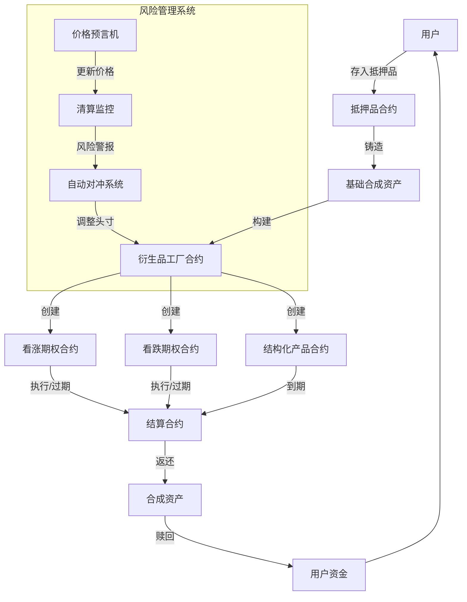
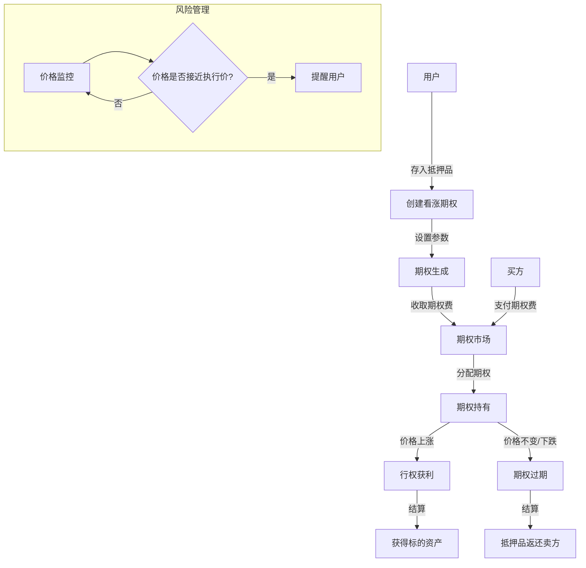
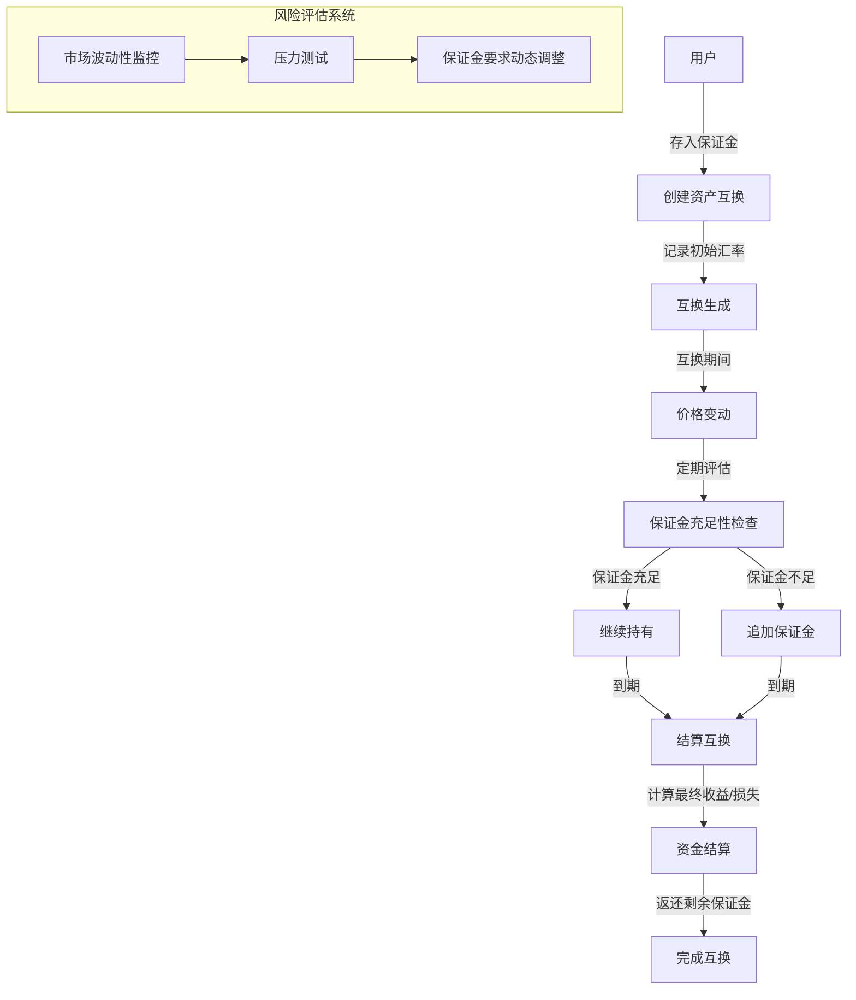
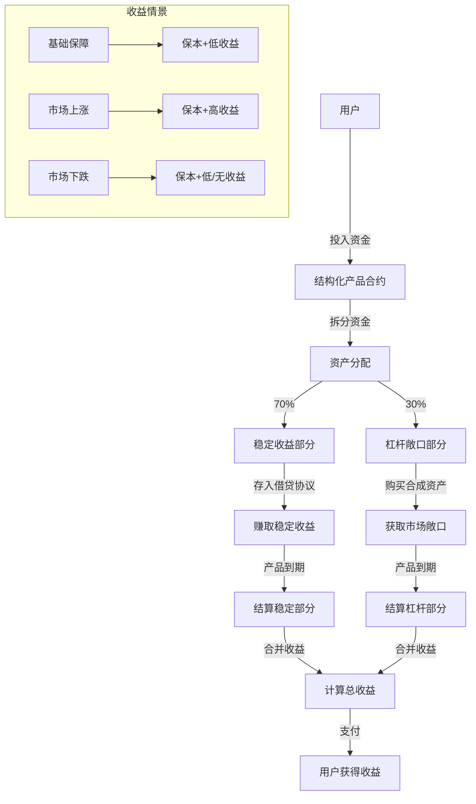

# Synthetix合成资产应用：高级衍生品策略

衍生品是传统金融市场中重要的组成部分，用于风险管理、投资和投机。Synthetix的合成资产系统提供了在DeFi领域创建和交易复杂衍生品策略的重要基础设施。

## 应用价值

高级衍生品策略在DeFi中具有以下价值：

- **风险管理**：为用户提供对冲市场风险的工具
- **杠杆敞口**：创建具有杠杆效应的市场敞口
- **收益增强**：通过结构化产品增强收益潜力
- **风险定制**：允许用户根据自己的风险偏好定制风险敞口
- **市场中性策略**：创建不受市场方向影响的收益策略

## 实现方式

### 1. 合成期权结构

利用Synthetix的合成资产可以创建类似期权的结构：

- **看涨期权**：赋予持有者以指定价格购买资产的权利
- **看跌期权**：赋予持有者以指定价格出售资产的权利
- **期权组合**：创建复杂的期权策略，如跨式期权、蝶式期权等

### 2. 杠杆交易策略

通过抵押品和借贷创建杠杆头寸：

- **多头杠杆**：放大上涨市场的收益
- **空头杠杆**：从下跌市场中获利
- **杠杆率管理**：通过智能合约自动管理杠杆率，防止清算

### 3. 结构化产品

创建混合多种资产和策略的结构化投资产品：

- **保本型产品**：结合低风险和高风险部分的资产配置
- **增强型收益产品**：通过期权策略增强基础资产收益
- **参与型产品**：允许有限参与市场上涨，同时提供部分下跌保护

## 系统架构



## 代码实现

### 基础合成期权合约

```solidity
// SPDX-License-Identifier: MIT
pragma solidity ^0.8.0;

import "@openzeppelin/contracts/token/ERC20/IERC20.sol";
import "@openzeppelin/contracts/security/ReentrancyGuard.sol";
import "@openzeppelin/contracts/access/Ownable.sol";

interface ISynthetixExchange {
    function exchange(
        bytes32 sourceCurrencyKey,
        uint256 sourceAmount,
        bytes32 destinationCurrencyKey
    ) external returns (uint256);
    
    function effectiveValue(
        bytes32 sourceCurrencyKey,
        uint256 sourceAmount,
        bytes32 destinationCurrencyKey
    ) external view returns (uint256);
}

// 期权类型枚举
enum OptionType { CALL, PUT }

contract SyntheticOption is ReentrancyGuard, Ownable {
    // 合约地址
    address public synthetixExchange;
    address public priceOracle;
    
    // 期权参数
    struct Option {
        bytes32 baseAsset;        // 基础资产 (如 "sETH")
        bytes32 quoteAsset;       // 计价资产 (如 "sUSD")
        uint256 strikePrice;      // 执行价格
        uint256 premium;          // 期权费
        uint256 collateral;       // 抵押品金额
        uint256 expiry;           // 到期时间
        OptionType optionType;    // 期权类型
        address writer;           // 期权卖方
        address holder;           // 期权买方
        bool exercised;           // 是否已行权
        bool closed;              // 是否已关闭
    }
    
    // 存储期权信息
    Option[] public options;
    
    // 事件
    event OptionCreated(uint256 indexed optionId, address indexed writer, bytes32 baseAsset, uint256 strikePrice, uint256 expiry, OptionType optionType);
    event OptionPurchased(uint256 indexed optionId, address indexed holder, uint256 premium);
    event OptionExercised(uint256 indexed optionId, address indexed holder, uint256 profit);
    event OptionExpired(uint256 indexed optionId);
    event OptionClosed(uint256 indexed optionId);
    
    constructor(address _synthetixExchange, address _priceOracle) {
        synthetixExchange = _synthetixExchange;
        priceOracle = _priceOracle;
    }
    
    // 创建期权 (卖方调用)
    function createOption(
        bytes32 baseAsset,
        bytes32 quoteAsset,
        uint256 strikePrice,
        uint256 premium,
        uint256 duration,
        OptionType optionType,
        uint256 collateralAmount
    ) external nonReentrant returns (uint256) {
        require(strikePrice > 0, "Strike price must be positive");
        require(premium > 0, "Premium must be positive");
        require(duration > 0, "Duration must be positive");
        require(collateralAmount > 0, "Collateral must be positive");
        
        // 转移抵押品
        if (optionType == OptionType.CALL) {
            // 看涨期权：卖方提供基础资产作为抵押
            IERC20 baseToken = IERC20(getTokenAddress(baseAsset));
            require(baseToken.transferFrom(msg.sender, address(this), collateralAmount), "Collateral transfer failed");
        } else {
            // 看跌期权：卖方提供计价资产作为抵押
            IERC20 quoteToken = IERC20(getTokenAddress(quoteAsset));
            require(quoteToken.transferFrom(msg.sender, address(this), collateralAmount), "Collateral transfer failed");
        }
        
        // 创建期权
        uint256 optionId = options.length;
        options.push(Option({
            baseAsset: baseAsset,
            quoteAsset: quoteAsset,
            strikePrice: strikePrice,
            premium: premium,
            collateral: collateralAmount,
            expiry: block.timestamp + duration,
            optionType: optionType,
            writer: msg.sender,
            holder: address(0),
            exercised: false,
            closed: false
        }));
        
        emit OptionCreated(optionId, msg.sender, baseAsset, strikePrice, block.timestamp + duration, optionType);
        
        return optionId;
    }
    
    // 购买期权 (买方调用)
    function purchaseOption(uint256 optionId) external nonReentrant {
        Option storage option = options[optionId];
        
        require(option.holder == address(0), "Option already purchased");
        require(option.writer != msg.sender, "Writer cannot purchase own option");
        require(!option.closed, "Option is closed");
        require(block.timestamp < option.expiry, "Option expired");
        
        // 转移期权费
        IERC20 quoteToken = IERC20(getTokenAddress(option.quoteAsset));
        require(quoteToken.transferFrom(msg.sender, option.writer, option.premium), "Premium transfer failed");
        
        // 更新期权持有人
        option.holder = msg.sender;
        
        emit OptionPurchased(optionId, msg.sender, option.premium);
    }
    
    // 行权 (买方调用)
    function exerciseOption(uint256 optionId) external nonReentrant {
        Option storage option = options[optionId];
        
        require(option.holder == msg.sender, "Not option holder");
        require(!option.exercised, "Option already exercised");
        require(!option.closed, "Option is closed");
        require(block.timestamp < option.expiry, "Option expired");
        
        // 获取当前价格
        uint256 currentPrice = getCurrentPrice(option.baseAsset, option.quoteAsset);
        
        // 计算是否值得行权
        bool profitable;
        uint256 profit;
        
        if (option.optionType == OptionType.CALL) {
            // 看涨期权：当前价格 > 执行价格时有利可图
            profitable = currentPrice > option.strikePrice;
            if (profitable) {
                profit = (currentPrice - option.strikePrice) * option.collateral / currentPrice;
            }
        } else {
            // 看跌期权：执行价格 > 当前价格时有利可图
            profitable = option.strikePrice > currentPrice;
            if (profitable) {
                profit = (option.strikePrice - currentPrice) * option.collateral / option.strikePrice;
            }
        }
        
        require(profitable, "Not profitable to exercise");
        
        // 执行结算
        option.exercised = true;
        
        if (option.optionType == OptionType.CALL) {
            // 看涨期权：根据执行价格转移基础资产给买方
            IERC20 baseToken = IERC20(getTokenAddress(option.baseAsset));
            require(baseToken.transfer(option.holder, option.collateral), "Asset transfer failed");
            
            // 买方需支付执行价格
            IERC20 quoteToken = IERC20(getTokenAddress(option.quoteAsset));
            uint256 paymentAmount = option.strikePrice * option.collateral / currentPrice;
            require(quoteToken.transferFrom(option.holder, option.writer, paymentAmount), "Payment failed");
        } else {
            // 看跌期权：买方将基础资产按执行价格卖给卖方
            IERC20 baseToken = IERC20(getTokenAddress(option.baseAsset));
            uint256 baseAmount = option.collateral * currentPrice / option.strikePrice;
            require(baseToken.transferFrom(option.holder, option.writer, baseAmount), "Asset transfer failed");
            
            // 卖方支付执行价格
            IERC20 quoteToken = IERC20(getTokenAddress(option.quoteAsset));
            require(quoteToken.transfer(option.holder, option.collateral), "Payment failed");
        }
        
        emit OptionExercised(optionId, option.holder, profit);
    }
    
    // 期权到期处理 (任何人可调用)
    function settleExpiredOption(uint256 optionId) external nonReentrant {
        Option storage option = options[optionId];
        
        require(!option.exercised, "Option already exercised");
        require(!option.closed, "Option already closed");
        require(block.timestamp >= option.expiry, "Option not yet expired");
        
        // 将抵押品返还给卖方
        option.closed = true;
        
        if (option.optionType == OptionType.CALL) {
            IERC20 baseToken = IERC20(getTokenAddress(option.baseAsset));
            require(baseToken.transfer(option.writer, option.collateral), "Collateral return failed");
        } else {
            IERC20 quoteToken = IERC20(getTokenAddress(option.quoteAsset));
            require(quoteToken.transfer(option.writer, option.collateral), "Collateral return failed");
        }
        
        emit OptionExpired(optionId);
    }
    
    // 提前关闭期权 (卖方调用，仅限未被购买的期权)
    function closeOption(uint256 optionId) external nonReentrant {
        Option storage option = options[optionId];
        
        require(option.writer == msg.sender, "Not option writer");
        require(option.holder == address(0), "Option already purchased");
        require(!option.closed, "Option already closed");
        
        // 关闭期权并返还抵押品
        option.closed = true;
        
        if (option.optionType == OptionType.CALL) {
            IERC20 baseToken = IERC20(getTokenAddress(option.baseAsset));
            require(baseToken.transfer(option.writer, option.collateral), "Collateral return failed");
        } else {
            IERC20 quoteToken = IERC20(getTokenAddress(option.quoteAsset));
            require(quoteToken.transfer(option.writer, option.collateral), "Collateral return failed");
        }
        
        emit OptionClosed(optionId);
    }
    
    // 获取期权信息
    function getOption(uint256 optionId) external view returns (
        bytes32 baseAsset,
        bytes32 quoteAsset,
        uint256 strikePrice,
        uint256 premium,
        uint256 collateral,
        uint256 expiry,
        OptionType optionType,
        address writer,
        address holder,
        bool exercised,
        bool closed
    ) {
        Option storage option = options[optionId];
        return (
            option.baseAsset,
            option.quoteAsset,
            option.strikePrice,
            option.premium,
            option.collateral,
            option.expiry,
            option.optionType,
            option.writer,
            option.holder,
            option.exercised,
            option.closed
        );
    }
    
    // 计算期权当前价值
    function getOptionValue(uint256 optionId) external view returns (uint256) {
        Option storage option = options[optionId];
        
        if (option.exercised || option.closed || block.timestamp >= option.expiry) {
            return 0;
        }
        
        uint256 currentPrice = getCurrentPrice(option.baseAsset, option.quoteAsset);
        
        if (option.optionType == OptionType.CALL) {
            // 看涨期权价值计算
            if (currentPrice > option.strikePrice) {
                return (currentPrice - option.strikePrice) * option.collateral / currentPrice;
            }
        } else {
            // 看跌期权价值计算
            if (option.strikePrice > currentPrice) {
                return (option.strikePrice - currentPrice) * option.collateral / option.strikePrice;
            }
        }
        
        return 0; // 虚值期权
    }
    
    // 获取合成资产代币地址
    function getTokenAddress(bytes32 currencyKey) internal view returns (address) {
        // 实际应用中需要通过Synthetix AddressResolver获取
        return address(0); // 简化示例，实际需要实现
    }
    
    // 获取当前价格
    function getCurrentPrice(bytes32 baseAsset, bytes32 quoteAsset) internal view returns (uint256) {
        // 使用Synthetix汇率或外部预言机获取价格
        ISynthetixExchange exchange = ISynthetixExchange(synthetixExchange);
        return exchange.effectiveValue(baseAsset, 1e18, quoteAsset);
    }
}
```

### 实际衍生品策略案例

#### 1. 看涨期权策略

```solidity
// 创建长期看涨期权
function createLongTermCallOption(bytes32 asset, uint256 strikePrice) external payable {
    // 计算所需抵押品
    uint256 requiredCollateral = calculateRequiredCollateral(
        asset, 
        strikePrice, 
        90 days
    );
    
    // 验证足够的抵押品
    require(msg.value >= requiredCollateral, "Insufficient collateral");
    
    // 存入抵押品
    collateralEth.deposit{value: msg.value}(address(this), 0);
    
    // 计算期权费
    uint256 premium = calculateOptionPremium(asset, strikePrice, 90 days, OptionType.CALL);
    
    // 创建期权
    uint256 optionId = optionContract.createOption(
        asset,              // 基础资产
        "sUSD",             // 计价资产
        strikePrice,        // 执行价格
        premium,            // 期权费
        90 days,            // 期限
        OptionType.CALL,    // 期权类型
        msg.value           // 抵押品金额
    );
    
    // 记录期权信息
    userOptions[msg.sender].push(optionId);
    
    emit CallOptionCreated(msg.sender, asset, strikePrice, premium, block.timestamp + 90 days);
}
```

#### 2. 合成资产互换(Swaps)

```solidity
// 创建合成资产互换
function createSyntheticSwap(
    bytes32 assetPaid,
    bytes32 assetReceived,
    uint256 notional,
    uint256 duration
) external {
    // 收取初始保证金
    uint256 requiredMargin = calculateMargin(assetPaid, assetReceived, notional);
    
    // 转移保证金
    IERC20 marginToken = IERC20(getTokenAddress("sUSD"));
    require(marginToken.transferFrom(msg.sender, address(this), requiredMargin), "Margin transfer failed");
    
    // 计算互换参数
    uint256 initialRate = synthetixExchange.effectiveValue(assetPaid, 1e18, assetReceived);
    
    // 创建互换
    uint256 swapId = swaps.length;
    swaps.push(Swap({
        creator: msg.sender,
        assetPaid: assetPaid,
        assetReceived: assetReceived,
        notional: notional,
        initialRate: initialRate,
        margin: requiredMargin,
        startTime: block.timestamp,
        endTime: block.timestamp + duration,
        settled: false
    }));
    
    emit SwapCreated(swapId, msg.sender, assetPaid, assetReceived, notional, initialRate);
}

// 结算互换
function settleSwap(uint256 swapId) external {
    Swap storage swap = swaps[swapId];
    
    require(!swap.settled, "Swap already settled");
    require(block.timestamp >= swap.endTime, "Swap not yet matured");
    
    // 计算结算金额
    uint256 finalRate = synthetixExchange.effectiveValue(swap.assetPaid, 1e18, swap.assetReceived);
    
    // 计算收益/损失
    int256 pnl;
    if (finalRate > swap.initialRate) {
        // 接收方资产价值上升，创建者获利
        pnl = int256((finalRate - swap.initialRate) * swap.notional / 1e18);
    } else if (finalRate < swap.initialRate) {
        // 接收方资产价值下降，创建者亏损
        pnl = -int256((swap.initialRate - finalRate) * swap.notional / 1e18);
    }
    
    // 结算支付
    if (pnl > 0) {
        // 创建者获利，从保证金池中支付
        uint256 profit = uint256(pnl);
        IERC20 marginToken = IERC20(getTokenAddress("sUSD"));
        require(marginToken.transfer(swap.creator, profit), "Profit transfer failed");
    } else if (pnl < 0) {
        // 创建者亏损，从保证金中扣除
        uint256 loss = uint256(-pnl);
        // 保证金扣除逻辑
    }
    
    // 返还剩余保证金
    uint256 remainingMargin = swap.margin - (pnl < 0 ? uint256(-pnl) : 0);
    if (remainingMargin > 0) {
        IERC20 marginToken = IERC20(getTokenAddress("sUSD"));
        require(marginToken.transfer(swap.creator, remainingMargin), "Margin return failed");
    }
    
    // 标记为已结算
    swap.settled = true;
    
    emit SwapSettled(swapId, finalRate, pnl);
}
```

#### 3. 结构化产品

```solidity
// 创建结构化产品
function createStructuredProduct(
    bytes32 baseAsset,
    uint256 amount,
    uint256 duration
) external {
    // 转移资金
    IERC20 susd = IERC20(getTokenAddress("sUSD"));
    require(susd.transferFrom(msg.sender, address(this), amount), "Transfer failed");
    
    // 分配资金：70% 用于稳定收益部分，30% 用于杠杆敞口
    uint256 stableAmount = amount * 70 / 100;
    uint256 leverageAmount = amount - stableAmount;
    
    // 1. 稳定收益部分：存入借贷协议赚取利息
    lendingProtocol.deposit(stableAmount);
    
    // 2. 杠杆敞口部分：创建合成资产杠杆头寸
    synthetixExchange.exchange("sUSD", leverageAmount, baseAsset);
    
    // 创建产品记录
    uint256 productId = products.length;
    products.push(Product({
        owner: msg.sender,
        baseAsset: baseAsset,
        totalAmount: amount,
        stableAmount: stableAmount,
        leverageAmount: leverageAmount,
        startTime: block.timestamp,
        endTime: block.timestamp + duration,
        settled: false
    }));
    
    emit ProductCreated(productId, msg.sender, baseAsset, amount, duration);
}

// 结算结构化产品
function settleProduct(uint256 productId) external {
    Product storage product = products[productId];
    
    require(!product.settled, "Product already settled");
    require(block.timestamp >= product.endTime, "Product not yet matured");
    
    // 1. 计算稳定部分收益
    uint256 stableReturn = lendingProtocol.withdraw(product.stableAmount);
    
    // 2. 计算杠杆部分收益
    uint256 leverageValue = synthetixExchange.effectiveValue(
        product.baseAsset,
        IERC20(getTokenAddress(product.baseAsset)).balanceOf(address(this)),
        "sUSD"
    );
    
    // 3. 计算总收益
    uint256 totalReturn = stableReturn + leverageValue;
    
    // 4. 转移资金给用户
    IERC20 susd = IERC20(getTokenAddress("sUSD"));
    require(susd.transfer(product.owner, totalReturn), "Return transfer failed");
    
    // 标记为已结算
    product.settled = true;
    
    emit ProductSettled(productId, totalReturn, totalReturn > product.totalAmount);
}
```

## 衍生品策略流程图

### 看涨期权策略流程



### 合成资产互换流程



### 结构化产品流程



## 优势与差异化

使用Synthetix创建高级衍生品策略相比传统衍生品有以下优势：

1. **无信用风险**：通过智能合约和抵押品机制消除交易对手风险
2. **无需中心化交易所**：直接在DeFi生态系统中创建和交易衍生品
3. **资产组合灵活性**：可以创建基于任何合成资产的衍生品
4. **自动化执行**：智能合约确保衍生品条款的自动执行
5. **透明度**：所有交易和条款都在区块链上公开可见
6. **分数所有权**：能够以更小的单位参与衍生品策略

## 潜在风险与缓解措施

1. **流动性风险**
   - 风险：合成资产流动性不足，影响衍生品价格发现
   - 缓解：设计流动性激励机制，实施市场做市计划

2. **预言机风险**
   - 风险：价格预言机故障或操纵
   - 缓解：使用多重预言机，实施价格偏离检测

3. **智能合约风险**
   - 风险：合约漏洞导致资金损失
   - 缓解：全面审计，渐进式部署，保险覆盖

4. **波动性风险**
   - 风险：市场极端波动导致衍生品策略失效
   - 缓解：实施波动性预警系统，自动调整风险参数

## 合成衍生品工具包

为了促进衍生品策略的开发和使用，可以提供以下工具：

1. **衍生品构建器**：用户友好的界面，允许创建自定义衍生品策略
2. **风险分析工具**：评估不同衍生品策略的风险和收益潜力
3. **策略模拟器**：在历史数据上测试衍生品策略表现
4. **策略模板库**：预设常用衍生品策略模板，便于快速实施

## 结论

利用Synthetix的合成资产系统构建高级衍生品策略，为DeFi用户提供了强大的风险管理和投资工具。通过智能合约自动化和区块链透明性，这些衍生品策略具有传统金融衍生品无法企及的优势，尤其适合那些寻求精细风险控制和多样化投资机会的用户。随着DeFi生态系统的不断发展，基于合成资产的衍生品策略将成为连接传统金融和加密货币世界的关键桥梁。 

## 跨市场指数套利策略

async function executeIndexArbitrage() {
  // 获取CEX指数价格
  const cexIndexPrice = await getCEXIndexPrice("DeFi-Index");
  
  // 获取Synthetix合成指数价格
  const synthIndexPrice = await getSynthetixIndexPrice("sDEFI");
  
  // 计算价格偏差
  const priceDifference = Math.abs(cexIndexPrice - synthIndexPrice) / cexIndexPrice * 100;
  
  // 如果价格偏差超过阈值，执行套利
  if (priceDifference > ARBITRAGE_THRESHOLD) {
    console.log(`套利机会发现：${priceDifference.toFixed(2)}% 的价格差异`);
    
    if (cexIndexPrice > synthIndexPrice) {
      // 在Synthetix买入指数，在CEX卖出
      await buySynthIndex(TRADE_AMOUNT);
      await shortCEXIndex(TRADE_AMOUNT);
    } else {
      // 在CEX买入指数，在Synthetix卖出
      await longCEXIndex(TRADE_AMOUNT);
      await sellSynthIndex(TRADE_AMOUNT);
    }
    
    // 记录套利结果
    const estimatedProfit = TRADE_AMOUNT * priceDifference / 100 - TRADING_FEES;
    console.log(`预计利润: $${estimatedProfit.toFixed(2)}`);
  } else {
    console.log(`当前价格差异 ${priceDifference.toFixed(2)}% 不足以套利`);
  }
} 

## 资产证券化合约

contract AssetSecuritization {
    struct SecurityPool {
        uint256 totalValue;
        uint256 totalShares;
        mapping(address => uint256) assetContributions;
        mapping(address => uint256) shareHoldings;
    }
    
    mapping(bytes32 => SecurityPool) public securityPools;
    
    // 创建证券化池
    function createSecurityPool(bytes32 poolId) external {
        // 初始化池
        SecurityPool storage pool = securityPools[poolId];
        pool.totalValue = 0;
        pool.totalShares = 0;
    }
    
    // 贡献资产到证券化池
    function contributeAsset(
        bytes32 poolId,
        address assetAddress,
        uint256 amount,
        uint256 valuation
    ) external {
        SecurityPool storage pool = securityPools[poolId];
        
        // 转移资产到池中
        IERC20(assetAddress).transferFrom(msg.sender, address(this), amount);
        
        // 记录贡献
        pool.assetContributions[msg.sender] += valuation;
        pool.totalValue += valuation;
        
        // 铸造份额
        uint256 sharesToMint;
        if (pool.totalShares == 0) {
            sharesToMint = valuation;
        } else {
            sharesToMint = (valuation * pool.totalShares) / (pool.totalValue - valuation);
        }
        
        pool.shareHoldings[msg.sender] += sharesToMint;
        pool.totalShares += sharesToMint;
    }
    
    // 分配收益
    function distributeReturns(bytes32 poolId, uint256 returnAmount) external {
        SecurityPool storage pool = securityPools[poolId];
        
        // 根据份额分配
        for (uint i = 0; i < participants[poolId].length; i++) {
            address participant = participants[poolId][i];
            uint256 share = pool.shareHoldings[participant];
            uint256 returnShare = (returnAmount * share) / pool.totalShares;
            
            // 转账收益
            payable(participant).transfer(returnShare);
        }
    }
} 
```

## 机构级风险管理系统

```mermaid
flowchart TD
    A[机构资产池] -->|分配| B[Synthetix V3风险管理系统]
    
    B -->|监控| C[风险敞口分析]
    B -->|计算| D[风险价值VaR模型]
    B -->|评估| E[压力测试模拟]
    B -->|执行| F[自动对冲策略]
    
    C -->|触发| G{风险阈值检查}
    D -->|影响| G
    E -->|反馈| G
    
    G -->|阈值超过| H[风险缓解操作]
    G -->|阈值内| I[保持当前头寸]
    
    H -->|调整| J[头寸重平衡]
    H -->|增加| K[对冲头寸]
    H -->|减少| L[风险敞口]
    
    F -->|自动化| J
    F -->|自动化| K
    F -->|自动化| L
    
    subgraph 合规报告
    M[实时风险仪表板]
    N[监管报告生成]
    O[审计跟踪记录]
    end