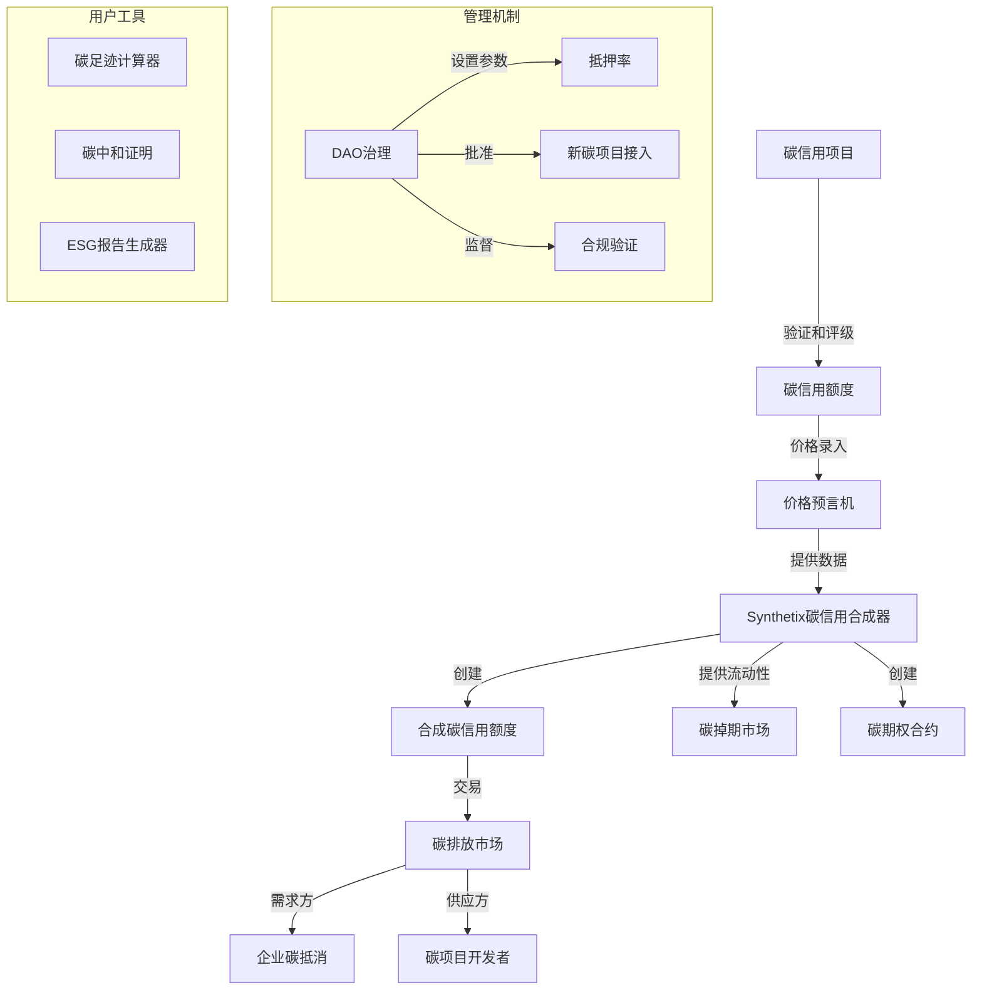
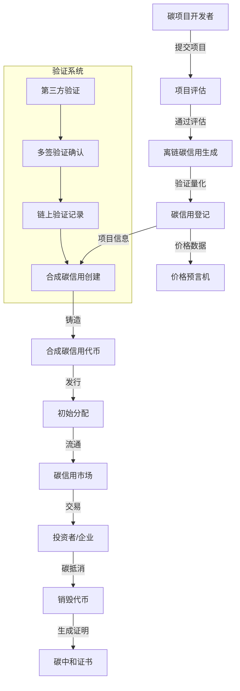
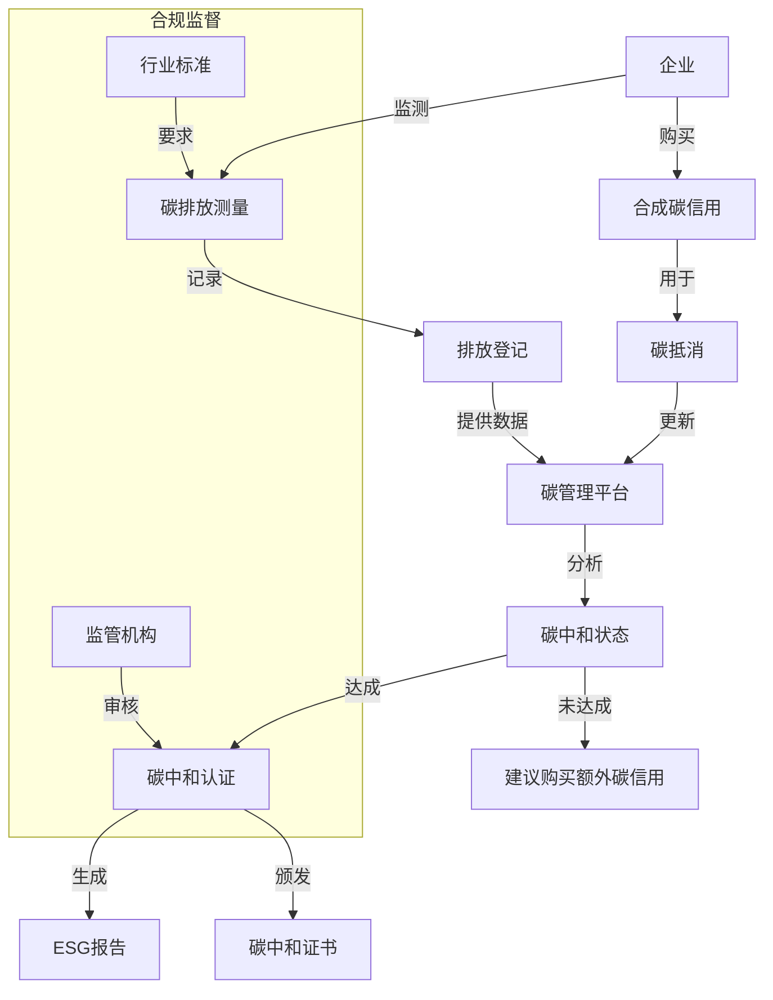

# Synthetix合成资产应用：合成碳信用额度市场

利用Synthetix V3创建碳信用额度的合成版本，使全球碳市场更加透明和流动，同时为环保项目提供更多融资渠道，并为碳排放企业提供更高效的抵消机制。

## 应用价值

合成碳信用额度市场在DeFi中具有以下价值：

- **提高碳市场流动性**：为碳信用额度创建全天候、全球化的交易市场
- **降低参与门槛**：使小型企业和个人也能参与碳市场交易
- **增强碳资产定价透明度**：通过市场机制实现更透明的碳价格发现
- **推动环保项目融资**：为可持续发展项目提供更多元的融资途径
- **实现全球碳市场整合**：连接原本分散的区域性碳市场

## 实现方式

### 1. 多层级资产验证

利用Synthetix V3的价格预言机和验证系统：

- 法律实体进行离链资产验证
- 多重验证机构确认资产权属
- 链上Oracle提供实时价格和状态更新

### 2. 资产代币化流程

为各类碳信用额度创建链上合成代表：

- 碳项目评估与额度确定
- 智能合约铸造代表性代币
- 设立治理与权利分配机制

### 3. 实现架构



## 代码实现

### 基础合成碳信用额度合约

```solidity
// SPDX-License-Identifier: MIT
pragma solidity ^0.8.0;

import "@synthetixio/core-modules/contracts/interfaces/ITokenModule.sol";
import "@synthetixio/oracle-manager/contracts/interfaces/IOracleManager.sol";
import "@openzeppelin/contracts/token/ERC20/ERC20.sol";
import "@openzeppelin/contracts/access/AccessControl.sol";

/**
 * @title SyntheticCarbonCredits
 * @notice 基于Synthetix V3的合成碳信用额度系统
 */
contract SyntheticCarbonCredits is AccessControl {
    // 角色定义
    bytes32 public constant VERIFIER_ROLE = keccak256("VERIFIER_ROLE");
    bytes32 public constant MINTER_ROLE = keccak256("MINTER_ROLE");
    bytes32 public constant PAUSER_ROLE = keccak256("PAUSER_ROLE");
    
    // Synthetix Oracle Manager
    IOracleManager public oracleManager;
    ITokenModule public tokenModule;
    
    // 碳信用类型
    enum CarbonCreditType { 
        VCS,        // Verified Carbon Standard
        GoldStandard, // Gold Standard
        CDM,        // Clean Development Mechanism
        CarbonPlan, // Carbon Plan
        ACR         // American Carbon Registry
    }
    
    struct CarbonCredit {
        CarbonCreditType creditType;
        string projectId;        // 碳项目ID
        uint256 vintage;         // 信用额度年份
        uint256 amount;          // 碳信用额度数量(tCO2e)
        string geolocation;      // 项目地理位置
        string methodology;      // 计量方法学
        uint256 expirationDate;  // 到期日期
        bool verified;           // 是否经过验证
    }
    
    // 合成碳信用代币地址映射
    mapping(bytes32 => address) public carbonTokens;
    
    // 碳信用记录
    mapping(bytes32 => CarbonCredit) public carbonCredits;
    
    // 项目验证人映射
    mapping(string => address) public projectVerifiers;
    
    // 事件
    event CarbonCreditCreated(bytes32 indexed creditId, string projectId, uint256 vintage, uint256 amount);
    event CarbonCreditVerified(bytes32 indexed creditId, address verifier);
    event CarbonCreditMinted(bytes32 indexed creditId, address recipient, uint256 amount);
    event CarbonCreditOffset(bytes32 indexed creditId, address offsetter, uint256 amount);
    
    constructor(address _oracleManager, address _tokenModule) {
        oracleManager = IOracleManager(_oracleManager);
        tokenModule = ITokenModule(_tokenModule);
        
        _setupRole(DEFAULT_ADMIN_ROLE, msg.sender);
        _setupRole(VERIFIER_ROLE, msg.sender);
        _setupRole(MINTER_ROLE, msg.sender);
    }
    
    /**
     * @notice 创建合成碳信用额度
     * @param creditType 碳信用类型
     * @param projectId 项目ID
     * @param vintage 年份
     * @param geolocation 地理位置
     * @param methodology 方法学
     * @param amount 数量(tCO2e)
     */
    function createSyntheticCarbonCredit(
        CarbonCreditType creditType,
        string memory projectId,
        uint256 vintage,
        string memory geolocation,
        string memory methodology,
        uint256 amount
    ) external returns (bytes32) {
        require(hasRole(MINTER_ROLE, msg.sender), "Caller is not a minter");
        
        // 创建唯一标识
        bytes32 creditId = keccak256(abi.encodePacked(
            creditType, projectId, vintage, geolocation, methodology
        ));
        
        // 检查是否已存在
        require(carbonTokens[creditId] == address(0), "Carbon credit already exists");
        
        // 记录碳信用信息
        carbonCredits[creditId] = CarbonCredit({
            creditType: creditType,
            projectId: projectId,
            vintage: vintage,
            amount: amount,
            geolocation: geolocation,
            methodology: methodology,
            expirationDate: block.timestamp + 365 days * 8, // 8年有效期
            verified: false
        });
        
        // 创建合成碳信用代币
        string memory symbol = _generateCarbonSymbol(creditType, vintage);
        string memory name = string(abi.encodePacked("Synthetic Carbon Credit ", symbol));
        
        // 使用Synthetix Token Module创建代币
        address tokenAddress = tokenModule.createToken(name, symbol, 18);
        
        // 记录代币地址
        carbonTokens[creditId] = tokenAddress;
        
        emit CarbonCreditCreated(creditId, projectId, vintage, amount);
        
        return creditId;
    }
    
    /**
     * @notice 验证碳信用额度
     * @param creditId 碳信用ID
     */
    function verifyCarbonCredit(bytes32 creditId) external {
        require(hasRole(VERIFIER_ROLE, msg.sender), "Caller is not a verifier");
        
        CarbonCredit storage credit = carbonCredits[creditId];
        require(credit.amount > 0, "Carbon credit does not exist");
        require(!credit.verified, "Carbon credit already verified");
        
        // 确保验证人与项目匹配或是主验证人
        require(
            projectVerifiers[credit.projectId] == msg.sender || 
            hasRole(DEFAULT_ADMIN_ROLE, msg.sender),
            "Not authorized to verify this project"
        );
        
        // 标记为已验证
        credit.verified = true;
        
        emit CarbonCreditVerified(creditId, msg.sender);
    }
    
    /**
     * @notice 铸造合成碳信用代币
     * @param creditId 碳信用ID
     * @param recipient 接收者
     * @param amount 铸造数量
     */
    function mintCarbonToken(bytes32 creditId, address recipient, uint256 amount) external {
        require(hasRole(MINTER_ROLE, msg.sender), "Caller is not a minter");
        
        CarbonCredit storage credit = carbonCredits[creditId];
        require(credit.amount >= amount, "Amount exceeds available credits");
        require(credit.verified, "Carbon credit not verified");
        require(block.timestamp < credit.expirationDate, "Carbon credit expired");
        
        // 获取代币地址
        address tokenAddress = carbonTokens[creditId];
        require(tokenAddress != address(0), "Token not found");
        
        // 铸造代币
        tokenModule.mint(tokenAddress, recipient, amount);
        
        // 减少可用碳信用
        credit.amount -= amount;
        
        emit CarbonCreditMinted(creditId, recipient, amount);
    }
    
    /**
     * @notice 抵消碳排放(销毁代币)
     * @param creditId 碳信用ID
     * @param amount 抵消数量
     */
    function offsetCarbonCredit(bytes32 creditId, uint256 amount) external {
        address tokenAddress = carbonTokens[creditId];
        require(tokenAddress != address(0), "Carbon credit not found");
        
        // 销毁代币
        tokenModule.burn(tokenAddress, msg.sender, amount);
        
        // 生成碳抵消证明(链下)
        emit CarbonCreditOffset(creditId, msg.sender, amount);
    }
    
    /**
     * @notice 获取碳信用价格(USD)
     * @param creditId 碳信用ID
     */
    function getCarbonCreditPrice(bytes32 creditId) external view returns (uint256) {
        CarbonCredit storage credit = carbonCredits[creditId];
        
        // 获取预言机节点ID
        bytes32 oracleNodeId = _getCarbonPriceNodeId(credit.creditType, credit.vintage);
        
        // 从预言机获取价格
        return oracleManager.process(oracleNodeId);
    }
    
    /**
     * @notice 注册项目验证人
     * @param projectId 项目ID
     * @param verifier 验证人地址
     */
    function registerProjectVerifier(string memory projectId, address verifier) external {
        require(hasRole(DEFAULT_ADMIN_ROLE, msg.sender), "Caller is not admin");
        require(hasRole(VERIFIER_ROLE, verifier), "Address is not a verifier");
        
        projectVerifiers[projectId] = verifier;
    }
    
    /**
     * @notice 添加验证人角色
     * @param verifier 验证人地址
     */
    function addVerifier(address verifier) external {
        require(hasRole(DEFAULT_ADMIN_ROLE, msg.sender), "Caller is not admin");
        grantRole(VERIFIER_ROLE, verifier);
    }
    
    /**
     * @notice 添加铸造者角色
     * @param minter 铸造者地址
     */
    function addMinter(address minter) external {
        require(hasRole(DEFAULT_ADMIN_ROLE, msg.sender), "Caller is not admin");
        grantRole(MINTER_ROLE, minter);
    }
    
    /**
     * @notice 生成碳信用代币符号
     * @param creditType 碳信用类型
     * @param vintage 年份
     */
    function _generateCarbonSymbol(CarbonCreditType creditType, uint256 vintage) internal pure returns (string memory) {
        string memory typePrefix;
        
        if (creditType == CarbonCreditType.VCS) {
            typePrefix = "VCS";
        } else if (creditType == CarbonCreditType.GoldStandard) {
            typePrefix = "GS";
        } else if (creditType == CarbonCreditType.CDM) {
            typePrefix = "CDM";
        } else if (creditType == CarbonCreditType.CarbonPlan) {
            typePrefix = "CP";
        } else {
            typePrefix = "ACR";
        }
        
        return string(abi.encodePacked(typePrefix, "-", _uintToString(vintage)));
    }
    
    /**
     * @notice 获取碳价格预言机节点ID
     * @param creditType 碳信用类型
     * @param vintage 年份
     */
    function _getCarbonPriceNodeId(CarbonCreditType creditType, uint256 vintage) internal pure returns (bytes32) {
        // 实际应用中需根据Synthetix Oracle Manager配置返回正确节点ID
        return bytes32(keccak256(abi.encodePacked("carbon", creditType, vintage)));
    }
    
    /**
     * @notice 将uint转换为string
     * @param value 数值
     */
    function _uintToString(uint256 value) internal pure returns (string memory) {
        if (value == 0) {
            return "0";
        }
        
        uint256 temp = value;
        uint256 digits;
        
        while (temp != 0) {
            digits++;
            temp /= 10;
        }
        
        bytes memory buffer = new bytes(digits);
        
        while (value != 0) {
            digits -= 1;
            buffer[digits] = bytes1(uint8(48 + uint256(value % 10)));
            value /= 10;
        }
        
        return string(buffer);
    }
}
```

### 实际应用案例

#### 1. 雨林保护碳项目代币化

```solidity
// 创建雨林保护碳信用案例
function amazonRainforestConservationExample() public {
    // 创建合成碳信用
    bytes32 creditId = carbonCredits.createSyntheticCarbonCredit(
        CarbonCreditType.VCS,        // Verified Carbon Standard
        "VCS-2023-AR-001",           // 项目ID
        2023,                        // 年份
        "Amazon Basin, Brazil",      // 地理位置
        "VM0015 - REDD Methodology", // 方法学
        100000                       // 10万吨CO2当量
    );
    
    // 验证碳信用
    carbonCredits.verifyCarbonCredit(creditId);
    
    // 铸造代币
    carbonCredits.mintCarbonToken(creditId, projectDeveloper, 100000);
    
    // 企业购买并抵消部分碳排放
    // 假设企业已获得代币
    carbonCredits.offsetCarbonCredit(creditId, 25000); // 抵消2.5万吨CO2
}
```

#### 2. 碳信用投资组合

```javascript
// 创建多元化碳信用投资组合
async function createCarbonPortfolio(investor, investmentAmount) {
    // 分配比例
    const allocation = {
        forestryProjects: 0.4,    // 40% 林业项目
        renewableEnergy: 0.3,     // 30% 可再生能源
        methaneCapture: 0.2,      // 20% 甲烷捕获
        soilCarbon: 0.1           // 10% 土壤碳汇
    };
    
    // 计算每类项目的投资额
    const forestryAmount = investmentAmount * allocation.forestryProjects;
    const renewableAmount = investmentAmount * allocation.renewableEnergy;
    const methaneAmount = investmentAmount * allocation.methaneCapture;
    const soilAmount = investmentAmount * allocation.soilCarbon;
    
    // 获取当前碳信用价格
    const forestryPrice = await carbonMarket.getCarbonCreditPrice(FORESTRY_CREDIT_ID);
    const renewablePrice = await carbonMarket.getCarbonCreditPrice(RENEWABLE_CREDIT_ID);
    const methanePrice = await carbonMarket.getCarbonCreditPrice(METHANE_CREDIT_ID);
    const soilPrice = await carbonMarket.getCarbonCreditPrice(SOIL_CREDIT_ID);
    
    // 计算购买数量
    const forestryTokens = forestryAmount / forestryPrice;
    const renewableTokens = renewableAmount / renewablePrice;
    const methaneTokens = methaneAmount / methanePrice;
    const soilTokens = soilAmount / soilPrice;
    
    // 执行交易
    await carbonMarket.buyCarbonCredits(FORESTRY_CREDIT_ID, forestryTokens, investor);
    await carbonMarket.buyCarbonCredits(RENEWABLE_CREDIT_ID, renewableTokens, investor);
    await carbonMarket.buyCarbonCredits(METHANE_CREDIT_ID, methaneTokens, investor);
    await carbonMarket.buyCarbonCredits(SOIL_CREDIT_ID, soilTokens, investor);
    
    // 返回投资组合信息
    return {
        investor,
        totalInvestment: investmentAmount,
        holdings: {
            forestry: forestryTokens,
            renewable: renewableTokens,
            methane: methaneTokens,
            soil: soilTokens
        },
        acquisitionPrices: {
            forestry: forestryPrice,
            renewable: renewablePrice,
            methane: methanePrice,
            soil: soilPrice
        }
    };
}
```

#### 3. 企业碳中和解决方案

```solidity
// 企业碳中和管理合约
contract CorporateCarbonNeutrality {
    // Synthetix合成碳信用合约
    SyntheticCarbonCredits public carbonCredits;
    
    // 企业碳排放记录
    struct EmissionRecord {
        uint256 timestamp;
        uint256 amount;         // 吨CO2当量
        string description;
        bool offset;            // 是否已抵消
    }
    
    // 企业碳抵消记录
    struct OffsetRecord {
        uint256 timestamp;
        bytes32 creditId;       // 使用的碳信用ID
        uint256 amount;         // 抵消数量
        uint256 price;          // 抵消时价格
    }
    
    // 企业到记录的映射
    mapping(address => EmissionRecord[]) public corporateEmissions;
    mapping(address => OffsetRecord[]) public corporateOffsets;
    mapping(address => uint256) public totalEmissions;
    mapping(address => uint256) public totalOffsets;
    
    // 事件
    event EmissionRegistered(address indexed company, uint256 amount);
    event EmissionOffset(address indexed company, bytes32 creditId, uint256 amount);
    
    constructor(address _carbonCredits) {
        carbonCredits = SyntheticCarbonCredits(_carbonCredits);
    }
    
    /**
     * @notice 注册碳排放
     * @param amount 排放量(吨CO2当量)
     * @param description 排放描述
     */
    function registerEmission(uint256 amount, string memory description) external {
        corporateEmissions[msg.sender].push(EmissionRecord({
            timestamp: block.timestamp,
            amount: amount,
            description: description,
            offset: false
        }));
        
        totalEmissions[msg.sender] += amount;
        
        emit EmissionRegistered(msg.sender, amount);
    }
    
    /**
     * @notice 抵消碳排放
     * @param creditId 碳信用ID
     * @param amount 抵消数量
     */
    function offsetEmissions(bytes32 creditId, uint256 amount) external {
        // 获取碳信用价格
        uint256 creditPrice = carbonCredits.getCarbonCreditPrice(creditId);
        
        // 抵消碳排放
        carbonCredits.offsetCarbonCredit(creditId, amount);
        
        // 记录抵消
        corporateOffsets[msg.sender].push(OffsetRecord({
            timestamp: block.timestamp,
            creditId: creditId,
            amount: amount,
            price: creditPrice
        }));
        
        totalOffsets[msg.sender] += amount;
        
        emit EmissionOffset(msg.sender, creditId, amount);
    }
    
    /**
     * @notice 获取碳中和状态
     * @param company 企业地址
     * @return carbonNeutral 是否碳中和
     * @return netEmissions 净排放量(负值表示净碳汇)
     */
    function getCarbonNeutralStatus(address company) external view returns (bool carbonNeutral, int256 netEmissions) {
        uint256 emissions = totalEmissions[company];
        uint256 offsets = totalOffsets[company];
        
        if (offsets >= emissions) {
            return (true, -int256(offsets - emissions));
        } else {
            return (false, int256(emissions - offsets));
        }
    }
    
    /**
     * @notice 生成碳中和证书
     * @param year 年份
     * @return certificateId 证书ID
     */
    function generateCarbonNeutralCertificate(uint256 year) external view returns (bytes32) {
        (bool carbonNeutral, ) = this.getCarbonNeutralStatus(msg.sender);
        require(carbonNeutral, "Not carbon neutral");
        
        // 生成证书ID
        bytes32 certificateId = keccak256(abi.encodePacked(
            msg.sender,
            year,
            totalEmissions[msg.sender],
            totalOffsets[msg.sender]
        ));
        
        return certificateId;
    }
}
```

## 碳信用市场流程图

### 碳信用创建和验证流程



### 企业碳管理流程



## 优势与差异化

使用Synthetix V3构建合成碳信用市场具有以下优势：

1. **全球可访问性**：打破地域限制，实现全球范围内的碳信用交易
2. **资产分数化**：允许小额投资，降低碳市场参与门槛
3. **提高流动性**：为传统上流动性不足的碳市场提供24/7交易
4. **价格透明度**：通过市场机制实现更透明的碳价格发现
5. **多样化碳资产**：支持不同类型、不同地区的碳信用额度交易
6. **可编程特性**：支持自动碳抵消和预设碳中和目标

## 潜在风险与缓解措施

1. **验证风险**
   - 风险：碳信用未经充分验证或存在重复计算
   - 缓解：多层验证系统和链上透明记录

2. **监管风险**
   - 风险：不同司法管辖区对碳信用的监管要求不同
   - 缓解：模块化设计，支持多种合规标准

3. **定价风险**
   - 风险：流动性不足导致价格波动
   - 缓解：流动性挖矿计划和专业做市商支持

4. **交付风险**
   - 风险：碳项目未能实现承诺的减排
   - 缓解：基于实际结果的分阶段代币释放机制

## 拓展方向

1. **碳期货和期权**：创建碳信用衍生品市场，管理未来碳价格风险
2. **碳贷款**：以碳信用额度为抵押的借贷市场
3. **自动碳抵消**：与物联网设备集成，实现实时碳排放监测和自动抵消
4. **碳负面排放代币**：激励碳捕获和存储项目

## 结论

合成碳信用额度市场利用Synthetix V3的强大功能，将分散的全球碳市场整合到区块链上，提供更高的透明度、流动性和可访问性。通过将环保项目与金融创新相结合，该应用不仅为气候行动提供了新工具，也为绿色金融开辟了新途径，有助于加速全球向可持续发展转型。 