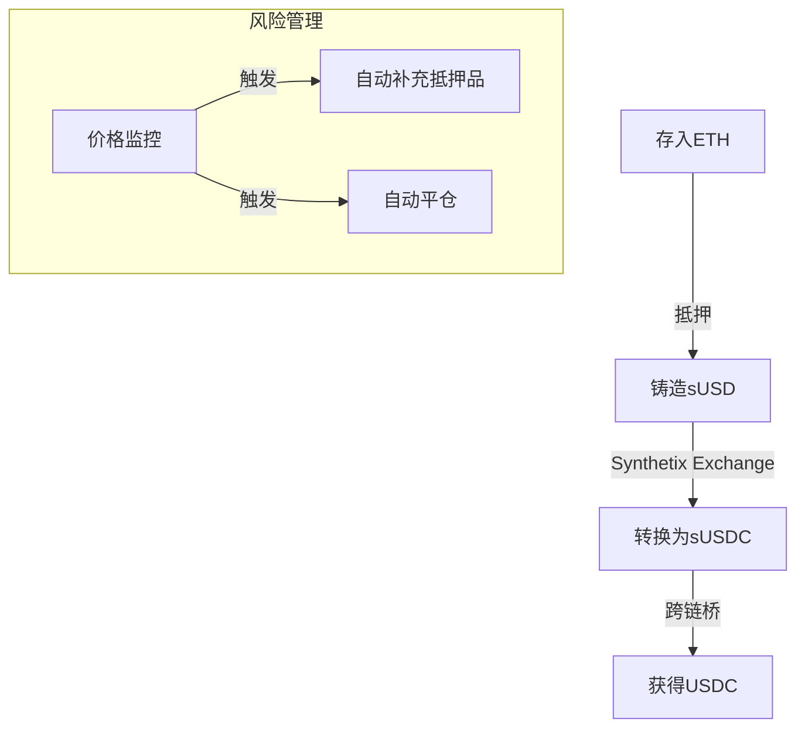
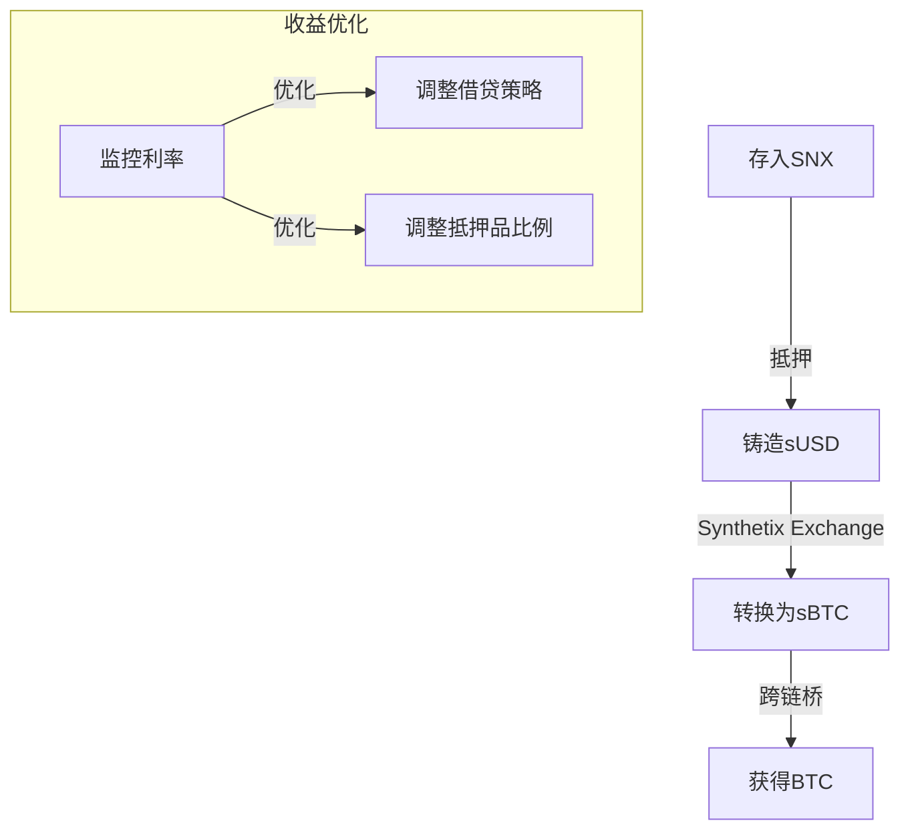

# 利用Synthetix特性实现传统借贷

## 基本思路

通过Synthetix的合成资产和交易特性，我们可以构建一个类似传统借贷的方案。这种方案具有以下优势：

1. **无滑点交易**：利用Synthetix的无滑点交易特性
2. **灵活的抵押品管理**：支持多种抵押品类型
3. **跨资产借贷**：可以实现任意资产之间的借贷转换

## 实现方案

### 1. 基础借贷流程

1. **存入抵押品**
   - 使用CollateralEth或CollateralErc20合约存入抵押品
   - 可选择ETH、SNX或其他支持的ERC20代币作为抵押品

2. **铸造合成资产**
   - 首先铸造sUSD作为中间货币
   - 利用Synthetix的债务池机制管理风险

3. **资产转换**
   - 通过Synthetix Exchange将sUSD转换为目标借贷资产
   - 利用无滑点交易特性，降低转换成本

### 2. 具体实现步骤

```solidity
// 1. 存入ETH抵押品
function depositCollateral() payable {
    collateralEth.deposit{value: msg.value}(msg.sender, loanId);
}

// 2. 开启借贷头寸
function openLoan(uint256 amount, bytes32 targetCurrency) {
    // 先借入sUSD
    uint256 loanId = collateralEth.open(amount, "sUSD");
    
    // 如果目标货币不是sUSD，则进行转换
    if (targetCurrency != "sUSD") {
        synthetixExchange.exchange(
            "sUSD",
            amount,
            targetCurrency
        );
    }
}
```

### 3. 优化策略

#### a) 抵押品组合优化

1. **多抵押品策略**
   - 组合使用ETH和ERC20代币作为抵押品
   - 根据市场波动调整抵押品比例

2. **抵押率管理**
   - 维持较高的抵押率以防清算
   - 设置自动补充抵押品的机制

#### b) 借贷成本优化

1. **费用优化**
   - 选择最优的借贷路径
   - 合理利用Synthetix的费用机制

2. **利率优化**
   - 通过合成资产组合降低总体借贷成本
   - 利用不同市场的利率差异

## 风险管理

### 1. 价格风险

- **价格监控**：实时监控抵押品和借贷资产的价格变化
- **自动平仓**：设置自动平仓阈值，防止清算

### 2. 清算风险

- **预警机制**：设置多级预警阈值
- **自动补充**：当抵押率接近危险水平时自动补充抵押品

### 3. 系统性风险

- **债务池风险**：关注Synthetix整体债务池状况
- **市场风险**：监控合成资产的市场深度

## 示例场景

### 场景一：ETH借USDC



### 场景二：SNX借BTC



## 优势与局限性

### 优势

1. **无滑点交易**：降低转换成本
2. **灵活性高**：支持多种资产组合
3. **一站式服务**：在同一平台完成所有操作
4. **套利机会**：可以利用不同市场的价格差异

### 局限性

1. **系统风险**：受Synthetix债务池影响
2. **成本考虑**：需要考虑多层转换费用
3. **流动性限制**：受限于Synthetix的流动性池
4. **操作复杂性**：需要更专业的操作知识

## 改进建议

1. **自动化管理**
   - 开发自动化工具管理抵押品
   - 实现智能调仓和风险管理

2. **优化路径**
   - 研究最优借贷路径
   - 降低总体操作成本

3. **风险对冲**
   - 设计对冲策略
   - 降低市场波动影响

4. **用户界面**
   - 简化操作流程
   - 提供可视化管理工具

## 总结

利用Synthetix的特性实现传统借贷具有独特优势，但也需要注意相关风险。通过合理的策略设计和风险管理，可以构建一个高效、灵活的借贷系统。关键是要充分利用Synthetix的无滑点交易和合成资产特性，同时做好风险控制。 