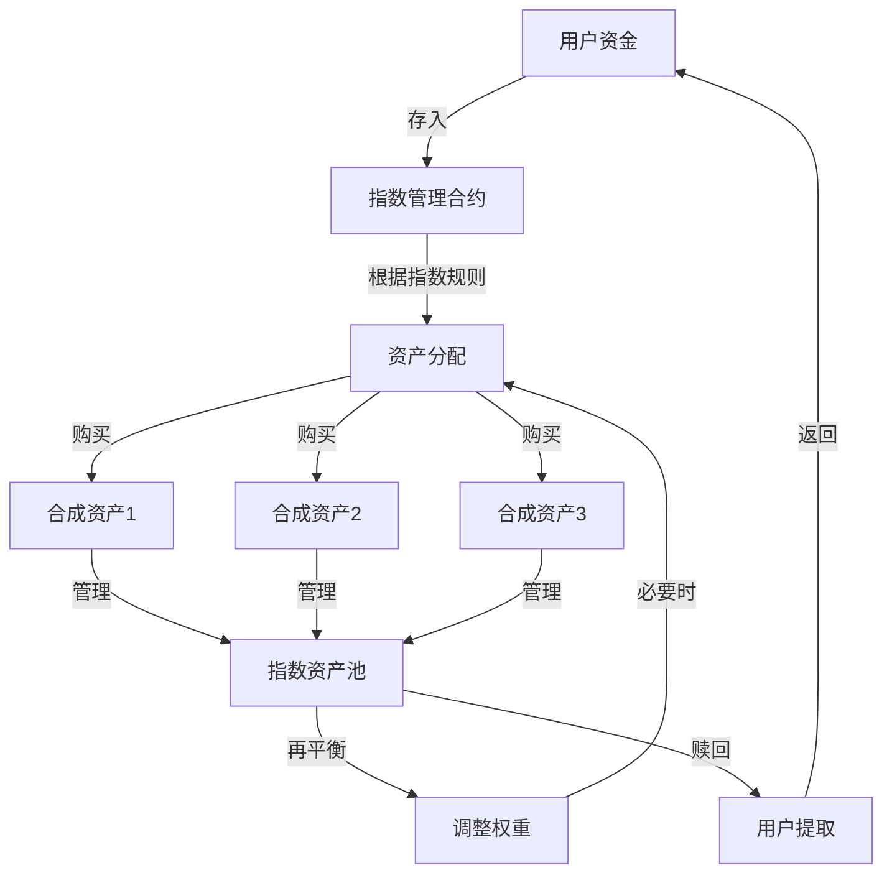

# Synthetix合成资产应用：指数投资与资产组合管理

在传统金融市场中，ETF和指数基金已经成为投资者分散风险的重要工具。Synthetix的合成资产系统为我们提供了在DeFi领域创建类似产品的强大基础设施。

## 应用价值

指数投资和资产组合管理在DeFi中具有以下价值：

- **风险分散**：通过投资多种资产降低单一资产风险
- **降低决策成本**：避免选择个别资产的认知负担
- **获取多市场敞口**：一次操作即可获得多个市场的暴露
- **降低交易费用**：批量交易降低总体成本

## 实现方式

### 1. 合成指数创建

利用Synthetix的合成资产系统，我们可以创建各种指数，包括但不限于：

- 加密货币市值指数
- DeFi协议代币指数
- 特定区块链生态系统指数
- 传统金融资产的合成版本组合

### 2. 自定义投资组合构建

用户可以根据自己的风险偏好和投资目标，构建个性化的投资组合：

- 可调整不同资产的权重
- 支持定期自动再平衡
- 可设置风险管理参数

### 3. 实现架构



## 代码实现

### 基础指数创建合约

```solidity
// SPDX-License-Identifier: MIT
pragma solidity ^0.8.0;

import "@openzeppelin/contracts/token/ERC20/IERC20.sol";
import "@openzeppelin/contracts/token/ERC20/ERC20.sol";
import "@openzeppelin/contracts/access/Ownable.sol";

interface ISynthetixExchange {
    function exchange(
        bytes32 sourceCurrencyKey,
        uint256 sourceAmount,
        bytes32 destinationCurrencyKey
    ) external returns (uint256);
}

contract SynthetixIndex is ERC20, Ownable {
    // Synthetix合约地址
    address public synthetixExchange;
    address public synthetixAddressResolver;
    
    // 指数成分资产
    struct IndexComponent {
        bytes32 currencyKey;  // 如 "sETH", "sBTC"
        uint256 weight;       // 如 30 表示 30%
    }
    
    IndexComponent[] public components;
    uint256 public totalWeight;
    
    // 再平衡设置
    uint256 public rebalancePeriod = 30 days;
    uint256 public lastRebalance;
    
    // 指数创建
    constructor(
        string memory _name,
        string memory _symbol,
        address _synthetixExchange,
        address _synthetixAddressResolver
    ) ERC20(_name, _symbol) {
        synthetixExchange = _synthetixExchange;
        synthetixAddressResolver = _synthetixAddressResolver;
        lastRebalance = block.timestamp;
    }
    
    // 添加指数成分
    function addComponent(bytes32 _currencyKey, uint256 _weight) external onlyOwner {
        require(_weight > 0, "Weight must be positive");
        
        components.push(IndexComponent({
            currencyKey: _currencyKey,
            weight: _weight
        }));
        
        totalWeight += _weight;
    }
    
    // 移除指数成分
    function removeComponent(uint256 _index) external onlyOwner {
        require(_index < components.length, "Invalid index");
        
        totalWeight -= components[_index].weight;
        
        // 移除元素 - 通过用最后一个覆盖并弹出
        if (_index < components.length - 1) {
            components[_index] = components[components.length - 1];
        }
        components.pop();
    }
    
    // 创建指数份额
    function mint(uint256 susdAmount) external {
        // 转入sUSD
        IERC20 susd = IERC20(getAddressByCurrencyKey("sUSD"));
        require(susd.transferFrom(msg.sender, address(this), susdAmount), "Transfer failed");
        
        // 根据当前指数成分分配资金
        _allocateComponents(susdAmount);
        
        // 铸造指数份额代币
        _mint(msg.sender, susdAmount);
        
        // 检查是否需要再平衡
        _checkRebalance();
    }
    
    // 赎回指数份额
    function redeem(uint256 amount) external {
        require(balanceOf(msg.sender) >= amount, "Insufficient balance");
        
        // 销毁指数份额代币
        _burn(msg.sender, amount);
        
        // 根据当前持有比例赎回资产
        _redeemComponents(amount, msg.sender);
    }
    
    // 内部函数：分配资金到各成分
    function _allocateComponents(uint256 susdAmount) internal {
        ISynthetixExchange exchange = ISynthetixExchange(synthetixExchange);
        
        for (uint i = 0; i < components.length; i++) {
            // 计算分配金额
            uint256 componentAmount = susdAmount * components[i].weight / totalWeight;
            
            // 兑换为目标资产
            if (components[i].currencyKey != "sUSD") {
                exchange.exchange(
                    "sUSD",
                    componentAmount,
                    components[i].currencyKey
                );
            }
        }
    }
    
    // 内部函数：赎回各成分资产
    function _redeemComponents(uint256 amount, address recipient) internal {
        ISynthetixExchange exchange = ISynthetixExchange(synthetixExchange);
        uint256 totalSUSD = 0;
        
        for (uint i = 0; i < components.length; i++) {
            // 计算赎回比例
            uint256 componentShare = amount * components[i].weight / totalWeight;
            
            // 将各资产兑换回sUSD
            if (components[i].currencyKey != "sUSD") {
                IERC20 synth = IERC20(getAddressByCurrencyKey(components[i].currencyKey));
                uint256 balance = synth.balanceOf(address(this));
                uint256 redeemAmount = balance * componentShare / totalSupply();
                
                // 转换为sUSD
                exchange.exchange(
                    components[i].currencyKey,
                    redeemAmount,
                    "sUSD"
                );
            }
            
            // 累计sUSD金额
            IERC20 susd = IERC20(getAddressByCurrencyKey("sUSD"));
            totalSUSD = susd.balanceOf(address(this));
        }
        
        // 转移sUSD给用户
        IERC20 susd = IERC20(getAddressByCurrencyKey("sUSD"));
        require(susd.transfer(recipient, totalSUSD), "Transfer failed");
    }
    
    // 内部函数：检查是否需要再平衡
    function _checkRebalance() internal {
        if (block.timestamp >= lastRebalance + rebalancePeriod) {
            _rebalance();
            lastRebalance = block.timestamp;
        }
    }
    
    // 内部函数：执行再平衡
    function _rebalance() internal {
        // 暂存当前持有资产价值
        uint256 totalValue = this.getIndexValue();
        
        // 卖出所有资产获得sUSD
        _convertAllToSUSD();
        
        // 重新按指数分配
        IERC20 susd = IERC20(getAddressByCurrencyKey("sUSD"));
        _allocateComponents(susd.balanceOf(address(this)));
        
        emit Rebalanced(totalValue, block.timestamp);
    }
    
    // 内部函数：将所有资产转换为sUSD
    function _convertAllToSUSD() internal {
        ISynthetixExchange exchange = ISynthetixExchange(synthetixExchange);
        
        for (uint i = 0; i < components.length; i++) {
            if (components[i].currencyKey != "sUSD") {
                IERC20 synth = IERC20(getAddressByCurrencyKey(components[i].currencyKey));
                uint256 balance = synth.balanceOf(address(this));
                
                if (balance > 0) {
                    exchange.exchange(
                        components[i].currencyKey,
                        balance,
                        "sUSD"
                    );
                }
            }
        }
    }
    
    // 通过币种键获取合约地址
    function getAddressByCurrencyKey(bytes32 currencyKey) internal view returns (address) {
        // 通过AddressResolver获取地址，这里简化处理
        // 实际应用需要调用Synthetix的AddressResolver
        return address(0); // 占位，实际实现需要替换
    }
    
    // 获取当前指数价值
    function getIndexValue() external view returns (uint256) {
        uint256 totalValue = 0;
        
        for (uint i = 0; i < components.length; i++) {
            IERC20 synth = IERC20(getAddressByCurrencyKey(components[i].currencyKey));
            uint256 balance = synth.balanceOf(address(this));
            
            // 获取当前资产价值
            // 需要通过Synthetix价格预言机获取
            uint256 price = 1; // 占位，实际实现需要替换
            
            totalValue += balance * price;
        }
        
        return totalValue;
    }
    
    // 事件
    event Rebalanced(uint256 indexValue, uint256 timestamp);
}
```

### 实际应用案例

#### 1. DeFi指数

```solidity
// 创建DeFi指数实例
SynthetixIndex defiIndex = new SynthetixIndex(
    "Synth DeFi Index",
    "sDEFI",
    synthetixExchangeAddress,
    synthetixAddressResolverAddress
);

// 添加指数成分
defiIndex.addComponent("sUNI", 30);   // Uniswap 30%
defiIndex.addComponent("sAAVE", 25);  // Aave 25%
defiIndex.addComponent("sCOMP", 20);  // Compound 20%
defiIndex.addComponent("sSUSHI", 15); // Sushi 15%
defiIndex.addComponent("sYFI", 10);   // Yearn 10%
```

#### 2. 区块链生态指数

```solidity
// 创建Solana生态指数
SynthetixIndex solanaIndex = new SynthetixIndex(
    "Synth Solana Ecosystem",
    "sSOL-ECO",
    synthetixExchangeAddress,
    synthetixAddressResolverAddress
);

// 添加指数成分
solanaIndex.addComponent("sSOL", 40);  // Solana 40%
solanaIndex.addComponent("sSRM", 25);  // Serum 25%
solanaIndex.addComponent("sRAY", 20);  // Raydium 20%
solanaIndex.addComponent("sFTT", 15);  // FTX Token 15%
```

#### 3. 传统金融合成组合

```solidity
// 创建传统资产组合
SynthetixIndex tradIndex = new SynthetixIndex(
    "Synth Traditional Assets",
    "sTRAD",
    synthetixExchangeAddress,
    synthetixAddressResolverAddress
);

// 添加指数成分
tradIndex.addComponent("sXAU", 40);     // 黄金 40%
tradIndex.addComponent("sFTSE", 30);    // 英国富时指数 30%
tradIndex.addComponent("sNIKKEI", 30);  // 日经指数 30%
```

## 使用案例

### 为投资者提供简化的投资途径

```javascript
// 前端代码示例：一键投资DeFi指数
async function investInDeFiIndex(amount) {
    // 获取合约实例
    const defiIndex = await ethers.getContractAt("SynthetixIndex", DEFI_INDEX_ADDRESS);
    
    // 授权转账sUSD
    await susdToken.approve(DEFI_INDEX_ADDRESS, amount);
    
    // 投资指定金额
    const tx = await defiIndex.mint(amount);
    await tx.wait();
    
    // 获取指数份额
    const balance = await defiIndex.balanceOf(signer.address);
    
    return {
        transactionHash: tx.hash,
        indexShares: balance.toString()
    };
}
```

### 机构投资者的定制化指数解决方案

对于专业投资机构，我们可以提供更高级的指数创建工具：

```solidity
// 高级指数工厂
contract IndexFactory {
    // 指数注册表
    mapping(address => bool) public registeredIndices;
    
    // 创建新指数
    function createIndex(
        string memory name,
        string memory symbol,
        bytes32[] memory components,
        uint256[] memory weights
    ) external returns (address) {
        require(components.length == weights.length, "Length mismatch");
        
        // 创建新指数
        SynthetixIndex newIndex = new SynthetixIndex(
            name,
            symbol,
            synthetixExchangeAddress,
            synthetixAddressResolverAddress
        );
        
        // 添加成分
        for (uint i = 0; i < components.length; i++) {
            newIndex.addComponent(components[i], weights[i]);
        }
        
        // 移交所有权给调用者
        newIndex.transferOwnership(msg.sender);
        
        // 注册指数
        registeredIndices[address(newIndex)] = true;
        
        return address(newIndex);
    }
}
```

## 优势与差异化

使用Synthetix创建的指数相比传统指数产品具有以下优势：

1. **无滑点交易**：Synthetix的无滑点交易特性使指数投资更加高效
2. **全球资产暴露**：可以轻松创建包含全球各类资产的指数
3. **低Gas成本**：无需与多个AMM交互，降低了交易成本
4. **自动化再平衡**：智能合约可以自动执行再平衡策略
5. **组合灵活性**：可以包含传统无法组合的资产类别

## 潜在风险与缓解措施

1. **预言机风险**
   - 风险：价格预言机不准确可能导致指数价值计算错误
   - 缓解：使用多重预言机验证，设置价格偏离阈值警报

2. **流动性风险**
   - 风险：某些合成资产流动性不足
   - 缓解：为低流动性资产设置较低权重，定期监控流动性指标

3. **合约风险**
   - 风险：智能合约漏洞
   - 缓解：全面的安全审计，渐进式部署，保险覆盖

## 拓展方向

1. **主动管理型指数**：根据市场趋势和AI分析动态调整权重
2. **杠杆指数产品**：提供杠杆化的指数敞口
3. **对冲指数**：创建用于市场下跌环境的指数产品
4. **收益型指数**：将DeFi收益率策略融入指数设计

## 结论

利用Synthetix的合成资产系统创建指数投资和资产组合管理产品，可以为DeFi用户提供更加多样化、高效和低成本的投资选择。这种方式充分利用了合成资产的灵活性和Synthetix协议的优势，为用户创造更大的投资价值。 