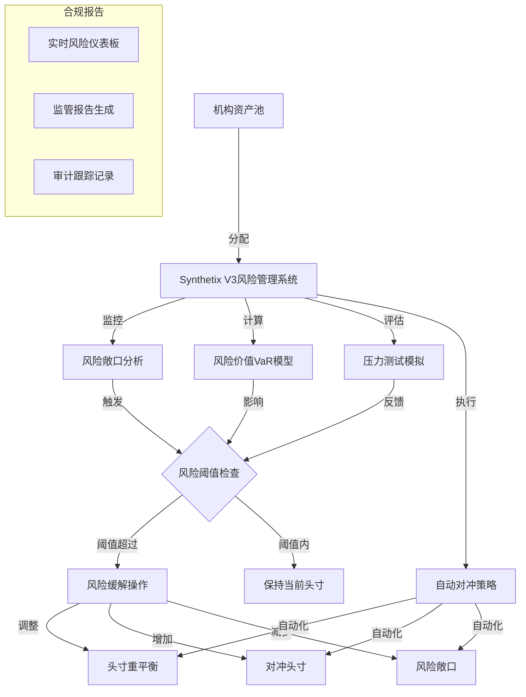
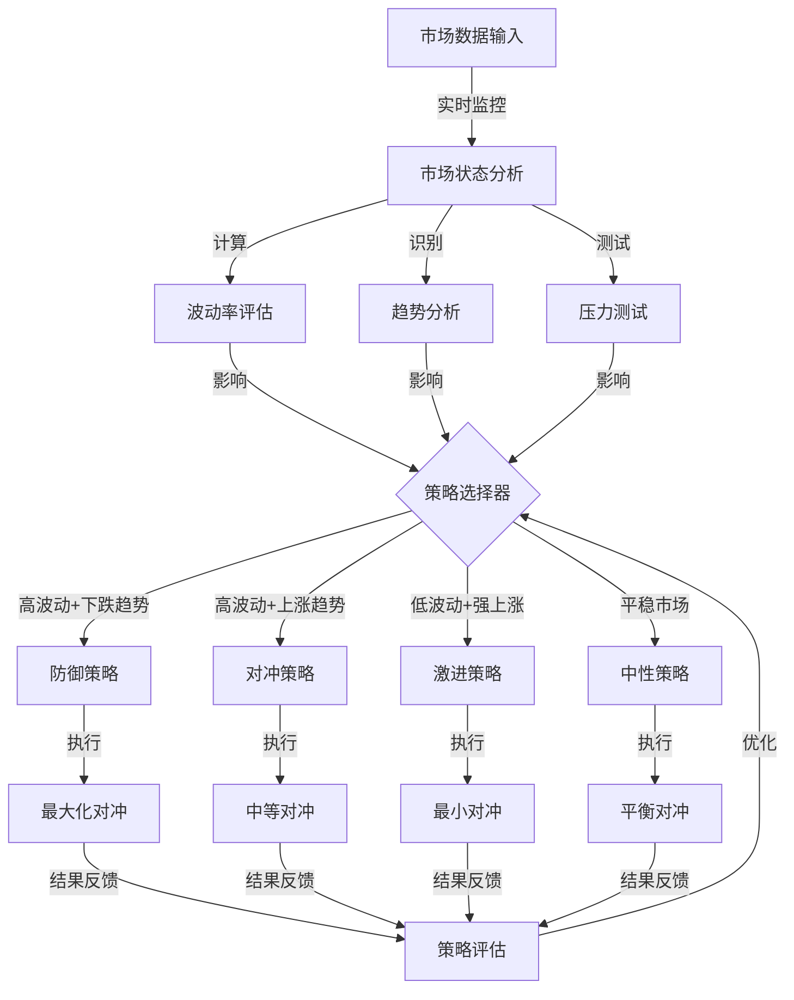
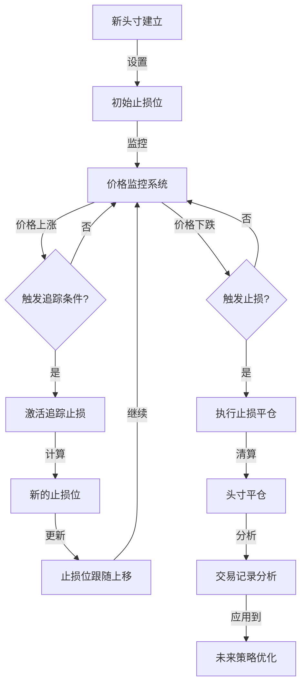

# Synthetix合成资产应用：动态对冲策略自动化系统

基于市场条件自动调整对冲策略的智能系统，利用Synthetix V3的合成资产特性，为用户提供智能化的风险管理工具，无需人工干预即可应对不同市场环境。

## 应用价值

动态对冲策略自动化系统在DeFi中具有以下价值：

- **降低投资组合波动性**：通过自动对冲减轻市场波动对投资组合的影响
- **降低人工干预需求**：算法化决策减少情绪化交易和人工监控需求
- **优化资本利用效率**：根据市场风险动态调整对冲比例，避免过度对冲
- **提供定制化风险管理**：允许用户根据风险偏好设置对冲参数
- **实现策略连续性**：全天候监控和调整，不受时区限制

## 实现方式

### 1. 市场状态检测

实时监控与分析市场状态：

- 价格趋势识别
- 波动率计算
- 市场压力测试
- 相关性分析

### 2. 策略自动选择

根据市场状态自动选择最优对冲策略：

- 中性对冲状态
- 防御型对冲状态
- 激进型对冲状态
- 滚动对冲策略

### 3. 实现架构



## 代码实现

### 基础动态对冲合约

```solidity
// SPDX-License-Identifier: MIT
pragma solidity ^0.8.0;

import "@synthetixio/core-modules/contracts/interfaces/IMarket.sol";
import "@chainlink/contracts/src/v0.8/interfaces/AggregatorV3Interface.sol";
import "@openzeppelin/contracts/access/Ownable.sol";

contract DynamicHedgingStrategy is Ownable {
    // 策略状态
    enum HedgeState {
        NEUTRAL,     // 中性
        HEDGED,      // 已对冲
        AGGRESSIVE,  // 激进
        DEFENSIVE    // 防御
    }
    
    // 头寸类型
    enum PositionType {
        LONG,       // 做多
        SHORT,      // 做空
        NEUTRAL     // 中性
    }
    
    // 策略配置
    struct StrategyConfig {
        uint256 volatilityThreshold;    // 波动率阈值
        uint256 trendFollowingFactor;   // 趋势跟踪因子
        uint256 rebalanceThreshold;     // 再平衡阈值
        uint256 maxExposure;            // 最大敞口
        uint256 minHedgeRatio;          // 最小对冲比例
    }
    
    // 当前持仓
    struct Position {
        bytes32 assetId;
        PositionType positionType;
        uint256 size;
        uint256 entryPrice;
        uint256 hedgeRatio;   // 对冲比例 (0-100%)
    }
    
    // 资产配置
    struct AssetConfig {
        bytes32 assetId;
        address priceOracle;
        address hedgeInstrument;
        int256 correlationFactor;  // 与基础投资组合的相关性 (-100 to 100)
    }
    
    // 策略配置
    StrategyConfig public config;
    
    // 当前策略状态
    HedgeState public currentState;
    
    // 资产配置
    mapping(bytes32 => AssetConfig) public assetConfigs;
    
    // 当前持仓
    mapping(bytes32 => Position) public positions;
    
    // 基础投资组合总价值
    uint256 public portfolioValue;
    
    // 历史波动率数据
    uint256[] public historicalVolatility;
    
    // 已支持的资产ID列表
    bytes32[] public assetIds;
    
    // Synthetix市场接口
    IMarket public synthetixMarket;
    
    event StrategyUpdated(HedgeState newState);
    event PositionAdjusted(bytes32 assetId, PositionType positionType, uint256 size, uint256 hedgeRatio);
    event RebalanceExecuted(uint256 timestamp, uint256 portfolioValue);
    
    constructor(address _synthetixMarket, uint256 _initialPortfolioValue) {
        synthetixMarket = IMarket(_synthetixMarket);
        portfolioValue = _initialPortfolioValue;
        currentState = HedgeState.NEUTRAL;
        
        // 设置默认策略参数
        config = StrategyConfig({
            volatilityThreshold: 20,     // 20% 波动率阈值
            trendFollowingFactor: 50,    // 50% 趋势跟踪
            rebalanceThreshold: 5,       // 5% 再平衡阈值
            maxExposure: 80,             // 80% 最大敞口
            minHedgeRatio: 20            // 20% 最小对冲比例
        });
    }
    
    // 配置资产对冲参数
    function configureAsset(
        bytes32 _assetId,
        address _priceOracle,
        address _hedgeInstrument,
        int256 _correlationFactor
    ) external onlyOwner {
        require(_correlationFactor >= -100 && _correlationFactor <= 100, "Correlation out of range");
        
        // 检查是否是新资产
        bool isNew = true;
        for (uint i = 0; i < assetIds.length; i++) {
            if (assetIds[i] == _assetId) {
                isNew = false;
                break;
            }
        }
        
        if (isNew) {
            assetIds.push(_assetId);
        }
        
        assetConfigs[_assetId] = AssetConfig({
            assetId: _assetId,
            priceOracle: _priceOracle,
            hedgeInstrument: _hedgeInstrument,
            correlationFactor: _correlationFactor
        });
    }
    
    // 更新策略配置
    function updateStrategyConfig(
        uint256 _volatilityThreshold,
        uint256 _trendFollowingFactor,
        uint256 _rebalanceThreshold,
        uint256 _maxExposure,
        uint256 _minHedgeRatio
    ) external onlyOwner {
        config.volatilityThreshold = _volatilityThreshold;
        config.trendFollowingFactor = _trendFollowingFactor;
        config.rebalanceThreshold = _rebalanceThreshold;
        config.maxExposure = _maxExposure;
        config.minHedgeRatio = _minHedgeRatio;
    }
    
    // 执行策略更新
    function updateStrategy() external {
        // 分析市场条件
        uint256 currentVolatility = _calculateCurrentVolatility();
        int256 marketTrend = _calculateMarketTrend();
        
        // 根据市场条件更新策略状态
        HedgeState newState = _determineOptimalState(currentVolatility, marketTrend);
        
        // 如果状态发生变化，调整持仓
        if (newState != currentState) {
            currentState = newState;
            _adjustPositionsForState(newState);
            emit StrategyUpdated(newState);
        }
        
        // 检查是否需要再平衡
        bool needsRebalance = _checkRebalanceNeeded();
        if (needsRebalance) {
            _executeRebalance();
            emit RebalanceExecuted(block.timestamp, portfolioValue);
        }
    }
    
    // 计算当前波动率
    function _calculateCurrentVolatility() internal returns (uint256) {
        // 实现波动率计算 - 简化版
        uint256 volatility = 0;
        uint256 totalWeight = 0;
        
        // 使用价格预言机数据计算波动率
        for (uint i = 0; i < assetIds.length; i++) {
            bytes32 assetId = assetIds[i];
            AssetConfig memory asset = assetConfigs[assetId];
            
            if (asset.priceOracle != address(0)) {
                AggregatorV3Interface oracle = AggregatorV3Interface(asset.priceOracle);
                
                // 获取当前价格
                (, int256 price, , , ) = oracle.latestRoundData();
                
                // 这里简化了计算 - 实际应用中需要更复杂的波动率计算
                uint256 assetVol = _calculateAssetVolatility(asset.priceOracle);
                Position memory position = positions[assetId];
                
                // 按持仓规模加权
                volatility += assetVol * position.size;
                totalWeight += position.size;
            }
        }
        
        // 计算加权平均波动率
        if (totalWeight > 0) {
            volatility = volatility / totalWeight;
        } else {
            // 如果没有持仓，使用默认值
            volatility = 15; // 15% 默认波动率
        }
        
        // 记录历史波动率
        historicalVolatility.push(volatility);
        if (historicalVolatility.length > 30) {
            // 只保留30天数据
            for (uint i = 0; i < historicalVolatility.length - 1; i++) {
                historicalVolatility[i] = historicalVolatility[i+1];
            }
            historicalVolatility.pop();
        }
        
        return volatility;
    }
    
    // 计算单个资产的波动率
    function _calculateAssetVolatility(address oracleAddress) internal view returns (uint256) {
        // 实际应用中需要使用历史价格计算波动率
        // 这里简化实现
        return 15; // 假设15%的波动率
    }
    
    // 计算市场趋势
    function _calculateMarketTrend() internal view returns (int256) {
        // 实现趋势计算 - 简化版
        // 返回 -100 到 100 的值，代表强烈下跌到强烈上涨
        int256 trendSum = 0;
        uint256 count = 0;
        
        for (uint i = 0; i < assetIds.length; i++) {
            bytes32 assetId = assetIds[i];
            AssetConfig memory asset = assetConfigs[assetId];
            
            if (asset.priceOracle != address(0)) {
                int256 assetTrend = _calculateAssetTrend(asset.priceOracle);
                trendSum += assetTrend;
                count++;
            }
        }
        
        if (count > 0) {
            return trendSum / int256(count);
        }
        
        return 0; // 默认中性趋势
    }
    
    // 计算单个资产的趋势
    function _calculateAssetTrend(address oracleAddress) internal view returns (int256) {
        // 实际应用中需要比较历史价格计算趋势
        // 这里简化实现
        return 0; // 假设中性趋势
    }
    
    // 确定最优策略状态
    function _determineOptimalState(uint256 volatility, int256 trend) internal view returns (HedgeState) {
        // 高波动率 + 下跌趋势 = 防御状态
        if (volatility > config.volatilityThreshold && trend < -20) {
            return HedgeState.DEFENSIVE;
        }
        
        // 高波动率 + 上涨趋势 = 对冲状态
        if (volatility > config.volatilityThreshold && trend > 20) {
            return HedgeState.HEDGED;
        }
        
        // 低波动率 + 强上涨趋势 = 激进状态
        if (volatility < config.volatilityThreshold / 2 && trend > 50) {
            return HedgeState.AGGRESSIVE;
        }
        
        // 默认为中性状态
        return HedgeState.NEUTRAL;
    }
    
    // 根据策略状态调整持仓
    function _adjustPositionsForState(HedgeState state) internal {
        for (uint i = 0; i < assetIds.length; i++) {
            bytes32 assetId = assetIds[i];
            Position storage position = positions[assetId];
            
            if (state == HedgeState.DEFENSIVE) {
                // 防御状态：最大化对冲，减少敞口
                position.hedgeRatio = 90; // 90% 对冲
                _adjustHedgePosition(assetId, position.hedgeRatio);
            } 
            else if (state == HedgeState.HEDGED) {
                // 对冲状态：中等对冲
                position.hedgeRatio = 50; // 50% 对冲
                _adjustHedgePosition(assetId, position.hedgeRatio);
            }
            else if (state == HedgeState.AGGRESSIVE) {
                // 激进状态：最小对冲
                position.hedgeRatio = config.minHedgeRatio;
                _adjustHedgePosition(assetId, position.hedgeRatio);
            }
            else {
                // 中性状态：平衡对冲
                position.hedgeRatio = 30; // 30% 对冲
                _adjustHedgePosition(assetId, position.hedgeRatio);
            }
            
            emit PositionAdjusted(assetId, position.positionType, position.size, position.hedgeRatio);
        }
    }
    
    // 调整对冲头寸
    function _adjustHedgePosition(bytes32 assetId, uint256 hedgeRatio) internal {
        Position storage position = positions[assetId];
        AssetConfig memory assetConfig = assetConfigs[assetId];
        
        // 计算目标对冲规模
        uint256 assetValue = _getAssetValue(assetId);
        uint256 targetHedgeSize = (assetValue * hedgeRatio) / 100;
        
        // 使用Synthetix合成资产创建对冲头寸
        // 实际应用中需要实现具体交易逻辑
    }
    
    // 检查是否需要再平衡
    function _checkRebalanceNeeded() internal view returns (bool) {
        // 实现再平衡检查
        return false; // 简化示例
    }
    
    // 执行再平衡
    function _executeRebalance() internal {
        // 实现再平衡逻辑
    }
    
    // 获取资产价值
    function _getAssetValue(bytes32 assetId) internal view returns (uint256) {
        // 实现资产价值获取
        // 在实际应用中，应该调用预言机获取当前价格并乘以持仓规模
        Position memory position = positions[assetId];
        return position.size * position.entryPrice;
    }
}
```

### 实际应用案例

#### 1. 机构级对冲管理

```javascript
// 机构级对冲管理示例
async function setupInstitutionalHedging() {
    // 创建对冲策略实例
    const hedgingContract = await DynamicHedgingStrategy.deploy(
        SYNTHETIX_MARKET_ADDRESS,
        ethers.utils.parseEther("10000000") // 1000万美元投资组合
    );
    
    // 配置策略参数 - 较为保守的设置
    await hedgingContract.updateStrategyConfig(
        15,     // 15% 波动率阈值 (较低，更早触发对冲)
        40,     // 40% 趋势跟踪因子
        3,      // 3% 再平衡阈值 (更频繁再平衡)
        70,     // 70% 最大敞口 (较低，更保守)
        30      // 30% 最小对冲比例 (较高，始终保持一定对冲)
    );
    
    // 配置资产对冲参数
    await hedgingContract.configureAsset(
        ethers.utils.formatBytes32String("BTC"),
        BTC_PRICE_ORACLE_ADDRESS,
        BTC_HEDGE_INSTRUMENT_ADDRESS,
        80      // 80% 正相关
    );
    
    await hedgingContract.configureAsset(
        ethers.utils.formatBytes32String("ETH"),
        ETH_PRICE_ORACLE_ADDRESS,
        ETH_HEDGE_INSTRUMENT_ADDRESS,
        70      // 70% 正相关
    );
    
    await hedgingContract.configureAsset(
        ethers.utils.formatBytes32String("GOLD"),
        GOLD_PRICE_ORACLE_ADDRESS,
        GOLD_HEDGE_INSTRUMENT_ADDRESS,
        -30     // -30% 负相关 (对冲资产)
    );
    
    // 设置自动化执行
    const automationRegistry = await AutomationCompatibleInterface.at(CHAINLINK_AUTOMATION_REGISTRY);
    
    await automationRegistry.registerUpkeep(
        hedgingContract.address,
        GAS_LIMIT,
        hedgingContract.address,
        ethers.utils.defaultAbiCoder.encode(
            ['uint256', 'uint256'],
            [3600, 0] // 每小时执行一次
        )
    );
    
    console.log("机构对冲策略已设置，每小时自动更新");
}
```

#### 2. 资产组合特定风险管理

```solidity
// 资产组合风险管理扩展
contract PortfolioRiskManager {
    // 动态对冲策略合约
    DynamicHedgingStrategy public hedgingStrategy;
    
    // 投资组合信息
    struct Portfolio {
        address owner;              // 投资组合所有者
        uint256 totalValue;         // 总价值
        uint256 riskScore;          // 风险评分 (1-100)
        uint256 targetHedgeRatio;   // 目标对冲比例
        bytes32[] assets;           // 组合中的资产
        mapping(bytes32 => uint256) allocation; // 资产分配比例
    }
    
    // 风险参数
    struct RiskParams {
        uint256 maxDrawdown;        // 最大回撤容忍度
        uint256 volatilityTarget;   // 目标波动率
        uint256 confidenceLevel;    // VaR置信水平
        bool autoRebalance;         // 是否自动再平衡
    }
    
    // 投资组合映射
    mapping(address => Portfolio) public portfolios;
    mapping(address => RiskParams) public riskParams;
    
    constructor(address _hedgingStrategy) {
        hedgingStrategy = DynamicHedgingStrategy(_hedgingStrategy);
    }
    
    // 创建或更新投资组合
    function updatePortfolio(
        bytes32[] memory assets,
        uint256[] memory allocations,
        uint256 totalValue,
        uint256 targetHedgeRatio
    ) external {
        require(assets.length == allocations.length, "Arrays length mismatch");
        
        // 验证分配总和为100%
        uint256 totalAllocation = 0;
        for (uint i = 0; i < allocations.length; i++) {
            totalAllocation += allocations[i];
        }
        require(totalAllocation == 100, "Allocation must sum to 100");
        
        // 更新投资组合
        Portfolio storage portfolio = portfolios[msg.sender];
        portfolio.owner = msg.sender;
        portfolio.totalValue = totalValue;
        portfolio.targetHedgeRatio = targetHedgeRatio;
        
        // 更新资产分配
        // 首先移除旧资产
        for (uint i = 0; i < portfolio.assets.length; i++) {
            portfolio.allocation[portfolio.assets[i]] = 0;
        }
        
        // 然后添加新资产
        portfolio.assets = assets;
        for (uint i = 0; i < assets.length; i++) {
            portfolio.allocation[assets[i]] = allocations[i];
        }
        
        // 计算投资组合风险评分
        portfolio.riskScore = _calculatePortfolioRisk(msg.sender);
    }
    
    // 设置风险参数
    function setRiskParams(
        uint256 maxDrawdown,
        uint256 volatilityTarget,
        uint256 confidenceLevel,
        bool autoRebalance
    ) external {
        riskParams[msg.sender] = RiskParams({
            maxDrawdown: maxDrawdown,
            volatilityTarget: volatilityTarget,
            confidenceLevel: confidenceLevel,
            autoRebalance: autoRebalance
        });
    }
    
    // 执行投资组合对冲
    function hedgePortfolio() external {
        Portfolio storage portfolio = portfolios[msg.sender];
        require(portfolio.owner == msg.sender, "Portfolio not found");
        
        RiskParams memory params = riskParams[msg.sender];
        
        // 根据当前市场条件和风险参数计算最优对冲比例
        uint256 optimalHedgeRatio = _calculateOptimalHedgeRatio(
            portfolio.riskScore,
            params.volatilityTarget,
            params.maxDrawdown
        );
        
        // 检查是否需要调整对冲比例
        if (optimalHedgeRatio != portfolio.targetHedgeRatio) {
            portfolio.targetHedgeRatio = optimalHedgeRatio;
            
            // 执行对冲调整
            for (uint i = 0; i < portfolio.assets.length; i++) {
                bytes32 assetId = portfolio.assets[i];
                uint256 allocation = portfolio.allocation[assetId];
                
                // 只对大于5%分配的资产进行对冲
                if (allocation >= 5) {
                    uint256 assetValue = (portfolio.totalValue * allocation) / 100;
                    
                    // 通过对冲策略合约执行对冲
                    // 这里简化了实现，实际应用中需要调用具体的对冲方法
                }
            }
        }
    }
    
    // 计算投资组合风险评分
    function _calculatePortfolioRisk(address owner) internal view returns (uint256) {
        Portfolio storage portfolio = portfolios[owner];
        
        // 基于资产配置、市场条件和相关性计算风险
        // 简化实现，返回1-100的风险评分
        uint256 riskScore = 50; // 默认中等风险
        
        for (uint i = 0; i < portfolio.assets.length; i++) {
            bytes32 assetId = portfolio.assets[i];
            // 获取资产风险系数 (简化)
            uint256 assetRisk = 50; // 默认风险
            
            // 加权计算
            riskScore = (riskScore + (assetRisk * portfolio.allocation[assetId]) / 100) / 2;
        }
        
        return riskScore;
    }
    
    // 计算最优对冲比例
    function _calculateOptimalHedgeRatio(
        uint256 riskScore,
        uint256 volatilityTarget,
        uint256 maxDrawdown
    ) internal pure returns (uint256) {
        // 基于风险参数计算最优对冲比例
        // 简化实现
        return (riskScore + (volatilityTarget * 50) / 20 + (maxDrawdown * 30) / 20) / 3;
    }
}
```

#### 3. 动态止损策略

```javascript
// 动态止损策略实现
class DynamicStopLossStrategy {
    constructor(hedgingContract, params) {
        this.hedgingContract = hedgingContract;
        this.params = params;
        this.positions = {};
    }
    
    // 设置新的头寸
    async setPosition(assetId, size, entryPrice) {
        // 计算初始止损位
        const initialStopLoss = this._calculateInitialStopLoss(entryPrice, this.params.initialStopLossPercent);
        
        // 记录头寸信息
        this.positions[assetId] = {
            size,
            entryPrice,
            currentStop: initialStopLoss,
            highestPrice: entryPrice,
            trailingActivated: false
        };
        
        console.log(`新头寸设置: ${assetId}, 规模: ${size}, 入场价: ${entryPrice}, 初始止损: ${initialStopLoss}`);
        
        // 设置监控器
        this._startMonitor(assetId);
    }
    
    // 私有方法：启动价格监控
    _startMonitor(assetId) {
        // 在实际应用中，应使用事件订阅或Chainlink自动化
        
        // 模拟实现，每分钟检查一次价格
        const monitor = setInterval(async () => {
            try {
                const position = this.positions[assetId];
                if (!position) {
                    clearInterval(monitor);
                    return;
                }
                
                // 获取当前价格
                const currentPrice = await this._getCurrentPrice(assetId);
                
                // 更新最高价
                if (currentPrice > position.highestPrice) {
                    position.highestPrice = currentPrice;
                    
                    // 检查是否应该激活追踪止损
                    if (!position.trailingActivated && 
                        (currentPrice - position.entryPrice) / position.entryPrice > this.params.trailActivationPercent / 100) {
                        position.trailingActivated = true;
                        console.log(`追踪止损已激活: ${assetId}, 价格: ${currentPrice}`);
                    }
                    
                    // 如果追踪止损已激活，更新止损位
                    if (position.trailingActivated) {
                        const newStopLoss = this._calculateTrailingStopLoss(
                            position.highestPrice, 
                            this.params.trailingStopPercent
                        );
                        
                        // 仅当新止损位更高时更新
                        if (newStopLoss > position.currentStop) {
                            position.currentStop = newStopLoss;
                            console.log(`止损更新: ${assetId}, 新止损: ${newStopLoss}`);
                        }
                    }
                }
                
                // 检查是否触发止损
                if (currentPrice <= position.currentStop) {
                    console.log(`触发止损: ${assetId}, 价格: ${currentPrice}, 止损位: ${position.currentStop}`);
                    
                    // 执行止损操作
                    await this._executeStopLoss(assetId);
                    
                    // 清除监控
                    clearInterval(monitor);
                }
            } catch (error) {
                console.error(`监控错误: ${error.message}`);
            }
        }, 60000); // 每分钟检查一次
    }
    
    // 私有方法：计算初始止损位
    _calculateInitialStopLoss(entryPrice, stopLossPercent) {
        return entryPrice * (1 - stopLossPercent / 100);
    }
    
    // 私有方法：计算追踪止损位
    _calculateTrailingStopLoss(highestPrice, trailingPercent) {
        return highestPrice * (1 - trailingPercent / 100);
    }
    
    // 私有方法：获取当前价格
    async _getCurrentPrice(assetId) {
        // 实际应用中应调用预言机或市场API
        // 这里简化实现
        return 1000; // 示例价格
    }
    
    // 私有方法：执行止损操作
    async _executeStopLoss(assetId) {
        const position = this.positions[assetId];
        
        // 使用对冲合约执行平仓操作
        // 实际应用中需要调用具体的合成资产交易方法
        
        // 清除头寸记录
        delete this.positions[assetId];
        
        console.log(`止损执行完成: ${assetId}`);
    }
}

// 使用示例
async function setupDynamicStopLoss() {
    const stopLossStrategy = new DynamicStopLossStrategy(hedgingContract, {
        initialStopLossPercent: 5,    // 5%初始止损
        trailActivationPercent: 3,    // 盈利3%后激活追踪止损
        trailingStopPercent: 2        // 2%追踪止损间距
    });
    
    // 设置BTC头寸
    await stopLossStrategy.setPosition(
        "0x4254430000000000000000000000000000000000000000000000000000000000", // BTC的bytes32表示
        10,                      // 10 BTC
        50000                    // $50,000入场价
    );
    
    console.log("动态止损策略已设置");
}
```

## 策略流程图

### 动态对冲决策流程



### 动态止损机制流程



## 优势与差异化

使用Synthetix V3的动态对冲系统具有以下优势：

1. **无滑点对冲**：Synthetix的无滑点交易特性使对冲更加精确，特别是在高波动性市场
2. **全天候交易**：不受传统市场交易时间限制，可随时调整对冲策略
3. **跨资产对冲**：能够同时对冲多种类型的资产，包括加密货币、外汇和商品
4. **自动化执行**：通过智能合约和预言机实现全自动策略调整，无需人工干预
5. **链上透明度**：所有对冲操作可在链上验证，增强透明度和审计能力
6. **定制化风险管理**：根据不同用户的风险偏好提供个性化对冲参数

## 潜在风险与缓解措施

1. **价格预言机风险**
   - 风险：预言机数据延迟或不准确导致对冲策略错误
   - 缓解：使用多重预言机验证，设置数据偏差容忍阈值

2. **策略过度调整风险**
   - 风险：频繁的策略调整可能导致高昂的Gas费用和效率损失
   - 缓解：实施冷却期和最小调整幅度限制

3. **黑天鹅事件风险**
   - 风险：极端市场事件使常规对冲策略失效
   - 缓解：设计极端条件下的应急策略，保持适当现金储备

4. **合约风险**
   - 风险：智能合约漏洞导致资金损失
   - 缓解：全面安全审计，渐进式部署，设定操作限额

## 使用场景

本系统适用于以下场景：

1. **机构投资组合管理**：为投资基金提供自动化风险管理解决方案
2. **高净值个人资产保护**：为大额持仓提供定制化对冲策略
3. **DeFi流动性提供者**：为提供流动性的用户对冲无常损失风险
4. **跨市场做市商**：为市场做市活动提供动态风险对冲
5. **策略交易者**：将对冲系统集成到更复杂的交易策略中

## 结论

动态对冲策略自动化系统充分利用了Synthetix V3的合成资产特性，为用户提供了先进的风险管理工具。通过实时监控市场状态，自动调整对冲策略，不仅大幅提高了对冲效率，也降低了人工操作的情绪偏见。这一系统为机构级资产管理提供了可靠的链上解决方案，同时也让个人投资者能够获取专业级的风险管理能力。随着区块链技术和智能合约的进一步发展，这类自动化风险管理系统将成为DeFi生态系统的重要组成部分。