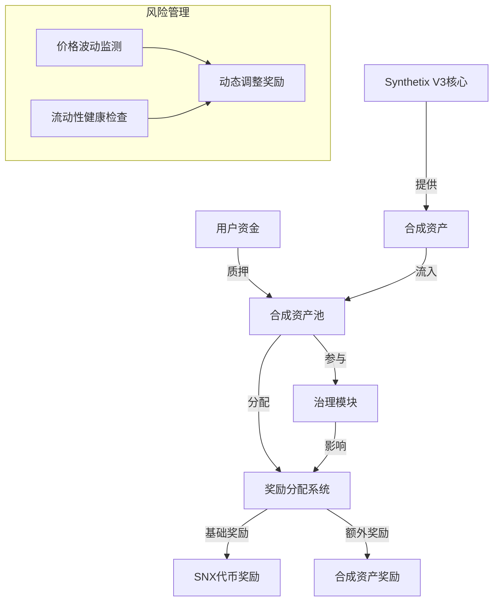

# Synthetix合成资产应用：合成资产流动性挖矿协议

流动性挖矿是DeFi生态系统中重要的激励机制，为协议吸引流动性提供了有效途径。Synthetix V3的合成资产系统为构建专属的流动性挖矿协议提供了强大基础，使用户可以通过提供合成资产流动性获得额外收益。

## 应用价值

合成资产流动性挖矿在DeFi中具有以下价值：

- **提高市场深度**：激励用户为合成资产提供流动性，降低交易滑点
- **去中心化价格发现**：充足的流动性帮助形成更准确的市场价格
- **用户激励对齐**：激励用户长期参与生态系统建设
- **资产利用率提升**：为闲置合成资产创造额外收益机会
- **促进跨链流动性**：支持在多个链上同时流动性挖矿

## 实现方式

### 1. 多层级奖励机制

为不同合成资产池设计差异化奖励：

- 基于风险等级的奖励分配
- 长期质押额外奖励倍数
- 合成资产组合池更高奖励

### 2. 治理权重系统

质押者可参与协议治理：

- 质押时长影响治理权重
- 多种资产组合质押提高权重
- 积极参与治理获得额外奖励

### 3. 实现架构



## 代码实现

### 基础流动性挖矿合约

```solidity
// SPDX-License-Identifier: MIT
pragma solidity ^0.8.0;

import "@synthetixio/core-modules/contracts/interfaces/ITokenModule.sol";
import "@openzeppelin/contracts/token/ERC20/IERC20.sol";
import "@openzeppelin/contracts/access/Ownable.sol";
import "@openzeppelin/contracts/security/ReentrancyGuard.sol";

contract SynthLiquidityMining is Ownable, ReentrancyGuard {
    // 奖励代币
    IERC20 public rewardToken;
    
    // 每个池的配置
    struct Pool {
        address synth;          // 合成资产地址
        uint256 allocPoint;     // 分配权重
        uint256 lastRewardTime; // 上次奖励时间
        uint256 accRewardPerShare; // 累计每份奖励
        uint256 totalStaked;    // 总质押量
    }
    
    // 用户在每个池的信息
    struct UserInfo {
        uint256 amount;         // 用户质押数量
        uint256 rewardDebt;     // 已结算奖励债务
    }
    
    // 池列表
    Pool[] public pools;
    
    // 池映射: synth地址 => 池ID
    mapping(address => uint256) public synthToPoolId;
    
    // 用户在每个池的质押信息: 用户地址 => 池ID => 用户信息
    mapping(address => mapping(uint256 => UserInfo)) public userInfo;
    
    // 每个区块的奖励
    uint256 public rewardPerSecond;
    
    // 开始和结束时间
    uint256 public startTime;
    uint256 public endTime;
    
    // 总分配点数
    uint256 public totalAllocPoint = 0;
    
    event Deposit(address indexed user, uint256 indexed pid, uint256 amount);
    event Withdraw(address indexed user, uint256 indexed pid, uint256 amount);
    event Harvest(address indexed user, uint256 indexed pid, uint256 amount);
    
    constructor(
        address _rewardToken,
        uint256 _rewardPerSecond,
        uint256 _startTime,
        uint256 _endTime
    ) {
        rewardToken = IERC20(_rewardToken);
        rewardPerSecond = _rewardPerSecond;
        startTime = _startTime;
        endTime = _endTime;
    }
    
    // 添加合成资产流动性池
    function addPool(address _synth, uint256 _allocPoint) external onlyOwner {
        // 确保池不存在
        require(synthToPoolId[_synth] == 0, "Pool already exists");
        
        // 更新现有池的奖励
        massUpdatePools();
        
        // 计算总分配点数
        totalAllocPoint += _allocPoint;
        
        // 添加新池
        pools.push(Pool({
            synth: _synth,
            allocPoint: _allocPoint,
            lastRewardTime: block.timestamp > startTime ? block.timestamp : startTime,
            accRewardPerShare: 0,
            totalStaked: 0
        }));
        
        // 更新映射
        synthToPoolId[_synth] = pools.length;
    }
    
    // 更新池的分配权重
    function setPoolAllocPoint(uint256 _pid, uint256 _allocPoint) external onlyOwner {
        // 更新所有池的奖励
        massUpdatePools();
        
        // 更新总分配点数
        totalAllocPoint = totalAllocPoint - pools[_pid].allocPoint + _allocPoint;
        
        // 更新池分配点数
        pools[_pid].allocPoint = _allocPoint;
    }
    
    // 更新所有池的奖励
    function massUpdatePools() public {
        for (uint256 i = 0; i < pools.length; i++) {
            updatePool(i);
        }
    }
    
    // 更新指定池的奖励
    function updatePool(uint256 _pid) public {
        Pool storage pool = pools[_pid];
        
        // 如果当前时间小于等于上次奖励时间，不更新
        if (block.timestamp <= pool.lastRewardTime) {
            return;
        }
        
        // 如果池中没有质押，只更新上次奖励时间
        if (pool.totalStaked == 0) {
            pool.lastRewardTime = block.timestamp;
            return;
        }
        
        // 计算奖励时间段
        uint256 endRewardTime = block.timestamp > endTime ? endTime : block.timestamp;
        uint256 timeElapsed = endRewardTime - pool.lastRewardTime;
        
        // 如果没有奖励时间，不更新
        if (timeElapsed == 0) {
            return;
        }
        
        // 计算奖励
        uint256 reward = (timeElapsed * rewardPerSecond * pool.allocPoint) / totalAllocPoint;
        
        // 更新累计每份奖励
        pool.accRewardPerShare += (reward * 1e18) / pool.totalStaked;
        
        // 更新上次奖励时间
        pool.lastRewardTime = block.timestamp;
    }
    
    // 质押合成资产
    function deposit(uint256 _pid, uint256 _amount) external nonReentrant {
        Pool storage pool = pools[_pid];
        UserInfo storage user = userInfo[msg.sender][_pid];
        
        // 更新池奖励
        updatePool(_pid);
        
        // 如果用户已经有质押，先结算奖励
        if (user.amount > 0) {
            uint256 pending = (user.amount * pool.accRewardPerShare / 1e18) - user.rewardDebt;
            if (pending > 0) {
                rewardToken.transfer(msg.sender, pending);
                emit Harvest(msg.sender, _pid, pending);
            }
        }
        
        // 转移合成资产到合约
        if (_amount > 0) {
            IERC20(pool.synth).transferFrom(msg.sender, address(this), _amount);
            user.amount += _amount;
            pool.totalStaked += _amount;
        }
        
        // 更新奖励债务
        user.rewardDebt = user.amount * pool.accRewardPerShare / 1e18;
        
        emit Deposit(msg.sender, _pid, _amount);
    }
    
    // 提取合成资产
    function withdraw(uint256 _pid, uint256 _amount) external nonReentrant {
        Pool storage pool = pools[_pid];
        UserInfo storage user = userInfo[msg.sender][_pid];
        
        require(user.amount >= _amount, "Withdraw: not enough balance");
        
        // 更新池奖励
        updatePool(_pid);
        
        // 计算待领取奖励
        uint256 pending = (user.amount * pool.accRewardPerShare / 1e18) - user.rewardDebt;
        
        if (_amount > 0) {
            user.amount -= _amount;
            pool.totalStaked -= _amount;
            IERC20(pool.synth).transfer(msg.sender, _amount);
        }
        
        // 发送奖励
        if (pending > 0) {
            rewardToken.transfer(msg.sender, pending);
            emit Harvest(msg.sender, _pid, pending);
        }
        
        // 更新奖励债务
        user.rewardDebt = user.amount * pool.accRewardPerShare / 1e18;
        
        emit Withdraw(msg.sender, _pid, _amount);
    }
    
    // 仅收获奖励
    function harvest(uint256 _pid) external nonReentrant {
        Pool storage pool = pools[_pid];
        UserInfo storage user = userInfo[msg.sender][_pid];
        
        // 更新池奖励
        updatePool(_pid);
        
        // 计算待领取奖励
        uint256 pending = (user.amount * pool.accRewardPerShare / 1e18) - user.rewardDebt;
        
        // 发送奖励
        if (pending > 0) {
            rewardToken.transfer(msg.sender, pending);
            emit Harvest(msg.sender, _pid, pending);
        }
        
        // 更新奖励债务
        user.rewardDebt = user.amount * pool.accRewardPerShare / 1e18;
    }
}
```

### 实际应用案例

#### 1. 跨链流动性挖矿配置

```javascript
// 以太坊主网流动性挖矿配置
const ethereumConfig = {
  rewardToken: "0x...", // SNX主网地址
  rewardPerSecond: ethers.utils.parseEther("0.1"), // 每秒0.1 SNX
  startTime: Math.floor(Date.now() / 1000), // 立即开始
  endTime: Math.floor(Date.now() / 1000) + 30 * 24 * 60 * 60, // 30天后结束
  pools: [
    {
      synth: "0x...", // sETH地址
      allocPoint: 4000 // 40%权重
    },
    {
      synth: "0x...", // sBTC地址
      allocPoint: 3000 // 30%权重
    },
    {
      synth: "0x...", // sUSD地址
      allocPoint: 2000 // 20%权重
    },
    {
      synth: "0x...", // sFX篮子币地址
      allocPoint: 1000 // 10%权重
    }
  ]
};

// Optimism流动性挖矿配置
const optimismConfig = {
  rewardToken: "0x...", // SNX Optimism地址
  rewardPerSecond: ethers.utils.parseEther("0.2"), // 每秒0.2 SNX (更高奖励以吸引流动性)
  startTime: Math.floor(Date.now() / 1000),
  endTime: Math.floor(Date.now() / 1000) + 30 * 24 * 60 * 60,
  pools: [
    {
      synth: "0x...", // Optimism sETH地址
      allocPoint: 3500 // 35%权重
    },
    {
      synth: "0x...", // Optimism sBTC地址
      allocPoint: 2500 // 25%权重
    },
    {
      synth: "0x...", // Optimism sUSD地址
      allocPoint: 2500 // 25%权重
    },
    {
      synth: "0x...", // Optimism sPerp篮子币地址
      allocPoint: 1500 // 15%权重
    }
  ]
};
```

#### 2. 增强型流动性奖励机制

```solidity
// 增强型奖励机制扩展
contract EnhancedSynthMining is SynthLiquidityMining {
    // 质押时长奖励倍数
    struct TimeMultiplier {
        uint256 minStakeDays;  // 最小质押天数
        uint256 multiplierBps; // 奖励倍数 (基点，10000=1倍)
    }
    
    // 时长奖励配置
    TimeMultiplier[] public timeMultipliers;
    
    // 用户质押开始时间: 用户地址 => 池ID => 开始时间
    mapping(address => mapping(uint256 => uint256)) public userStakeStart;
    
    constructor(
        address _rewardToken,
        uint256 _rewardPerSecond,
        uint256 _startTime,
        uint256 _endTime
    ) SynthLiquidityMining(_rewardToken, _rewardPerSecond, _startTime, _endTime) {
        // 设置默认时长奖励倍数
        timeMultipliers.push(TimeMultiplier({
            minStakeDays: 0,     // 0天起
            multiplierBps: 10000  // 1倍基础奖励
        }));
        
        timeMultipliers.push(TimeMultiplier({
            minStakeDays: 7,      // 7天起
            multiplierBps: 11000   // 1.1倍奖励
        }));
        
        timeMultipliers.push(TimeMultiplier({
            minStakeDays: 30,     // 30天起
            multiplierBps: 12500   // 1.25倍奖励
        }));
        
        timeMultipliers.push(TimeMultiplier({
            minStakeDays: 90,     // 90天起
            multiplierBps: 15000   // 1.5倍奖励
        }));
    }
    
    // 添加/更新时长奖励倍数
    function setTimeMultiplier(uint256 _minStakeDays, uint256 _multiplierBps) external onlyOwner {
        // 查找是否已存在该质押时长
        for (uint i = 0; i < timeMultipliers.length; i++) {
            if (timeMultipliers[i].minStakeDays == _minStakeDays) {
                timeMultipliers[i].multiplierBps = _multiplierBps;
                return;
            }
        }
        
        // 添加新的时长倍数
        timeMultipliers.push(TimeMultiplier({
            minStakeDays: _minStakeDays,
            multiplierBps: _multiplierBps
        }));
        
        // 按质押时长排序
        _sortTimeMultipliers();
    }
    
    // 重写质押函数，记录质押开始时间
    function deposit(uint256 _pid, uint256 _amount) external override nonReentrant {
        // 调用父合约的deposit函数
        super.deposit(_pid, _amount);
        
        // 如果是新质押，记录开始时间
        if (userStakeStart[msg.sender][_pid] == 0 && userInfo[msg.sender][_pid].amount > 0) {
            userStakeStart[msg.sender][_pid] = block.timestamp;
        }
    }
    
    // 重写奖励计算，应用时长倍数
    function pendingReward(uint256 _pid, address _user) external view returns (uint256) {
        Pool storage pool = pools[_pid];
        UserInfo storage user = userInfo[_user][_pid];
        
        uint256 accRewardPerShare = pool.accRewardPerShare;
        
        if (block.timestamp > pool.lastRewardTime && pool.totalStaked != 0) {
            uint256 endRewardTime = block.timestamp > endTime ? endTime : block.timestamp;
            uint256 timeElapsed = endRewardTime - pool.lastRewardTime;
            uint256 reward = (timeElapsed * rewardPerSecond * pool.allocPoint) / totalAllocPoint;
            accRewardPerShare += (reward * 1e18) / pool.totalStaked;
        }
        
        uint256 baseReward = (user.amount * accRewardPerShare / 1e18) - user.rewardDebt;
        
        // 应用时长倍数
        uint256 multiplier = getTimeMultiplier(_user, _pid);
        return (baseReward * multiplier) / 10000;
    }
    
    // 获取用户当前时长倍数
    function getTimeMultiplier(address _user, uint256 _pid) public view returns (uint256) {
        uint256 stakeStart = userStakeStart[_user][_pid];
        
        // 如果尚未开始质押，返回基础倍数
        if (stakeStart == 0) {
            return 10000; // 1倍
        }
        
        // 计算质押天数
        uint256 stakeDays = (block.timestamp - stakeStart) / (1 days);
        
        // 查找适用的时长倍数
        for (uint i = timeMultipliers.length - 1; i >= 0; i--) {
            if (stakeDays >= timeMultipliers[i].minStakeDays) {
                return timeMultipliers[i].multiplierBps;
            }
            
            // 防止underflow
            if (i == 0) break;
        }
        
        return 10000; // 默认1倍
    }
    
    // 内部函数：排序时长倍数
    function _sortTimeMultipliers() internal {
        // 简单的插入排序
        for (uint i = 1; i < timeMultipliers.length; i++) {
            TimeMultiplier memory tmp = timeMultipliers[i];
            uint j = i;
            while (j > 0 && timeMultipliers[j-1].minStakeDays > tmp.minStakeDays) {
                timeMultipliers[j] = timeMultipliers[j-1];
                j--;
            }
            timeMultipliers[j] = tmp;
        }
    }
}
```

#### 3. 多链奖励协调器

```solidity
// 跨链奖励协调器
contract CrossChainRewardCoordinator is Ownable {
    // 链ID到挖矿合约的映射
    mapping(uint256 => address) public miningContracts;
    
    // 全局奖励配置
    struct GlobalRewardConfig {
        uint256 totalRewardPerDay;  // 每日总奖励
        mapping(uint256 => uint256) chainAllocation; // 链ID => 分配百分比
    }
    
    GlobalRewardConfig public globalConfig;
    
    // 链间消息传递接口
    ICrossChainMessenger public messenger;
    
    constructor(address _messenger) {
        messenger = ICrossChainMessenger(_messenger);
        
        // 设置每日总奖励
        globalConfig.totalRewardPerDay = 10000 * 1e18; // 10,000 SNX
    }
    
    // 设置链奖励分配
    function setChainAllocation(uint256 _chainId, uint256 _allocation) external onlyOwner {
        globalConfig.chainAllocation[_chainId] = _allocation;
    }
    
    // 设置挖矿合约地址
    function setMiningContract(uint256 _chainId, address _contract) external onlyOwner {
        miningContracts[_chainId] = _contract;
    }
    
    // 启动跨链奖励分发
    function distributeRewards() external onlyOwner {
        // 对所有支持的链分发奖励
        uint256[] memory supportedChains = getSupportedChains();
        
        for (uint i = 0; i < supportedChains.length; i++) {
            uint256 chainId = supportedChains[i];
            address miningContract = miningContracts[chainId];
            
            if (miningContract != address(0)) {
                // 计算该链的每日奖励
                uint256 dailyReward = (globalConfig.totalRewardPerDay * 
                    globalConfig.chainAllocation[chainId]) / 10000;
                
                // 计算每秒奖励
                uint256 rewardPerSecond = dailyReward / 86400;
                
                // 将奖励参数发送到目标链
                bytes memory message = abi.encodeWithSignature(
                    "updateRewardRate(uint256)",
                    rewardPerSecond
                );
                
                messenger.sendMessageToChain(chainId, miningContract, message);
            }
        }
    }
    
    // 获取所有支持的链ID
    function getSupportedChains() public view returns (uint256[] memory) {
        // 实现支持链ID查询
        // 简化示例，实际应根据已配置的链返回
        uint256[] memory chains = new uint256[](3);
        chains[0] = 1;      // 以太坊主网
        chains[1] = 10;     // Optimism
        chains[2] = 8453;   // Base
        return chains;
    }
}
```

## 优势与差异化

使用Synthetix V3构建流动性挖矿协议具有以下优势：

1. **双重收益机制**：用户除获得挖矿奖励外，还能享受合成资产的交易费收益
2. **跨链流动性**：可在多个链上同时激励流动性提供，提高资本效率
3. **风险调整收益**：根据不同合成资产的风险特性，提供差异化的奖励
4. **融合治理**：流动性提供者可参与Synthetix生态系统治理
5. **灵活奖励设计**：支持自定义奖励分配和时长激励机制

## 潜在风险与缓解措施

1. **激励不当风险**
   - 风险：不合理的奖励分配导致流动性集中或不足
   - 缓解：动态调整奖励参数，基于市场数据优化分配

2. **一次性流动性风险**
   - 风险：奖励结束后流动性大幅流失
   - 缓解：实施长期锁定奖励和平滑减少奖励的退出机制

3. **价格操纵风险**
   - 风险：恶意用户操纵价格获取额外奖励
   - 缓解：使用时间加权平均价格和异常监测系统

4. **跨链协调风险**
   - 风险：跨链奖励分配不同步
   - 缓解：建立可靠的跨链消息传递和动态奖励调整机制

## 拓展方向

1. **定制化奖励策略**：允许用户选择不同风险-收益配置的奖励池
2. **合成资产组合挖矿**：为质押多种合成资产组合提供额外奖励
3. **衍生品挖矿**：为合成衍生品策略提供流动性挖矿奖励
4. **回购与分配**：使用协议收益回购并分配给长期流动性提供者

## 结论

合成资产流动性挖矿协议为Synthetix V3生态系统提供了重要的流动性激励机制，通过精心设计的奖励结构，可以显著提高市场深度和价格效率。多链部署和灵活的奖励设计使流动性更加高效分配，为用户提供了具有吸引力的收益机会，同时增强整个生态系统的健康发展。 