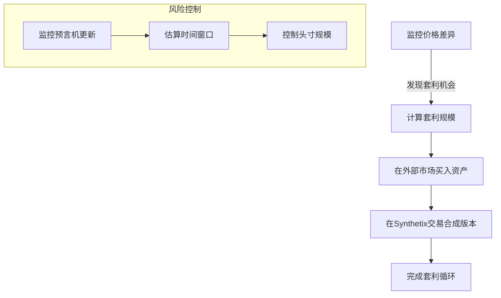
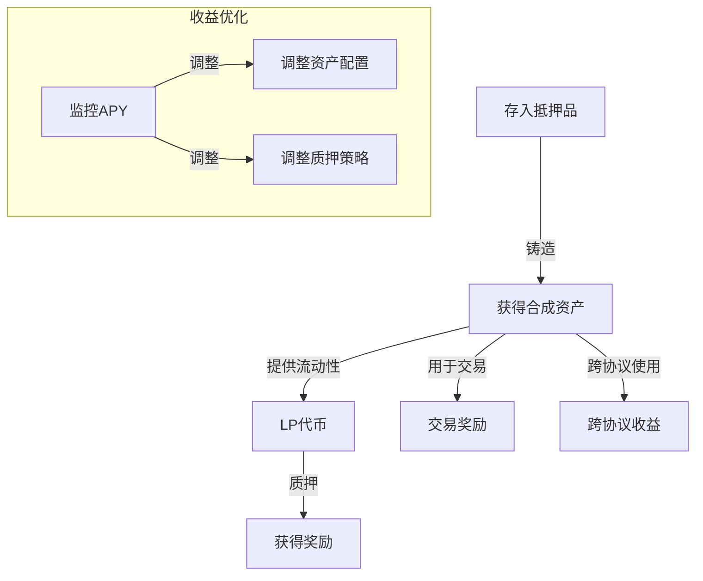
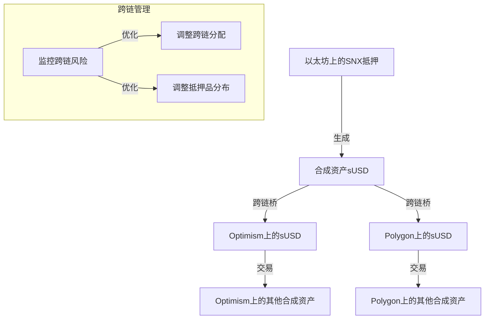

# Synthetix合成资产的DeFi应用场景

Synthetix的合成资产系统提供了丰富的金融工具，不仅限于借贷，还可以实现多种DeFi应用场景。以下是一些利用Synthetix合成资产的创新DeFi应用：

## 1. 指数投资与资产组合管理

### 实现方式

- **合成指数创建**：利用Synthetix可以创建各种合成指数，如加密货币指数、股票市场指数等
- **自定义投资组合**：组合不同的合成资产，创建个性化的投资组合
- **多资产敞口**：一键获得多种资产的市场敞口

### 代码示例

```solidity
// 创建加密货币指数投资组合
function createCryptoIndex(uint256 amount) external {
    // 定义投资组合权重
    uint256[] memory weights = new uint256[](3);
    bytes32[] memory assets = new bytes32[](3);
    
    // 配置资产和权重 (例如: 50% BTC, 30% ETH, 20% DOT)
    assets[0] = "sBTC";
    weights[0] = 50;
    
    assets[1] = "sETH";
    weights[1] = 30;
    
    assets[2] = "sDOT";
    weights[2] = 20;
    
    // 执行资产分配
    for (uint i = 0; i < assets.length; i++) {
        synthetixExchange.exchange(
            "sUSD",
            amount * weights[i] / 100,
            assets[i]
        );
    }
}
```

### 实际应用案例

1. **DeFi板块ETF**：创建一个追踪主要DeFi代币表现的合成指数
   ```solidity
   // DeFi指数组件
   bytes32[] defiAssets = ["sUNI", "sAAVE", "sCOMP", "sSUSHI", "sYFI"];
   uint256[] defiWeights = [30, 25, 20, 15, 10];
   ```

2. **区块链赛道主题指数**：创建特定区块链生态系统的指数
   ```solidity
   // Solana生态指数
   bytes32[] solanaAssets = ["sSOL", "sSRM", "sRAY", "sFTT"];
   uint256[] solanaWeights = [40, 25, 20, 15];
   ```

3. **传统金融合成组合**：组合黄金、股票和债券的合成版本
   ```solidity
   // 传统资产配置
   bytes32[] tradAssets = ["sXAU", "sFTSE", "sNIKKEI"];
   uint256[] tradWeights = [40, 30, 30];
   ```

## 2. 跨市场套利策略

### 实现方式

- **无滑点套利**：利用Synthetix的无滑点交易与外部市场的价格差异进行套利
- **延迟套利**：利用预言机更新延迟进行套利
- **跨链套利**：通过合成资产进行跨链市场套利

### 套利流程



### 实际套利案例

1. **BTC/sBTC套利**：
   - 监控Binance上的BTC价格和Synthetix上的sBTC价格
   - 当sBTC价格高于BTC 0.5%以上时，在Binance买入BTC并在Synthetix卖出sBTC
   - 当价格回归时平仓，获取差价

2. **预言机延迟套利**：
   - 利用Chainlink预言机更新延迟(10-15分钟)
   - 市场急剧波动时，在外部市场快速建仓，等待Synthetix预言机更新
   - 预言机更新后，在Synthetix上平仓获利

3. **Layer2低成本套利**：
   - 在Optimism或Arbitrum上的Synthetix与L1交易所之间套利
   - 利用L2的低交易成本进行高频套利交易
   - 套利规模小但高频，累计获利可观

## 3. 高级衍生品策略

### 实现方式

- **合成期权结构**：组合合成资产创建类似期权的结构
- **杠杆交易**：利用合成资产设计杠杆交易策略
- **风险对冲**：构建对冲投资组合

### 代码示例

```solidity
// 实现简化的看涨期权结构
function createSyntheticCallOption(
    bytes32 baseAsset,
    uint256 strikePrice,
    uint256 collateralAmount
) external {
    // 存入抵押品
    collateralEth.deposit{value: collateralAmount}(msg.sender, loanId);
    
    // 铸造sUSD
    uint256 susdAmount = collateralAmount * getCurrentPrice() / 1e18;
    uint256 loanId = collateralEth.open(susdAmount, "sUSD");
    
    // 设置条件监控合约以在达到执行价时转换为目标资产
    OptionMonitor(optionMonitorAddress).createMonitor(
        baseAsset,
        strikePrice,
        loanId,
        msg.sender
    );
}
```

### 复杂衍生品结构

1. **长期期权策略**：
   ```solidity
   // 创建90天期限的ETH看涨期权结构
   function createLongTermCallOption(uint256 strikePrice) external payable {
       // 计算所需抵押品
       uint256 requiredCollateral = calculateRequiredCollateral(
           "sETH", 
           strikePrice, 
           90 days
       );
       
       // 验证足够的抵押品
       require(msg.value >= requiredCollateral, "Insufficient collateral");
       
       // 创建期权结构
       uint256 optionId = optionFactory.createCall(
           "sETH",
           strikePrice,
           block.timestamp + 90 days,
           msg.value
       );
       
       // 记录用户期权
       userOptions[msg.sender].push(optionId);
   }
   ```

2. **合成资产互换(Swaps)**：
   ```solidity
   // 创建两个合成资产之间的互换合约
   function createSyntheticSwap(
       bytes32 assetPaid,
       bytes32 assetReceived,
       uint256 notional,
       uint256 duration
   ) external {
       // 收取初始保证金
       require(
           collateralManager.lockCollateral(msg.sender, calculateMargin(notional)),
           "Margin lock failed"
       );
       
       // 创建互换合约
       uint256 swapId = swapFactory.createSwap(
           msg.sender,
           assetPaid,
           assetReceived,
           notional,
           block.timestamp + duration
       );
       
       // 记录用户的互换合约
       userSwaps[msg.sender].push(swapId);
   }
   ```

3. **结构化产品**：
   ```mermaid
   graph TD
       A[用户资金] -->|投入| B[结构化产品合约]
       B -->|70%| C[sUSD稳定收益]
       B -->|30%| D[sBTC/sETH杠杆敞口]
       C -->|固定收益| E[保本部分]
       D -->|上涨收益| F[增值部分]
       E -->|到期| G[用户]
       F -->|到期| G
   ```

## 4. 收益耕作与激励机制

### 实现方式

- **流动性挖矿**：为合成资产提供流动性挖矿
- **交易激励**：设计交易激励机制
- **抵押奖励**：优化抵押奖励策略

### 示例策略



### 创新激励模型

1. **多层级质押奖励**：
   ```solidity
   // 多层级质押奖励计算
   function calculateRewards(address staker) public view returns (uint256) {
       uint256 baseReward = stakedAmount[staker] * baseRate;
       
       // 层级1: 质押时间奖励
       uint256 timeMultiplier = getTimeMultiplier(staker);
       
       // 层级2: 质押金额奖励
       uint256 amountMultiplier = getAmountMultiplier(staker);
       
       // 层级3: 交易活跃度奖励
       uint256 activityMultiplier = getActivityMultiplier(staker);
       
       return baseReward * timeMultiplier * amountMultiplier * activityMultiplier / 1e18;
   }
   ```

2. **交叉协议挖矿**：
   - 在Synthetix铸造sUSD并在Curve提供流动性
   - 同时获得SNX、CRV和可能的其他协议代币奖励
   - 使用Yearn等收益聚合器最大化收益

3. **合成资产篮子质押**：
   ```solidity
   // 创建多资产质押篮子
   function stakeAssetBasket(uint256[] memory amounts, bytes32[] memory synths) external {
       require(amounts.length == synths.length, "Length mismatch");
       
       uint256 basketValue = 0;
       
       // 计算篮子总价值并转移资产
       for (uint i = 0; i < synths.length; i++) {
           require(IERC20(addressResolver.getSynthAddress(synths[i])).transferFrom(
               msg.sender, address(this), amounts[i]
           ), "Transfer failed");
           
           basketValue += getUSDValue(synths[i], amounts[i]);
       }
       
       // 创建篮子LP代币
       _mint(msg.sender, basketValue);
       
       // 记录用户篮子构成
       for (uint i = 0; i < synths.length; i++) {
           userBaskets[msg.sender][synths[i]] += amounts[i];
       }
   }
   ```

## 5. 合成资产做市商策略

### 实现方式

- **中心化做市**：在Synthetix和其他交易所间做市
- **多资产做市**：同时为多种合成资产提供流动性
- **风险中性策略**：设计风险中性的做市策略

### 核心优势

- **无滑点交易**：Synthetix的无滑点交易降低了做市风险
- **价格确定性**：预言机价格提供了做市的基准
- **多市场覆盖**：可以覆盖难以直接交易的资产市场

### 做市商策略示例

1. **三角套利做市**：
   ```mermaid
   graph TD
       A[监控价格] -->|价差机会| B[执行三角套利]
       B --> C[在交易所A买入BTC]
       C --> D[在Synthetix将BTC换为ETH]
       D --> E[在交易所B将ETH卖出为BTC]
       E --> F[完成套利循环]
   ```

2. **风险对冲做市**：
   ```solidity
   // 风险对冲做市策略
   function hedgedMarketMaking(
       bytes32 synth,
       uint256 amount,
       uint256 spread
   ) external {
       // 计算当前价格
       uint256 currentPrice = synthetixPriceOracle.getCurrentPrice(synth);
       
       // 设置做市价格范围
       uint256 buyPrice = currentPrice * (10000 - spread) / 10000;
       uint256 sellPrice = currentPrice * (10000 + spread) / 10000;
       
       // 设置做市订单
       orderBook.placeBuyOrder(synth, amount, buyPrice);
       orderBook.placeSellOrder(synth, amount, sellPrice);
       
       // 建立对冲头寸
       hedgingStrategy.createHedge(synth, amount, currentPrice);
   }
   ```

3. **跨平台流动性提供**：
   - 同时在Uniswap V3、Curve和Synthetix提供sETH/ETH流动性
   - 使用集中管理的仓位调整策略
   - 实时监控三个平台的价格和流动性，动态调整资金分配

## 6. 跨链DeFi应用

### 实现方式

- **跨链资产桥接**：利用合成资产实现跨链资产转移
- **多链投资组合**：在不同链上管理统一的投资组合
- **风险分散**：跨链分散风险

### 示例架构



### 跨链应用实例

1. **一键跨链投资组合**：
   ```solidity
   // 跨链投资组合部署
   function deployPortfolioAcrossChains(
       uint256 amount,
       uint256[] memory chainAllocations,
       uint256[] memory assetAllocations
   ) external {
       // 验证分配总和为100%
       require(validateAllocations(chainAllocations), "Invalid chain allocations");
       require(validateAllocations(assetAllocations), "Invalid asset allocations");
       
       // 首先铸造sUSD
       uint256 susdAmount = synthetix.mintSUSD(amount);
       
       // 分配给不同链
       for (uint i = 0; i < chainAllocations.length; i++) {
           // 计算分配金额
           uint256 chainAmount = susdAmount * chainAllocations[i] / 100;
           
           // 发送到目标链
           crossChainBridge.bridgeToChain(
               chainIds[i],
               chainAmount,
               assetAllocations
           );
       }
   }
   ```

2. **跨链收益优化器**：
   - 实时监控多链上的收益机会
   - 自动将资金转移到收益最高的链和协议
   - 使用链上的预言机数据进行决策

3. **链间套利机器人**：
   ```solidity
   // 监控跨链套利机会
   function monitorCrossChainArbitrage() external {
       // 获取各链上的资产价格
       uint256 ethPriceOnEthereum = getPriceOnChain(1, "sETH");
       uint256 ethPriceOnOptimism = getPriceOnChain(10, "sETH");
       uint256 ethPriceOnPolygon = getPriceOnChain(137, "sETH");
       
       // 找到最佳套利路径
       (uint256 buyChainId, uint256 sellChainId) = findBestArbitragePath(
           [1, 10, 137],
           [ethPriceOnEthereum, ethPriceOnOptimism, ethPriceOnPolygon]
       );
       
       // 执行套利
       if (getPriceGap(buyChainId, sellChainId) > minProfitThreshold) {
           executeCrossChainArbitrage(buyChainId, sellChainId);
       }
   }
   ```

## 7. 实时支付和商业应用

### 实现方式

- **跨境支付**：利用合成资产实现低成本跨境支付
- **薪资支付**：提供稳定的合成资产薪资支付方案
- **商业结算**：跨市场商业结算

### 优势分析

1. **价格稳定**：合成资产可以跟踪稳定币或法币
2. **低滑点**：大额转账无需担心滑点问题
3. **全球可及**：不受地理限制的资产获取

### 商业应用案例

1. **多币种薪资系统**：
   ```solidity
   // 全球薪资发放合约
   contract GlobalPayroll {
       // 员工薪资配置
       struct EmployeeSalary {
           address employee;
           bytes32[] currencyTypes;  // 如 "sUSD", "sEUR", "sJPY"
           uint256[] percentages;    // 对应币种的百分比
           uint256 baseSalaryUSD;    // 基础薪资(USD)
       }
       
       mapping(address => EmployeeSalary) public employeeSalaries;
       
       // 发放薪资
       function paySalaries() external onlyOwner {
           for (uint i = 0; i < employees.length; i++) {
               EmployeeSalary memory salary = employeeSalaries[employees[i]];
               
               for (uint j = 0; j < salary.currencyTypes.length; j++) {
                   uint256 amount = salary.baseSalaryUSD * salary.percentages[j] / 100;
                   
                   // 转换为对应货币并支付
                   paySalaryInCurrency(
                       salary.employee,
                       salary.currencyTypes[j],
                       amount
                   );
               }
           }
       }
   }
   ```

2. **供应链支付解决方案**：
   - 使用sUSD、sEUR等合成法币进行全球供应链结算
   - 智能合约自动执行交付确认和支付
   - 降低跨境支付成本和结算时间

3. **合成资产支付网关**：
   ```mermaid
   graph TD
       A[商户] -->|集成| B[合成资产支付网关]
       C[客户] -->|支付| B
       B -->|选择支付方式| D[选择货币]
       D -->|sUSD| E[处理sUSD支付]
       D -->|sBTC| F[处理sBTC支付]
       D -->|sEUR| G[处理sEUR支付]
       E --> H[结算给商户]
       F --> H
       G --> H
   ```

## 8. 风险管理产品

### 实现方式

- **保险产品**：设计基于合成资产的保险产品
- **对冲工具**：提供市场下跌对冲工具
- **风险分散策略**：设计风险分散投资组合

### 代码示例

```solidity
// 实现简化的市场对冲机制
function createHedgePosition(bytes32 assetToHedge, uint256 amount) external {
    // 计算所需的反向头寸规模
    uint256 hedgeAmount = calculateHedgeAmount(assetToHedge, amount);
    
    // 借入sUSD
    uint256 loanId = collateralEth.open(hedgeAmount, "sUSD");
    
    // 转换为反向资产 (例如，对ETH做多头寸的对冲可能是做空ETH)
    bytes32 hedgeAsset = getInverseAsset(assetToHedge);
    synthetixExchange.exchange(
        "sUSD",
        hedgeAmount,
        hedgeAsset
    );
}
```

### 风险管理产品案例

1. **智能清算保护**：
   ```solidity
   // 防止清算的智能保护合约
   contract LiquidationProtection {
       // 设置清算保护
       function setupProtection(
           uint256 loanId,
           uint256 triggerRatio,
           uint256 addCollateralAmount
       ) external {
           // 记录保护设置
           protectionSettings[loanId] = ProtectionSetting({
               owner: msg.sender,
               triggerRatio: triggerRatio,
               addCollateralAmount: addCollateralAmount,
               active: true
           });
           
           // 监控抵押率
           startMonitoring(loanId);
       }
       
       // 检查并执行保护
       function checkAndProtect(uint256 loanId) external {
           // 获取当前抵押率
           uint256 currentRatio = getLoanCollateralRatio(loanId);
           ProtectionSetting memory settings = protectionSettings[loanId];
           
           if (currentRatio <= settings.triggerRatio && settings.active) {
               // 自动添加抵押品
               addCollateral(loanId, settings.addCollateralAmount);
               
               // 通知用户
               emit ProtectionTriggered(loanId, currentRatio, settings.addCollateralAmount);
           }
       }
   }
   ```

2. **市场波动对冲基金**：
   - 创建一个自动调整的对冲基金
   - 在市场上涨时减少对冲头寸，在市场下跌时增加对冲
   - 使用合成资产实现无缝调整，降低交易成本

3. **合成期权保险产品**：
   ```mermaid
   graph TD
       A[投资组合] -->|投保| B[保险合约]
       B -->|创建| C[合成看跌期权]
       D[市场下跌] -->|触发| E[执行期权]
       E -->|赔付| F[投资组合损失补偿]
       
       G[市场上涨] -->|到期| H[期权过期]
       H -->|小额损失| A
   ```

## 9. 合成资产DAO治理

### 实现方式

- **合成资产支持的DAO**：使用合成资产进行DAO投票权分配
- **投资DAO**：管理合成资产投资组合的DAO
- **风险参数治理**：社区治理风险参数

### 治理机制

1. **参数提案**：用户可以提出风险参数调整
2. **投票机制**：使用SNX或合成资产进行投票
3. **执行机制**：自动执行通过的提案

### DAO治理实例

1. **风险参数治理系统**：
   ```solidity
   // DAO治理风险参数
   contract RiskParameterGovernance {
       struct Proposal {
           bytes32 parameterType;    // 例如 "minCollateralRatio"
           uint256 proposedValue;
           uint256 votesFor;
           uint256 votesAgainst;
           uint256 proposalEnd;
           bool executed;
       }
       
       Proposal[] public proposals;
       
       // 创建新提案
       function createProposal(
           bytes32 parameterType,
           uint256 proposedValue
       ) external {
           require(snxToken.balanceOf(msg.sender) >= proposalThreshold, "Insufficient SNX");
           
           proposals.push(Proposal({
               parameterType: parameterType,
               proposedValue: proposedValue,
               votesFor: 0,
               votesAgainst: 0,
               proposalEnd: block.timestamp + votingPeriod,
               executed: false
           }));
           
           emit ProposalCreated(proposals.length - 1, msg.sender, parameterType, proposedValue);
       }
       
       // 投票
       function vote(uint256 proposalId, bool support) external {
           Proposal storage proposal = proposals[proposalId];
           require(block.timestamp < proposal.proposalEnd, "Voting ended");
           
           uint256 voteWeight = getVoteWeight(msg.sender);
           
           if (support) {
               proposal.votesFor += voteWeight;
           } else {
               proposal.votesAgainst += voteWeight;
           }
           
           emit Voted(proposalId, msg.sender, support, voteWeight);
       }
       
       // 执行提案
       function executeProposal(uint256 proposalId) external {
           Proposal storage proposal = proposals[proposalId];
           require(block.timestamp >= proposal.proposalEnd, "Voting not ended");
           require(!proposal.executed, "Already executed");
           require(proposal.votesFor > proposal.votesAgainst, "Proposal rejected");
           
           // 更新系统参数
           systemParameters.updateParameter(
               proposal.parameterType,
               proposal.proposedValue
           );
           
           proposal.executed = true;
           emit ProposalExecuted(proposalId);
       }
   }
   ```

2. **合成资产投资DAO**：
   - 社区提案和投票决定投资策略
   - 自动执行投资决策
   - 收益分配给DAO成员

3. **多层级治理结构**：
   ```mermaid
   graph TD
       A[SNX持有者] -->|基础投票权| B[第一层：核心参数]
       C[Synth持有者] -->|特定投票权| D[第二层：合成资产参数]
       E[LP提供者] -->|流动性投票权| F[第三层：交易参数]
       
       B --> G[执行更改]
       D --> G
       F --> G
   ```

## 10. 跨资产交易解决方案

### 实现方式

- **原子交换**：无需中介的跨资产交换
- **高效价格发现**：利用预言机和合成资产定价
- **降低交易成本**：减少中间交易环节

### 应用案例

1. **一站式资产转换平台**：
   ```solidity
   // 一站式资产转换
   function convertAnyToAny(
       address inputToken,
       address outputToken,
       uint256 inputAmount
   ) external returns (uint256) {
       // 第一步：将输入代币转为sUSD
       uint256 susdAmount;
       
       if (isSynth(inputToken)) {
           // 直接交换为sUSD
           susdAmount = synthetixExchange.exchange(
               getSynthKey(inputToken),
               inputAmount,
               "sUSD"
           );
       } else {
           // 使用DEX转换为sUSD
           susdAmount = dexAggregator.swap(
               inputToken,
               sUSD,
               inputAmount
           );
       }
       
       // 第二步：将sUSD转为目标代币
       if (isSynth(outputToken)) {
           // 直接从sUSD交换为目标Synth
           return synthetixExchange.exchange(
               "sUSD",
               susdAmount,
               getSynthKey(outputToken)
           );
       } else {
           // 使用DEX从sUSD转换为目标代币
           return dexAggregator.swap(
               sUSD,
               outputToken,
               susdAmount
           );
       }
   }
   ```

2. **隐含价格套利系统**：
   - 利用合成资产隐含的价格关系进行三角套利
   - 例如：ETH -> sETH -> sBTC -> BTC -> ETH
   - 自动捕捉和利用价格效率低下的情况

## 挑战与风险

1. **预言机风险**：合成资产依赖预言机的价格数据
2. **清算风险**：市场波动可能导致清算
3. **流动性风险**：大规模采用可能面临流动性问题
4. **监管不确定性**：合成资产可能面临监管挑战

## 未来发展方向

1. **实物资产合成**：扩展到实物资产的合成版本
2. **算法优化**：改进价格发现和风险控制算法
3. **跨链扩展**：更多链上的无缝体验
4. **机构级解决方案**：为机构投资者提供定制化方案

## 总结

Synthetix的合成资产系统为DeFi创新提供了丰富的可能性，远超传统借贷应用。通过利用其无滑点交易、灵活的资产创建和跨链能力，开发者和用户可以构建出更加复杂和高效的金融产品。关键是要理解合成资产的特性，把握其优势，同时做好风险管理。 