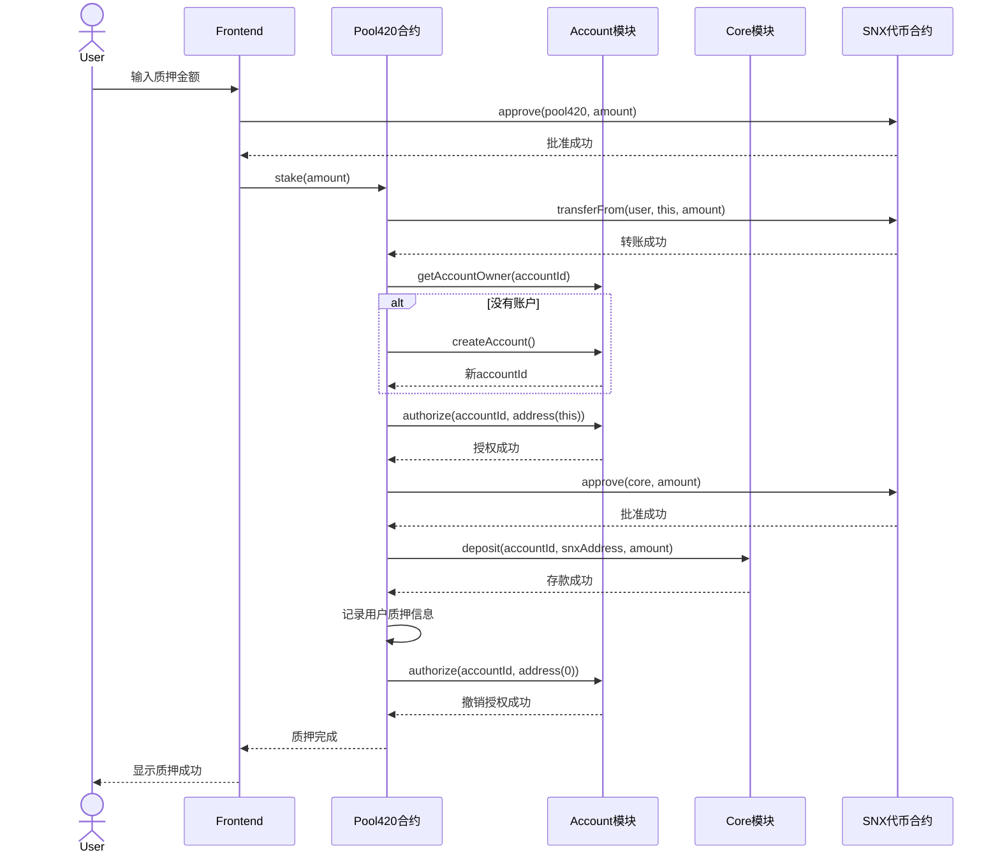
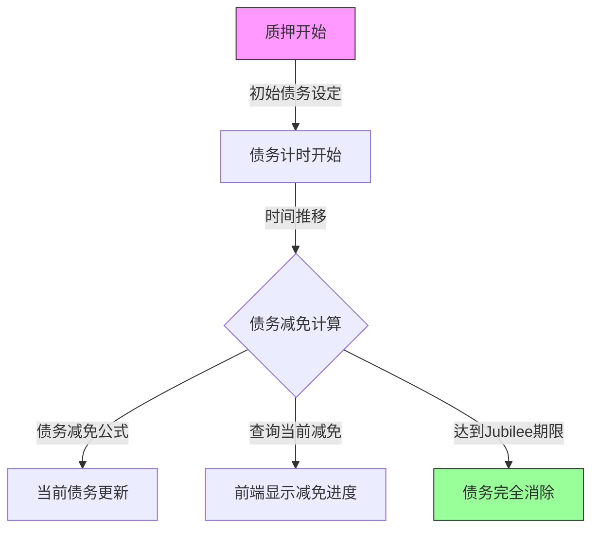
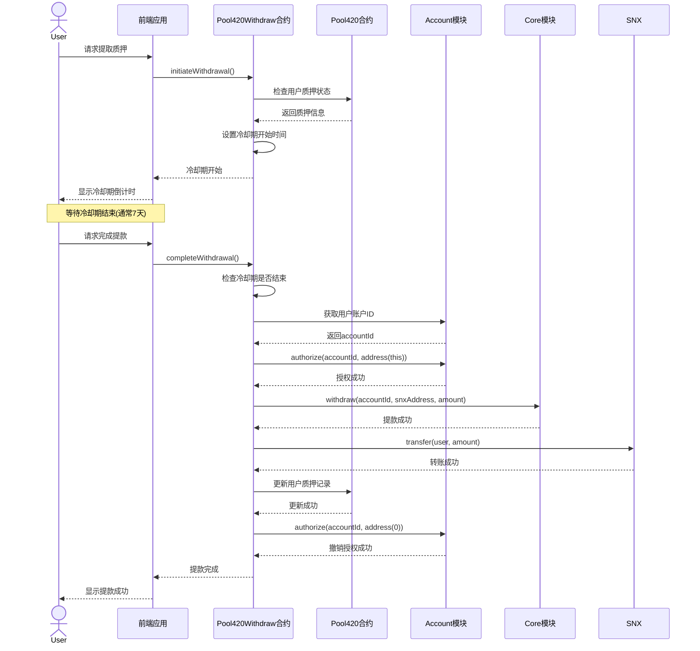
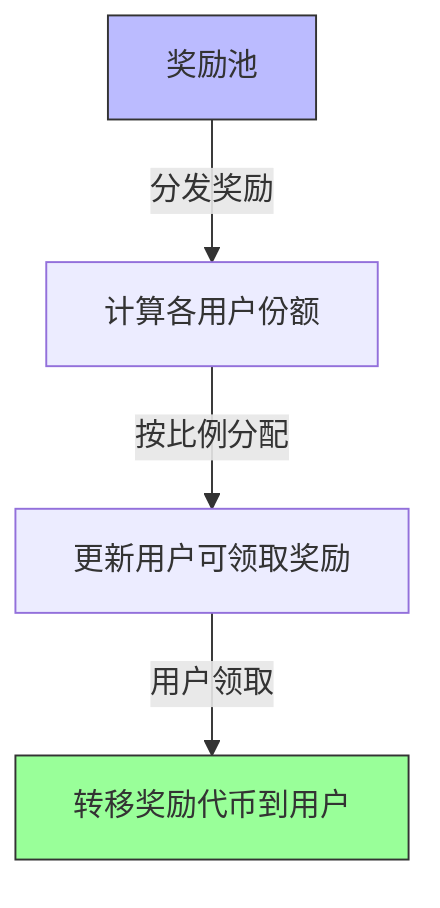
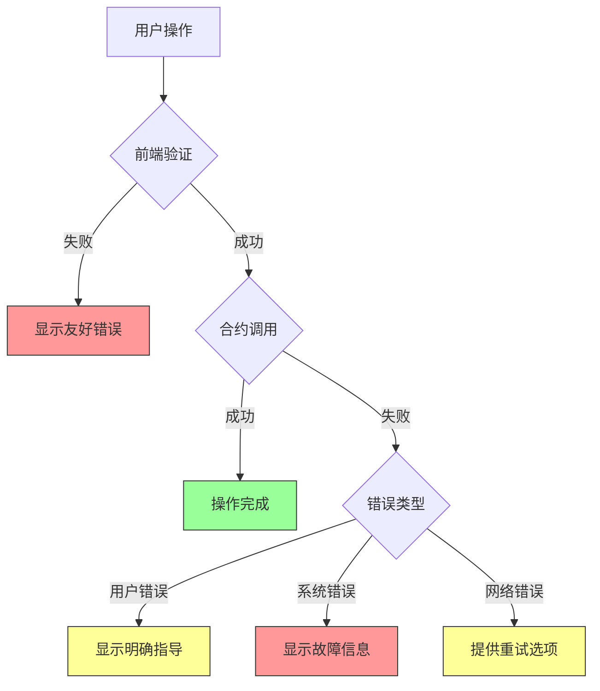

# Synthetix V3 & 420 Pool 交互流程分析

## 任务使命 (Mission)

掌握Synthetix V3和420 Pool的核心交互流程，理解用户与系统交互的主要场景和处理逻辑，为进一步开发和优化提供基础。

## 背景上下文 (Context)

Synthetix V3和420 Pool的强大功能通过一系列精心设计的交互流程展现，这些流程不仅决定了用户体验，也反映了系统的核心逻辑和安全机制。深入理解这些交互流程，对于开发者实现、优化和扩展系统功能至关重要。

## 执行计划 (Plan)

本文档将系统分析Synthetix V3和420 Pool的主要交互流程，包括：

1. SNX质押流程
2. 债务减免机制流程
3. 提款流程
4. 奖励分配流程
5. 错误处理流程

每个流程分析将包括流程图、关键步骤、接口调用、状态转换和最佳实践。

## 1. SNX质押流程

### 1.1 质押流程概述

SNX质押是用户参与Synthetix V3系统的入口，通过420 Pool，这一流程被大大简化。用户只需调用一个函数，背后涉及多个复杂的系统操作。



### 1.2 质押流程关键步骤

#### 1.2.1 前端准备

前端应用需要执行以下准备工作：

1. 连接用户钱包
2. 获取用户SNX余额
3. 批准Pool420合约花费用户的SNX
4. 调用`stake`函数

```javascript
// 1. 连接钱包
const provider = new ethers.providers.Web3Provider(window.ethereum);
await provider.send('eth_requestAccounts', []);
const signer = provider.getSigner();
const userAddress = await signer.getAddress();

// 2. 获取SNX余额
const snxContract = new ethers.Contract(snxAddress, snxABI, provider);
const balance = await snxContract.balanceOf(userAddress);

// 3. 批准Pool420合约
const approveTx = await snxContract.connect(signer).approve(pool420Address, amount);
await approveTx.wait();

// 4. 质押SNX
const pool420Contract = new ethers.Contract(pool420Address, pool420ABI, signer);
const stakeTx = await pool420Contract.stake(amount);
await stakeTx.wait();
```

#### 1.2.2 Pool420合约处理

Pool420合约是质押流程的核心，它处理以下关键步骤：

1. 接收用户的SNX
2. 获取或创建用户的Synthetix V3账户
3. 临时授权自己操作用户账户
4. 将SNX存入Core模块
5. 计算初始债务
6. 记录用户质押信息
7. 撤销临时授权

```solidity
function stake(uint256 amount) external {
    // 1. 转移SNX到合约
    snxToken.transferFrom(msg.sender, address(this), amount);
    
    // 2. 获取或创建账户
    uint128 accountId = getOrCreateAccount(msg.sender);
    
    // 3. 临时授权
    account.authorize(accountId, address(this));
    
    // 4. 将SNX存入Core
    snxToken.approve(address(core), amount);
    core.deposit(accountId, address(snxToken), amount);
    
    // 5. 计算初始债务
    uint256 initialDebt = calculateInitialDebt(amount);
    
    // 6. 记录质押信息
    positions[msg.sender] = Position({
        accountId: accountId,
        stakedAmount: amount,
        originalDebt: initialDebt,
        currentDebt: initialDebt,
        entryTimestamp: block.timestamp
    });
    
    // 7. 撤销临时授权
    account.authorize(accountId, address(0));
    
    emit Staked(msg.sender, amount, initialDebt);
}
```

### 1.3 状态变更分析

质押流程中的关键状态变更包括：

1. **代币状态变更**：
   - 用户SNX余额减少
   - Pool420合约SNX余额临时增加
   - Core模块SNX余额最终增加

2. **账户状态变更**：
   - 如果是首次质押，创建新的Synthetix V3账户
   - 账户与用户地址关联
   - 账户抵押品增加

3. **债务状态变更**：
   - 用户获得初始债务
   - 系统总债务增加

4. **质押记录变更**：
   - 创建新的质押记录，包含质押金额、债务和时间戳

### 1.4 错误处理和边界条件

质押过程中可能出现的问题及其处理方式：

| 错误类型 | 可能原因 | 处理方式 |
|---------|---------|---------|
| 余额不足 | 用户SNX不足 | 交易回滚，返回错误信息 |
| 授权失败 | 用户未批准或批准额度不足 | 交易回滚，提示用户批准 |
| Gas不足 | 复杂操作需要较高Gas | 建议用户增加Gas限额 |
| 合约暂停 | 系统维护或紧急情况 | 检查合约状态，提供相应提示 |
| 债务上限 | 系统债务已达上限 | 交易回滚，提示系统容量已满 |

### 1.5 质押流程最佳实践

为确保质押流程的顺畅和安全，建议遵循以下最佳实践：

1. **前端验证**：在调用合约前验证输入金额、余额和批准状态
2. **错误提示**：为不同错误提供清晰、用户友好的提示
3. **交易确认**：等待交易确认后再更新UI状态
4. **状态刷新**：完成后自动刷新用户质押状态和余额
5. **Gas估算**：提前估算所需Gas并建议合理的Gas限额

## 2. 债务减免机制流程

### 2.1 债务减免概述

420 Pool的核心创新之一是债务减免机制，随着时间推移，用户的债务会逐渐减少，直至完全消除。



### 2.2 债务减免计算

债务减免采用线性减少模型，计算公式如下：

```solidity
function calculateDebtRelief(address user) public view returns (uint256) {
    Position storage position = positions[user];
    
    // 如果没有质押或债务为0，返回0
    if (position.stakedAmount == 0 || position.originalDebt == 0) {
        return 0;
    }
    
    // 计算经过的时间
    uint256 timeElapsed = block.timestamp - position.entryTimestamp;
    
    // 如果超过jubilee期限，返回全部原始债务（完全减免）
    if (timeElapsed >= jubileePeriod) {
        return position.originalDebt;
    }
    
    // 线性计算已减免的债务
    return (position.originalDebt * timeElapsed) / jubileePeriod;
}
```

### 2.3 债务减免流程的前端实现

前端应用需要定期查询和显示用户的债务减免进度：

```javascript
// 获取用户当前债务状态
async function getUserDebtStatus(userAddress) {
    // 获取质押头寸
    const position = await pool420.getPosition(userAddress);
    
    // 获取当前减免额度
    const relief = await pool420.calculateDebtRelief(userAddress);
    
    // 计算减免百分比
    const reliefPercentage = position.originalDebt === 0 ? 
        0 : (relief * 100) / position.originalDebt;
    
    // 计算剩余债务
    const remainingDebt = position.originalDebt - relief;
    
    // 计算预计完全减免日期
    const fullReliefDate = new Date((position.entryTimestamp + jubileePeriod) * 1000);
    
    return {
        originalDebt: ethers.utils.formatEther(position.originalDebt),
        currentDebt: ethers.utils.formatEther(remainingDebt),
        relief: ethers.utils.formatEther(relief),
        reliefPercentage: reliefPercentage.toFixed(2),
        fullReliefDate: fullReliefDate.toLocaleString()
    };
}
```

### 2.4 债务减免相关事件

债务减免过程中的关键事件包括：

1. **质押事件**：记录初始债务
2. **债务更新事件**：记录债务变化（如果实现定期更新）
3. **减免完成事件**：当债务完全减免时触发

```solidity
// 债务减免相关事件
event Staked(address indexed user, uint256 amount, uint256 initialDebt);
event DebtUpdated(address indexed user, uint256 newDebt, uint256 relief);
event JubileeCompleted(address indexed user, uint256 totalRelief);
```

### 2.5 债务减免的监控和通知

为提升用户体验，可以实现债务减免的监控和通知机制：

1. **进度条显示**：直观展示减免进度
2. **里程碑通知**：当减免达到25%、50%、75%等节点时通知用户
3. **完成预估**：显示预计完全减免的日期和时间
4. **完成通知**：当债务完全减免时通知用户

## 3. 提款流程

### 3.1 提款流程概述

420 Pool的提款流程需要考虑债务状态和冷却期，确保系统安全和稳定。



### 3.2 提款流程关键步骤

#### 3.2.1 启动提款冷却期

```solidity
function initiateWithdrawal() external {
    // 检查用户是否有质押
    require(pool420.hasStake(msg.sender), "No stake found");
    
    // 获取用户质押信息
    (uint256 stakedAmount, uint256 originalDebt, uint256 currentDebt, ) = 
        pool420.getPosition(msg.sender);
    
    // 检查是否已经启动了提款
    require(!withdrawals[msg.sender].initiated, "Withdrawal already initiated");
    
    // 设置冷却期
    withdrawals[msg.sender] = Withdrawal({
        initiated: true,
        cooldownEnd: block.timestamp + cooldownPeriod,
        amount: stakedAmount
    });
    
    emit WithdrawalInitiated(msg.sender, stakedAmount, block.timestamp + cooldownPeriod);
}
```

#### 3.2.2 完成提款

```solidity
function completeWithdrawal() external {
    // 获取提款信息
    Withdrawal storage withdrawal = withdrawals[msg.sender];
    
    // 检查是否已启动提款
    require(withdrawal.initiated, "Withdrawal not initiated");
    
    // 检查冷却期是否结束
    require(block.timestamp >= withdrawal.cooldownEnd, "Cooldown period not finished");
    
    // 获取质押信息
    (uint256 stakedAmount, , uint256 currentDebt, ) = pool420.getPosition(msg.sender);
    
    // 检查债务状态
    require(currentDebt == 0, "Debt must be fully relieved");
    
    // 获取账户ID
    uint128 accountId = pool420.getAccountId(msg.sender);
    
    // 临时授权
    account.authorize(accountId, address(this));
    
    // 从Core提取SNX
    core.withdraw(accountId, address(snxToken), stakedAmount);
    
    // 转移SNX给用户
    snxToken.transfer(msg.sender, stakedAmount);
    
    // 更新质押记录
    pool420.clearStake(msg.sender);
    
    // 清除提款记录
    delete withdrawals[msg.sender];
    
    // 撤销授权
    account.authorize(accountId, address(0));
    
    emit WithdrawalCompleted(msg.sender, stakedAmount);
}
```

### 3.3 提款条件判断

提款流程中的关键条件判断：

1. **冷却期检查**：确保已等待足够的冷却期
2. **债务检查**：确保债务已经完全减免
3. **质押检查**：确保用户有活跃的质押
4. **重复操作检查**：防止重复启动或完成提款

### 3.4 前端提款状态跟踪

```javascript
// 获取提款状态
async function getWithdrawalStatus(userAddress) {
    const status = await pool420Withdraw.withdrawalStatus(userAddress);
    
    // 解构状态
    const [initiated, cooldownEnd, amount] = status;
    
    // 当前时间（秒）
    const now = Math.floor(Date.now() / 1000);
    
    // 计算剩余冷却时间
    const cooldownRemaining = initiated && cooldownEnd > now ? 
        cooldownEnd - now : 0;
    
    // 格式化日期
    const cooldownEndDate = new Date(cooldownEnd * 1000).toLocaleString();
    
    // 检查是否可以提款
    const canWithdraw = initiated && now >= cooldownEnd;
    
    return {
        initiated,
        cooldownEnd,
        cooldownEndDate,
        cooldownRemaining,
        amount: ethers.utils.formatEther(amount),
        canWithdraw
    };
}
```

### 3.5 提款流程的安全考虑

提款流程需要特别注意以下安全问题：

1. **防重入攻击**：确保完整的状态更新后再转移资产
2. **授权管理**：严格控制临时授权的使用
3. **边界条件**：处理债务接近零但未完全清零的情况
4. **Gas优化**：高效执行提款操作，避免Gas消耗过高

## 4. 奖励分配流程

### 4.1 奖励分配概述

奖励分配是激励用户参与质押的重要机制，包括SNX质押奖励和其他可能的奖励类型。



### 4.2 奖励计算逻辑

奖励计算通常基于用户的质押比例和质押时长：

```solidity
function calculateRewards(address user) public view returns (uint256) {
    // 获取用户质押信息
    Position storage position = positions[user];
    
    // 没有质押则没有奖励
    if (position.stakedAmount == 0) {
        return 0;
    }
    
    // 获取上次领取后累积的奖励
    uint256 newRewards = calculateNewRewards(user);
    
    // 返回待领取奖励总额
    return userRewards[user] + newRewards;
}

function calculateNewRewards(address user) internal view returns (uint256) {
    Position storage position = positions[user];
    
    // 获取用户质押占比
    uint256 userShare = (position.stakedAmount * 1e18) / totalStaked;
    
    // 上次更新到现在累积的奖励
    uint256 periodRewards = (rewardRate * (block.timestamp - lastUpdateTime));
    
    // 用户应得奖励
    return (periodRewards * userShare) / 1e18;
}
```

### 4.3 奖励领取流程

```solidity
function claimRewards() external {
    // 计算待领取奖励
    uint256 rewards = calculateRewards(msg.sender);
    
    // 确保有奖励可领
    require(rewards > 0, "No rewards to claim");
    
    // 更新用户奖励记录
    userRewards[msg.sender] = 0;
    lastClaimTime[msg.sender] = block.timestamp;
    
    // 转移奖励代币
    rewardToken.transfer(msg.sender, rewards);
    
    emit RewardsClaimed(msg.sender, rewards);
}
```

### 4.4 前端奖励显示

```javascript
// 获取用户奖励信息
async function getUserRewards(userAddress) {
    // 获取可领取奖励
    const pendingRewards = await pool420.calculateRewards(userAddress);
    
    // 获取历史已领取奖励
    const claimedRewards = await pool420.userClaimedRewards(userAddress);
    
    // 获取奖励率信息
    const rewardRate = await pool420.rewardRate();
    const annualizedRate = (rewardRate * 365 * 24 * 60 * 60) / totalStaked * 100;
    
    return {
        pendingRewards: ethers.utils.formatEther(pendingRewards),
        claimedRewards: ethers.utils.formatEther(claimedRewards),
        annualizedRate: annualizedRate.toFixed(2) + '%'
    };
}
```

## 5. 错误处理流程

### 5.1 错误处理策略

良好的错误处理能够提高用户体验和系统稳定性。



### 5.2 常见错误及处理方式

| 错误类型 | 错误信息 | 用户友好提示 | 处理方式 |
|---------|---------|------------|---------|
| 余额不足 | "Transfer amount exceeds balance" | "您的SNX余额不足，无法质押此金额" | 建议更小金额或获取更多SNX |
| 授权不足 | "Insufficient allowance" | "需要先授权合约使用您的SNX" | 引导用户完成授权流程 |
| 未启动提款 | "Withdrawal not initiated" | "您需要先启动提款流程" | 引导用户启动提款 |
| 冷却期未结束 | "Cooldown period not finished" | "提款冷却期尚未结束，还需等待X天X小时" | 显示剩余时间倒计时 |
| 债务未清零 | "Debt must be fully relieved" | "需要等待债务完全减免后才能提款" | 显示当前债务和预计完成时间 |
| Gas不足 | "Out of gas" | "交易需要更高的Gas限额" | 推荐合适的Gas设置 |

### 5.3 前端错误捕获示例

```javascript
// 质押SNX的错误处理
async function stakeWithErrorHandling(amount) {
    try {
        // 前端验证
        if (amount <= 0) {
            return { success: false, error: "质押金额必须大于0" };
        }
        
        const balance = await snxContract.balanceOf(userAddress);
        if (amount > balance) {
            return { success: false, error: "SNX余额不足" };
        }
        
        // 执行批准
        try {
            const approveTx = await snxContract.approve(pool420Address, amount);
            await approveTx.wait();
        } catch (approveError) {
            console.error("批准失败:", approveError);
            return { success: false, error: "授权SNX失败，请重试" };
        }
        
        // 执行质押
        const stakeTx = await pool420Contract.stake(amount);
        await stakeTx.wait();
        
        return { success: true };
        
    } catch (error) {
        console.error("质押失败:", error);
        
        // 解析错误信息
        let userMessage = "质押操作失败";
        
        if (error.message.includes("Transfer amount exceeds balance")) {
            userMessage = "SNX余额不足";
        } else if (error.message.includes("Insufficient allowance")) {
            userMessage = "合约授权不足";
        } else if (error.message.includes("user rejected transaction")) {
            userMessage = "您取消了交易";
        } else if (error.message.includes("gas required exceeds allowance")) {
            userMessage = "Gas不足，请增加Gas限额";
        }
        
        return { success: false, error: userMessage };
    }
}
```

### 5.4 合约层错误处理

```solidity
function stake(uint256 amount) external {
    // 输入验证
    require(amount > 0, "Amount must be greater than 0");
    
    // 业务逻辑验证
    require(!systemPaused, "System is paused");
    require(totalStaked + amount <= stakingCap, "Staking cap reached");
    
    // 执行前检查
    uint256 snxBalance = snxToken.balanceOf(msg.sender);
    require(snxBalance >= amount, "Insufficient SNX balance");
    
    // 主要业务逻辑
    try snxToken.transferFrom(msg.sender, address(this), amount) {
        // 转账成功，继续处理
        // ...
    } catch {
        // 转账失败，提供具体错误
        revert("SNX transfer failed, check allowance");
    }
    
    // 状态更新和事件发出
    // ...
}
```

## 6. 集成最佳实践

### 6.1 交互流程集成清单

为确保成功实现Synthetix V3和420 Pool的核心交互流程，开发者应当：

1. **理解基础架构**：
   - 熟悉Synthetix V3的模块化架构
   - 了解420 Pool如何与底层系统交互

2. **前端准备**：
   - 实现钱包连接功能
   - 构建用户友好的交互界面
   - 设计明确的操作流程和状态反馈

3. **质押流程**：
   - 实现代币授权和余额检查
   - 提供质押金额输入和确认机制
   - 显示质押状态和历史记录

4. **债务监控**：
   - 实现债务减免进度显示
   - 提供债务状态实时更新
   - 设计直观的进度指示器

5. **提款流程**：
   - 实现冷却期状态跟踪
   - 提供明确的时间倒计时
   - 验证提款条件并引导用户操作

6. **错误处理**：
   - 捕获和翻译合约错误
   - 提供用户友好的错误提示
   - 设计合理的恢复流程

### 6.2 测试与验证

每个交互流程都应该经过全面测试：

1. **单元测试**：测试各个功能点的正确性
2. **集成测试**：验证多步骤流程的完整性
3. **UI测试**：确保用户界面正确反映状态
4. **异常测试**：检验错误处理的有效性
5. **性能测试**：评估操作延迟和资源消耗

### 6.3 监控与分析

实现有效的系统监控：

1. **交易跟踪**：记录用户操作的成功率和完成时间
2. **错误统计**：收集常见错误类型和频率
3. **用户行为分析**：了解用户如何与系统交互
4. **性能指标**：监控关键操作的响应时间和Gas消耗

## 总结

Synthetix V3和420 Pool的交互流程设计体现了系统的核心价值主张：简化用户体验、降低参与门槛、提高资本效率。通过深入理解这些流程，开发者可以更好地与系统集成，优化用户体验，并确保操作的安全和稳定。

主要交互流程包括SNX质押、债务减免、提款和奖励分配，每个流程都有其独特的设计考量和安全机制。良好的错误处理和用户反馈是保证流畅用户体验的关键要素。

## 进一步学习

- 研究Synthetix V3的事件日志，了解更多系统内部状态变化
- 探索420 Pool的合约源码，理解流程实现细节
- 在测试网上实践完整的质押-减免-提款流程
- 分析主网上的实际交易数据，了解用户行为模式 