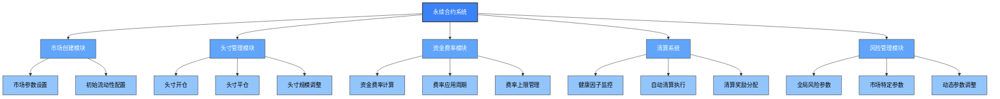
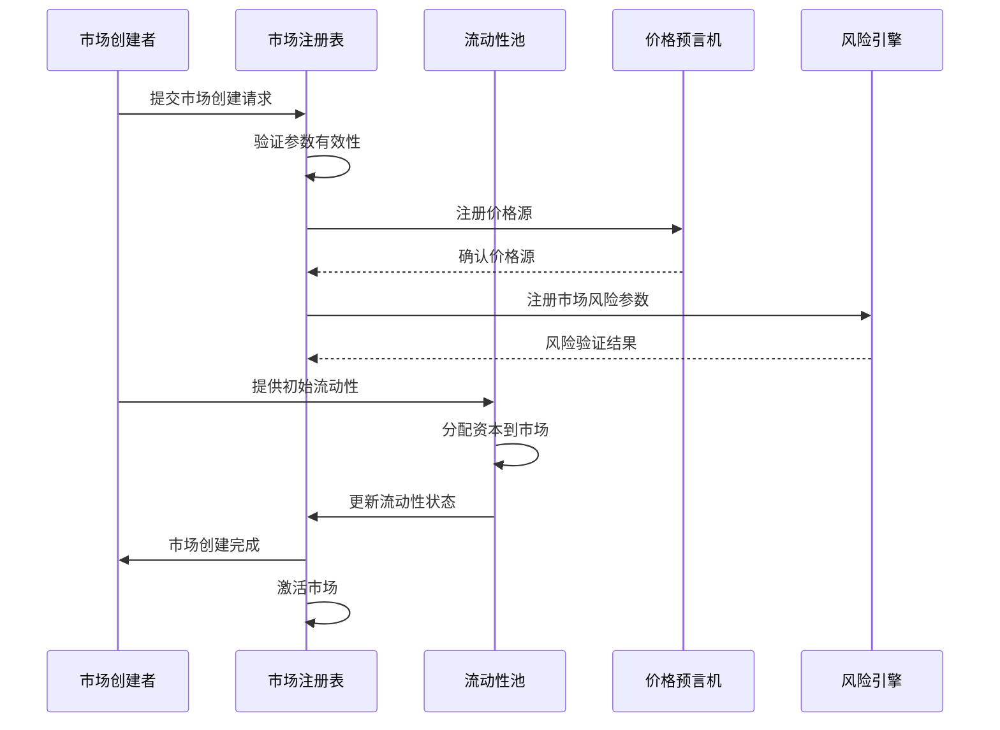
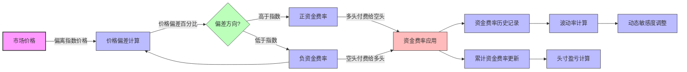
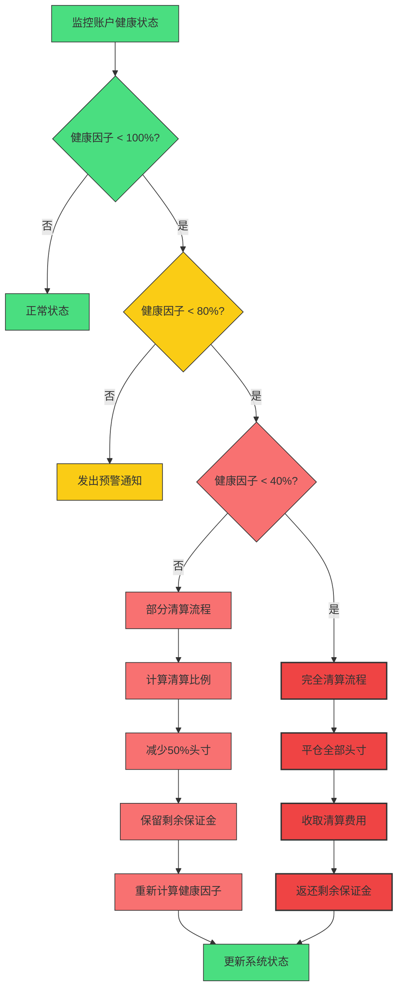

# SynthetixV3永续合约机制分析

## 1. 永续合约架构概述

SynthetixV3的永续合约系统采用创新的模块化设计，通过分离资金费率、保证金管理和结算逻辑，实现了高度灵活和可扩展的永续合约交易平台。



## 2. 永续合约市场创建与配置

### 2.1 市场参数配置

SynthetixV3的永续合约市场通过精细化参数配置，实现高度定制化的合约行为：

```solidity
// 永续合约市场参数定义
struct PerpetualMarketParameters {
    // 基础参数
    address baseAsset;          // 基础资产地址
    string marketSymbol;        // 市场符号
    uint256 minimumPositionSize; // 最小头寸规模
    uint256 maximumPositionSize; // 最大头寸规模
    
    // 费用参数
    uint16 makerFeeRate;        // 挂单方费率 (基点)
    uint16 takerFeeRate;        // 吃单方费率 (基点)
    uint16 liquidationFeeRate;  // 清算费率 (基点)
    
    // 保证金参数
    uint16 initialMarginRatio;  // 初始保证金比例 (基点)
    uint16 maintenanceMarginRatio; // 维持保证金比例 (基点)
    uint16 maxLeverage;         // 最大杠杆倍数
    
    // 资金费率参数
    uint16 fundingRateSensitivity; // 资金费率敏感度
    uint16 maxFundingRate;      // 最大资金费率 (基点)
    uint16 fundingInterval;     // 资金费率结算间隔 (秒)
    
    // 价格源配置
    PriceSourceConfig priceSource; // 价格源配置
    
    // 市场控制参数
    bool isActive;              // 市场活跃状态
    address marketManager;      // 市场管理员
}

// 创建永续合约市场
function createPerpetualMarket(
    PerpetualMarketParameters calldata params
) external onlyMarketManager returns (bytes32 marketId) {
    // 验证参数
    require(params.initialMarginRatio >= params.maintenanceMarginRatio, "初始保证金必须大于等于维持保证金");
    require(params.maxLeverage * params.initialMarginRatio <= 10000, "杠杆与保证金参数不兼容");
    require(params.fundingInterval >= MIN_FUNDING_INTERVAL, "资金费率间隔过短");
    
    // 生成市场ID
    marketId = keccak256(abi.encodePacked(
        "PERP",
        params.baseAsset,
        params.marketSymbol,
        block.timestamp
    ));
    
    // 存储市场参数
    _marketParameters[marketId] = params;
    
    // 初始化市场状态
    _marketState[marketId] = PerpetualMarketState({
        totalLongPositionSize: 0,
        totalShortPositionSize: 0,
        lastFundingTimestamp: block.timestamp,
        cumulativeFundingLong: 0,
        cumulativeFundingShort: 0,
        openInterest: 0,
        marketPrice: 0
    });
    
    // 设置价格源
    _setPriceSource(marketId, params.priceSource);
    
    // 触发市场创建事件
    emit PerpetualMarketCreated(
        marketId,
        params.baseAsset,
        params.marketSymbol,
        params.initialMarginRatio,
        params.maxLeverage,
        params.isActive
    );
    
    return marketId;
}
```

### 2.2 市场流动性配置流程

永续合约的流动性设置过程包括初始定价和流动性分配：



## 3. 永续合约头寸管理

### 3.1 头寸数据结构

```solidity
// 永续合约头寸结构
struct PerpetualPosition {
    // 头寸所有者
    address trader;
    
    // 市场标识符
    bytes32 marketId;
    
    // 头寸大小 (正数表示多头，负数表示空头)
    int256 size;
    
    // 名义价值 (以USD计价)
    uint256 notionalValue;
    
    // 入场价格
    uint256 entryPrice;
    
    // 最后更新时间
    uint256 lastUpdatedTimestamp;
    
    // 已实现盈亏
    int256 realizedPnl;
    
    // 累计资金费率指标 (用于计算资金费用)
    int256 entryFundingIndex;
    
    // 使用的杠杆倍数
    uint16 leverage;
    
    // 分配的保证金
    uint256 margin;
    
    // 锁定保证金 (用于未完成订单)
    uint256 lockedMargin;
}

// 头寸管理器
contract PerpetualPositionManager {
    // 用户在特定市场的头寸
    mapping(address => mapping(bytes32 => PerpetualPosition)) public positions;
    
    // 打开或修改头寸
    function modifyPosition(
        bytes32 marketId,
        int256 sizeDelta,
        uint256 marginDelta,
        bool isIncreasingMargin,
        uint16 desiredLeverage,
        uint256 acceptablePrice
    ) external nonReentrant returns (PerpetualPosition memory newPosition) {
        // 获取当前头寸
        PerpetualPosition memory position = positions[msg.sender][marketId];
        
        // 获取市场参数
        PerpetualMarketParameters memory marketParams = _getMarketParameters(marketId);
        
        // 获取当前市场价格
        uint256 currentPrice = _getPriceAndVerify(marketId);
        
        // 验证价格是否在可接受范围内
        _verifyPriceImpact(currentPrice, acceptablePrice, sizeDelta > 0);
        
        // 计算新头寸参数
        int256 newSize = position.size + sizeDelta;
        
        // 验证头寸大小是否在允许范围内
        require(abs(newSize) >= marketParams.minimumPositionSize || newSize == 0, "头寸规模过小");
        require(abs(newSize) <= marketParams.maximumPositionSize, "头寸规模过大");
        
        // 更新保证金
        uint256 newMargin = position.margin;
        if (isIncreasingMargin) {
            newMargin += marginDelta;
        } else {
            require(marginDelta <= position.margin, "减少的保证金超过当前保证金");
            newMargin -= marginDelta;
        }
        
        // 计算名义价值
        uint256 newNotionalValue = abs(newSize) * currentPrice / 1e18;
        
        // 验证杠杆和保证金
        require(newMargin * desiredLeverage >= newNotionalValue, "保证金不足以支持所需杠杆");
        require(desiredLeverage <= marketParams.maxLeverage, "杠杆超过市场上限");
        
        // 计算新的入场价格 (使用TWAP方式)
        uint256 newEntryPrice;
        if (position.size == 0) {
            newEntryPrice = currentPrice;
        } else if (newSize == 0) {
            newEntryPrice = 0; // 平仓
        } else {
            // 计算加权平均入场价格
            newEntryPrice = _calculateWeightedEntryPrice(
                position.size,
                position.entryPrice,
                sizeDelta,
                currentPrice,
                newSize
            );
        }
        
        // 计算实现的盈亏 (如果有平仓)
        int256 realizedPnl = 0;
        if (sizeDelta * position.size < 0) { // 方向相反，表示部分或全部平仓
            realizedPnl = _calculateRealizedPnl(
                position.size,
                position.entryPrice,
                sizeDelta,
                currentPrice
            );
            position.realizedPnl += realizedPnl;
        }
        
        // 更新头寸数据
        position.size = newSize;
        position.notionalValue = newNotionalValue;
        position.entryPrice = newEntryPrice;
        position.margin = newMargin;
        position.leverage = desiredLeverage;
        position.lastUpdatedTimestamp = block.timestamp;
        
        // 如果是新头寸，更新入场资金费率指标
        if (position.size == 0 && newSize != 0) {
            position.entryFundingIndex = _getCurrentFundingIndex(marketId, newSize > 0);
        }
        
        // 存储更新后的头寸
        positions[msg.sender][marketId] = position;
        
        // 更新市场聚合数据
        _updateMarketAggregates(marketId, position.size, newSize);
        
        // 触发头寸更新事件
        emit PositionModified(
            msg.sender,
            marketId,
            newSize,
            newMargin,
            newEntryPrice,
            realizedPnl
        );
        
        return position;
    }
}
```

### 3.2 头寸生命周期

永续合约头寸的完整生命周期流程：

```mermaid
graph TD
    A[交易者] --> B[提交头寸请求]
    B --> C{有现有头寸?}
    
    C -->|是| D[修改现有头寸]
    C -->|否| E[创建新头寸]
    
    D --> D1[增加规模]
    D --> D2[减少规模]
    D --> D3[调整杠杆]
    D --> D4[添加保证金]
    D --> D5[移除保证金]
    
    E --> E1[初始化头寸状态]
    E --> E2[验证初始保证金]
    E --> E3[记录入场价格]
    
    D1 --> F[更新市场风险暴露]
    D2 --> F
    E3 --> F
    
    F --> G[计算资金费率影响]
    G --> H[更新头寸账户]
    
    H --> I[正常持有]
    H --> J[触发清算]
    
    I --> K[主动平仓]
    I --> L[收取/支付资金费率]
    I --> M[调整头寸参数]
    
    J --> N[清算处理]
    K --> O[平仓结算]
    N --> O
    
    O --> P[计算最终PnL]
    P --> Q[清算头寸状态]
    
    classDef start fill:#4ade80,stroke:#333,stroke-width:2px
    classDef decision fill:#60a5fa,color:#fff,stroke:#333,stroke-width:1px
    classDef action fill:#93c5fd,color:#000,stroke:#333,stroke-width:1px
    classDef end fill:#f87171,stroke:#333,stroke-width:1px
    
    class A start
    class C decision
    class D1,D2,D3,D4,D5,E1,E2,E3,F,G,H,L,M action
    class K,N,O,P,Q end
```

## 4. 永续合约资金费率机制

### 4.1 资金费率计算

SynthetixV3的永续合约采用创新的资金费率计算机制，确保市场价格与指数价格保持一致：

```solidity
// 资金费率模块
contract PerpetualFundingModule {
    // 市场资金费率状态
    struct FundingState {
        // 上次资金费率结算时间
        uint256 lastFundingTime;
        
        // 累计多头资金费率
        int256 cumulativeFundingLong;
        
        // 累计空头资金费率
        int256 cumulativeFundingShort;
        
        // 当前资金费率
        int256 currentFundingRate;
        
        // 最近8小时资金费率历史
        int256[8] fundingRateHistory;
        
        // 历史索引
        uint8 historyIndex;
    }
    
    // 市场资金费率配置
    struct FundingConfig {
        // 资金费率灵敏度
        uint16 sensitivity;
        
        // 最大资金费率 (基点，如500表示5%)
        uint16 maxRate;
        
        // 资金费率结算间隔 (秒)
        uint32 fundingInterval;
        
        // 价格偏差衰减因子 (每小时)
        uint16 decayFactor;
    }
    
    // 市场ID到资金状态的映射
    mapping(bytes32 => FundingState) private _fundingStates;
    
    // 市场ID到资金配置的映射
    mapping(bytes32 => FundingConfig) private _fundingConfigs;
    
    // 计算当前资金费率
    function calculateFundingRate(bytes32 marketId) public view returns (int256 fundingRate) {
        // 获取市场配置
        FundingConfig memory config = _fundingConfigs[marketId];
        
        // 获取市场价格和指数价格
        uint256 marketPrice = getMarketPrice(marketId);
        uint256 indexPrice = getIndexPrice(marketId);
        
        // 计算价格偏差百分比 (基点)
        int256 priceDelta = int256(marketPrice) - int256(indexPrice);
        int256 priceDeviationPercent = (priceDelta * 10000) / int256(indexPrice);
        
        // 应用灵敏度因子
        fundingRate = (priceDeviationPercent * int256(config.sensitivity)) / 10000;
        
        // 限制在最大费率范围内
        int256 maxRate = int256(config.maxRate);
        if (fundingRate > maxRate) {
            fundingRate = maxRate;
        } else if (fundingRate < -maxRate) {
            fundingRate = -maxRate;
        }
        
        return fundingRate;
    }
    
    // 执行资金费率结算
    function applyFunding(bytes32 marketId) public returns (int256 appliedRate) {
        FundingState storage state = _fundingStates[marketId];
        FundingConfig memory config = _fundingConfigs[marketId];
        
        // 检查是否到达结算时间
        require(
            block.timestamp >= state.lastFundingTime + config.fundingInterval,
            "资金费率结算时间未到"
        );
        
        // 计算当前资金费率
        int256 currentRate = calculateFundingRate(marketId);
        
        // 计算应用的费率 (按时间比例)
        uint256 timeDelta = block.timestamp - state.lastFundingTime;
        int256 proRatedFunding = (currentRate * int256(timeDelta)) / int256(config.fundingInterval);
        
        // 更新累计资金费率
        state.cumulativeFundingLong += proRatedFunding;
        state.cumulativeFundingShort -= proRatedFunding;
        
        // 更新资金费率历史
        state.fundingRateHistory[state.historyIndex] = currentRate;
        state.historyIndex = (state.historyIndex + 1) % 8;
        
        // 更新状态
        state.lastFundingTime = block.timestamp;
        state.currentFundingRate = currentRate;
        
        // 触发资金费率更新事件
        emit FundingUpdated(
            marketId,
            currentRate,
            proRatedFunding,
            state.cumulativeFundingLong,
            state.cumulativeFundingShort
        );
        
        return proRatedFunding;
    }
    
    // 计算头寸的资金费用
    function calculateFundingFee(
        bytes32 marketId,
        int256 positionSize,
        int256 entryFundingIndex
    ) public view returns (int256 fundingFee) {
        // 获取当前累计资金指标
        int256 currentIndex = positionSize > 0 ? 
                             _fundingStates[marketId].cumulativeFundingLong : 
                             _fundingStates[marketId].cumulativeFundingShort;
        
        // 计算从头寸创建以来的累计资金费率变化
        int256 fundingDelta = currentIndex - entryFundingIndex;
        
        // 计算头寸应付的资金费用
        fundingFee = (abs(positionSize) * fundingDelta) / 1e18;
        
        // 多头支付正费率，空头支付负费率
        if (positionSize < 0) {
            fundingFee = -fundingFee;
        }
        
        return fundingFee;
    }
}
```

### 4.2 资金费率动态调整



## 5. 永续合约清算系统

### 5.1 清算流程

```solidity
// 清算管理器
contract PerpetualLiquidationManager {
    // 检查头寸是否可清算
    function isLiquidatable(address trader, bytes32 marketId) public view returns (bool) {
        // 获取头寸
        PerpetualPosition memory position = getPosition(trader, marketId);
        
        // 空头寸不需要清算
        if (position.size == 0) return false;
        
        // 获取市场参数
        PerpetualMarketParameters memory params = getMarketParameters(marketId);
        
        // 计算当前名义价值
        uint256 currentPrice = getMarkPrice(marketId);
        uint256 currentNotional = abs(position.size) * currentPrice / 1e18;
        
        // 计算未实现盈亏
        int256 unrealizedPnl = calculateUnrealizedPnl(
            position.size,
            position.entryPrice,
            currentPrice
        );
        
        // 计算累计资金费用
        int256 fundingFee = calculateAccumulatedFunding(
            marketId,
            position.size,
            position.entryFundingIndex
        );
        
        // 计算有效保证金 (保证金 + 未实现盈亏 - 资金费用)
        int256 effectiveMargin = int256(position.margin) + unrealizedPnl - fundingFee;
        
        // 如果有效保证金为负，直接清算
        if (effectiveMargin <= 0) return true;
        
        // 计算所需的维持保证金
        uint256 maintenanceMargin = (currentNotional * params.maintenanceMarginRatio) / 10000;
        
        // 如果有效保证金低于维持保证金，可以清算
        return uint256(effectiveMargin) < maintenanceMargin;
    }
    
    // 执行清算
    function liquidatePosition(
        address trader,
        bytes32 marketId
    ) external nonReentrant returns (
        uint256 liquidationPrice,
        uint256 liquidatorFee,
        int256 pnl
    ) {
        // 验证头寸是否可清算
        require(isLiquidatable(trader, marketId), "头寸不满足清算条件");
        
        // 获取头寸
        PerpetualPosition memory position = getPosition(trader, marketId);
        
        // 获取市场参数
        PerpetualMarketParameters memory params = getMarketParameters(marketId);
        
        // 获取清算价格
        liquidationPrice = getMarkPrice(marketId);
        
        // 计算清算费用
        liquidatorFee = (position.notionalValue * params.liquidationFeeRate) / 10000;
        
        // 确保清算费不超过剩余保证金
        uint256 maxFee = position.margin / 2; // 最多使用一半保证金作为清算费
        if (liquidatorFee > maxFee) {
            liquidatorFee = maxFee;
        }
        
        // 计算头寸平仓盈亏
        pnl = calculateRealizedPnl(
            position.size,
            position.entryPrice,
            -position.size, // 全部平仓
            liquidationPrice
        );
        
        // 计算资金费用
        int256 fundingFee = calculateAccumulatedFunding(
            marketId,
            position.size,
            position.entryFundingIndex
        );
        
        // 计算交易者最终余额
        int256 finalBalance = int256(position.margin) + pnl - fundingFee - int256(liquidatorFee);
        
        // 如果余额为正，将剩余保证金返还给交易者
        if (finalBalance > 0) {
            transferMargin(trader, uint256(finalBalance));
        }
        
        // 支付清算者奖励
        transferMargin(msg.sender, liquidatorFee);
        
        // 更新市场聚合数据
        updateMarketAggregates(marketId, position.size, 0);
        
        // 删除头寸
        deletePosition(trader, marketId);
        
        // 触发清算事件
        emit PositionLiquidated(
            trader,
            marketId,
            position.size,
            liquidationPrice,
            liquidatorFee,
            pnl,
            msg.sender
        );
        
        return (liquidationPrice, liquidatorFee, pnl);
    }
}
```

### 5.2 部分清算机制

SynthetixV3的永续合约创新性地引入了部分清算机制，在特定条件下对头寸进行部分而非全部清算，提高资本效率：



## 6. 与传统永续合约的比较

SynthetixV3的永续合约与中心化及其他去中心化平台的比较：

| 特性 | 中心化交易所 | 其他DEX | SynthetixV3 |
|-----|------------|--------|------------|
| 资金费率频率 | 每8小时 | 每1-8小时 | 可动态配置 (最低1小时) |
| 清算机制 | 全额清算 | 全额清算 | 支持部分清算 |
| 杠杆灵活性 | 高度灵活 | 有限可调 | 动态调整，市场特定 |
| 价格馈送 | 中心化预言机 | 去中心化预言机 | 混合预言机+订单簿价格 |
| 滑点控制 | 完善 | 有限 | 先进的滑点保护 |
| Gas优化 | 不适用 | 有限 | L2专用优化 |
| 交易成本 | 低 (费率) | 高 (Gas) | 低 (L2优化) |
| 保证金类型 | 多种资产 | 有限资产 | 多种合成资产 |
| 流动性来源 | 中心化做市 | AMM/订单簿混合 | 创新的混合流动性系统 |

## 7. 主要创新点

SynthetixV3永续合约系统的核心创新：

1. **模块化风险参数** - 每个市场的风险参数可单独调整，实现精细化风险管理
2. **动态资金费率** - 资金费率敏感度根据市场波动性自动调整
3. **分级清算系统** - 多级健康因子阈值，支持部分清算，减少市场冲击
4. **混合价格发现** - 结合订单簿和预言机价格，提高抗操纵性
5. **L2优化设计** - 专为Layer 2环境优化的低Gas交易和频繁更新机制

## 8. 未来发展方向

SynthetixV3永续合约系统的未来发展路线：

1. **多抵押品支持** - 支持使用多种抵押品类型来保证永续合约头寸
2. **交叉保证金系统** - 实现跨市场的保证金效率优化
3. **自动对冲机制** - 智能风险对冲系统，优化协议自身风险敞口
4. **先进订单类型** - 支持更复杂的条件单和策略单
5. **流动性挖矿整合** - 为永续合约做市商提供额外激励

## 总结

SynthetixV3的永续合约系统通过创新的模块化设计、先进的资金费率机制和独特的风险管理功能，为去中心化衍生品交易提供了全新解决方案。与传统永续合约相比，其在资本效率、风险管理和用户体验方面都提供了显著改进，为DeFi生态系统的衍生品市场发展做出了重要贡献。通过在Layer 2网络上的优化实现，SynthetixV3永续合约在交易成本和执行效率上与中心化交易所相媲美，同时保持了去中心化的安全性和透明度。 