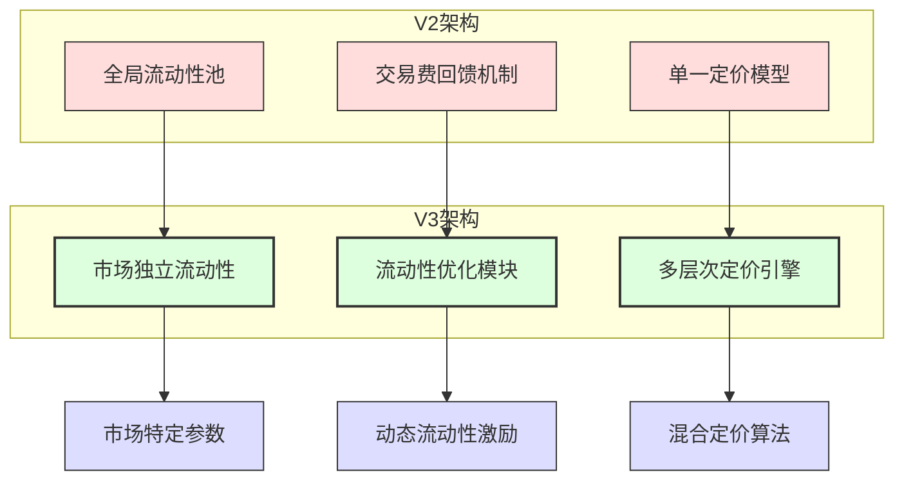
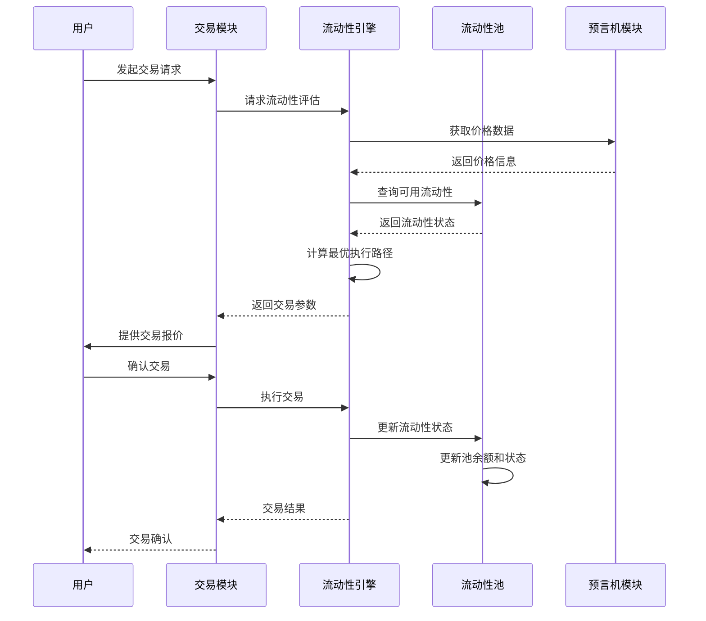
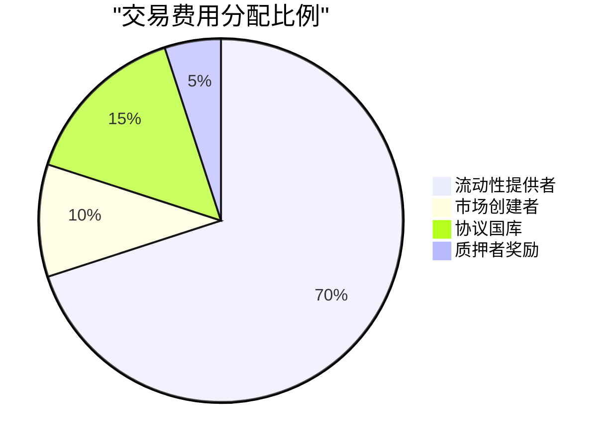
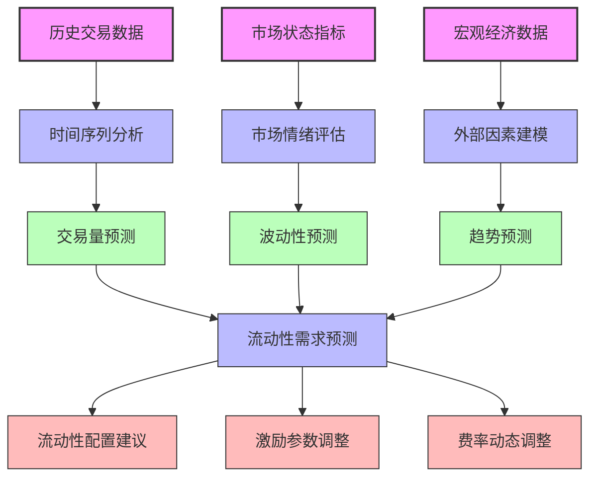
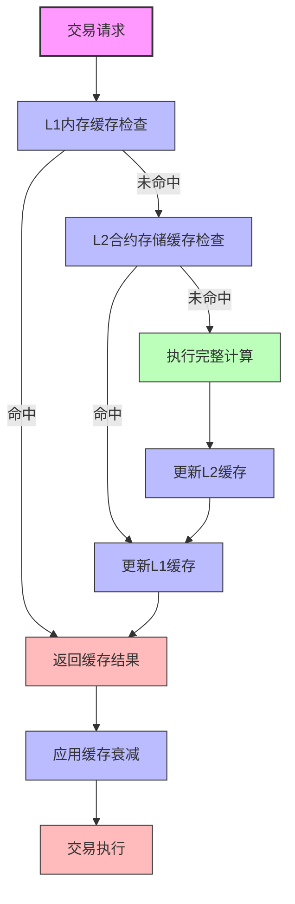

# SynthetixV3 流动性引擎与交易系统分析

## 1. 流动性架构概述

SynthetixV3彻底重构了交易和流动性管理系统，从V2的合成资产互换模型转变为更灵活、更高效的模块化流动性引擎。新架构极大提升了资本效率和交易体验，同时支持更复杂的交易类型和市场结构。

### 1.1 流动性架构演进



## 2. 多层次流动性池设计

### 2.1 流动性池类型与结构

SynthetixV3实现了多种流动性池类型，满足不同资产类别和交易场景的需求：

```solidity
// 流动性池基础结构
struct LiquidityPool {
    // 池ID
    uint128 poolId;
    
    // 池类型
    PoolType poolType;
    
    // 支持的资产列表
    address[] supportedAssets;
    
    // 池配置参数
    PoolParameters params;
    
    // 流动性提供者份额
    mapping(address => uint256) providerShares;
    
    // 总流动性价值
    uint256 totalLiquidity;
    
    // 流动性利用率
    uint256 utilizationRate;
    
    // 流动性激励配置
    IncentiveConfig incentives;
}

// 池类型枚举
enum PoolType {
    SPOT_POOL,        // 现货交易池
    PERPETUAL_POOL,   // 永续合约池
    STABLE_POOL,      // 稳定币池
    HYBRID_POOL,      // 混合资产池
    INDEX_POOL        // 指数资产池
}
```

### 2.2 流动性池交互流程

流动性池与交易系统的交互流程展示了V3系统的高度模块化：



## 3. 流动性优化算法

### 3.1 流动性分配机制

SynthetixV3采用先进的流动性分配算法，以最大化资本效率和降低交易成本：

```solidity
// 流动性分配优化
function optimizeLiquidityAllocation(
    uint128[] memory poolIds,
    address[] memory assets,
    uint256[] memory volumeProjections
) external onlyLiquidityManager returns (uint256[] memory allocations) {
    allocations = new uint256[](poolIds.length);
    
    // 获取池信息
    PoolInfo[] memory pools = new PoolInfo[](poolIds.length);
    for (uint256 i = 0; i < poolIds.length; i++) {
        pools[i] = getPoolInfo(poolIds[i]);
    }
    
    // 计算资产波动性和相关性
    uint256[][] memory assetVolatilities = calculateVolatilityMatrix(assets);
    
    // 计算交易量预测权重
    uint256[] memory volumeWeights = normalizeVolumeWeights(volumeProjections);
    
    // 执行优化算法
    for (uint256 i = 0; i < poolIds.length; i++) {
        // 池基础权重
        uint256 baseWeight = pools[i].baseAllocationWeight;
        
        // 交易量调整
        uint256 volumeAdjustment = calculateVolumeAdjustment(pools[i], volumeWeights);
        
        // 波动性调整
        uint256 volatilityAdjustment = calculateVolatilityAdjustment(
            pools[i],
            assetVolatilities,
            assets
        );
        
        // 利用率调整
        uint256 utilizationAdjustment = calculateUtilizationAdjustment(pools[i]);
        
        // 计算最终分配权重
        allocations[i] = baseWeight;
        allocations[i] = applyAdjustment(allocations[i], volumeAdjustment);
        allocations[i] = applyAdjustment(allocations[i], volatilityAdjustment);
        allocations[i] = applyAdjustment(allocations[i], utilizationAdjustment);
    }
    
    // 归一化分配比例
    normalizeAllocations(allocations);
    
    return allocations;
}
```

### 3.2 动态流动性激励

V3实现了基于市场条件的动态流动性激励机制，吸引流动性提供者到最需要的市场：

| 流动性指标 | 激励调整机制 | 目标效果 | 动态范围 |
|-----------|------------|---------|---------|
| 利用率过高 | 提高流动性提供奖励 | 吸引更多流动性 | +10% 至 +100% |
| 利用率过低 | 降低流动性提供奖励 | 减少过剩流动性 | -5% 至 -50% |
| 价格波动高 | 提高波动性奖励 | 稳定价格波动 | +5% 至 +80% |
| 交易量提升 | 提高交易量奖励比例 | 奖励高交易量市场 | +10% 至 +60% |
| 新市场培养 | 设置初始激励倍数 | 快速吸引流动性 | 1.5x 至 3x |

## 4. 混合交易执行系统

### 4.1 交易执行流程

SynthetixV3的混合交易执行系统结合了多种执行策略，实现最优价格发现和执行效率：

```mermaid
graph TD
    A[交易请求] --> B{流动性类型?}
    
    B -->|内部流动性| C[价格计算]
    B -->|外部DEX| D[聚合路由]
    B -->|混合流动性| E[分割执行]
    
    C --> F{价格影响评估}
    D --> G[最优路径选择]
    E --> H[执行比例优化]
    
    F -->|可接受| I[内部执行]
    F -->|过高| J[寻找替代路径]
    G --> K[路由分析]
    H --> L[跨池拆分执行]
    
    I --> M[完成交易]
    J --> D
    K --> M
    L --> M
    
    classDef start fill:#f9f,stroke:#333,stroke-width:2px
    classDef decision fill:#bbf,stroke:#333,stroke-width:1px
    classDef process fill:#bfb,stroke:#333,stroke-width:1px
    classDef end fill:#fbb,stroke:#333,stroke-width:1px
    
    class A start
    class B,F decision
    class C,D,E,G,H,I,J,K,L process
    class M end
```

### 4.2 价格影响算法

V3采用精细的价格影响模型，根据交易规模、流动性深度和市场条件计算最优执行价格：

```solidity
// 价格影响计算
function calculatePriceImpact(
    address assetIn,
    address assetOut,
    uint256 amountIn,
    uint128 poolId
) public view returns (uint256 priceImpact) {
    // 获取基础定价
    uint256 basePrice = getBasePrice(assetIn, assetOut);
    
    // 获取池流动性数据
    PoolLiquidityData memory poolData = getPoolLiquidity(poolId, assetIn, assetOut);
    
    // 计算有效流动性深度
    uint256 effectiveDepth = calculateEffectiveDepth(poolData);
    
    // 流动性敏感系数
    uint256 liquiditySensitivity = calculateSensitivity(poolData);
    
    // 非线性价格影响曲线
    // 小额交易几乎没有影响，大额交易影响迅速增加
    if (amountIn <= effectiveDepth / 100) {
        // 微小交易，最小影响
        priceImpact = amountIn * MIN_IMPACT_FACTOR / effectiveDepth;
    } else if (amountIn <= effectiveDepth / 10) {
        // 小额交易，线性影响
        priceImpact = amountIn * LINEAR_IMPACT_FACTOR / effectiveDepth;
    } else if (amountIn <= effectiveDepth / 2) {
        // 中额交易，二次曲线影响
        uint256 scaled = (amountIn * PRECISION) / effectiveDepth;
        priceImpact = (scaled * scaled) * QUADRATIC_IMPACT_FACTOR / PRECISION;
    } else {
        // 大额交易，指数曲线影响
        uint256 scaled = (amountIn * PRECISION) / effectiveDepth;
        priceImpact = exponentialImpact(scaled, liquiditySensitivity);
    }
    
    return priceImpact;
}
```

## 5. 交易费用与收益分配

### 5.1 多层次费用结构

SynthetixV3实现了复杂的多层次费用结构，以平衡交易成本、流动性提供激励和协议收益：

```solidity
// 交易费计算
function calculateTradingFees(
    address assetIn,
    address assetOut,
    uint256 amountIn,
    uint128 poolId,
    address trader
) public view returns (
    uint256 totalFee,
    uint256 liquidityProviderFee,
    uint256 marketFee,
    uint256 protocolFee
) {
    // 获取基础费率
    uint256 baseFeeRate = getBaseFeeRate(poolId);
    
    // 获取资产特定费率调整
    uint256 assetFeeAdjustment = getAssetFeeAdjustment(assetIn, assetOut);
    
    // 获取市场状态费率调整
    uint256 marketConditionAdjustment = getMarketConditionAdjustment(assetIn, assetOut);
    
    // 获取用户特定费率调整（交易量折扣等）
    uint256 userDiscountRate = getUserFeeDiscount(trader);
    
    // 计算调整后的费率
    uint256 adjustedFeeRate = baseFeeRate;
    adjustedFeeRate = applyAdjustment(adjustedFeeRate, assetFeeAdjustment);
    adjustedFeeRate = applyAdjustment(adjustedFeeRate, marketConditionAdjustment);
    
    // 应用用户折扣
    adjustedFeeRate = (adjustedFeeRate * (FEE_PRECISION - userDiscountRate)) / FEE_PRECISION;
    
    // 计算总费用
    totalFee = (amountIn * adjustedFeeRate) / FEE_PRECISION;
    
    // 分配费用
    liquidityProviderFee = (totalFee * getPoolLPShare(poolId)) / FEE_PRECISION;
    marketFee = (totalFee * getMarketFeeShare(poolId)) / FEE_PRECISION;
    protocolFee = totalFee - liquidityProviderFee - marketFee;
    
    return (totalFee, liquidityProviderFee, marketFee, protocolFee);
}
```

### 5.2 费用分配流程

以下是V3系统中交易费用的分配流程，展示了费用如何在不同利益相关者之间分配：



## 6. 高级交易功能

### 6.1 智能订单路由

SynthetixV3实现了智能订单路由系统，自动寻找最优执行路径：

```solidity
// 智能订单路由
function findOptimalRoute(
    address assetIn,
    address assetOut,
    uint256 amountIn,
    uint256 minAmountOut
) public view returns (
    RouteInfo memory bestRoute,
    uint256 expectedOutput
) {
    // 获取所有支持的池
    uint128[] memory eligiblePools = getEligiblePools(assetIn, assetOut);
    
    // 初始化最佳路径
    expectedOutput = 0;
    
    // 评估直接路径
    for (uint256 i = 0; i < eligiblePools.length; i++) {
        uint128 poolId = eligiblePools[i];
        
        // 获取池交易报价
        (uint256 outputAmount, uint256 fee) = getPoolQuote(poolId, assetIn, assetOut, amountIn);
        
        // 更新最佳路径
        if (outputAmount > expectedOutput) {
            expectedOutput = outputAmount;
            bestRoute = RouteInfo({
                routeType: RouteType.DIRECT,
                pools: new uint128[](1),
                splitRatios: new uint256[](1),
                intermediateAssets: new address[](0)
            });
            bestRoute.pools[0] = poolId;
            bestRoute.splitRatios[0] = FULL_PERCENT;
        }
    }
    
    // 评估拆分路径（跨多个池）
    if (eligiblePools.length >= 2) {
        bestRoute = findBestSplitRoute(assetIn, assetOut, amountIn, eligiblePools, bestRoute, expectedOutput);
    }
    
    // 评估中间资产路径（使用中间资产）
    address[] memory bridgingAssets = getPotentialBridgingAssets(assetIn, assetOut);
    if (bridgingAssets.length > 0) {
        bestRoute = findBestBridgingRoute(assetIn, assetOut, amountIn, bridgingAssets, bestRoute, expectedOutput);
    }
    
    return (bestRoute, expectedOutput);
}
```

### 6.2 交易类型支持

V3支持多种高级交易类型，满足不同交易需求：

| 交易类型 | 实现机制 | 优势 | 用例 |
|---------|---------|------|------|
| 限价订单 | 链上条件执行 | 价格保证 | 设定目标价格交易 |
| 止损订单 | 价格触发执行 | 风险管理 | 限制潜在损失 |
| TWAP执行 | 时间加权平均执行 | 减少价格影响 | 大额订单分批执行 |
| 闪电交换 | 单一交易批量执行 | 无滑点套利 | 复杂交易策略 |
| 组合订单 | 多资产同时交易 | 一步到位 | 投资组合再平衡 |

## 7. 流动性分析和优化工具

### 7.1 流动性健康指标

SynthetixV3开发了一套全面的流动性健康指标体系，用于监测和优化系统流动性：

```solidity
// 流动性健康评估
function assessLiquidityHealth(uint128 poolId) public view returns (
    uint256 healthScore,
    uint256 utilizationScore,
    uint256 depthScore,
    uint256 volatilityScore,
    uint256 resilienceScore
) {
    // 获取池数据
    PoolData memory pool = getPoolData(poolId);
    
    // 计算利用率得分 (优化区间: 30-70%)
    uint256 utilization = pool.utilizedLiquidity * 100 / pool.totalLiquidity;
    if (utilization < 30) {
        utilizationScore = 50 + (utilization * 50 / 30);
    } else if (utilization <= 70) {
        utilizationScore = 100;
    } else if (utilization <= 90) {
        utilizationScore = 100 - ((utilization - 70) * 80 / 20);
    } else {
        utilizationScore = 20 - ((utilization - 90) * 20 / 10);
        utilizationScore = utilizationScore > 0 ? utilizationScore : 0;
    }
    
    // 计算深度得分
    depthScore = calculateDepthScore(pool);
    
    // 计算波动性得分
    volatilityScore = calculateVolatilityScore(pool);
    
    // 计算弹性得分
    resilienceScore = calculateResilienceScore(pool);
    
    // 计算综合健康得分
    healthScore = (
        utilizationScore * UTILIZATION_WEIGHT +
        depthScore * DEPTH_WEIGHT +
        volatilityScore * VOLATILITY_WEIGHT +
        resilienceScore * RESILIENCE_WEIGHT
    ) / TOTAL_WEIGHT;
    
    return (healthScore, utilizationScore, depthScore, volatilityScore, resilienceScore);
}
```

### 7.2 流动性预测模型

V3引入了先进的流动性预测模型，帮助优化流动性分配和激励：



## 8. 与外部流动性集成

### 8.1 DEX聚合器集成

SynthetixV3设计了与外部DEX流动性的集成机制，大幅增强了整体流动性深度：

```solidity
// DEX集成接口
interface IExternalDEXIntegration {
    // 获取外部DEX报价
    function getExternalQuote(
        address assetIn,
        address assetOut,
        uint256 amountIn,
        address[] calldata dexList
    ) external view returns (
        uint256 bestAmountOut,
        address bestDex,
        bytes memory executionData
    );
    
    // 执行外部DEX交易
    function executeExternalSwap(
        address assetIn,
        address assetOut,
        uint256 amountIn,
        uint256 minAmountOut,
        address dex,
        bytes calldata executionData
    ) external returns (uint256 amountOut);
    
    // 获取流动性分析
    function analyzeExternalLiquidity(
        address assetIn,
        address assetOut,
        address[] calldata dexList
    ) external view returns (
        uint256[] memory depthLevels,
        uint256[] memory prices
    );
}
```

### 8.2 混合流动性策略

V3实现了创新的混合流动性策略，结合内部和外部流动性实现最佳执行效果：

| 策略类型 | 应用场景 | 实现机制 | 优势 |
|---------|---------|---------|------|
| 阈值路由 | 大额交易 | 超过阈值部分使用外部DEX | 减少价格影响 |
| 价格优先 | 所有交易 | 自动选择最优价格路径 | 最佳执行价格 |
| 深度优先 | 流动性紧缺 | 基于实时深度分析路由 | 确保订单完成 |
| 费用优先 | 小额交易 | 优先考虑低费用路径 | 降低交易成本 |
| 混合执行 | 复杂订单 | 同时使用多种流动性来源 | 最优整体效果 |

## 9. 性能与Gas优化

### 9.1 Gas优化技术

SynthetixV3在交易执行中实施了多种Gas优化技术：

```solidity
// Gas优化的交易执行
function executeOptimizedSwap(
    address assetIn,
    address assetOut,
    uint256 amountIn,
    uint256 minAmountOut,
    bytes calldata routeData
) external nonReentrant returns (uint256 amountOut) {
    // 解析路由数据 (使用紧凑编码以节省gas)
    (RouteType routeType, bytes memory routeParams) = abi.decode(routeData, (RouteType, bytes));
    
    // 转入资产
    IERC20(assetIn).safeTransferFrom(msg.sender, address(this), amountIn);
    
    // 根据路由类型执行不同优化策略
    if (routeType == RouteType.DIRECT) {
        // 直接交换 - 最低gas成本
        amountOut = executeDirect(assetIn, assetOut, amountIn, routeParams);
    } else if (routeType == RouteType.SPLIT) {
        // 拆分交换 - 批量执行优化
        amountOut = executeSplit(assetIn, assetOut, amountIn, routeParams);
    } else if (routeType == RouteType.BRIDGE) {
        // 桥接交换 - 中间资产优化
        amountOut = executeBridge(assetIn, assetOut, amountIn, routeParams);
    } else {
        revert("Invalid route type");
    }
    
    // 验证最小输出
    require(amountOut >= minAmountOut, "Insufficient output amount");
    
    // 转出资产
    IERC20(assetOut).safeTransfer(msg.sender, amountOut);
    
    emit SwapExecuted(msg.sender, assetIn, assetOut, amountIn, amountOut, routeType);
    
    return amountOut;
}

// 实施 EIP-2929 访问列表优化
function addEIP2929AccessList(address[] memory accounts, address[] memory storageContracts)
    internal view returns (AccessList memory accessList)
{
    // 生成访问列表以减少gas成本
    // ...实现细节
}
```

### 9.2 多层缓存策略

V3实现了多层缓存策略，显著提升交易执行效率：



## 10. 与V2比较与未来发展

### 10.1 流动性系统比较

| 特性 | V2流动性系统 | V3流动性引擎 | 改进效益 |
|------|------------|------------|---------|
| 流动性隔离 | 全局共享流动性 | 市场独立流动性 | 风险隔离、资本效率提升 |
| 定价机制 | 固定曲线定价 | 多模型混合定价 | 更精确的价格发现 |
| 交易类型 | 基础互换 | 多种高级交易类型 | 更强的交易灵活性 |
| 流动性激励 | 静态激励 | 动态市场驱动激励 | 更高的资本配置效率 |
| 执行效率 | 中等 | 高（多优化） | 降低Gas成本、提高吞吐量 |
| 外部集成 | 有限 | 全面集成 | 更深的流动性、更好的执行 |
| 自定义能力 | 有限 | 高度可定制 | 支持更多资产类型和策略 |

### 10.2 未来发展方向

V3流动性引擎的模块化设计为未来扩展奠定了基础：

1. **Layer 2扩展**：针对不同L2网络优化的专用流动性引擎
2. **自动做市算法**：高级算法做市系统，动态调整池参数
3. **跨链流动性桥接**：实现跨链流动性无缝共享和优化
4. **定制化市场**：支持特定行业或资产类别的专用流动性配置
5. **流动性即服务**：为其他DeFi协议提供流动性基础设施

## 总结

SynthetixV3的流动性引擎与交易系统代表了DeFi交易基础设施的重大进步，从传统的单一流动性池模型转变为高度模块化、可定制的流动性管理系统。通过市场隔离、动态激励、智能路由和高效执行等创新，V3大幅提升了资本效率、交易体验和系统扩展性。这一架构不仅解决了V2中的核心限制，还为SynthetixV3生态系统提供了强大的交易基础设施，支持更多资产类型和复杂交易策略的开发。 