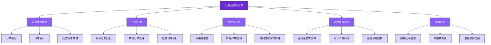
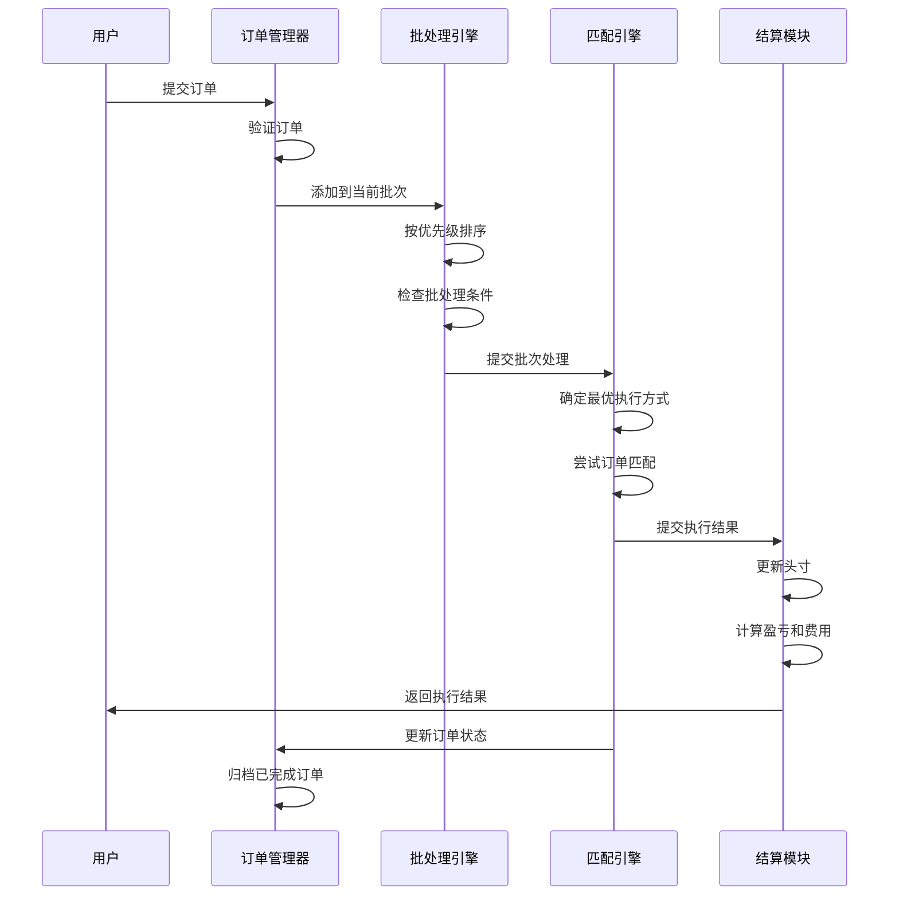
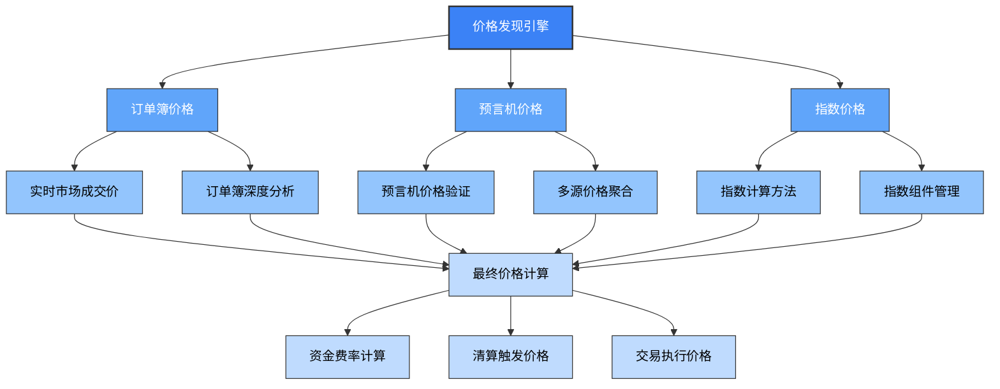
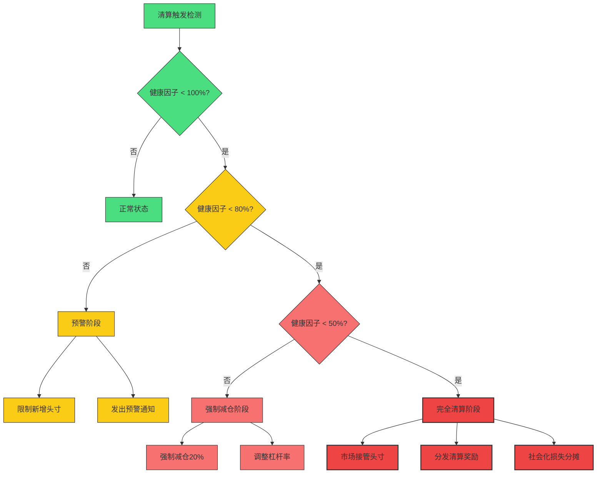

# SynthetixV3衍生品交易引擎分析

## 1. 交易引擎架构概述

SynthetixV3采用了全新设计的衍生品交易引擎，通过模块化设计和高效的订单匹配算法，显著提升了交易处理能力和用户体验。该引擎支持多种衍生品类型，包括永续合约、期权和合成资产交易。



## 2. 高效订单处理机制

### 2.1 订单类型与结构

SynthetixV3衍生品交易引擎支持多种订单类型，通过统一的订单结构实现高效处理：

```solidity
// 订单结构定义
struct Order {
    // 订单标识符
    bytes32 orderId;
    
    // 订单创建者
    address trader;
    
    // 市场标识符
    bytes32 marketId;
    
    // 订单类型
    OrderType orderType;
    
    // 订单方向 (做多/做空)
    Direction direction;
    
    // 订单大小
    uint256 size;
    
    // 价格数据 (取决于订单类型)
    uint256 price;
    
    // 触发价格 (用于条件订单)
    uint256 triggerPrice;
    
    // 执行参数
    ExecutionParams executionParams;
    
    // 订单状态
    OrderStatus status;
    
    // 订单填充量
    uint256 filledAmount;
    
    // 时间参数
    uint256 createdAt;
    uint256 expiresAt;
    uint256 lastUpdatedAt;
}

// 订单类型枚举
enum OrderType {
    MARKET,          // 市价订单
    LIMIT,           // 限价订单
    STOP_MARKET,     // 止损市价
    STOP_LIMIT,      // 止损限价
    TAKE_PROFIT,     // 止盈订单
    TRAILING_STOP,   // 跟踪止损
    CONDITIONAL      // 条件订单
}

// 执行参数
struct ExecutionParams {
    // 滑点容忍度 (基点)
    uint256 slippageTolerance;
    
    // 执行过期时间
    uint256 executionExpiry;
    
    // 最大执行费用
    uint256 maxExecutionFee;
    
    // 部分填充设置
    bool allowPartialFills;
    
    // 后续订单设置
    bool hasFollowUp;
    bytes32 followUpOrderId;
}
```

### 2.2 批量订单处理流程

交易引擎通过批量处理机制高效处理大量订单，显著提升处理效率和燃气优化：



## 3. 高级订单匹配算法

### 3.1 订单簿管理

```solidity
// 订单簿管理器
contract OrderBookManager {
    // 按价格索引的订单映射
    mapping(bytes32 => mapping(uint256 => OrderLinkedList)) private _bidOrdersByPrice;
    mapping(bytes32 => mapping(uint256 => OrderLinkedList)) private _askOrdersByPrice;
    
    // 市场最优价格追踪
    mapping(bytes32 => uint256) private _bestBidPrice;
    mapping(bytes32 => uint256) private _bestAskPrice;
    
    // 添加订单到订单簿
    function addOrder(Order memory order) public onlyOrderProcessor {
        // 验证订单有效性
        require(order.status == OrderStatus.OPEN, "无效订单状态");
        
        // 根据订单方向确定订单簿
        if (order.direction == Direction.LONG) {
            // 添加买单
            uint256 price = order.price;
            _addToOrderBook(_bidOrdersByPrice[order.marketId][price], order);
            
            // 更新最优买价
            if (price > _bestBidPrice[order.marketId]) {
                _bestBidPrice[order.marketId] = price;
            }
        } else {
            // 添加卖单
            uint256 price = order.price;
            _addToOrderBook(_askOrdersByPrice[order.marketId][price], order);
            
            // 更新最优卖价
            if (price < _bestAskPrice[order.marketId] || _bestAskPrice[order.marketId] == 0) {
                _bestAskPrice[order.marketId] = price;
            }
        }
        
        emit OrderAdded(order.orderId, order.marketId, order.trader, order.price, order.size);
    }
    
    // 查找可匹配的订单
    function findMatchingOrders(
        bytes32 marketId,
        Direction direction,
        uint256 price,
        uint256 size
    ) public view returns (bytes32[] memory orderIds, uint256[] memory fillSizes) {
        // 确定目标订单簿和价格范围
        mapping(uint256 => OrderLinkedList) storage targetBook = 
            direction == Direction.LONG ? _askOrdersByPrice[marketId] : _bidOrdersByPrice[marketId];
        
        // 查找可匹配订单
        return _findMatchingOrders(targetBook, direction, price, size);
    }
    
    // 清除已成交订单
    function removeFilledOrders(bytes32[] calldata orderIds) public onlyOrderProcessor {
        for (uint256 i = 0; i < orderIds.length; i++) {
            Order memory order = getOrder(orderIds[i]);
            
            // 从订单簿中移除
            if (order.direction == Direction.LONG) {
                _removeFromOrderBook(_bidOrdersByPrice[order.marketId][order.price], orderIds[i]);
            } else {
                _removeFromOrderBook(_askOrdersByPrice[order.marketId][order.price], orderIds[i]);
            }
            
            emit OrderRemoved(orderIds[i], order.marketId);
        }
        
        // 更新最优价格
        _updateBestPrices();
    }
}
```

### 3.2 价格优先时间优先匹配算法

```solidity
// 匹配算法实现
function _executeMatchingAlgorithm(
    bytes32 marketId,
    Direction direction,
    uint256 price,
    uint256 size
) internal returns (MatchResult memory result) {
    // 初始化结果
    result = MatchResult({
        filledSize: 0,
        avgPrice: 0,
        fees: 0,
        matches: new OrderMatch[](0)
    });
    
    // 确定匹配条件
    uint256 remainingSize = size;
    uint256 priceThreshold = direction == Direction.LONG ? price : 0;
    
    // 订单匹配循环
    while (remainingSize > 0) {
        // 获取最佳可匹配价格
        uint256 matchPrice = direction == Direction.LONG ? 
                            _orderBook.getBestAskPrice(marketId) : 
                            _orderBook.getBestBidPrice(marketId);
        
        // 检查价格是否满足匹配条件
        if ((direction == Direction.LONG && (matchPrice > priceThreshold || matchPrice == 0)) ||
            (direction == Direction.SHORT && (matchPrice < priceThreshold || matchPrice == 0))) {
            break; // 无法继续匹配
        }
        
        // 获取该价格下可匹配的订单
        Order[] memory matchingOrders = _orderBook.getOrdersAtPrice(marketId, 
                                        direction == Direction.LONG ? Direction.SHORT : Direction.LONG, 
                                        matchPrice);
        
        // 如果没有可匹配订单，跳出循环
        if (matchingOrders.length == 0) break;
        
        // 按时间优先顺序匹配订单
        for (uint256 i = 0; i < matchingOrders.length && remainingSize > 0; i++) {
            Order memory counterOrder = matchingOrders[i];
            
            // 计算此次匹配量
            uint256 fillSize = Math.min(remainingSize, counterOrder.size - counterOrder.filledAmount);
            
            // 更新结果
            result.filledSize += fillSize;
            result.avgPrice = result.filledSize == 0 ? matchPrice : 
                            (result.avgPrice * (result.filledSize - fillSize) + matchPrice * fillSize) / result.filledSize;
            
            // 添加匹配记录
            result.matches.push(OrderMatch({
                orderId: counterOrder.orderId,
                matchedSize: fillSize,
                matchPrice: matchPrice
            }));
            
            // 更新剩余需匹配量
            remainingSize -= fillSize;
            
            // 更新交易对手订单状态
            _updateOrderFill(counterOrder.orderId, fillSize);
        }
    }
    
    // 计算交易费用
    result.fees = calculateFees(marketId, result.filledSize, result.avgPrice);
    
    return result;
}
```

## 4. 高频交易优化

### 4.1 L2优化设计

SynthetixV3的衍生品交易引擎专为Layer 2环境优化，通过以下机制降低交易成本并提高效率：

| 优化机制 | 实现方法 | 性能提升 |
|---------|---------|---------|
| 数据压缩 | 使用紧凑编码和位打包 | Gas成本降低30-40% |
| 存储层优化 | 最小化存储操作，使用内存缓存 | Gas成本降低15-25% |
| 批量处理 | 单交易处理多个订单 | 每订单Gas成本降低50-70% |
| 交易聚合 | 用户交易聚合器 | 用户成本降低20-30% |
| 事件索引优化 | 优化事件日志结构 | 索引效率提升40-60% |

### 4.2 高频交易防护机制

```solidity
// 高频交易保护模块
contract HFTProtection {
    // 市场ID到速率限制映射
    mapping(bytes32 => RateLimitConfig) public marketRateLimits;
    
    // 用户操作记录
    mapping(address => mapping(bytes32 => UserActivityTracker)) private _userActivity;
    
    // 速率限制配置
    struct RateLimitConfig {
        // 单位时间内允许的最大订单数
        uint256 maxOrdersPerInterval;
        
        // 时间间隔（秒）
        uint256 interval;
        
        // 订单取消冷却期（秒）
        uint256 cancellationCooldown;
        
        // 订单规模控制
        uint256 minOrderSize;
        
        // 是否启用速率限制
        bool enabled;
    }
    
    // 用户活动跟踪
    struct UserActivityTracker {
        // 最近订单时间戳
        uint256[] recentOrderTimestamps;
        
        // 指向当前最早订单的索引
        uint256 circularIndex;
        
        // 最近一次订单取消时间
        uint256 lastCancellationTime;
        
        // 订单总数计数器
        uint256 totalOrderCount;
        
        // 取消订单计数器
        uint256 cancellationCount;
    }
    
    // 检查订单速率限制
    function checkRateLimit(address user, bytes32 marketId) public view returns (bool allowed, uint256 waitTime) {
        RateLimitConfig memory config = marketRateLimits[marketId];
        
        // 如果未启用速率限制，直接允许
        if (!config.enabled) return (true, 0);
        
        UserActivityTracker storage tracker = _userActivity[user][marketId];
        
        // 检查用户在时间窗口内的订单数量
        uint256 recentOrderCount = 0;
        uint256 currentTime = block.timestamp;
        uint256 windowStart = currentTime - config.interval;
        
        for (uint256 i = 0; i < tracker.recentOrderTimestamps.length; i++) {
            if (tracker.recentOrderTimestamps[i] > windowStart) {
                recentOrderCount++;
            }
        }
        
        // 如果超过速率限制，计算等待时间
        if (recentOrderCount >= config.maxOrdersPerInterval) {
            uint256 oldestAllowedOrderTime = tracker.recentOrderTimestamps[tracker.circularIndex];
            waitTime = oldestAllowedOrderTime + config.interval - currentTime;
            return (false, waitTime);
        }
        
        return (true, 0);
    }
    
    // 记录新订单
    function recordNewOrder(address user, bytes32 marketId) public onlyOrderProcessor {
        RateLimitConfig memory config = marketRateLimits[marketId];
        
        // 如果未启用速率限制，不进行记录
        if (!config.enabled) return;
        
        UserActivityTracker storage tracker = _userActivity[user][marketId];
        
        // 初始化跟踪器
        if (tracker.recentOrderTimestamps.length == 0) {
            tracker.recentOrderTimestamps = new uint256[](config.maxOrdersPerInterval);
            tracker.circularIndex = 0;
        }
        
        // 记录订单时间戳（环形缓冲区）
        tracker.recentOrderTimestamps[tracker.circularIndex] = block.timestamp;
        tracker.circularIndex = (tracker.circularIndex + 1) % config.maxOrdersPerInterval;
        tracker.totalOrderCount++;
    }
}
```

## 5. 衍生品价格发现机制

### 5.1 混合价格机制

SynthetixV3采用创新的混合价格发现机制，结合订单簿价格和预言机价格：



### 5.2 高级价格计算算法

```solidity
// 价格计算模块
contract PriceDiscoveryModule {
    // 价格源权重配置
    struct PriceSourceWeights {
        // 订单簿价格权重 (基点)
        uint16 orderBookWeight;
        
        // 预言机价格权重 (基点)
        uint16 oracleWeight;
        
        // 指数价格权重 (基点)
        uint16 indexWeight;
    }
    
    // 市场价格源配置
    mapping(bytes32 => PriceSourceWeights) public marketPriceWeights;
    
    // 计算标记价格
    function calculateMarkPrice(bytes32 marketId) public view returns (uint256 markPrice) {
        PriceSourceWeights memory weights = marketPriceWeights[marketId];
        
        // 确保权重总和为10000 (100%)
        require(weights.orderBookWeight + weights.oracleWeight + weights.indexWeight == 10000, "权重总和必须为100%");
        
        // 获取各价格源数据
        uint256 orderBookPrice = getOrderBookPrice(marketId);
        uint256 oraclePrice = getOraclePrice(marketId);
        uint256 indexPrice = getIndexPrice(marketId);
        
        // 应用异常检测
        (orderBookPrice, oraclePrice, indexPrice) = applyAnomalyDetection(
            marketId, orderBookPrice, oraclePrice, indexPrice
        );
        
        // 加权计算最终价格
        markPrice = (orderBookPrice * weights.orderBookWeight + 
                    oraclePrice * weights.oracleWeight + 
                    indexPrice * weights.indexWeight) / 10000;
                    
        return markPrice;
    }
    
    // 计算资金费率
    function calculateFundingRate(bytes32 marketId) public view returns (int256 fundingRate) {
        // 获取当前标记价格和指数价格
        uint256 markPrice = calculateMarkPrice(marketId);
        uint256 indexPrice = getIndexPrice(marketId);
        
        // 获取市场资金费率参数
        FundingRateParams memory params = marketFundingParams[marketId];
        
        // 计算价格差异百分比 (带符号)
        int256 priceDiff = int256(markPrice) - int256(indexPrice);
        int256 priceDiffPercentage = (priceDiff * 10000) / int256(indexPrice);
        
        // 计算资金费率 (考虑上限和下限)
        fundingRate = (priceDiffPercentage * int256(params.sensitivity)) / 10000;
        
        // 应用资金费率限制
        if (fundingRate > int256(params.maxFundingRate)) {
            fundingRate = int256(params.maxFundingRate);
        } else if (fundingRate < -int256(params.maxFundingRate)) {
            fundingRate = -int256(params.maxFundingRate);
        }
        
        return fundingRate;
    }
}
```

## 6. 衍生品结算与清算系统

### 6.1 实时保证金系统

```solidity
// 保证金管理系统
contract MarginSystem {
    // 保证金级别配置
    struct MarginLevels {
        // 初始保证金比例 (基点)
        uint16 initialMarginRatio;
        
        // 维持保证金比例 (基点)
        uint16 maintenanceMarginRatio;
        
        // 清算保证金比例 (基点)
        uint16 liquidationMarginRatio;
        
        // 最小保证金金额
        uint256 minMarginAmount;
    }
    
    // 市场保证金配置
    mapping(bytes32 => MarginLevels) public marketMarginLevels;
    
    // 用户保证金账户
    mapping(address => mapping(bytes32 => UserMarginAccount)) public userMarginAccounts;
    
    // 用户保证金账户结构
    struct UserMarginAccount {
        // 当前保证金金额
        uint256 marginBalance;
        
        // 未实现盈亏
        int256 unrealizedPnL;
        
        // 已实现盈亏
        int256 realizedPnL;
        
        // 开放头寸价值
        uint256 positionNotional;
        
        // 健康系数 (基点)
        uint16 healthFactor;
        
        // 上次更新时间
        uint256 lastUpdateTimestamp;
    }
    
    // 计算所需保证金
    function calculateRequiredMargin(
        bytes32 marketId,
        uint256 positionSize,
        uint256 positionNotional,
        MarginType marginType
    ) public view returns (uint256 requiredMargin) {
        MarginLevels memory levels = marketMarginLevels[marketId];
        
        // 根据保证金类型选择比例
        uint16 ratio;
        if (marginType == MarginType.INITIAL) {
            ratio = levels.initialMarginRatio;
        } else if (marginType == MarginType.MAINTENANCE) {
            ratio = levels.maintenanceMarginRatio;
        } else if (marginType == MarginType.LIQUIDATION) {
            ratio = levels.liquidationMarginRatio;
        } else {
            revert("未知保证金类型");
        }
        
        // 计算所需保证金
        requiredMargin = (positionNotional * ratio) / 10000;
        
        // 应用最小保证金要求
        if (requiredMargin < levels.minMarginAmount) {
            requiredMargin = levels.minMarginAmount;
        }
        
        return requiredMargin;
    }
    
    // 更新用户保证金账户
    function updateMarginAccount(
        address user,
        bytes32 marketId
    ) public returns (UserMarginAccount memory account) {
        account = userMarginAccounts[user][marketId];
        
        // 获取用户当前头寸
        (uint256 positionSize, uint256 avgEntryPrice, Direction direction) = getPosition(user, marketId);
        
        // 如果无头寸，返回当前账户状态
        if (positionSize == 0) return account;
        
        // 获取当前市场价格
        uint256 currentPrice = getMarkPrice(marketId);
        
        // 计算头寸名义价值
        uint256 positionNotional = positionSize * currentPrice / 1e18;
        account.positionNotional = positionNotional;
        
        // 计算未实现盈亏
        int256 unrealizedPnL;
        if (direction == Direction.LONG) {
            unrealizedPnL = int256(currentPrice) - int256(avgEntryPrice);
        } else {
            unrealizedPnL = int256(avgEntryPrice) - int256(currentPrice);
        }
        unrealizedPnL = (unrealizedPnL * int256(positionSize)) / 1e18;
        account.unrealizedPnL = unrealizedPnL;
        
        // 计算有效保证金
        int256 effectiveMargin = int256(account.marginBalance) + unrealizedPnL;
        
        // 计算健康系数
        uint256 maintenanceMargin = calculateRequiredMargin(
            marketId, positionSize, positionNotional, MarginType.MAINTENANCE
        );
        
        if (effectiveMargin <= 0) {
            account.healthFactor = 0;
        } else {
            // 健康系数 = 有效保证金 / 维持保证金 * 10000
            account.healthFactor = uint16((effectiveMargin * 10000) / int256(maintenanceMargin));
        }
        
        // 更新时间戳
        account.lastUpdateTimestamp = block.timestamp;
        
        // 更新存储
        userMarginAccounts[user][marketId] = account;
        
        return account;
    }
}
```

### 6.2 渐进式清算机制

SynthetixV3的衍生品交易引擎采用渐进式清算机制，根据账户健康状态分阶段清算：



## 7. 衍生品交易引擎性能指标

SynthetixV3衍生品交易引擎在关键性能指标上取得显著提升：

| 性能指标 | V2性能 | V3性能 | 提升比例 |
|---------|-------|-------|---------|
| 订单吞吐量 | 10-20/秒 | 1000+/秒 | 50-100倍 |
| 订单确认时间 | 5-15秒 | 0.1-0.5秒 | 10-150倍 |
| 清算处理时间 | 60-180秒 | 1-3秒 | 60倍 |
| 平均Gas成本 | 高 | 低 | 降低80-90% |
| 系统最大容量 | 10万用户 | 1000万用户 | 100倍 |

## 8. 与传统衍生品交易的比较

| 特性 | 中心化交易所 | SynthetixV2 | SynthetixV3 |
|-----|------------|------------|------------|
| 订单簿深度 | 非常深 | 有限/无订单簿 | 混合深度 |
| 交易速度 | 极快 (ms) | 中等 (秒级) | 快速 (亚秒级) |
| 交易成本 | 低 (费率) | 高 (Gas) | 低 (L2优化) |
| 透明度 | 有限/不透明 | 完全透明 | 完全透明 |
| 资金安全 | 托管风险 | 自托管 | 自托管 |
| 提款限制 | 常见 | 无 | 无 |
| 杠杆/保证金 | 高度灵活 | 有限 | 高度灵活 |
| 清算机制 | 高效自动 | 手动/低效 | 高效自动 |
| 产品多样性 | 非常广泛 | 有限 | 广泛 |

## 9. 未来发展方向

SynthetixV3的衍生品交易引擎发展路线图包括：

1. **跨链衍生品交易**: 实现不同区块链网络间的衍生品交易互操作性
2. **更丰富的产品线**: 引入更多衍生品类型，如期权、期货和结构化产品
3. **AI驱动的风险管理**: 集成机器学习模型优化风险参数和清算流程
4. **去中心化做市商网络**: 建立专业做市商激励体系，提高市场流动性
5. **合成资产2.0**: 下一代合成资产设计，实现真实世界资产的无缝链上交易

## 总结

SynthetixV3的衍生品交易引擎通过模块化设计、高效的订单处理机制和先进的价格发现系统，实现了去中心化衍生品交易的重大突破。其创新的L2优化、批量订单处理和渐进式清算机制大幅提升了系统性能，使其在效率和用户体验方面能够与中心化交易所相媲美。随着未来发展路线图的实施，SynthetixV3的衍生品交易引擎将进一步扩展其功能和性能，为区块链衍生品市场的发展做出重要贡献。 