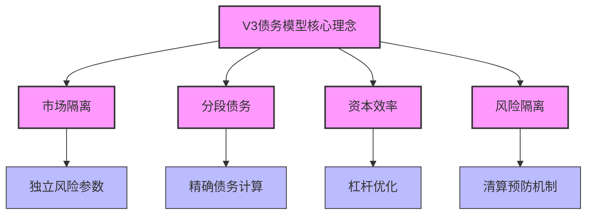
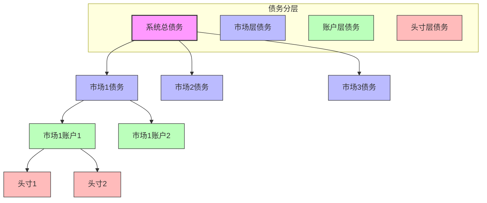
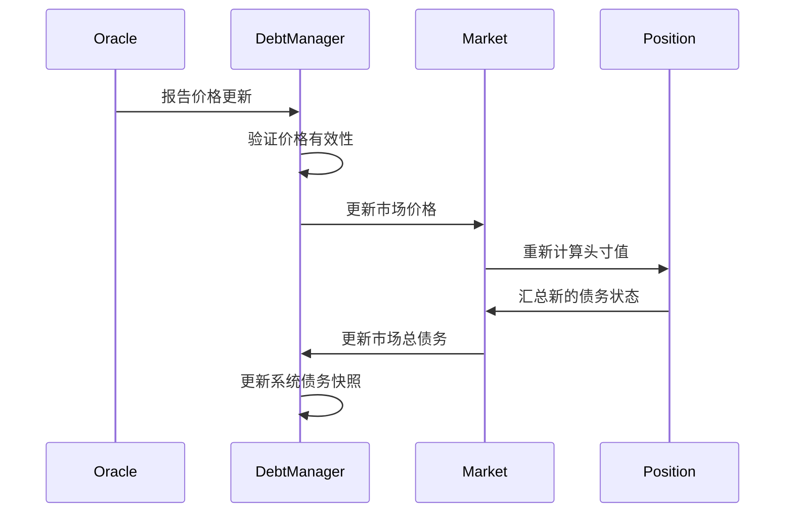

# SynthetixV3 债务模型专题研究

## 1. 债务系统概述

SynthetixV3对V2的债务模型进行了根本性重新设计，解决了V2中的核心问题，包括全局债务共享、清算效率低下和资本效率问题。V3采用了隔离市场和分段债务架构，极大地提高了系统的可扩展性和资本效率。

### 1.1 核心设计理念



## 2. 市场隔离设计

V3最重要的创新是从全局债务共享模型转变为市场隔离模型。每个市场现在都有自己独立的债务池和风险参数。

### 2.1 市场类型与债务关系

| 市场类型 | 债务特征 | 清算条件 | 资本效率 |
|---------|---------|---------|---------|
| 现货市场 | 直接债务记录 | 价格触发 | 中等 |
| 永续市场 | 标记价格计算 | 资金费率+价格 | 高 |
| 国库市场 | 固定债务比率 | 多重触发机制 | 最高 |

### 2.2 债务计算模型

```solidity
// 市场债务计算简化代码
function calculateMarketDebt(uint128 marketId) public view returns (int256) {
    Market storage market = markets[marketId];
    
    // 获取市场中的所有头寸
    Position[] memory positions = getMarketPositions(marketId);
    
    int256 totalDebt = 0;
    
    // 计算所有头寸的总债务
    for (uint i = 0; i < positions.length; i++) {
        Position memory position = positions[i];
        
        // 根据市场类型计算单个头寸债务
        int256 positionDebt = calculatePositionDebt(position, market.marketType);
        
        // 累加总债务
        totalDebt += positionDebt;
    }
    
    return totalDebt;
}
```

## 3. 分段债务架构

V3采用分段债务架构，将系统债务分为多个层次，每个层次有不同的风险特征和清算机制。

### 3.1 债务分层结构



### 3.2 债务跟踪机制

V3中的债务跟踪更加精确和实时，通过多级债务累计实现：

1. **头寸债务**：记录单个头寸的确切债务金额
2. **账户债务**：聚合单个账户在特定市场的所有头寸债务
3. **市场债务**：聚合特定市场中所有账户的债务
4. **系统债务**：所有市场债务的总和

## 4. 价格反馈与债务更新

### 4.1 债务价格更新流程



### 4.2 债务与抵押资产关系

V3实现了更精细的抵押品与债务关系管理：

```solidity
// 抵押率计算示例
function calculateCollateralRatio(address account, uint128 marketId) public view returns (uint256) {
    // 获取账户在市场中的所有头寸
    Position[] memory positions = getAccountMarketPositions(account, marketId);
    
    // 计算总债务价值
    uint256 totalDebtValue = 0;
    for (uint i = 0; i < positions.length; i++) {
        totalDebtValue += positions[i].notionalValue;
    }
    
    // 获取账户抵押品价值
    uint256 collateralValue = getAccountCollateralValue(account, marketId);
    
    // 防止除以零
    if (totalDebtValue == 0) return type(uint256).max;
    
    // 计算抵押率 (抵押品价值 / 债务价值)
    return (collateralValue * 1e18) / totalDebtValue;
}
```

## 5. 清算机制变革

### 5.1 清算触发条件

SynthetixV3清算机制有更加灵活和精细的触发条件：

1. **抵押率触发**：当账户抵押率低于市场设定的最低要求
2. **价格偏离触发**：当价格波动幅度超过预设阈值
3. **时间触发**：基于特定市场规则的时间条件
4. **多层保护**：设置多级预警和清算阈值

### 5.2 清算流程优化

V3的清算流程更高效，通过以下机制实现：

1. **部分清算**：支持仅清算必要部分而非整个头寸
2. **优先级清算**：基于风险等级确定清算顺序
3. **激励机制**：为清算人提供梯度式奖励
4. **自动化清算**：预设条件下的系统自动清算

## 6. 债务模型风险管理

### 6.1 风险参数设置

每个市场可以独立设置风险参数，包括：

| 参数类别 | 描述 | 典型值 |
|---------|------|-------|
| 最低抵押率 | 维持头寸所需的最低抵押品比例 | 120%-150% |
| 清算阈值 | 触发清算的抵押率水平 | 110%-125% |
| 清算惩罚 | 清算时收取的额外费用 | 5%-15% |
| 最大杠杆率 | 允许的最大杠杆倍数 | 3x-20x |
| 价格偏离容忍度 | 允许的最大价格波动 | 5%-20% |

### 6.2 压力测试机制

V3实现了更强大的压力测试系统，模拟各种极端市场条件：

1. **极端波动场景**：模拟资产价格大幅波动
2. **流动性枯竭**：模拟清算流动性不足情况
3. **级联清算**：测试连锁清算对系统的影响
4. **黑天鹅事件**：模拟极端而罕见的市场事件

## 7. 与V2债务模型对比

| 特性 | V2债务模型 | V3债务模型 | 改进效果 |
|------|-----------|-----------|---------|
| 债务结构 | 全局共享债务 | 市场隔离债务 | 风险隔离，提高可扩展性 |
| 清算机制 | 全仓清算 | 部分清算 | 降低用户损失，提高效率 |
| 资本效率 | 全局抵押 | 市场特定抵押 | 提高资本效率 |
| 头寸管理 | 综合头寸 | 分离头寸 | 精细控制风险敞口 |
| 杠杆控制 | 有限灵活性 | 市场特定杠杆 | 更多交易策略，更好风控 |
| 扩展性 | 受限 | 高度可扩展 | 支持更多资产和市场类型 |

## 总结

SynthetixV3的债务模型代表了协议核心架构的重大进步，通过市场隔离设计和分段债务架构，解决了V2中的关键限制。新模型不仅提高了资本效率和风险管理能力，还为未来扩展到更多资产类型和市场结构奠定了基础。债务系统的这一演进是SynthetixV3架构重新设计的核心部分，为协议的长期可持续发展提供了坚实基础。 