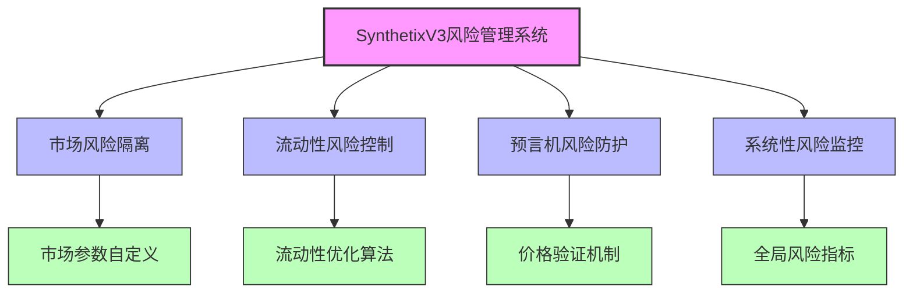
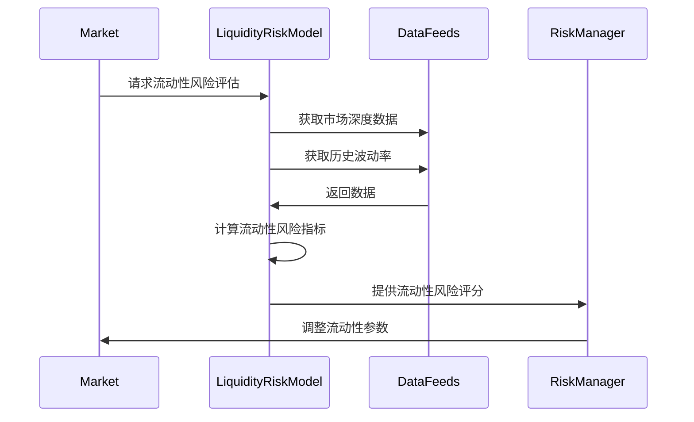
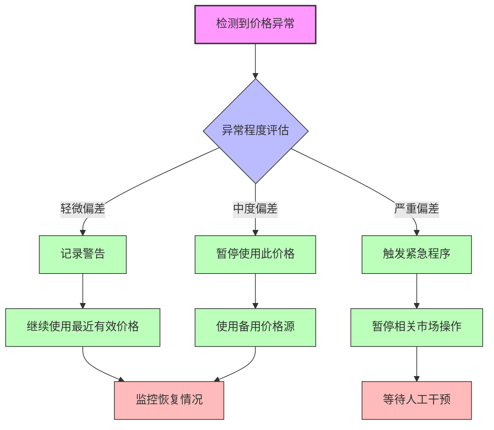
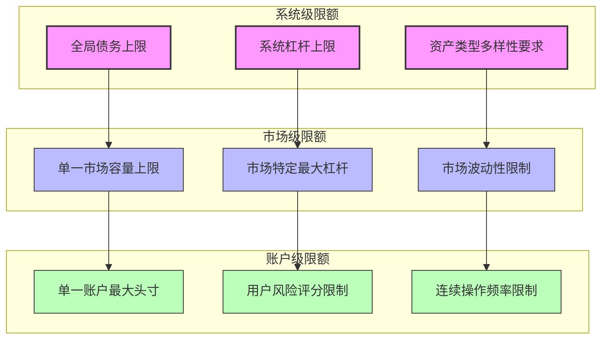

# SynthetixV3 风险管理系统深度分析

## 1. 风险管理架构概述

SynthetixV3的风险管理系统经过全面重构，采用多层次、模块化的架构设计，以应对去中心化合成资产系统面临的复杂风险挑战。新系统在保持高资本效率的同时，提供了更强的系统安全性和可靠性。

### 1.1 风险管理框架结构



## 2. 市场风险隔离机制

### 2.1 市场独立风险控制

SynthetixV3实现了完全的市场风险隔离，每个市场可以单独设置风险参数，优化资本效率：

```solidity
// 市场风险参数结构
struct MarketRiskParameters {
    // 清算阈值
    uint256 liquidationThreshold;
    
    // 清算奖励百分比
    uint256 liquidationReward;
    
    // 最大杠杆倍数
    uint256 maxLeverage;
    
    // 价格偏离容忍度
    uint256 priceDriftTolerance;
    
    // 最大市场容量
    uint256 marketCapacity;
    
    // 基础费率
    uint256 baseFeeRate;
    
    // 动态风险调整因子
    uint256 dynamicRiskFactor;
}
```

### 2.2 动态风险参数调整

V3引入了基于市场条件的动态风险参数调整机制：

| 市场状态 | 风险参数调整 | 调整目标 | 触发条件 |
|---------|------------|---------|---------|
| 正常状态 | 标准参数 | 平衡风险和效率 | 默认状态 |
| 高波动状态 | 提高清算阈值、降低杠杆 | 防范清算风暴 | 市场波动性超过阈值 |
| 极端状态 | 临时暂停部分功能 | 保护系统安全 | 价格大幅波动或喂价异常 |
| 恢复状态 | 渐进恢复参数 | 平稳过渡 | 波动性回归正常区间 |

## 3. 流动性风险管理

### 3.1 流动性风险评估模型

SynthetixV3采用先进的流动性风险评估模型，计算各种合成资产的流动性风险指标：



### 3.2 流动性激励机制

为确保高风险资产具有足够流动性，V3实施了动态流动性激励：

```solidity
// 流动性激励计算
function calculateLiquidityIncentive(
    address syntheticAsset,
    uint256 liquidityProvided
) public view returns (uint256) {
    // 获取资产的流动性风险分数
    uint256 liquidityRiskScore = getLiquidityRiskScore(syntheticAsset);
    
    // 获取资产的当前市场深度
    uint256 currentDepth = getMarketDepth(syntheticAsset);
    
    // 获取目标市场深度
    uint256 targetDepth = getTargetMarketDepth(syntheticAsset);
    
    // 计算深度不足比例
    uint256 depthDeficitRatio = 0;
    if (currentDepth < targetDepth) {
        depthDeficitRatio = ((targetDepth - currentDepth) * 1e18) / targetDepth;
    }
    
    // 基础奖励率
    uint256 baseRate = getBaseIncentiveRate();
    
    // 计算风险调整奖励
    uint256 riskAdjustedRate = (baseRate * (1e18 + liquidityRiskScore)) / 1e18;
    
    // 计算流动性调整奖励
    uint256 depthAdjustedRate = (riskAdjustedRate * (1e18 + depthDeficitRatio)) / 1e18;
    
    // 最终奖励金额
    return (liquidityProvided * depthAdjustedRate) / 1e18;
}
```

## 4. 预言机风险防护

### 4.1 多层验证机制

SynthetixV3实施了多层次的预言机验证机制，防止价格操纵和技术故障：

| 验证层 | 主要功能 | 实现方式 |
|-------|---------|---------|
| 来源验证 | 验证价格来源的可信度 | 白名单喂价账户 |
| 一致性验证 | 检测多个数据源间的一致性 | 中位数、TWAP对比 |
| 偏差验证 | 检测价格偏离幅度 | 相对历史价格的波动阈值 |
| 延迟验证 | 防止陈旧的价格数据 | 最大时间窗口限制 |
| 故障转移 | 在主要来源失效时提供备选 | 备用价格源自动切换 |

### 4.2 价格异常处理

当检测到价格异常时，系统会根据严重程度采取不同的应对措施：



## 5. 杠杆和抵押品风险控制

### 5.1 动态抵押品因子

SynthetixV3对不同抵押品根据风险特性动态调整抵押因子：

```solidity
// 动态抵押品因子计算
function calculateDynamicCollateralFactor(
    address collateralToken,
    uint256 collateralAmount
) public view returns (uint256) {
    // 获取基础抵押因子
    uint256 baseCollateralFactor = getBaseCollateralFactor(collateralToken);
    
    // 获取当前市场条件下的风险调整
    uint256 marketConditionAdjustment = getMarketRiskAdjustment();
    
    // 获取抵押品集中度
    uint256 concentrationRisk = getConcentrationRisk(collateralToken, collateralAmount);
    
    // 获取抵押品相关性调整
    uint256 correlationAdjustment = getCorrelationAdjustment(collateralToken);
    
    // 计算调整后的抵押因子
    uint256 adjustedFactor = baseCollateralFactor;
    
    // 应用市场风险调整
    adjustedFactor = (adjustedFactor * (BASE_FACTOR - marketConditionAdjustment)) / BASE_FACTOR;
    
    // 应用集中度风险调整
    adjustedFactor = (adjustedFactor * (BASE_FACTOR - concentrationRisk)) / BASE_FACTOR;
    
    // 应用相关性调整
    adjustedFactor = (adjustedFactor * (BASE_FACTOR - correlationAdjustment)) / BASE_FACTOR;
    
    return adjustedFactor;
}
```

### 5.2 梯度清算模型

V3采用了创新的梯度清算模型，根据头寸健康程度采取不同级别的清算动作：

| 健康度级别 | 触发条件 | 清算动作 | 目的 |
|-----------|---------|---------|------|
| 警告级别 | 接近清算阈值 | 通知用户 | 让用户有时间自行调整 |
| 轻度不健康 | 刚触及清算阈值 | 部分清算(20%) | 减轻用户损失，尝试恢复健康度 |
| 中度不健康 | 显著低于清算阈值 | 部分清算(50%) | 大幅减少风险，减轻冲击 |
| 严重不健康 | 远低于清算阈值 | 完全清算 | 保护系统安全 |

## 6. 整体风险监测系统

### 6.1 风险仪表盘

SynthetixV3实现了全面的风险监测仪表盘，追踪关键系统健康指标：

| 指标类别 | 关键指标 | 预警阈值 | 目的 |
|---------|---------|---------|------|
| 系统负载 | 总债务/总抵押品比率 | >85% | 监控系统整体健康度 |
| 市场风险 | 合成资产价格波动率 | 日波动>10% | 发现潜在的市场风险 |
| 集中度风险 | 最大头寸占比 | >25% | 监控过度集中风险 |
| 流动性风险 | 退出流动性比率 | <30% | 监控流动性危机风险 |
| 预言机健康 | 源一致性偏差 | >5% | 监控价格源稳定性 |

### 6.2 风险限额系统

V3实施了多层次的风险限额系统，为系统建立安全边界：



## 7. 压力测试与风险模拟

### 7.1 情景分析

SynthetixV3定期进行各种情景分析，评估系统对极端市场事件的承受能力：

1. **市场崩溃情景**：模拟主要加密资产价格短期内下跌50-80%
2. **流动性冲击情景**：模拟大规模退出流动性的系统响应
3. **预言机故障情景**：测试价格源异常情况下的系统弹性
4. **相关性崩溃情景**：评估传统不相关资产突然高度相关的影响
5. **逐级清算情景**：测试连锁清算事件的系统反应

### 7.2 蒙特卡洛模拟

V3应用蒙特卡洛方法模拟各类风险事件的概率和影响：

```solidity
// 风险量化模型简化代码
function simulateSystemRisk(
    uint256 iterations,
    uint256 timeHorizon
) external returns (RiskReport memory) {
    RiskReport memory report;
    
    for (uint256 i = 0; i < iterations; i++) {
        // 生成随机市场情景
        MarketScenario memory scenario = generateRandomScenario(timeHorizon);
        
        // 模拟系统在该情景下的行为
        SystemState memory resultState = simulateSystemBehavior(scenario);
        
        // 记录系统崩溃事件
        if (resultState.isSolvent == false) {
            report.systemFailureCount++;
            report.averageLossOnFailure += resultState.totalLoss;
        }
        
        // 更新风险指标
        updateRiskMetrics(report, resultState);
    }
    
    // 计算最终风险指标
    finalizeRiskMetrics(report, iterations);
    
    return report;
}
```

## 总结

SynthetixV3的风险管理系统代表了DeFi协议在风险管控方面的重大进步，通过市场隔离、多层预言机验证、动态参数调整和梯度清算等创新机制，为系统提供了前所未有的安全性和灵活性。同时，完善的风险监测系统和多维度的压力测试确保了系统能够在极端市场条件下保持稳健。这一风险管理框架的建立，为SynthetixV3处理更复杂的金融产品和更大规模的资产提供了坚实基础，也为DeFi行业的风险管理设立了新的标准。 