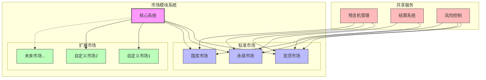
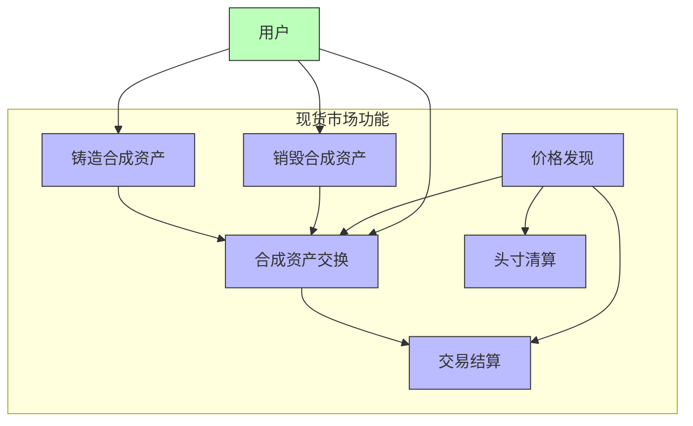
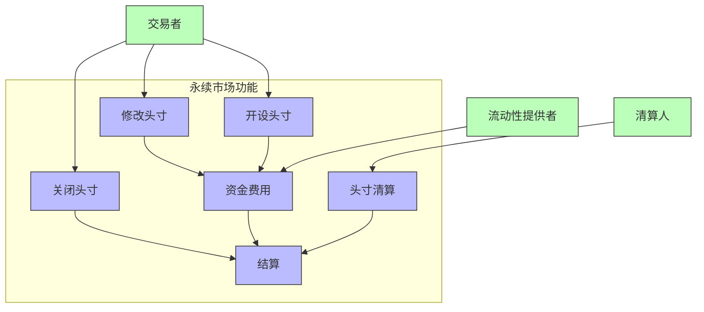
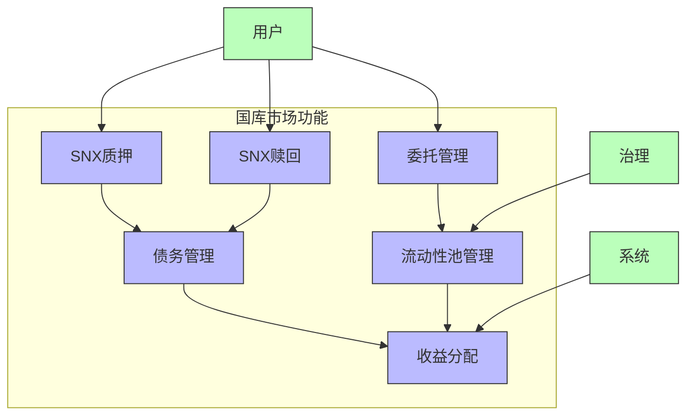
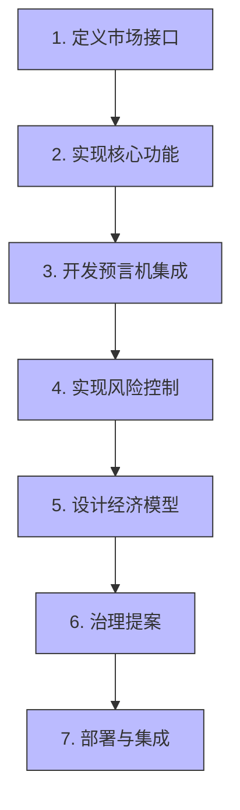
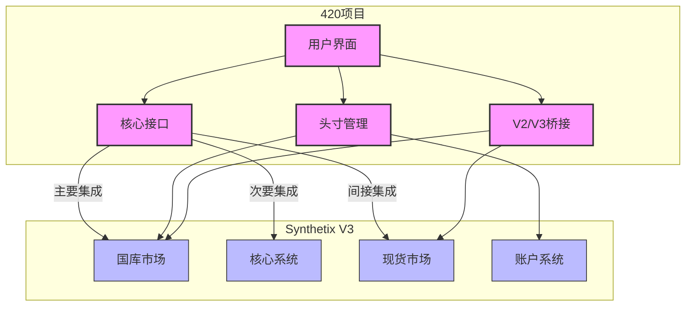

# Synthetix V3市场模块分析

## 1. 市场模块系统概述

Synthetix V3的一个核心创新是其模块化市场系统，这种设计允许不同类型的金融市场在同一协议框架内运行，并能灵活扩展以适应新的金融产品。市场模块系统是420项目与Synthetix V3集成的核心接口之一。

### 1.1 市场模块架构



### 1.2 市场接口设计

所有市场模块必须实现特定的接口，确保与核心系统兼容：

```solidity
// 市场接口简化示例
interface IMarket {
    // 市场初始化和配置
    function initialize(address owner, bytes32 marketName) external;
    function configureMaximumMarketDebt(uint debt) external;
    
    // 市场核心功能
    function deposit(uint accountId, address collateralType, uint amount) external;
    function withdraw(uint accountId, address collateralType, uint amount) external;
    function mintUsd(uint accountId, uint amount) external;
    function burnUsd(uint accountId, uint amount) external;
    
    // 市场状态查询
    function reportedDebt(uint accountId) external view returns (uint);
    function getCollateralConfiguration(address collateral) external view returns (...);
    
    // 市场特定操作
    function liquidate(uint accountId) external;
    function distributeRewards(uint amount) external;
    
    // 市场生命周期
    function pauseMarket() external;
    function unpauseMarket() external;
}
```

这种标准化接口使核心系统可以与任何兼容市场进行交互，不需要了解市场的内部实现细节。420项目利用这一特性，通过标准接口与多个市场模块（尤其是国库市场）进行集成。

## 2. 现货市场分析

### 2.1 现货市场概述

现货市场（Spot Market）是Synthetix V3提供的用于铸造、交易和管理合成资产的模块。它是V2 Synths功能的自然进化，在保持基本功能的同时提供了更大的灵活性。

### 2.2 现货市场核心功能



现货市场的主要功能：

1. **铸造合成资产**：用户可以通过质押抵押品铸造合成资产
2. **交易合成资产**：支持不同合成资产之间的互换
3. **管理抵押率**：跟踪并确保合成资产的适当抵押
4. **清算机制**：当抵押率降至阈值以下时触发清算
5. **价格发现**：通过预言机系统确定合成资产价格
6. **收费结构**：对铸造、交易和赎回收取特定费用

### 2.3 现货市场实现特点

现货市场实现了几个创新功能，解决了V2中的限制：

1. **多抵押品支持**：单一合成资产可以由多种抵押品支持
2. **动态费用**：基于市场条件调整的费用结构
3. **精细的清算**：部分清算机制，减少用户损失
4. **解耦的价格源**：可插拔的预言机支持多种价格源
5. **委托整合**：与多池委托模型完全兼容

### 2.4 与420项目的关系

420项目主要使用国库市场而非现货市场，但仍会与现货市场间接交互：

- 处理由现货市场产生的合成资产（如snxUSD）
- 为用户提供从现货市场到国库市场的桥接功能
- 在一些复杂操作中同时使用两种市场的功能

## 3. 永续市场分析

### 3.1 永续市场概述

永续市场（Perps Market）是V3提供的创新杠杆交易模块，允许用户进行杠杆化的衍生品交易，包括永续合约等衍生工具。

### 3.2 永续市场核心功能



永续市场的主要功能：

1. **杠杆头寸**：用户可以创建杠杆化的多头或空头头寸
2. **动态资金费率**：周期性结算的双向资金费用
3. **自动清算**：风险参数驱动的头寸清算机制
4. **跨抵押品**：支持多种抵押品类型
5. **价格保护**：价格偏离保护和黑天鹅事件处理
6. **头寸管理**：精细的头寸大小和风险控制

### 3.3 永续市场实现特点

永续市场引入了多项技术创新：

1. **隔离的风险仓**：独立的风险参数和流动性池
2. **动态定价**：基于市场深度的滑点模型
3. **高级订单类型**：包括限价单、止损单等复杂订单
4. **合成流动性**：无需传统流动性提供者的合成流动性
5. **智能费用结构**：激励市场平衡的动态费率

### 3.4 与420项目的关系

420项目与永续市场的交互相对有限，但有几个潜在的集成点：

- 为用户提供通过420界面访问永续市场的简化方式
- 在风险管理策略中考虑永续市场的暴露
- 潜在的未来功能，利用永续市场进行对冲或收益优化

## 4. 国库市场分析

### 4.1 国库市场概述

国库市场（Treasury Market）是420项目与Synthetix V3集成的主要接口，专门用于管理SNX质押、债务和收益分配等核心功能。该市场模块实质上扮演了系统"银行"的角色。

### 4.2 国库市场核心功能



国库市场的主要功能：

1. **SNX质押管理**：处理SNX的存入和提取
2. **债务分配**：计算和分配系统债务
3. **收益分配**：处理和分配交易费、质押奖励等
4. **委托管理**：协调与多池委托系统的交互
5. **风险参数控制**：管理最低抵押率等风险参数
6. **清算处理**：执行未满足抵押要求的仓位清算

### 4.3 国库市场实现特点

国库市场的技术实现有几个关键特点：

1. **模块化结构**：由多个专用模块组成，每个负责特定功能
2. **可配置参数**：大量可动态调整的参数，允许治理调整风险和收益配置
3. **多币种支持**：除SNX外，支持多种抵押品类型
4. **流动性分层**：不同风险层级的流动性池
5. **复杂的收益模型**：支持多种收益来源和分配策略

### 4.4 国库市场核心合约结构

```solidity
// 国库市场代理简化示例
contract TreasuryMarketProxy is Proxy {
    // 代理实现指向Router，Router再指向具体模块
    address public immutable marketRouter;
    
    constructor(address _router) {
        marketRouter = _router;
    }
    
    function _implementation() internal view override returns (address) {
        return marketRouter;
    }
}

// 国库市场路由器简化示例
contract TreasuryMarketRouter {
    // 映射存储各功能的实现
    mapping(bytes4 => address) private implementations;
    
    // 核心功能实现
    function deposit(uint accountId, address collateral, uint amount) external {
        // 实现路由到存款模块
    }
    
    function withdraw(uint accountId, address collateral, uint amount) external {
        // 实现路由到提款模块
    }
    
    function delegateCollateral(uint accountId, uint poolId, uint amount) external {
        // 实现路由到委托模块
    }
    
    function claimRewards(uint accountId) external {
        // 实现路由到奖励模块
    }
    
    // ... 其他功能
}
```

### 4.5 与420项目的关系

国库市场是420项目与Synthetix V3集成的核心接口：

- 420通过国库市场进行所有SNX质押和管理操作
- 用户的收益通过国库市场的机制分配
- 420的风险管理策略直接与国库市场的参数交互
- 420简化了用户与国库市场的交互，提供优化的接口

## 5. 自定义市场潜力与扩展性

### 5.1 自定义市场概述

Synthetix V3的一个重要设计目标是允许创建自定义市场，实现专业化的金融产品。这提供了无限的扩展可能性。

### 5.2 自定义市场示例

几个可能的自定义市场类型：

1. **期权市场**：用于交易合成期权
2. **债券市场**：固定收益和债券产品
3. **指数市场**：合成指数和篮子产品
4. **波动率市场**：专注于波动率交易的产品
5. **预测市场**：二元结果的预测市场
6. **借贷市场**：特定于资产的借贷功能

### 5.3 创建自定义市场的步骤



创建自定义市场的主要步骤：

1. **定义市场接口**：实现标准市场接口和特定于市场的扩展
2. **实现核心功能**：开发市场特有的业务逻辑
3. **集成预言机**：连接所需的价格数据源
4. **风险控制**：实现适合产品的风险管理机制
5. **经济模型**：设计可持续的费用和激励结构
6. **治理提案**：获得系统治理的批准
7. **部署与集成**：将市场添加到生态系统

### 5.4 对420项目的启示

420项目可以考虑创建或集成定制市场：

- 开发专门针对420用户的特定市场
- 创建独特的收益分配机制
- 设计简化风险管理的专用市场
- 为特定资产类别提供优化的交易环境

## 6. 420项目市场集成分析

### 6.1 当前集成状态



420项目当前与Synthetix V3市场模块的集成主要集中在：

1. **国库市场**：核心集成点，处理所有质押和收益操作
2. **账户系统**：管理代表用户仓位的NFT账户
3. **间接与现货市场**：通过桥接功能处理sUSD和snxUSD转换

### 6.2 集成优势分析

420项目与V3市场模块集成带来的主要优势：

1. **风险分离**：利用多池模型隔离特定风险
2. **资本效率**：优化质押率和资本使用
3. **用户体验简化**：抽象复杂的市场交互
4. **收益优化**：精细调整收益分配策略
5. **灵活性**：能够适应不同市场条件

### 6.3 集成挑战与解决方案

主要集成挑战：

1. **复杂性管理**：
   - 挑战：V3市场接口的复杂性
   - 解决方案：420提供的抽象层和简化接口

2. **V2/V3兼容性**：
   - 挑战：处理V2和V3资产差异
   - 解决方案：420的桥接功能和互操作性层

3. **用户教育**：
   - 挑战：用户理解新模型的复杂性
   - 解决方案：简化的UI和逐步引导

4. **风险参数优化**：
   - 挑战：确定最佳风险参数
   - 解决方案：数据驱动的参数优化和监控

## 7. 未来发展方向

### 7.1 市场模块演进趋势

Synthetix V3市场模块的未来演进可能包括：

1. **更多金融产品**：扩展到更多衍生品类型
2. **跨链市场**：支持多链环境下的市场操作
3. **深度预言机集成**：更复杂的价格发现机制
4. **AI辅助风险管理**：使用高级算法优化风险
5. **改进的隐私功能**：在维持透明度的同时保护交易隐私

### 7.2 420项目的市场集成机遇

420项目可以考虑的市场集成机遇：

1. **定制市场开发**：创建专用于420特定需求的市场
2. **跨市场策略**：跨多个市场优化用户策略
3. **高级交易功能**：专业交易工具和接口
4. **智能组合管理**：自动化的多市场仓位管理
5. **一站式市场入口**：统一访问所有Synthetix V3市场的接口

### 7.3 创新方向建议

对420项目的建议创新方向：

1. **集成型市场聚合器**：整合多个Synthetix V3市场的统一接口
2. **智能质押优化器**：自动优化用户在不同市场的质押分配
3. **跨市场风险对冲**：利用多个市场特性构建对冲策略
4. **定制收益分配**：创建特定于420的收益分配机制
5. **市场数据分析工具**：为用户提供市场洞察和决策支持

## 8. 总结

### 8.1 市场模块架构总结

Synthetix V3的市场模块系统代表了DeFi设计的重大进步，通过严格的接口标准、模块化实现和可扩展架构，实现了前所未有的灵活性和功能隔离。

### 8.2 420项目集成价值

420项目通过与Synthetix V3市场模块的深度集成，为用户提供了简化的界面、优化的风险管理和增强的收益策略，同时保持了底层系统的全部功能和灵活性。

### 8.3 未来发展建议

随着Synthetix V3生态系统的发展，420项目应继续深化市场模块集成，探索创建定制市场的可能性，并开发跨市场策略以最大化用户价值和系统效率。 