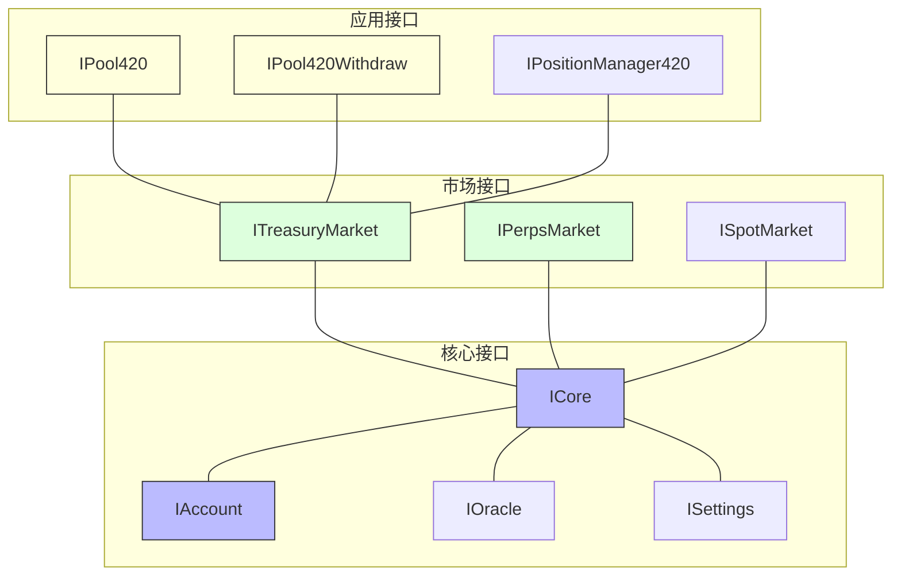
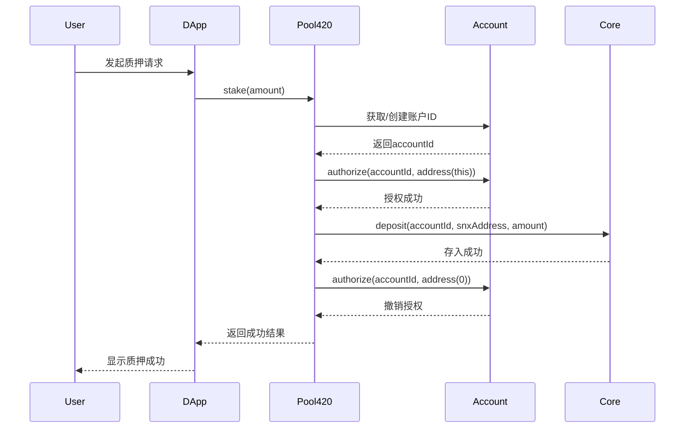

# Synthetix V3 & 420 Pool 核心接口学习

## 任务使命 (Mission)

掌握Synthetix V3和420 Pool的核心接口调用方法和交互模式，为实际开发和功能集成提供指导。

## 背景上下文 (Context)

Synthetix V3和420 Pool的功能通过一系列接口暴露，开发者需要了解如何正确调用这些接口才能有效地与系统交互。本文档将详细介绍这些核心接口、参数和调用模式，帮助开发者快速理解和使用这些功能。

## 执行计划 (Plan)

本文档将系统介绍Synthetix V3和420 Pool的核心接口，包括接口定义、参数说明、调用方法和使用示例，重点关注实际开发中的常见场景和最佳实践。

## 1. Synthetix V3 接口概览

### 1.1 接口层次结构



Synthetix V3的接口设计遵循分层架构，主要包括：

1. **核心接口层**：提供基础功能，如抵押品管理、账户操作和系统配置
2. **市场接口层**：提供特定市场功能，如质押池、永续合约和现货交易
3. **应用接口层**：提供面向特定应用的功能，如420 Pool的质押和提款操作

### 1.2 接口调用规范

在与Synthetix V3接口交互时，需要遵循以下规范：

- 所有金额参数都使用`uint256`表示
- 账户ID使用`uint128`表示
- 池ID和市场ID使用`bytes32`表示
- 所有外部调用都应进行适当的错误处理
- 调用前检查权限和前置条件

## 2. Core模块接口

### 2.1 ICore接口定义

```solidity
interface ICore {
    // 抵押品管理
    function deposit(uint128 accountId, address collateralType, uint256 amount) external;
    function withdraw(uint128 accountId, address collateralType, uint256 amount) external;
    
    // 债务管理
    function getCollateralValue(uint128 accountId) external view returns (uint256);
    function getDebtValue(uint128 accountId) external view returns (uint256);
    
    // 系统参数
    function issuanceRatio() external view returns (uint256);
    function liquidationRatio() external view returns (uint256);
}
```

### 2.2 抵押品管理接口

**存入抵押品**:
```solidity
function deposit(uint128 accountId, address collateralType, uint256 amount) external;
```

参数说明:
- `accountId`: NFT账户ID
- `collateralType`: 抵押品类型地址（如SNX代币地址）
- `amount`: 存入数量

使用示例:
```solidity
// 首先需要批准Core合约花费代币
IERC20(collateralAddress).approve(address(core), amount);

// 然后调用deposit函数
try core.deposit(myAccountId, collateralAddress, amount) {
    // 存入成功
} catch Error(string memory reason) {
    // 处理错误
}
```

**提取抵押品**:
```solidity
function withdraw(uint128 accountId, address collateralType, uint256 amount) external;
```

使用示例:
```solidity
try core.withdraw(myAccountId, collateralAddress, amount) {
    // 提取成功
} catch Error(string memory reason) {
    // 处理错误，可能是因为抵押率不足
}
```

### 2.3 债务查询接口

**获取抵押品价值**:
```solidity
function getCollateralValue(uint128 accountId) external view returns (uint256);
```

**获取债务价值**:
```solidity
function getDebtValue(uint128 accountId) external view returns (uint256);
```

使用示例:
```solidity
// 获取当前抵押率
uint256 collateralValue = core.getCollateralValue(accountId);
uint256 debtValue = core.getDebtValue(accountId);

uint256 cRatio = 0;
if (debtValue > 0) {
    cRatio = (collateralValue * 1e18) / debtValue;
}
```

## 3. Account模块接口

### 3.1 IAccount接口定义

```solidity
interface IAccount {
    // 账户管理
    function createAccount() external returns (uint128 accountId);
    function getAccountOwner(uint128 accountId) external view returns (address);
    
    // 权限管理
    function grantPermission(uint128 accountId, address delegate, bytes32 permission) external;
    function revokePermission(uint128 accountId, address delegate, bytes32 permission) external;
    function hasPermission(uint128 accountId, address delegate, bytes32 permission) external view returns (bool);
    
    // 临时授权
    function authorize(uint128 accountId, address authorized) external;
    function isAuthorized(uint128 accountId, address authorized) external view returns (bool);
}
```

### 3.2 账户管理接口

**创建账户**:
```solidity
function createAccount() external returns (uint128 accountId);
```

使用示例:
```solidity
// 创建新账户
uint128 newAccountId = account.createAccount();
```

**查询账户所有者**:
```solidity
function getAccountOwner(uint128 accountId) external view returns (address);
```

使用示例:
```solidity
address owner = account.getAccountOwner(accountId);
require(owner == msg.sender, "Not the account owner");
```

### 3.3 权限管理接口

**授予权限**:
```solidity
function grantPermission(uint128 accountId, address delegate, bytes32 permission) external;
```

参数说明:
- `accountId`: NFT账户ID
- `delegate`: 被授权的地址
- `permission`: 权限类型（如`ADMIN_PERMISSION`、`WITHDRAW_PERMISSION`等）

使用示例:
```solidity
// 授予另一个地址提取权限
bytes32 WITHDRAW_PERMISSION = keccak256("WITHDRAW_PERMISSION");
account.grantPermission(myAccountId, delegateAddress, WITHDRAW_PERMISSION);
```

**撤销权限**:
```solidity
function revokePermission(uint128 accountId, address delegate, bytes32 permission) external;
```

**检查权限**:
```solidity
function hasPermission(uint128 accountId, address delegate, bytes32 permission) external view returns (bool);
```

### 3.4 临时授权接口

**临时授权**:
```solidity
function authorize(uint128 accountId, address authorized) external;
```

这个接口特别重要，用于临时授权其他合约操作账户，是420 Pool等应用的核心机制。

使用示例:
```solidity
// 临时授权Pool420合约
account.authorize(myAccountId, address(this));

// 执行操作...

// 撤销授权
account.authorize(myAccountId, address(0));
```

## 4. TreasuryMarket模块接口

### 4.1 ITreasuryMarket接口定义

```solidity
interface ITreasuryMarket {
    // 池管理
    function createPool(bytes32 poolId, address collateralType) external;
    function configurePool(bytes32 poolId, bytes32 parameter, uint256 value) external;
    
    // 质押操作
    function deposit(uint128 accountId, bytes32 poolId, uint256 amount) external;
    function withdraw(uint128 accountId, bytes32 poolId, uint256 amount) external;
    
    // 奖励管理
    function distributeRewards(bytes32 poolId, uint256 amount) external;
    function claimRewards(uint128 accountId, bytes32 poolId) external returns (uint256);
}
```

### 4.2 池管理接口

**创建质押池**:
```solidity
function createPool(bytes32 poolId, address collateralType) external;
```

使用示例:
```solidity
// 创建SNX质押池
bytes32 poolId = keccak256("SNX_POOL");
treasuryMarket.createPool(poolId, snxTokenAddress);
```

**配置池参数**:
```solidity
function configurePool(bytes32 poolId, bytes32 parameter, uint256 value) external;
```

使用示例:
```solidity
// 设置池的最低抵押率
bytes32 parameter = keccak256("MIN_CRATIO");
treasuryMarket.configurePool(poolId, parameter, 2 * 1e18); // 200%抵押率
```

### 4.3 质押操作接口

**存入质押**:
```solidity
function deposit(uint128 accountId, bytes32 poolId, uint256 amount) external;
```

使用示例:
```solidity
// 需要确保账户已经有足够的抵押品
treasuryMarket.deposit(accountId, poolId, stakeAmount);
```

**提取质押**:
```solidity
function withdraw(uint128 accountId, bytes32 poolId, uint256 amount) external;
```

### 4.4 奖励管理接口

**分发奖励**:
```solidity
function distributeRewards(bytes32 poolId, uint256 amount) external;
```

**领取奖励**:
```solidity
function claimRewards(uint128 accountId, bytes32 poolId) external returns (uint256);
```

使用示例:
```solidity
// 领取质押奖励
uint256 rewardAmount = treasuryMarket.claimRewards(accountId, poolId);
```

## 5. 420 Pool特有接口

### 5.1 IPool420接口定义

```solidity
interface IPool420 {
    // 质押函数
    function stake(uint256 amount) external;
    
    // 查询质押信息
    function getPosition(address user) external view returns (
        uint256 stakedAmount,
        uint256 originalDebt,
        uint256 currentDebt,
        uint256 entryTimestamp
    );
    
    // 债务减免计算
    function calculateDebtRelief(address user) external view returns (uint256);
    
    // 池信息
    function getPoolInfo() external view returns (
        uint256 totalStaked,
        uint256 totalDebt,
        uint256 collateralizationRatio,
        uint256 jubileePeriod
    );
}
```

### 5.2 质押操作接口

**质押SNX**:
```solidity
function stake(uint256 amount) external;
```

相比Synthetix V3的原生接口，420 Pool的`stake`函数大大简化了质押流程，用户只需提供金额即可。

使用示例:
```solidity
// 首先批准Pool420合约花费SNX
IERC20(snxAddress).approve(address(pool420), amount);

// 调用stake函数
try pool420.stake(amount) {
    // 质押成功
} catch Error(string memory reason) {
    // 处理错误
}
```

### 5.3 查询接口

**获取质押头寸**:
```solidity
function getPosition(address user) external view returns (
    uint256 stakedAmount,
    uint256 originalDebt,
    uint256 currentDebt,
    uint256 entryTimestamp
);
```

使用示例:
```solidity
// 查询用户质押头寸
(
    uint256 stakedAmount,
    uint256 originalDebt,
    uint256 currentDebt,
    uint256 entryTimestamp
) = pool420.getPosition(userAddress);

// 计算质押时长
uint256 stakeDuration = block.timestamp - entryTimestamp;
```

**计算债务减免**:
```solidity
function calculateDebtRelief(address user) external view returns (uint256);
```

使用示例:
```solidity
// 计算当前债务减免额度
uint256 debtRelief = pool420.calculateDebtRelief(userAddress);
```

**获取池信息**:
```solidity
function getPoolInfo() external view returns (
    uint256 totalStaked,
    uint256 totalDebt,
    uint256 collateralizationRatio,
    uint256 jubileePeriod
);
```

### 5.4 IPool420Withdraw接口定义

```solidity
interface IPool420Withdraw {
    // 启动提款冷却期
    function initiateWithdrawal() external;
    
    // 完成提款
    function completeWithdrawal() external;
    
    // 查询冷却期状态
    function withdrawalStatus(address user) external view returns (
        bool initiated,
        uint256 cooldownEnd,
        uint256 availableAmount
    );
}
```

### 5.5 提款操作接口

**启动提款冷却期**:
```solidity
function initiateWithdrawal() external;
```

使用示例:
```solidity
// 启动7天冷却期
pool420Withdraw.initiateWithdrawal();
```

**完成提款**:
```solidity
function completeWithdrawal() external;
```

使用示例:
```solidity
// 检查冷却期是否结束
(
    bool initiated,
    uint256 cooldownEnd,
    uint256 availableAmount
) = pool420Withdraw.withdrawalStatus(userAddress);

if (initiated && block.timestamp >= cooldownEnd) {
    // 冷却期已结束，可以提款
    pool420Withdraw.completeWithdrawal();
}
```

## 6. 接口交互模式与最佳实践

### 6.1 临时授权模式



临时授权模式是Synthetix V3的重要设计模式，确保合约操作的安全性和原子性。正确使用这一模式的最佳实践：

1. 只在执行操作所需的最短时间内保持授权
2. 操作完成后立即撤销授权
3. 使用try/catch结构确保即使出错也能撤销授权
4. 在一个交易中完成所有需要授权的操作

### 6.2 错误处理模式

与Synthetix V3接口交互时，应采用以下错误处理模式：

```solidity
// 使用try/catch处理错误
try pool420.stake(amount) {
    // 操作成功，处理后续逻辑
} catch Error(string memory reason) {
    // 处理具体错误
    if (bytes(reason).length > 0) {
        // 解析错误信息
        handleSpecificError(reason);
    } else {
        // 通用错误处理
        handleGenericError();
    }
} catch (bytes memory revertData) {
    // 处理自定义错误或panic
    handleLowLevelError(revertData);
}
```

### 6.3 事件监听模式

Synthetix V3合约会在关键操作时发出事件，开发者可以监听这些事件来跟踪操作状态：

```solidity
// 定义事件监听器
contract SNXEventListener {
    event StakingCompleted(address user, uint256 amount);
    
    IPool420 private pool420;
    
    constructor(address _pool420) {
        pool420 = IPool420(_pool420);
    }
    
    // 监听Transfer事件来追踪质押
    function onSNXTransfer(address from, address to, uint256 amount) external {
        if (to == address(pool420)) {
            emit StakingCompleted(from, amount);
        }
    }
}
```

## 7. 接口集成实例

### 7.1 质押SNX到420 Pool

以下是集成420 Pool质押功能的完整示例：

```solidity
// SPDX-License-Identifier: MIT
pragma solidity ^0.8.18;

import "@openzeppelin/contracts/token/ERC20/IERC20.sol";
import "./interfaces/IPool420.sol";

contract SNXStakingIntegration {
    IPool420 public pool420;
    IERC20 public snxToken;
    
    constructor(address _pool420, address _snxToken) {
        pool420 = IPool420(_pool420);
        snxToken = IERC20(_snxToken);
    }
    
    // 质押SNX
    function stakeToPool(uint256 amount) external {
        // 转移SNX到本合约
        require(snxToken.transferFrom(msg.sender, address(this), amount), "SNX transfer failed");
        
        // 批准Pool420合约花费SNX
        snxToken.approve(address(pool420), amount);
        
        // 调用质押函数
        pool420.stake(amount);
        
        // 查询质押头寸
        (
            uint256 stakedAmount,
            uint256 originalDebt,
            uint256 currentDebt,
            uint256 entryTimestamp
        ) = pool420.getPosition(msg.sender);
        
        // 存储或处理质押信息
        // ...
    }
    
    // 查询债务减免
    function getDebtRelief(address user) external view returns (uint256) {
        return pool420.calculateDebtRelief(user);
    }
    
    // 启动提款
    function initiateWithdrawal() external {
        IPool420Withdraw withdrawContract = IPool420Withdraw(pool420.getWithdrawContractAddress());
        withdrawContract.initiateWithdrawal();
    }
    
    // 完成提款
    function completeWithdrawal() external {
        IPool420Withdraw withdrawContract = IPool420Withdraw(pool420.getWithdrawContractAddress());
        
        (bool initiated, uint256 cooldownEnd, ) = withdrawContract.withdrawalStatus(msg.sender);
        require(initiated, "Withdrawal not initiated");
        require(block.timestamp >= cooldownEnd, "Cooldown not finished");
        
        withdrawContract.completeWithdrawal();
    }
}
```

### 7.2 债务监控工具

以下是监控债务减免进度的示例：

```solidity
// SPDX-License-Identifier: MIT
pragma solidity ^0.8.18;

import "./interfaces/IPool420.sol";

contract DebtJubileeMonitor {
    IPool420 public pool420;
    
    event DebtReliefProgress(
        address user,
        uint256 originalDebt,
        uint256 currentDebt,
        uint256 relief,
        uint256 reliefPercentage
    );
    
    constructor(address _pool420) {
        pool420 = IPool420(_pool420);
    }
    
    // 检查债务减免进度
    function checkDebtReliefProgress(address user) external {
        (
            uint256 stakedAmount,
            uint256 originalDebt,
            uint256 currentDebt,
            uint256 entryTimestamp
        ) = pool420.getPosition(user);
        
        uint256 relief = originalDebt - currentDebt;
        uint256 reliefPercentage = originalDebt > 0 
            ? (relief * 100) / originalDebt 
            : 0;
        
        emit DebtReliefProgress(
            user,
            originalDebt,
            currentDebt,
            relief,
            reliefPercentage
        );
    }
    
    // 估算完全减免日期
    function estimateFullReliefDate(address user) external view returns (uint256) {
        (
            ,
            ,
            ,
            uint256 entryTimestamp
        ) = pool420.getPosition(user);
        
        (
            ,
            ,
            ,
            uint256 jubileePeriod
        ) = pool420.getPoolInfo();
        
        return entryTimestamp + jubileePeriod;
    }
}
```

## 8. 接口交互的前端示例

### 8.1 使用ethers.js连接420 Pool

以下是使用ethers.js与420 Pool交互的前端示例代码：

```javascript
import { ethers } from 'ethers';
import Pool420ABI from './abis/Pool420ABI.json';
import Pool420WithdrawABI from './abis/Pool420WithdrawABI.json';
import SNXABI from './abis/SNXABI.json';

class Pool420Service {
  constructor(provider) {
    this.provider = provider;
    this.signer = provider.getSigner();
    
    // 合约地址
    this.pool420Address = '0x...'; // Pool420合约地址
    this.pool420WithdrawAddress = '0x...'; // Pool420Withdraw合约地址
    this.snxAddress = '0x...'; // SNX代币地址
    
    // 合约实例
    this.pool420 = new ethers.Contract(
      this.pool420Address,
      Pool420ABI,
      this.signer
    );
    
    this.pool420Withdraw = new ethers.Contract(
      this.pool420WithdrawAddress,
      Pool420WithdrawABI,
      this.signer
    );
    
    this.snxToken = new ethers.Contract(
      this.snxAddress,
      SNXABI,
      this.signer
    );
  }
  
  // 质押SNX
  async stakeSnx(amount) {
    try {
      // 将金额转换为wei
      const amountWei = ethers.utils.parseEther(amount.toString());
      
      // 批准合约花费SNX
      const approveTx = await this.snxToken.approve(
        this.pool420Address,
        amountWei
      );
      await approveTx.wait();
      
      // 调用质押函数
      const stakeTx = await this.pool420.stake(amountWei);
      const receipt = await stakeTx.wait();
      
      return {
        success: true,
        transactionHash: receipt.transactionHash
      };
    } catch (error) {
      console.error('质押SNX失败:', error);
      return {
        success: false,
        error: error.message
      };
    }
  }
  
  // 获取质押头寸
  async getPosition(userAddress) {
    try {
      const position = await this.pool420.getPosition(userAddress);
      
      return {
        stakedAmount: ethers.utils.formatEther(position[0]),
        originalDebt: ethers.utils.formatEther(position[1]),
        currentDebt: ethers.utils.formatEther(position[2]),
        entryTimestamp: position[3].toNumber(),
        entryDate: new Date(position[3].toNumber() * 1000).toLocaleString()
      };
    } catch (error) {
      console.error('获取质押头寸失败:', error);
      throw error;
    }
  }
  
  // 计算债务减免
  async calculateDebtRelief(userAddress) {
    try {
      const relief = await this.pool420.calculateDebtRelief(userAddress);
      return ethers.utils.formatEther(relief);
    } catch (error) {
      console.error('计算债务减免失败:', error);
      throw error;
    }
  }
  
  // 启动提款
  async initiateWithdrawal() {
    try {
      const tx = await this.pool420Withdraw.initiateWithdrawal();
      const receipt = await tx.wait();
      
      return {
        success: true,
        transactionHash: receipt.transactionHash
      };
    } catch (error) {
      console.error('启动提款失败:', error);
      return {
        success: false,
        error: error.message
      };
    }
  }
  
  // 获取提款状态
  async getWithdrawalStatus(userAddress) {
    try {
      const status = await this.pool420Withdraw.withdrawalStatus(userAddress);
      
      const cooldownEnd = status[1].toNumber();
      const now = Math.floor(Date.now() / 1000);
      
      return {
        initiated: status[0],
        cooldownEnd: cooldownEnd,
        cooldownEndDate: new Date(cooldownEnd * 1000).toLocaleString(),
        availableAmount: ethers.utils.formatEther(status[2]),
        canWithdraw: status[0] && now >= cooldownEnd
      };
    } catch (error) {
      console.error('获取提款状态失败:', error);
      throw error;
    }
  }
  
  // 完成提款
  async completeWithdrawal() {
    try {
      const tx = await this.pool420Withdraw.completeWithdrawal();
      const receipt = await tx.wait();
      
      return {
        success: true,
        transactionHash: receipt.transactionHash
      };
    } catch (error) {
      console.error('完成提款失败:', error);
      return {
        success: false,
        error: error.message
      };
    }
  }
}

export default Pool420Service;
```

### 8.2 React组件示例

以下是一个简单的React组件，展示如何使用上述服务类与420 Pool交互：

```jsx
import React, { useState, useEffect } from 'react';
import { ethers } from 'ethers';
import Pool420Service from './services/Pool420Service';

function StakingDashboard() {
  const [account, setAccount] = useState('');
  const [position, setPosition] = useState(null);
  const [relief, setRelief] = useState('0');
  const [stakeAmount, setStakeAmount] = useState('');
  const [withdrawalStatus, setWithdrawalStatus] = useState(null);
  const [loading, setLoading] = useState(false);
  const [error, setError] = useState('');
  const [pool420Service, setPool420Service] = useState(null);

  // 初始化
  useEffect(() => {
    const init = async () => {
      try {
        // 连接MetaMask
        if (window.ethereum) {
          const provider = new ethers.providers.Web3Provider(window.ethereum);
          await provider.send('eth_requestAccounts', []);
          const signer = provider.getSigner();
          const currentAccount = await signer.getAddress();
          
          setAccount(currentAccount);
          setPool420Service(new Pool420Service(provider));
        } else {
          setError('请安装MetaMask');
        }
      } catch (error) {
        console.error('初始化失败:', error);
        setError('连接钱包失败');
      }
    };
    
    init();
  }, []);

  // 加载用户数据
  useEffect(() => {
    const loadUserData = async () => {
      if (pool420Service && account) {
        setLoading(true);
        try {
          const position = await pool420Service.getPosition(account);
          const relief = await pool420Service.calculateDebtRelief(account);
          const status = await pool420Service.getWithdrawalStatus(account);
          
          setPosition(position);
          setRelief(relief);
          setWithdrawalStatus(status);
        } catch (error) {
          console.error('加载用户数据失败:', error);
          setError('加载数据失败');
        } finally {
          setLoading(false);
        }
      }
    };
    
    loadUserData();
  }, [pool420Service, account]);

  // 质押SNX
  const handleStake = async () => {
    if (!stakeAmount) return;
    
    setLoading(true);
    setError('');
    
    try {
      const result = await pool420Service.stakeSnx(stakeAmount);
      if (result.success) {
        // 重新加载数据
        const position = await pool420Service.getPosition(account);
        const relief = await pool420Service.calculateDebtRelief(account);
        
        setPosition(position);
        setRelief(relief);
        setStakeAmount('');
      } else {
        setError(`质押失败: ${result.error}`);
      }
    } catch (error) {
      console.error('质押SNX失败:', error);
      setError('质押SNX失败');
    } finally {
      setLoading(false);
    }
  };

  // 启动提款
  const handleInitiateWithdrawal = async () => {
    setLoading(true);
    setError('');
    
    try {
      const result = await pool420Service.initiateWithdrawal();
      if (result.success) {
        // 重新加载提款状态
        const status = await pool420Service.getWithdrawalStatus(account);
        setWithdrawalStatus(status);
      } else {
        setError(`启动提款失败: ${result.error}`);
      }
    } catch (error) {
      console.error('启动提款失败:', error);
      setError('启动提款失败');
    } finally {
      setLoading(false);
    }
  };

  // 完成提款
  const handleCompleteWithdrawal = async () => {
    setLoading(true);
    setError('');
    
    try {
      const result = await pool420Service.completeWithdrawal();
      if (result.success) {
        // 重新加载数据
        const position = await pool420Service.getPosition(account);
        const status = await pool420Service.getWithdrawalStatus(account);
        
        setPosition(position);
        setWithdrawalStatus(status);
      } else {
        setError(`完成提款失败: ${result.error}`);
      }
    } catch (error) {
      console.error('完成提款失败:', error);
      setError('完成提款失败');
    } finally {
      setLoading(false);
    }
  };

  if (loading && !position) {
    return <div>加载中...</div>;
  }

  return (
    <div className="staking-dashboard">
      <h1>420 Pool 质押面板</h1>
      
      {error && <div className="error">{error}</div>}
      
      <div className="account-info">
        <h2>账户信息</h2>
        <p>当前地址: {account}</p>
      </div>
      
      {position && (
        <div className="position-info">
          <h2>质押头寸</h2>
          <p>质押数量: {position.stakedAmount} SNX</p>
          <p>原始债务: {position.originalDebt} sUSD</p>
          <p>当前债务: {position.currentDebt} sUSD</p>
          <p>债务减免: {relief} sUSD</p>
          <p>质押时间: {position.entryDate}</p>
        </div>
      )}
      
      <div className="stake-form">
        <h2>质押SNX</h2>
        <input
          type="number"
          value={stakeAmount}
          onChange={(e) => setStakeAmount(e.target.value)}
          placeholder="输入质押数量"
        />
        <button onClick={handleStake} disabled={loading}>
          {loading ? '处理中...' : '质押'}
        </button>
      </div>
      
      <div className="withdrawal-section">
        <h2>提款管理</h2>
        
        {withdrawalStatus && (
          <div className="withdrawal-status">
            <p>提款状态: {withdrawalStatus.initiated ? '已启动' : '未启动'}</p>
            
            {withdrawalStatus.initiated && (
              <>
                <p>冷却期结束: {withdrawalStatus.cooldownEndDate}</p>
                <p>可提取数量: {withdrawalStatus.availableAmount} SNX</p>
              </>
            )}
          </div>
        )}
        
        <button
          onClick={handleInitiateWithdrawal}
          disabled={loading || (withdrawalStatus && withdrawalStatus.initiated)}
        >
          启动提款
        </button>
        
        <button
          onClick={handleCompleteWithdrawal}
          disabled={loading || !withdrawalStatus || !withdrawalStatus.canWithdraw}
        >
          完成提款
        </button>
      </div>
    </div>
  );
}

export default StakingDashboard;
```

## 总结

Synthetix V3和420 Pool提供了一系列功能强大的接口，使开发者能够与系统进行深度交互。本文档介绍了这些核心接口的定义、参数和使用方法，并提供了实际开发中的示例和最佳实践。

掌握这些接口是有效开发和集成Synthetix V3功能的基础，特别是理解临时授权模式等特有设计模式，对于安全正确地与系统交互至关重要。

## 进一步学习

- 探索Synthetix V3官方文档和源代码
- 在测试网上实践接口调用
- 分析420 Pool的具体实现
- 学习更多DeFi集成最佳实践 