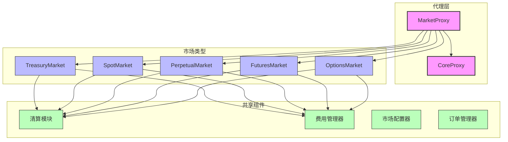
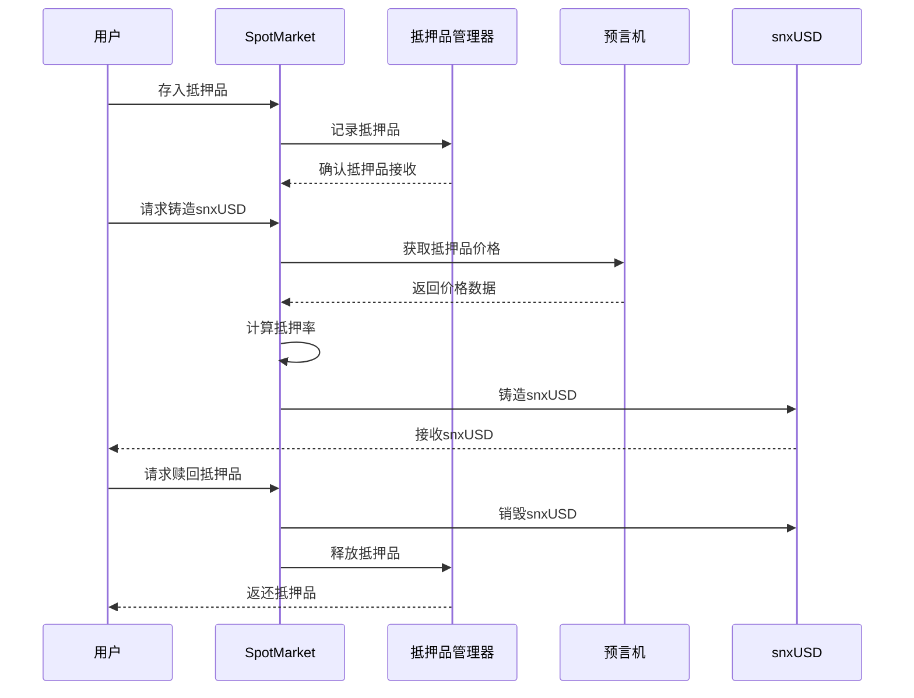
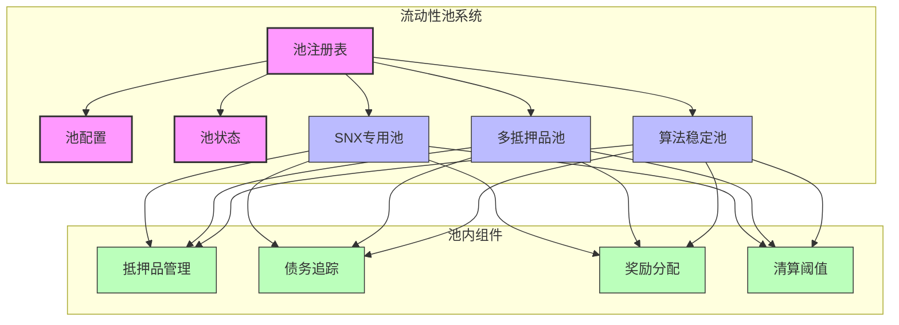
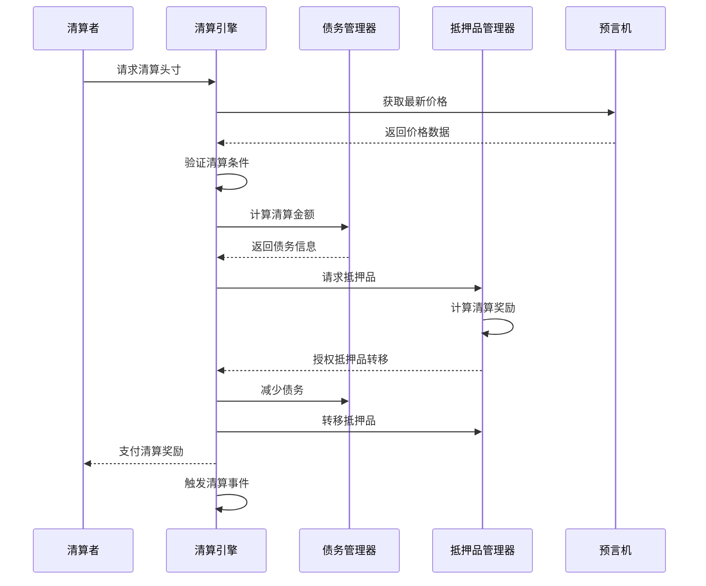
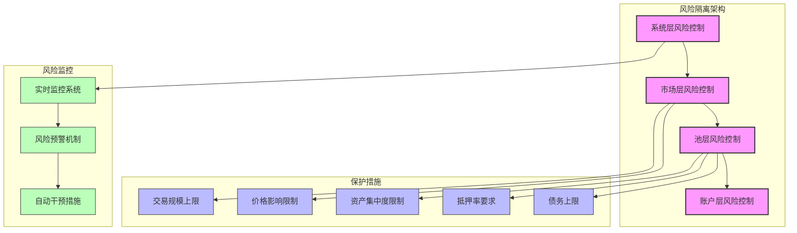
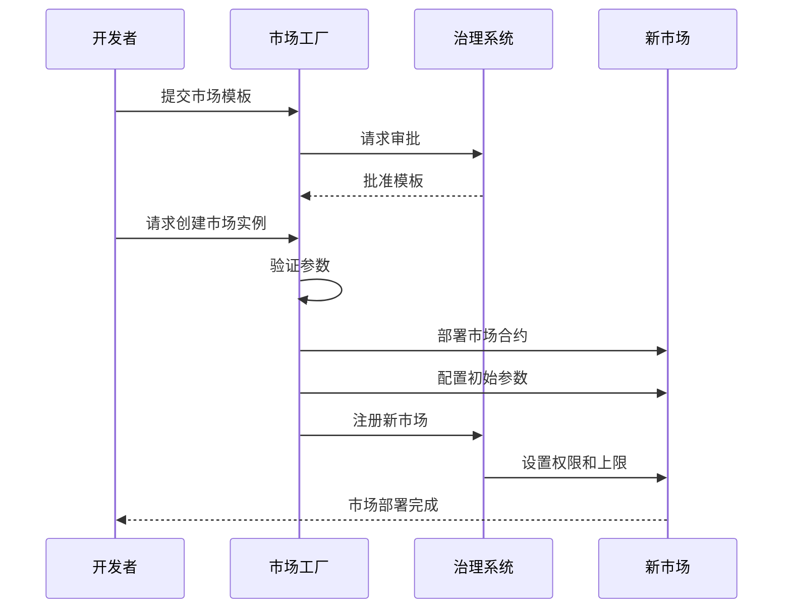
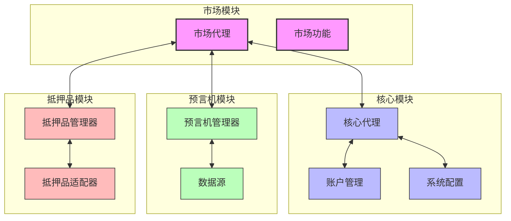
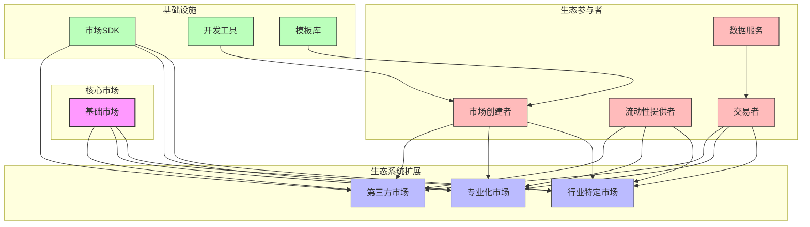

# SynthetixV3 市场模块详细分析

## 1. 市场架构概述

SynthetixV3的市场模块是整个系统中最核心的组件之一，负责管理所有交易相关的逻辑和状态。市场模块采用高度模块化的设计，支持多种不同类型的市场实现。

### 1.1 市场类型与层次结构



## 2. 核心市场合约分析

### 2.1 TreasuryMarket

TreasuryMarket是SynthetixV3的基础市场，主要负责SNX质押和snxUSD铸造的核心功能。

```solidity
// TreasuryMarket简化结构
contract TreasuryMarket {
    // 市场状态变量
    mapping(uint => Position) public positions;
    mapping(uint => Pool) public pools;
    
    // 核心铸造功能
    function mintUsd(uint accountId, uint poolId, uint amount) external {
        // 验证账户权限
        _validateAccountPermission(accountId);
        
        // 获取账户抵押品价值
        uint collateralValue = _getAccountCollateralValue(accountId, poolId);
        
        // 获取当前债务
        uint currentDebt = _getAccountDebt(accountId, poolId);
        uint newDebt = currentDebt + amount;
        
        // 检查抵押率
        uint minCollateralRatio = getMinCollateralRatio(poolId);
        require(
            collateralValue * PRECISION >= newDebt * minCollateralRatio,
            "Insufficient collateral ratio"
        );
        
        // 更新账户债务
        _updateAccountDebt(accountId, poolId, newDebt);
        
        // 铸造snxUSD
        _mintUsd(msg.sender, amount);
        
        emit UsdMinted(accountId, poolId, amount);
    }
    
    // 核心销毁功能
    function burnUsd(uint accountId, uint poolId, uint amount) external {
        // 验证账户权限
        _validateAccountPermission(accountId);
        
        // 获取当前债务
        uint currentDebt = _getAccountDebt(accountId, poolId);
        require(currentDebt >= amount, "Cannot burn more than debt");
        
        // 更新账户债务
        _updateAccountDebt(accountId, poolId, currentDebt - amount);
        
        // 销毁snxUSD
        _burnUsd(msg.sender, amount);
        
        emit UsdBurned(accountId, poolId, amount);
    }
}
```

### 2.2 SpotMarket

SpotMarket允许用户使用多种抵押品铸造和交易合成资产。



## 3. 市场流动性与交易机制

### 3.1 流动性池结构



### 3.2 交易执行流程详解

市场交易的执行遵循严格的流程，包括订单验证、价格确认和头寸更新：

1. **订单提交**：用户通过前端界面或API提交交易订单
2. **参数验证**：市场合约验证订单参数是否有效
3. **抵押品检查**：验证用户是否有足够的抵押品/保证金
4. **价格确认**：从预言机获取最新价格数据
5. **费用计算**：基于当前市场条件计算适用费用
6. **执行交易**：更新用户头寸和市场状态
7. **事件发出**：触发链上事件通知前端和索引器

## 4. 清算机制深入分析

清算是维护系统偿付能力的关键机制，SynthetixV3采用了先进的自动清算系统。

### 4.1 清算触发条件

```solidity
// 清算条件检查逻辑
function isLiquidatable(uint accountId, uint poolId) public view returns (bool) {
    // 获取账户抵押品价值
    uint collateralValue = getAccountCollateralValue(accountId, poolId);
    
    // 获取账户债务
    uint debtValue = getAccountDebt(accountId, poolId);
    
    // 如果没有债务，不需要清算
    if (debtValue == 0) return false;
    
    // 计算当前抵押率
    uint currentRatio = collateralValue * PRECISION / debtValue;
    
    // 获取清算阈值
    uint liquidationThreshold = getLiquidationThreshold(poolId);
    
    // 如果当前抵押率低于清算阈值，头寸可以被清算
    return currentRatio < liquidationThreshold;
}
```

### 4.2 清算流程



### 4.3 清算激励机制

SynthetixV3的清算激励设计旨在确保有足够的经济动机促使清算者参与系统维护：

1. **基础清算奖励**：清算头寸的固定百分比奖励
2. **动态激励系数**：随着抵押率下降，奖励系数增加
3. **优先清算序列**：系统识别最不健康的头寸优先清算
4. **清算折扣**：清算者可以以折扣价获取抵押品
5. **gas优化**：为减少清算成本而优化的合约设计

## 5. 市场费用结构

SynthetixV3市场采用多层次的费用结构，根据市场条件和用户行为动态调整：

### 5.1 费用类型

| 费用类型 | 计算方式 | 目的 | 接收方 |
|---------|---------|------|-------|
| 铸造费 | 铸造金额的百分比 | 抑制过度铸造风险 | 国库/质押者 |
| 赎回费 | 赎回金额的百分比 | 鼓励长期持有 | 国库/质押者 |
| 交易费 | 交易金额的百分比 | 补偿流动性提供者 | 池流动性提供者 |
| 预言机使用费 | 固定费用 | 支付预言机数据成本 | 预言机节点 |
| 清算惩罚费 | 清算金额的百分比 | 鼓励维持健康抵押率 | 清算者/国库 |

### 5.2 动态费用调整

```solidity
// 动态铸造费用计算
function calculateMintingFee(uint amount, uint poolId) public view returns (uint) {
    // 获取基础费率
    uint baseFee = getBaseMintingFee(poolId);
    
    // 获取池使用率
    uint utilization = getPoolUtilization(poolId);
    
    // 根据使用率动态调整费用
    // 使用率越高，费用越高，抑制过度铸造
    uint adjustedFee = baseFee;
    
    if (utilization > TARGET_UTILIZATION) {
        uint utilizationDelta = utilization - TARGET_UTILIZATION;
        uint feeIncrease = utilizationDelta * FEE_COEFFICIENT / PRECISION;
        adjustedFee = baseFee + feeIncrease;
    }
    
    // 应用费率上限
    return Math.min(adjustedFee, MAX_FEE);
}
```

## 6. 市场风险管理

### 6.1 风险隔离机制



### 6.2 黑天鹅事件处理

SynthetixV3设计了专门的机制来处理极端市场波动情况：

1. **紧急暂停**：在检测到异常市场行为时可暂停特定操作
2. **价格延迟机制**：大幅价格变动需要经过一定延迟才生效
3. **渐进式清算**：避免清算瀑布导致的市场崩溃
4. **资金费率加速器**：在极端波动时快速调整资金费率
5. **备用流动性池**：系统维护的应急流动性来源

## 7. 市场扩展能力

### 7.1 插件架构

SynthetixV3的市场模块采用插件式架构，允许无需分叉即可添加新功能：

```solidity
// 市场模块扩展接口
interface IMarketExtension {
    // 扩展初始化
    function initialize(address marketProxy) external;
    
    // 扩展功能接口
    function executeExtension(bytes calldata data) external returns (bytes memory);
    
    // 扩展视图功能
    function viewExtension(bytes calldata data) external view returns (bytes memory);
    
    // 扩展元数据
    function getExtensionInfo() external view returns (ExtensionInfo memory);
}

// 注册扩展
function registerExtension(address extension) external onlyOwner {
    // 验证扩展接口
    require(IERC165(extension).supportsInterface(type(IMarketExtension).interfaceId), "Invalid extension");
    
    // 获取扩展信息
    ExtensionInfo memory info = IMarketExtension(extension).getExtensionInfo();
    
    // 注册扩展
    extensions[info.id] = extension;
    
    // 初始化扩展
    IMarketExtension(extension).initialize(address(this));
    
    emit ExtensionRegistered(info.id, extension);
}
```

### 7.2 自定义市场创建

SynthetixV3允许创建自定义市场类型，这些市场可以有特定的参数和逻辑：



## 8. 市场模块性能优化

### 8.1 Gas优化策略

SynthetixV3在市场合约中实施了多种gas优化策略：

1. **存储优化**：紧密打包存储变量以减少存储槽使用
2. **批量操作**：支持批量处理交易以摊销固定成本
3. **懒加载计算**：仅在必要时计算复杂值
4. **短路评估**：优化条件检查顺序以减少执行路径
5. **事件优化**：精心设计事件参数以减少存储成本

### 8.2 交易吞吐量优化

为了支持高交易量，SynthetixV3市场采用了以下优化手段：

```solidity
// 批量处理交易示例
function batchProcess(
    BatchOperation[] calldata operations
) external returns (bytes[] memory results) {
    results = new bytes[](operations.length);
    
    for (uint i = 0; i < operations.length; i++) {
        BatchOperation memory op = operations[i];
        
        // 根据操作类型调用相应功能
        if (op.opType == OpType.MINT) {
            results[i] = abi.encode(_processMint(op.accountId, op.poolId, op.amount));
        } else if (op.opType == OpType.BURN) {
            results[i] = abi.encode(_processBurn(op.accountId, op.poolId, op.amount));
        } else if (op.opType == OpType.EXCHANGE) {
            results[i] = abi.encode(_processExchange(
                op.accountId,
                op.poolId,
                op.sourceKey,
                op.destKey,
                op.amount
            ));
        }
    }
    
    return results;
}
```

## 9. 市场模块与其他模块集成

### 9.1 与核心模块交互



### 9.2 市场事件与监听器

市场模块触发丰富的事件集合，用于系统监控和前端更新：

```solidity
// 主要市场事件
event PositionOpened(uint indexed accountId, uint indexed poolId, uint collateralAmount);
event PositionModified(uint indexed accountId, uint indexed poolId, uint collateralDelta, int debtDelta);
event PositionClosed(uint indexed accountId, uint indexed poolId);
event PositionLiquidated(uint indexed accountId, uint indexed poolId, address liquidator, uint collateralLiquidated, uint debtLiquidated);
event MarketFeeCharged(uint indexed poolId, uint feeType, uint amount);
event MarketParameterUpdated(uint indexed poolId, bytes32 parameter, uint value);
event MarketPaused(uint indexed poolId);
event MarketResumed(uint indexed poolId);
```

## 10. 未来市场发展方向

### 10.1 规划中的市场功能

SynthetixV3市场模块的未来发展方向包括：

1. **AMM集成**：与去中心化交易所的原生集成
2. **有限订单簿**：支持限价单和止损单
3. **交易者排名系统**：基于性能的交易者排名和激励
4. **复杂衍生品**：支持期权、结构化产品等高级衍生品
5. **隐私交易池**：支持私密交易的特殊池
6. **跨链市场**：在多条链上统一的交易体验
7. **AI驱动的风险管理**：使用机器学习优化风险参数

### 10.2 市场生态系统建设



## 总结

SynthetixV3的市场模块通过其高度模块化和可扩展的设计，为合成资产交易提供了强大的基础设施。该模块不仅支持多种市场类型和交易机制，还实现了高效的风险管理和清算系统，为用户提供流畅安全的交易体验。随着进一步的发展，SynthetixV3市场有望成为DeFi生态系统中最灵活和功能最丰富的合成资产交易平台。 