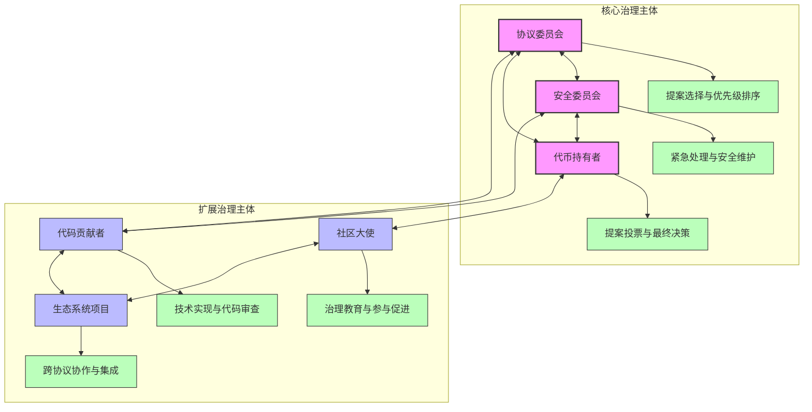
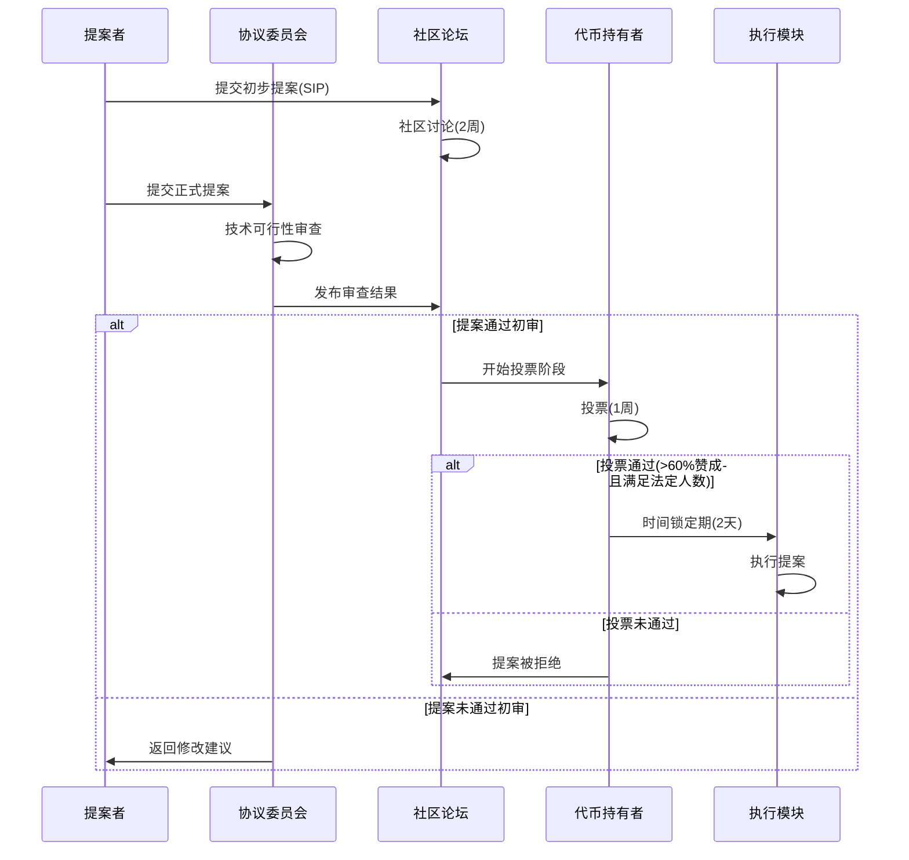
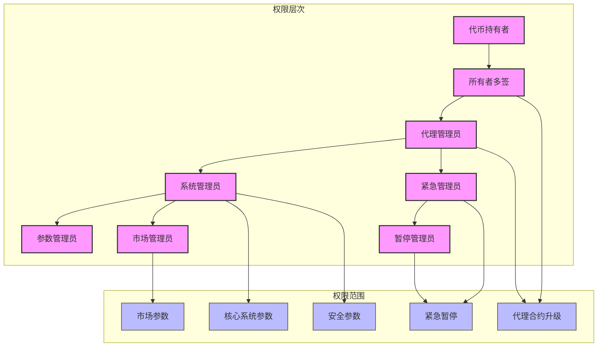
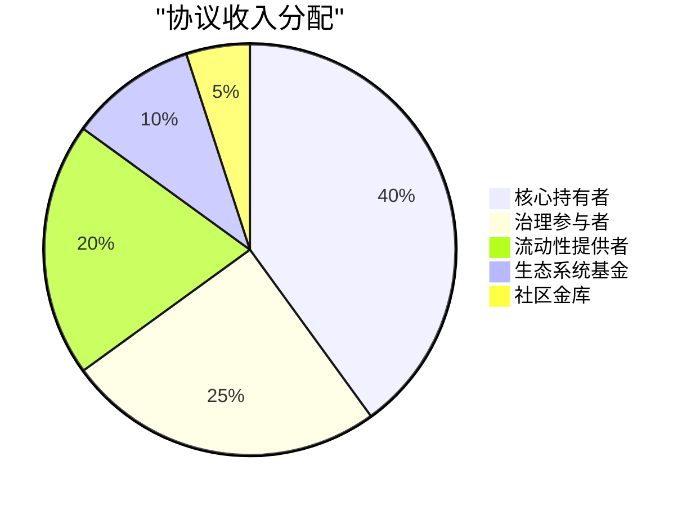
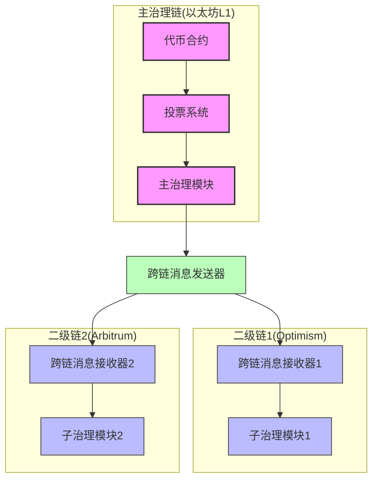
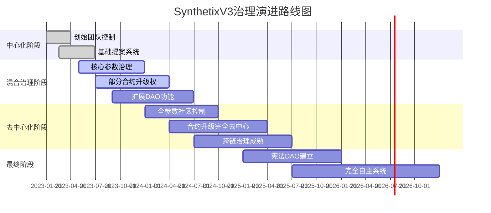
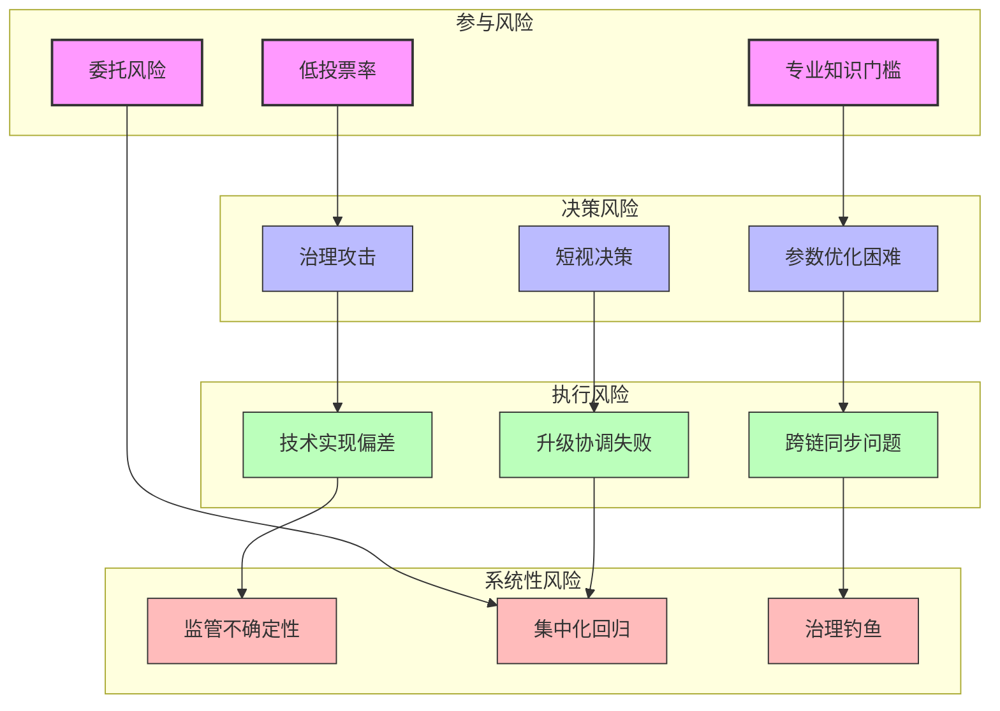

# SynthetixV3 治理系统深度分析

## 1. 治理架构概述

SynthetixV3采用了多层次的去中心化治理架构，旨在平衡效率、安全和社区参与。治理系统在V3中得到了显著增强，为协议的可持续发展提供了坚实基础。

### 1.1 治理主体结构



### 1.2 治理代币与投票权

SynthetixV3采用锁定治理代币模型，通过veToken(投票托管代币)机制赋予长期持有者更大的决策权重：

```solidity
// 简化的投票权重计算
function calculateVotingPower(address user) public view returns (uint256) {
    // 获取用户锁定的代币数量和锁定时间
    Lock memory userLock = locks[user];
    uint256 amount = userLock.amount;
    uint256 endTime = userLock.endTime;
    
    // 如果没有锁定或已过期，没有投票权
    if (amount == 0 || endTime <= block.timestamp) {
        return 0;
    }
    
    // 最大锁定时间(4年)
    uint256 maxLockTime = 4 * 365 days;
    
    // 剩余锁定时间
    uint256 remainingLockTime = endTime - block.timestamp;
    
    // 根据锁定时间计算权重
    // 线性比例：锁定时间越长，权重越大
    uint256 weight = (remainingLockTime * MAX_WEIGHT) / maxLockTime;
    
    // 计算最终投票权
    return (amount * weight) / MAX_WEIGHT;
}
```

## 2. 提案生命周期与决策流程

### 2.1 提案流程详解



### 2.2 投票机制设计

SynthetixV3的投票系统结合了多种机制以实现更公平和高效的决策：

1. **二次投票权重**：投票权重与锁定代币数量的平方根成正比，减少大持有者的过度影响
2. **代表制投票**：允许用户将投票权委托给专业代表，提高小持有者的影响力
3. **提案分类**：根据提案类型设置不同的投票门槛和通过要求
4. **硬共识与软共识**：核心参数变更需要硬共识(更高门槛)，一般提案需要软共识

```solidity
// 提案类型与对应投票要求
struct ProposalRequirements {
    uint256 quorumPercentage;  // 所需最低投票率
    uint256 approvalThreshold; // 所需最低赞成比例
    uint256 votingPeriod;      // 投票持续时间
    uint256 timelock;          // 执行前的时间锁定
}

// 不同类型提案的要求
mapping(ProposalType => ProposalRequirements) public proposalRequirements;

// 初始化提案要求
function initializeProposalRequirements() internal {
    // 核心合约升级 - 最高要求
    proposalRequirements[ProposalType.CONTRACT_UPGRADE] = ProposalRequirements({
        quorumPercentage: 40, // 40%投票率
        approvalThreshold: 75, // 75%赞成
        votingPeriod: 7 days,
        timelock: 48 hours
    });
    
    // 参数调整 - 中等要求
    proposalRequirements[ProposalType.PARAMETER_CHANGE] = ProposalRequirements({
        quorumPercentage: 30,
        approvalThreshold: 65,
        votingPeriod: 5 days,
        timelock: 24 hours
    });
    
    // 资金分配 - 标准要求
    proposalRequirements[ProposalType.TREASURY_SPENDING] = ProposalRequirements({
        quorumPercentage: 20,
        approvalThreshold: 60,
        votingPeriod: 5 days,
        timelock: 24 hours
    });
}
```

## 3. 时间锁与安全模块

### 3.1 时间锁机制

时间锁是SynthetixV3治理安全的关键组件，它在提案通过与执行之间引入延迟，为社区提供审查和应对恶意提案的机会：

```solidity
// 时间锁合约简化代码
contract TimelockController {
    // 时间锁队列
    struct QueuedTransaction {
        bytes32 txHash;
        address target;
        uint value;
        bytes data;
        uint timestamp;
    }
    
    // 时间锁延迟
    uint public delay;
    
    // 交易队列
    mapping(bytes32 => QueuedTransaction) public queue;
    
    // 将交易加入队列
    function queueTransaction(
        address target,
        uint value,
        bytes calldata data
    ) external onlyGovernance returns (bytes32) {
        bytes32 txHash = keccak256(abi.encode(target, value, data));
        
        // 计划执行时间 = 当前时间 + 延迟
        uint executionTime = block.timestamp + delay;
        
        // 加入队列
        queue[txHash] = QueuedTransaction({
            txHash: txHash,
            target: target,
            value: value,
            data: data,
            timestamp: executionTime
        });
        
        emit TransactionQueued(txHash, target, value, data, executionTime);
        
        return txHash;
    }
    
    // 执行队列中的交易
    function executeTransaction(
        address target,
        uint value,
        bytes calldata data
    ) external payable onlyGovernance returns (bytes memory) {
        bytes32 txHash = keccak256(abi.encode(target, value, data));
        
        // 验证交易是否在队列中且延迟已过
        QueuedTransaction memory queuedTx = queue[txHash];
        require(queuedTx.timestamp > 0, "Transaction not queued");
        require(block.timestamp >= queuedTx.timestamp, "Timelock not expired");
        
        // 从队列中移除
        delete queue[txHash];
        
        // 执行交易
        (bool success, bytes memory returnData) = target.call{value: value}(data);
        require(success, "Transaction execution failed");
        
        emit TransactionExecuted(txHash, target, value, data);
        
        return returnData;
    }
    
    // 取消队列中的交易
    function cancelTransaction(
        address target,
        uint value,
        bytes calldata data
    ) external onlyGovernance {
        bytes32 txHash = keccak256(abi.encode(target, value, data));
        
        // 验证交易是否在队列中
        require(queue[txHash].timestamp > 0, "Transaction not queued");
        
        // 从队列中移除
        delete queue[txHash];
        
        emit TransactionCancelled(txHash, target, value, data);
    }
}
```

### 3.2 紧急处理机制

为应对可能的漏洞或攻击，SynthetixV3设计了严格的紧急处理流程：

```mermaid
graph TD
    A[漏洞发现或异常检测] --> B{是否需要紧急应对?}
    
    B -->|是| C[安全委员会评估]
    B -->|否| D[常规治理流程]
    
    C --> E{风险等级评估}
    
    E -->|严重风险| F[触发紧急暂停]
    E -->|中等风险| G[准备快速修复提案]
    E -->|低风险| H[标准修复流程]
    
    F --> I[系统关键功能暂停]
    F --> J[部署临时缓解措施]
    
    G --> K[简化投票流程]
    G --> L[缩短时间锁延迟]
    
    I --> M[开发修复方案]
    J --> M
    K --> N[社区投票批准]
    L --> N
    
    M --> O[安全委员会审查]
    N --> O
    H --> O
    
    O --> P[部署修复]
    P --> Q[恢复系统功能]
    
    classDef start fill:#f9f,stroke:#333,stroke-width:2px
    classDef process fill:#bbf,stroke:#333,stroke-width:1px
    classDef decision fill:#bfb,stroke:#333,stroke-width:1px
    classDef end fill:#fbb,stroke:#333,stroke-width:1px
    
    class A start
    class B,E decision
    class C,D,F,G,H,I,J,K,L,M,N,O,P process
    class Q end
```

## 4. 链下治理与链上执行

### 4.1 链下讨论平台

SynthetixV3的治理依赖于多个链下平台，以促进深入讨论和社区参与：

| 平台 | 主要用途 | 参与者 |
|------|---------|--------|
| Discord | 日常讨论和非正式提案 | 所有社区成员 |
| 论坛 (discourse) | 正式SIP讨论和细节辩论 | 核心成员和积极参与者 |
| 研究仓库 | 技术规范和设计文档 | 技术团队和贡献者 |
| 社区电话会议 | 双周同步讨论和进度更新 | 核心团队和社区 |
| 社交媒体 | 公告和广泛反馈收集 | 整个生态系统 |

### 4.2 链上执行架构

链下讨论达成共识后，提案通过链上投票并由执行模块实现：

```solidity
// 治理执行器简化代码
contract GovernanceExecutor {
    // 管理员角色
    bytes32 public constant ADMIN_ROLE = keccak256("ADMIN_ROLE");
    
    // 提案执行器角色
    bytes32 public constant EXECUTOR_ROLE = keccak256("EXECUTOR_ROLE");
    
    // 角色管理
    mapping(bytes32 => mapping(address => bool)) public roles;
    
    // 可执行目标白名单
    mapping(address => bool) public allowedTargets;
    
    // 执行批处理调用
    function executeBatch(
        address[] calldata targets,
        uint256[] calldata values,
        bytes[] calldata calldatas
    ) external onlyRole(EXECUTOR_ROLE) {
        require(targets.length == values.length, "Array length mismatch");
        require(targets.length == calldatas.length, "Array length mismatch");
        
        for (uint256 i = 0; i < targets.length; i++) {
            // 检查目标是否在白名单中
            require(allowedTargets[targets[i]], "Target not allowed");
            
            // 执行调用
            (bool success, ) = targets[i].call{value: values[i]}(calldatas[i]);
            require(success, string(abi.encodePacked("Call to target failed: ", i)));
        }
        
        emit BatchExecuted(targets, values, calldatas);
    }
    
    // 添加允许的目标合约
    function addAllowedTarget(address target) external onlyRole(ADMIN_ROLE) {
        allowedTargets[target] = true;
        emit TargetAllowed(target);
    }
    
    // 移除允许的目标合约
    function removeAllowedTarget(address target) external onlyRole(ADMIN_ROLE) {
        allowedTargets[target] = false;
        emit TargetDisallowed(target);
    }
}
```

## 5. 代理结构与可升级性治理

### 5.1 代理治理权限层次

SynthetixV3的代理合约使用精细的权限控制，建立治理层次结构：



### 5.2 升级控制机制

合约升级是最敏感的治理操作，SynthetixV3实施了多层控制：

```solidity
// 可升级代理的访问控制
contract AccessControlledProxy {
    // 实现合约地址
    address public implementation;
    
    // 管理员地址
    address public admin;
    
    // 提案系统地址
    address public proposalSystem;
    
    // 时间锁地址
    address public timelock;
    
    // 升级提案状态
    struct UpgradeProposal {
        address proposedImplementation;
        uint256 proposalTime;
        bool approved;
    }
    
    // 当前升级提案
    UpgradeProposal public currentProposal;
    
    // 提议升级实现
    function proposeUpgrade(address newImplementation) external {
        // 只有提案系统可以提议升级
        require(msg.sender == proposalSystem, "Only proposal system can propose");
        
        // 验证新实现合约
        require(_isValidImplementation(newImplementation), "Invalid implementation");
        
        // 创建新的升级提案
        currentProposal = UpgradeProposal({
            proposedImplementation: newImplementation,
            proposalTime: block.timestamp,
            approved: false
        });
        
        emit UpgradeProposed(newImplementation);
    }
    
    // 批准升级
    function approveUpgrade() external {
        // 只有时间锁可以批准升级
        require(msg.sender == timelock, "Only timelock can approve");
        
        // 确保提案存在且未过期
        require(currentProposal.proposedImplementation != address(0), "No active proposal");
        require(block.timestamp - currentProposal.proposalTime <= 7 days, "Proposal expired");
        
        // 标记为已批准
        currentProposal.approved = true;
        
        emit UpgradeApproved(currentProposal.proposedImplementation);
    }
    
    // 执行升级
    function executeUpgrade() external {
        // 只有管理员可以执行升级
        require(msg.sender == admin, "Only admin can execute");
        
        // 确保提案已批准
        require(currentProposal.approved, "Upgrade not approved");
        
        // 执行升级
        address newImplementation = currentProposal.proposedImplementation;
        implementation = newImplementation;
        
        // 清除当前提案
        delete currentProposal;
        
        emit UpgradeExecuted(newImplementation);
    }
    
    // 验证实现合约
    function _isValidImplementation(address impl) internal view returns (bool) {
        // 实现必须是合约
        uint256 codeSize;
        assembly { codeSize := extcodesize(impl) }
        if (codeSize == 0) return false;
        
        // 检查实现是否支持必要的接口
        try IImplementation(impl).supportsInterface(0x01ffc9a7) returns (bool supported) {
            return supported;
        } catch {
            return false;
        }
    }
}
```

## 6. 激励治理参与机制

### 6.1 投票激励设计

SynthetixV3实施了多种机制来鼓励治理参与：

1. **投票奖励**：参与投票的代币持有者可获得额外的协议收益
2. **提案赏金**：高质量提案的作者可获得SNX代币奖励
3. **代表激励**：委托投票权的代表根据其性能和投票历史获得奖励
4. **长期持有奖励**：锁定代币时间越长，获得的治理奖励越多

```solidity
// 投票奖励计算
function calculateVotingReward(address voter, uint256 proposalId) public view returns (uint256) {
    // 获取提案信息
    Proposal memory proposal = proposals[proposalId];
    
    // 检查用户是否已投票
    require(hasVoted(proposalId, voter), "User did not vote");
    
    // 获取用户的投票权重
    uint256 votingPower = getVotingPowerAt(voter, proposal.snapshotBlock);
    
    // 获取提案的总投票权重
    uint256 totalVotingPower = getTotalVotingPowerAt(proposal.snapshotBlock);
    
    // 基础奖励率
    uint256 baseReward = proposal.rewardPool;
    
    // 计算用户份额
    return (votingPower * baseReward) / totalVotingPower;
}
```

### 6.2 协议收入分配机制

SynthetixV3将协议收入的一部分分配给活跃的治理参与者：



## 7. 治理数据分析与透明度

### 7.1 治理数据面板

SynthetixV3开发了全面的治理数据分析工具，提供关键指标的实时监控：

| 指标类别 | 关键指标 | 用途 |
|---------|---------|------|
| 参与度 | 投票率、活跃提案者数量 | 评估社区活跃度 |
| 代币分布 | 锁定率、集中度系数 | 监控权力分散程度 |
| 提案分析 | 通过率、平均讨论时长 | 评估治理效率 |
| 执行跟踪 | 参数变更频率、升级次数 | 监控系统演变 |
| 安全指标 | 时间锁使用、紧急操作频率 | 监控治理风险 |

### 7.2 治理透明度措施

为确保治理透明度，SynthetixV3实施了多项措施：

1. **链上提案存储**：所有提案的完整细节永久存储在链上
2. **投票记录追踪**：所有投票记录可公开查询和验证
3. **治理论坛存档**：所有链下讨论保存于可搜索的公开存档
4. **参数变更日志**：系统参数的所有变更记录在链上事件日志中
5. **执行追踪系统**：所有治理决策的执行状态可实时查询

## 8. 跨链治理架构

### 8.1 多链治理模型

SynthetixV3部署在多个链上，采用以下跨链治理模型：



### 8.2 跨链消息传递

跨链治理决策通过安全的消息桥从主链传递到其他链：

```solidity
// 跨链治理消息发送器
contract CrossChainGovernanceMessenger {
    // 消息类型
    enum MessageType {
        PARAMETER_UPDATE,
        CONTRACT_UPGRADE,
        EMERGENCY_ACTION,
        MARKET_CONFIGURATION
    }
    
    // 跨链桥接口
    ICrossChainBridge public bridge;
    
    // 目标链治理接收器地址映射
    mapping(uint256 => address) public targetChainReceivers;
    
    // 发送跨链治理消息
    function sendGovernanceMessage(
        uint256 targetChainId,
        MessageType messageType,
        bytes calldata payload
    ) external onlyGovernance {
        // 获取目标链接收器地址
        address receiver = targetChainReceivers[targetChainId];
        require(receiver != address(0), "Receiver not configured");
        
        // 编码完整消息
        bytes memory message = abi.encode(
            messageType,
            block.timestamp,
            msg.sender,
            payload
        );
        
        // 通过桥发送消息
        uint256 messageFee = bridge.estimateMessageFee(targetChainId, receiver, message);
        bridge.sendMessage{value: messageFee}(targetChainId, receiver, message);
        
        emit GovernanceMessageSent(targetChainId, uint8(messageType), payload);
    }
    
    // 配置目标链接收器
    function setTargetChainReceiver(uint256 chainId, address receiver) external onlyOwner {
        targetChainReceivers[chainId] = receiver;
        emit ReceiverConfigured(chainId, receiver);
    }
}

// 跨链治理消息接收器
contract CrossChainGovernanceReceiver {
    // 源链治理发送器地址
    address public sourceChainSender;
    
    // 源链ID
    uint256 public sourceChainId;
    
    // 跨链桥接口
    ICrossChainBridge public bridge;
    
    // 执行器
    address public executor;
    
    // 接收跨链消息
    function receiveMessage(bytes calldata message) external {
        // 验证消息来源
        require(bridge.validateSender(sourceChainId, sourceChainSender), "Invalid sender");
        
        // 解码消息
        (
            uint8 messageType,
            uint256 timestamp,
            address sourceGovernance,
            bytes memory payload
        ) = abi.decode(message, (uint8, uint256, address, bytes));
        
        // 验证消息时效性
        require(block.timestamp - timestamp <= 1 days, "Message expired");
        
        // 执行治理操作
        IGovernanceExecutor(executor).executeGovernanceAction(
            MessageType(messageType),
            sourceGovernance,
            payload
        );
        
        emit MessageReceived(sourceChainId, MessageType(messageType), payload);
    }
}
```

## 9. 治理演进与迁移计划

### 9.1 治理演进路线图

SynthetixV3的治理系统按照以下路线图逐步演进：



### 9.2 去中心化进程指标

SynthetixV3使用以下关键指标来衡量治理去中心化的进展：

| 指标 | 初始阶段 | 中期目标 | 最终目标 |
|------|---------|---------|---------|
| 纳什均衡投票权 | <0.3 | >0.5 | >0.7 |
| 提案来源多样性 | <20%非核心团队 | >50%非核心团队 | >80%非核心团队 |
| 决策执行分散度 | 1个多签 | 3+个多签 | 5+个多签 |
| 参与者地理分布 | <10个国家 | >30个国家 | >50个国家 |
| 时间锁控制分散 | 单一实体 | 多实体联合 | 完全分散 |

## 10. 治理风险与挑战

### 10.1 主要风险点



### 10.2 风险缓解策略

| 风险类别 | 缓解策略 | 实施阶段 |
|---------|---------|---------|
| 低投票率 | 投票激励机制、治理代表制 | 已实施 |
| 治理攻击 | 时间锁、多层审核、投票权重限制 | 已实施 |
| 参数优化困难 | 仿真工具、参数变更影响分析 | 进行中 |
| 技术实施偏差 | 形式化验证、预部署测试 | 进行中 |
| 跨链同步问题 | 强一致性协议、故障容错机制 | 规划中 |
| 监管不确定性 | 法律工作组、灵活适应机制 | 规划中 |
| 集中化回归 | 去中心化指标跟踪、社区警戒机制 | 规划中 |

## 总结

SynthetixV3的治理系统代表了DeFi治理的最新发展，通过多层次的权力分配、精细的控制机制和创新的参与激励，为协议的长期可持续发展奠定了基础。系统在保持高效决策能力的同时，也实现了广泛的社区参与和充分的安全保障。随着治理系统按路线图逐步演进，SynthetixV3有望实现真正的去中心化自治组织，为DeFi领域的治理实践树立新标准。 