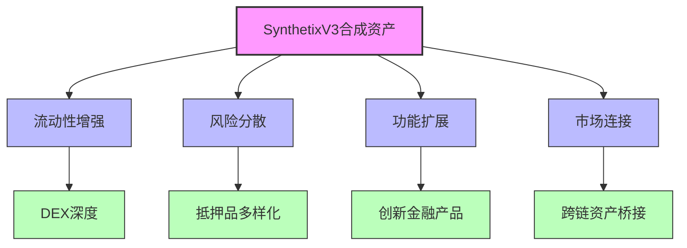
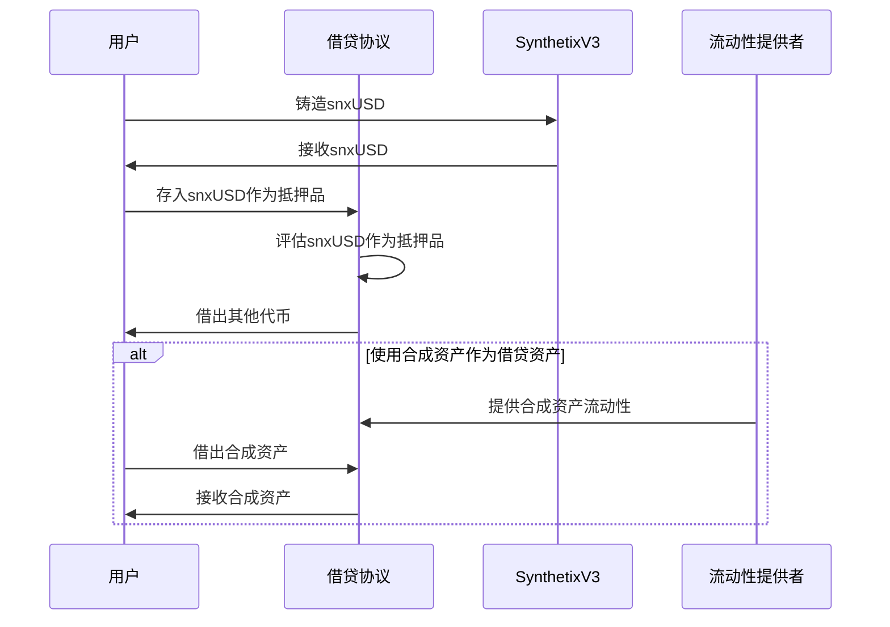
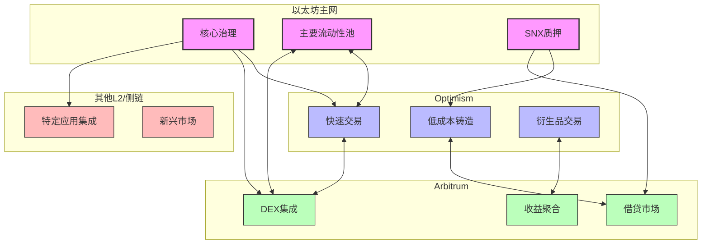

# SynthetixV3 合成资产生态集成研究

## 1. 合成资产的跨协议价值

SynthetixV3的合成资产体系具有强大的跨协议价值，通过多种集成模式为整个DeFi生态提供流动性和创新功能。新架构允许与各类DeFi协议建立更紧密和更灵活的互操作性。

### 1.1 集成价值模型



## 2. 主要生态集成模式

### 2.1 与DEX协议集成

SynthetixV3的合成资产为去中心化交易所提供了增强流动性的关键解决方案：

| DEX类型 | 集成模式 | 优势 | 主要合作伙伴 |
|---------|---------|------|------------|
| AMM | 合成资产流动性池 | 深度提升、无滑点交易 | Uniswap、Curve |
| 订单簿 | 合成资产做市 | 增加流动性、降低价差 | dYdX、Serum |
| 聚合器 | 合成资产路由 | 优化交易路径、提高效率 | 1inch、Cowswap |

集成代码示例（与Uniswap V3集成）：

```solidity
// 将snxUSD添加到Uniswap V3池
function integrateWithUniswapV3(
    address snxUSD,
    address token,
    uint24 fee,
    uint160 sqrtPriceX96
) external returns (address pool) {
    // 创建新的流动性池
    pool = IUniswapV3Factory(factory).createPool(
        snxUSD,
        token,
        fee
    );
    
    // 初始化价格
    IUniswapV3Pool(pool).initialize(sqrtPriceX96);
    
    // 设置价格预言机集成
    IOracleAdapter(oracleAdapter).registerPool(pool, snxUSD, token);
    
    return pool;
}
```

### 2.2 与借贷协议集成

SynthetixV3的合成资产在DeFi借贷平台中扮演着重要角色：



主要借贷协议集成案例：

1. **Aave集成**：snxUSD被添加为抵押品和借贷资产，利用Aave的风险参数框架
2. **Compound集成**：提供cSNX代币，允许用户在赚取利息的同时参与治理
3. **Euler集成**：合成资产成为分级抵押品，适用于不同风险偏好

### 2.3 与衍生品协议集成

SynthetixV3的合成资产系统与衍生品平台结合创造了创新的金融工具：

| 衍生品类型 | 集成模式 | 应用场景 |
|-----------|---------|---------|
| 期权协议 | 合成资产作为结算货币 | 跨资产期权、无需结算 |
| 永续合约 | 合成资产作为保证金 | 减少清算风险、增强杠杆效率 |
| 结构化产品 | 合成资产作为底层资产 | 创建复杂收益曲线产品 |

## 3. 跨链集成架构

### 3.1 多链部署模型

SynthetixV3设计了高效的跨链集成架构，允许合成资产在多个区块链生态系统中流通：



### 3.2 跨链消息传递

SynthetixV3实现了高效的跨链通信，确保合成资产在不同链上的一致性：

```solidity
// 跨链合成资产传输简化代码
function bridgeSyntheticAsset(
    uint256 targetChainId,
    address recipient,
    address syntheticAsset,
    uint256 amount
) external {
    // 验证发送者拥有足够的余额
    require(IERC20(syntheticAsset).balanceOf(msg.sender) >= amount, "Insufficient balance");
    
    // 在源链锁定或销毁资产
    IERC20(syntheticAsset).transferFrom(msg.sender, address(this), amount);
    
    // 生成跨链消息
    bytes memory message = abi.encode(
        recipient,
        syntheticAsset,
        amount,
        block.timestamp
    );
    
    // 通过跨链桥发送消息
    uint256 messageFee = bridge.estimateMessageFee(targetChainId, message);
    bridge.sendMessage{value: messageFee}(targetChainId, message);
    
    emit AssetBridged(msg.sender, recipient, targetChainId, syntheticAsset, amount);
}
```

## 4. 流动性协议集成

### 4.1 LP与流动性激励

SynthetixV3创新的流动性提供机制允许更深入的协议集成：

1. **双重激励模型**：合成资产LP提供者可以同时获得SNX和集成协议的原生代币奖励
2. **定向流动性**：根据市场需求动态调整流动性分配
3. **交叉抵押品**：允许使用合作协议代币作为SynthetixV3中的抵押品

### 4.2 实际集成示例

与Curve Finance的深度集成：

```solidity
// Curve池集成接口
interface ICurveIntegration {
    function addSyntheticAssetToPool(
        address syntheticAsset,
        address existingPool,
        uint256 A,
        uint256 fee
    ) external returns (address newPool);
    
    function provideInitialLiquidity(
        address pool,
        uint256[2] calldata amounts,
        uint256 minMintAmount
    ) external returns (uint256 lpTokens);
}

// 实现集成
contract SynthetixCurveIntegration is ICurveIntegration {
    address public snxSystem;
    address public curveFactory;
    
    // 添加合成资产到Curve池
    function addSyntheticAssetToPool(
        address syntheticAsset,
        address existingPool,
        uint256 A,
        uint256 fee
    ) external override onlyOwner returns (address newPool) {
        // 与Curve工厂交互创建新池
        // ...集成逻辑
        
        // 设置价格预言机集成
        // ...预言机设置
        
        // 开启激励
        // ...激励设置
        
        return newPool;
    }
}
```

## 5. 创新应用场景

### 5.1 与实际应用的集成案例

SynthetixV3的合成资产在各类DeFi应用中的创新用例：

| 应用类型 | 集成方式 | 创新点 |
|---------|---------|-------|
| DAO国库管理 | snxUSD作为储备货币 | 稳定且可编程的国库资产 |
| 收益聚合器 | 合成资产收益策略 | 无需交换的跨资产收益优化 |
| 保险协议 | 风险对冲工具 | 参数化保险产品 |
| 支付系统 | 稳定交易媒介 | 低滑点大额支付解决方案 |
| NFT金融化 | 合成资产抵押NFT | 提高NFT流动性和价值发现 |

### 5.2 未来集成方向

SynthetixV3计划中的生态系统扩展方向：

1. **DeFi操作系统**：作为底层合成资产基础设施，支持各类应用构建
2. **跨链金融中心**：成为不同区块链间价值转移的核心枢纽
3. **实物资产合成化**：扩展到代币化房地产、商品和其他传统资产
4. **可组合性网络**：建立标准化接口，促进与其他DeFi协议的无缝集成

## 6. 集成的技术与安全考量

### 6.1 预言机协同机制

SynthetixV3与集成协议间的预言机协同至关重要：

```solidity
// 集成协议预言机协同示例
contract OracleCoordination {
    IOracleManager public synthetixOracle;
    address public externalOracle;
    
    function getCoordinatedPrice(address asset) public view returns (uint256) {
        // 获取Synthetix预言机价格
        uint256 synthetixPrice = synthetixOracle.getPrice(asset);
        
        // 获取外部协议预言机价格
        uint256 externalPrice = IExternalOracle(externalOracle).getAssetPrice(asset);
        
        // 协调价格策略
        if (isSignificantDeviation(synthetixPrice, externalPrice)) {
            // 触发偏差处理
            return calculateMedianPrice(synthetixPrice, externalPrice);
        }
        
        // 默认使用Synthetix价格
        return synthetixPrice;
    }
}
```

### 6.2 风险隔离策略

为确保生态集成的安全，SynthetixV3实施了多层次的风险隔离策略：

1. **集成协议白名单**：只有经过审核和批准的协议才能获得特权集成
2. **风险参数调整**：根据集成协议的风险特性动态调整参数
3. **渐进式集成**：分阶段增加集成深度和互操作性
4. **紧急断路机制**：在检测到异常时能够快速隔离风险

## 总结

SynthetixV3的合成资产生态集成代表了DeFi协议间互操作性的新高度。通过提供灵活、可编程的合成资产基础设施，Synthetix不仅扩展了自身的应用场景，还为整个DeFi生态系统注入了新的流动性和创新可能。市场隔离设计和模块化架构使V3能够以前所未有的灵活性与各类协议集成，同时维持系统的安全性和稳定性。随着V3的持续发展，其生态集成网络将进一步扩大，最终可能成为连接不同DeFi协议和区块链的核心基础设施。 