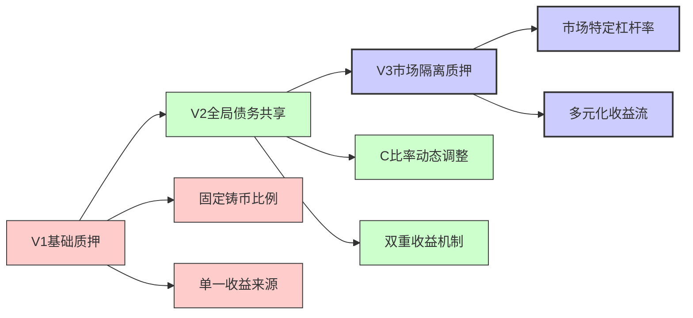
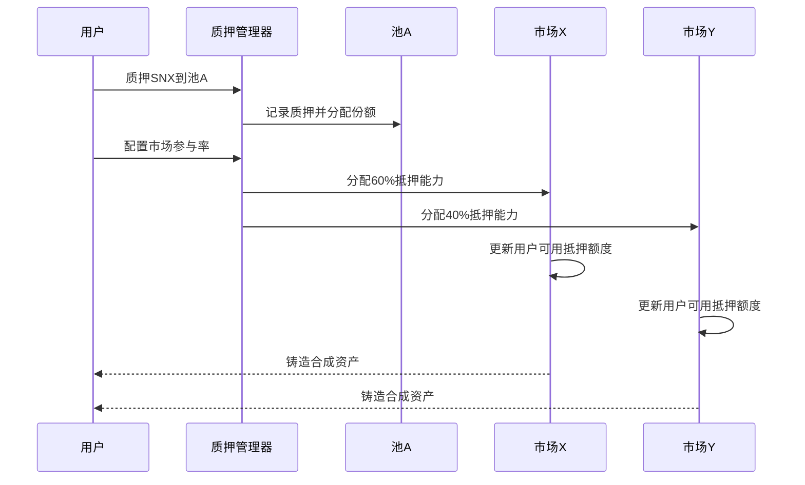
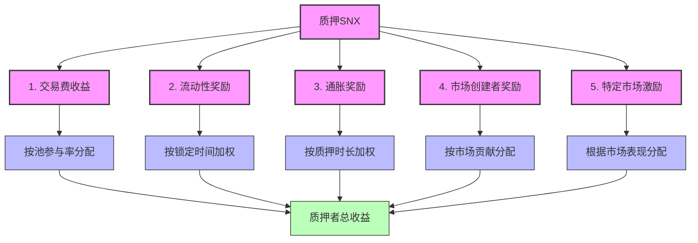
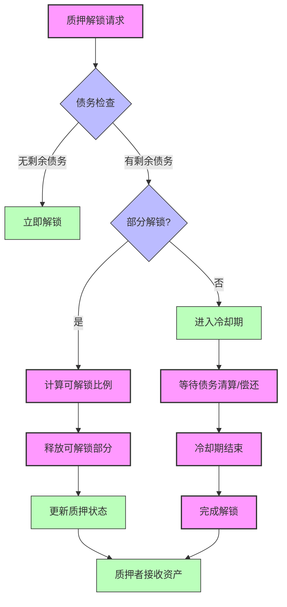

# SynthetixV3 质押机制优化研究

## 1. 质押模型演进

SynthetixV3对V2的质押机制进行了全面优化，从根本上改变了质押资产的使用方式和收益结构，更好地平衡了资本效率、风险管理和激励机制。

### 1.1 质押机制演进历程



## 2. 市场隔离质押设计

### 2.1 质押资产池化结构

SynthetixV3的质押系统采用了全新的资产池化结构，允许质押者更灵活地管理风险敞口：

```solidity
// 质押池结构简化代码
struct StakingPool {
    // 池ID
    uint128 poolId;
    
    // 池名称
    string name;
    
    // 接受的抵押品类型
    address[] collateralTypes;
    
    // 抵押品权重
    mapping(address => uint256) collateralWeights;
    
    // 池总价值
    uint256 totalPoolValue;
    
    // 支持的市场ID列表
    uint128[] supportedMarketIds;
    
    // 市场配置
    mapping(uint128 => MarketConfig) marketConfigurations;
    
    // 池参数
    PoolParameters parameters;
}
```

### 2.2 市场参与灵活性

V3创新性地实现了多市场支持，质押者可以选择将其抵押品分配给不同市场：



## 3. 资本效率优化

### 3.1 杠杆率动态调整

SynthetixV3实现了基于市场风险特性的杠杆率动态调整：

| 市场类型 | 典型杠杆率范围 | 调整因素 | 效率提升 |
|---------|--------------|----------|---------|
| 国库市场 | 400%-1000% | 固定收益特性 | 最高 |
| 蓝筹合成资产 | 200%-400% | 流动性、波动性 | 高 |
| 波动性资产 | 120%-200% | 价格波动历史 | 中等 |
| 新兴资产 | 110%-150% | 风险评估、市场深度 | 低 |

### 3.2 多抵押品策略

V3支持在同一质押池中混合使用多种抵押品，通过智能权重分配最大化资本效率：

```solidity
// 抵押品组合权重计算
function calculateOptimalCollateralWeights(
    address[] memory collateralAssets,
    uint256[] memory amounts
) external view returns (uint256[] memory weights) {
    uint256[] memory volatilities = new uint256[](collateralAssets.length);
    uint256[][] memory correlations = new uint256[][](collateralAssets.length);
    
    // 获取每个资产的波动率
    for (uint256 i = 0; i < collateralAssets.length; i++) {
        volatilities[i] = getAssetVolatility(collateralAssets[i]);
        correlations[i] = new uint256[](collateralAssets.length);
    }
    
    // 获取资产间相关性
    for (uint256 i = 0; i < collateralAssets.length; i++) {
        for (uint256 j = i; j < collateralAssets.length; j++) {
            uint256 correlation = getAssetCorrelation(collateralAssets[i], collateralAssets[j]);
            correlations[i][j] = correlation;
            correlations[j][i] = correlation;
        }
    }
    
    // 计算最优权重（风险平价方法简化）
    weights = calculateRiskParityWeights(volatilities, correlations, amounts);
    
    return weights;
}
```

## 4. 质押收益结构创新

### 4.1 多元化收益来源

SynthetixV3为质押者提供了多样化的收益来源：



### 4.2 收益分配算法

V3实现了精细化的收益分配算法，确保质押者获得与其风险贡献相匹配的收益：

```solidity
// 质押者收益计算
function calculateStakerRewards(
    address staker,
    uint128 poolId,
    uint256 fromTime,
    uint256 toTime
) public view returns (uint256 totalRewards) {
    // 获取质押者在池中的份额
    uint256 stakerPoolShare = getStakerPoolShare(staker, poolId);
    
    // 获取池总份额
    uint256 totalPoolShares = getTotalPoolShares(poolId);
    
    // 获取池在各市场的配置
    StakingPool memory pool = stakingPools[poolId];
    uint128[] memory markets = pool.supportedMarketIds;
    
    // 累计所有市场的收益
    for (uint256 i = 0; i < markets.length; i++) {
        uint128 marketId = markets[i];
        
        // 获取市场在时间段内产生的收益
        uint256 marketRewards = getMarketRewards(marketId, fromTime, toTime);
        
        // 获取池在该市场的参与率
        uint256 poolMarketShare = getPoolMarketShare(poolId, marketId);
        
        // 计算质押者从该市场获得的收益
        uint256 stakerMarketReward = (marketRewards * poolMarketShare / PRECISION) * stakerPoolShare / totalPoolShares;
        
        // 累加到总收益
        totalRewards += stakerMarketReward;
    }
    
    // 添加通胀奖励
    totalRewards += calculateInflationRewards(staker, poolId, fromTime, toTime);
    
    return totalRewards;
}
```

## 5. 流动性增强机制

### 5.1 流动性挖矿创新

SynthetixV3设计了创新的流动性挖矿机制，激励更多高质量的流动性：

| 流动性类型 | 奖励倍数 | 适用场景 | 目标效果 |
|-----------|--------|---------|---------|
| 稳定币配对 | 1.0x | 基础流动性 | 维持深度 |
| 长期锁定流动性 | 1.2x-2.0x | 核心市场 | 降低波动性 |
| 低滑点提供者 | 1.1x-1.5x | 波动市场 | 提高交易效率 |
| 双边流动性 | 1.3x-1.8x | 新兴市场 | 促进价格发现 |
| 跨市场LP | 1.2x-1.7x | 协同市场 | 增加互操作性 |

### 5.2 流动性质押联动

V3创新性地建立了质押与流动性提供的联动机制，质押者可以额外获得LP激励：

```solidity
// LP-质押联动奖励
function calculateLPStakingBonus(
    address account,
    uint128 poolId,
    uint128 marketId
) public view returns (uint256 bonus) {
    // 获取账户在池中的质押份额
    uint256 stakingShare = getStakerPoolShare(account, poolId);
    
    // 获取账户在市场中的LP份额
    uint256 lpShare = getLPShare(account, marketId);
    
    // 如果没有LP或质押，没有奖励
    if (stakingShare == 0 || lpShare == 0) {
        return 0;
    }
    
    // 获取市场的LP总份额
    uint256 totalLpShares = getTotalLPShares(marketId);
    
    // 获取市场的LP奖励系数
    uint256 marketLPMultiplier = getMarketLPMultiplier(marketId);
    
    // 计算基础奖励
    uint256 baseBonus = stakingShare * lpShare / totalLpShares;
    
    // 应用市场特定乘数
    bonus = baseBonus * marketLPMultiplier / PRECISION;
    
    return bonus;
}
```

## 6. 质押解锁与迁移优化

### 6.1 灵活解锁机制

V3实现了更加灵活的质押解锁机制，允许质押者根据市场条件调整战略：



### 6.2 跨市场质押迁移

V3支持质押资产的高效跨市场迁移，无需解锁和重新质押的复杂过程：

```solidity
// 跨市场质押迁移
function migrateStake(
    address staker,
    uint128 fromPoolId,
    uint128 toPoolId,
    uint256 amount,
    uint128[] calldata marketIds
) external {
    // 验证发起者
    require(msg.sender == staker || isApprovedManager(staker, msg.sender), "Not authorized");
    
    // 验证质押量
    uint256 stakerBalance = getStakerPoolBalance(staker, fromPoolId);
    require(stakerBalance >= amount, "Insufficient balance");
    
    // 检查市场债务状态
    for (uint256 i = 0; i < marketIds.length; i++) {
        uint128 marketId = marketIds[i];
        require(canMigrateFromMarket(staker, fromPoolId, marketId), "Market debt not cleared");
    }
    
    // 从源池减少质押
    _decreaseStake(staker, fromPoolId, amount);
    
    // 添加到目标池
    _increaseStake(staker, toPoolId, amount);
    
    // 更新市场配置
    for (uint256 i = 0; i < marketIds.length; i++) {
        _updateMarketStakeAllocation(staker, marketIds[i], fromPoolId, toPoolId);
    }
    
    emit StakeMigrated(staker, fromPoolId, toPoolId, amount, marketIds);
}
```

## 7. 治理与质押联动

### 7.1 质押加权投票

SynthetixV3实现了基于质押的加权投票机制，质押时长和数量共同决定治理权重：

```solidity
// 投票权重计算
function calculateVotingPower(
    address voter,
    uint128 poolId
) public view returns (uint256) {
    // 获取质押数量
    uint256 stakeAmount = getStakerPoolBalance(voter, poolId);
    
    // 获取质押锁定时间
    uint256 stakeLockupTime = getStakeLockupTime(voter, poolId);
    
    // 获取已质押时长
    uint256 stakedDuration = getStakedDuration(voter, poolId);
    
    // 基础投票权
    uint256 baseVotingPower = stakeAmount;
    
    // 锁定时间权重 (最长4年)
    uint256 lockupMultiplier = 1e18 + (stakeLockupTime * 1e18 / (4 * 365 days));
    
    // 质押时长权重 (最长2年)
    uint256 durationMultiplier = 1e18 + (min(stakedDuration, 2 * 365 days) * 5e17 / (2 * 365 days));
    
    // 计算最终投票权
    return (baseVotingPower * lockupMultiplier / 1e18) * durationMultiplier / 1e18;
}
```

### 7.2 质押者特权

V3为长期质押者提供了一系列特殊权益，增强质押忠诚度：

1. **提案优先级**：大型质押者的提案获得更高的审查优先级
2. **市场参数调整**：质押量占比高的用户可参与市场参数调整投票
3. **协议收入分配**：影响协议收入在不同利益相关者间的分配比例
4. **新市场创建权**：长期大额质押者可以提出新合成资产市场
5. **流动性计划投票**：参与决定协议流动性激励分配

## 总结

SynthetixV3的质押机制优化代表了协议在资本效率和用户体验方面的重大飞跃。通过市场隔离设计、多抵押品策略、动态杠杆率和多元化收益结构，V3为质押者提供了前所未有的灵活性和选择权。同时，流动性挖矿创新和质押解锁优化解决了V2中的关键痛点，使系统更加用户友好和资本高效。这些改进共同构建了一个更具扩展性和可持续性的质押经济模型，为SynthetixV3的长期发展奠定了坚实基础。 