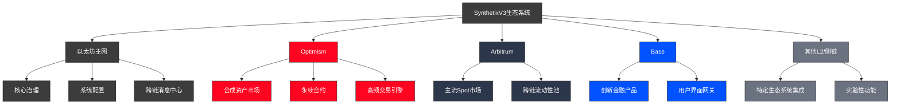
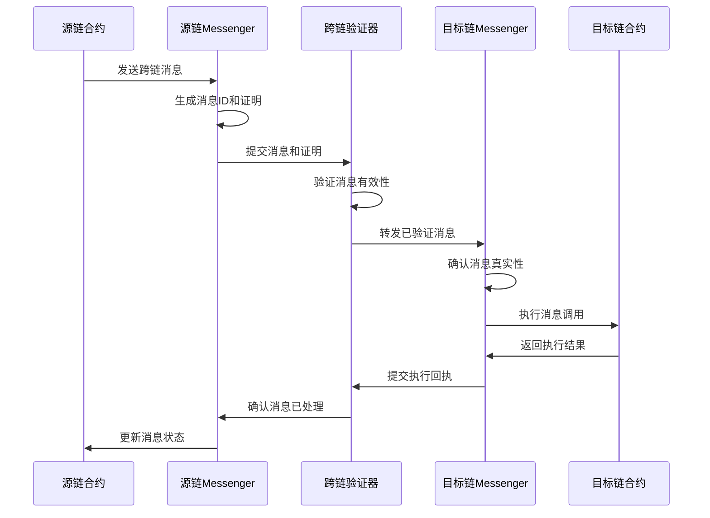
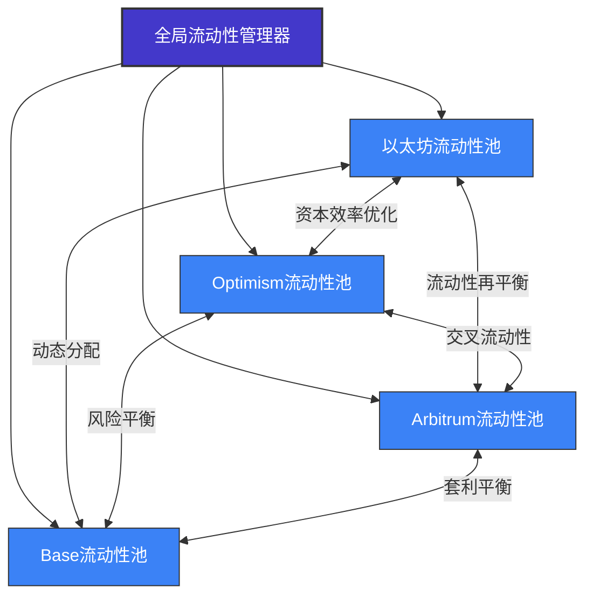
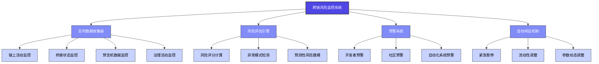

# SynthetixV3跨链部署战略分析

## 1. 跨链布局概述

SynthetixV3采用全新的跨链部署策略，实现了多链生态系统的有效构建和管理。这一战略性转变源于DeFi生态系统的分散化趋势，以及单一区块链无法满足所有用例的现实挑战。

### 1.1 跨链架构设计原则

V3的跨链架构遵循以下核心设计原则：

- **互操作性优先**：确保不同链上部署的组件可无缝通信
- **模块独立性**：各功能模块可在不同链上独立部署和运行
- **链特性适配**：根据不同链的特性优化部署策略
- **治理统一性**：维持跨链治理的一致性和协调性
- **安全边界清晰**：明确定义跨链操作的安全边界和验证机制

### 1.2 当前部署概况



## 2. 跨链通信基础架构

SynthetixV3的跨链功能依赖于先进的跨链通信基础架构，实现了不同区块链网络间的无缝交互和数据传输。

### 2.1 跨链消息协议

V3采用多层跨链消息协议，确保跨链通信的安全性和可靠性：

```solidity
// ICrossChainMessenger.sol
interface ICrossChainMessenger {
    enum MessageStatus {
        UNCONFIRMED,  // 消息尚未确认
        CONFIRMED,    // 消息已确认但未被处理
        RELAYED,      // 消息已被成功处理
        FAILED        // 消息处理失败
    }

    // 发送跨链消息
    function sendCrossChainMessage(
        uint32 destinationChainId,
        address targetAddress,
        bytes calldata message,
        uint256 gaslimit
    ) external payable returns (bytes32 messageId);
    
    // 检查消息状态
    function getMessageStatus(bytes32 messageId) external view returns (MessageStatus);
    
    // 重试失败的消息
    function retryMessage(bytes32 messageId, uint256 gasLimit) external payable;
    
    // 接收并处理跨链消息
    function receiveMessage(
        uint32 sourceChainId,
        bytes32 messageId,
        address sourceAddress,
        bytes calldata message
    ) external returns (bool success);
}
```

### 2.2 跨链桥接技术比较

| 跨链桥接方案 | 优势 | 劣势 | SynthetixV3应用场景 |
|------------|------|------|------------------|
| Layer Zero | 通用性强，多链支持 | 验证成本较高 | 高价值资产跨链传输 |
| Chainlink CCIP | 安全性高，Oracle支持 | 处理延迟较长 | 市场数据和配置同步 |
| Optimism标准桥 | 与L2紧密集成 | 仅支持Optimism | Optimism网络专用功能 |
| Arbitrum Nitro桥 | 高吞吐量 | 仅支持Arbitrum | Arbitrum网络专用功能 |
| 自定义消息协议 | 高度定制化 | 开发和维护成本高 | 特定功能的优化实现 |

### 2.3 消息验证流程



## 3. 核心模块跨链部署策略

V3的模块化设计使其各个核心组件能在不同链上独立运行，同时保持系统的整体一致性。

### 3.1 治理模块的跨链实现

治理模块作为系统的核心决策机制，采用"中心决策+跨链执行"的模式：

```solidity
// CrossChainGovernor.sol示例
contract CrossChainGovernor is ICrossChainMessenger {
    // 链ID到执行器映射
    mapping(uint32 => address) public executors;
    
    // 提案状态追踪
    mapping(bytes32 => ProposalStatus) public proposals;
    
    // 提交跨链治理提案
    function proposeForChain(
        uint32 targetChainId,
        address[] calldata targets,
        uint256[] calldata values,
        bytes[] calldata calldatas,
        string calldata description
    ) external returns (bytes32 proposalId) {
        // 生成提案ID
        proposalId = keccak256(abi.encode(targetChainId, targets, values, calldatas, description));
        
        // 记录提案
        proposals[proposalId] = ProposalStatus.PENDING;
        
        // 触发提案事件
        emit ProposalCreated(proposalId, msg.sender, targetChainId, targets, values, calldatas, description);
        
        return proposalId;
    }
    
    // 执行已批准的跨链提案
    function executeProposal(bytes32 proposalId) external {
        require(proposals[proposalId] == ProposalStatus.APPROVED, "提案未获批准");
        
        // 获取提案详情
        (uint32 targetChainId, address[] memory targets, uint256[] memory values, bytes[] memory calldatas, ) = getProposalDetails(proposalId);
        
        // 准备跨链执行数据
        bytes memory executionData = abi.encode(proposalId, targets, values, calldatas);
        
        // 发送跨链消息
        sendCrossChainMessage(
            targetChainId,
            executors[targetChainId],
            executionData,
            1000000 // 预设gas限制
        );
        
        // 更新提案状态
        proposals[proposalId] = ProposalStatus.EXECUTING;
    }
    
    // 处理提案执行结果
    function receiveProposalResult(
        uint32 sourceChainId,
        bytes32 messageId,
        bytes32 proposalId,
        bool success
    ) external {
        // 验证消息来源
        require(msg.sender == address(this), "非法调用者");
        
        // 更新提案状态
        proposals[proposalId] = success ? ProposalStatus.EXECUTED : ProposalStatus.FAILED;
        
        // 触发结果事件
        emit ProposalExecuted(proposalId, success);
    }
}
```

### 3.2 市场模块跨链分布

市场模块根据不同链的特性进行优化部署：

| 区块链网络 | 部署市场类型 | 优化理由 | 特殊考量 |
|----------|------------|---------|--------|
| 以太坊主网 | 高价值低频市场 | 安全性最高 | Gas成本高，吞吐量限制 |
| Optimism | 永续合约市场 | L2低延迟 | 适合高频交易 |
| Arbitrum | 主流现货市场 | 高吞吐量 | 活跃的DeFi生态 |
| Base | 创新金融产品 | 用户友好 | 新兴生态系统 |

### 3.3 跨链流动性管理

V3实现了创新的跨链流动性管理机制，使流动性可以在不同链上高效利用：



## 4. 跨链资产桥接与合成资产

### 4.1 跨链资产模型

V3采用创新的跨链资产模型，支持跨链资产的一致性表示和操作：

```solidity
// ICrossChainAsset.sol示例
interface ICrossChainAsset {
    // 资产类型定义
    enum AssetType {
        NATIVE,       // 链原生资产
        LOCAL_TOKEN,  // 本地ERC20代币
        SYNTH,        // 合成资产
        BRIDGED,      // 跨链桥接资产
        WRAPPED       // 包装资产
    }
    
    // 资产解析器
    function resolveAsset(
        uint32 chainId,
        address assetAddress
    ) external view returns (
        AssetType assetType,
        address canonicalAddress,
        uint32 canonicalChainId,
        uint8 decimals,
        string memory symbol
    );
    
    // 跨链资产传输
    function transferCrossChain(
        uint32 destinationChainId,
        address assetAddress,
        address recipient,
        uint256 amount
    ) external payable returns (bytes32 transferId);
    
    // 跨链资产兑换
    function swapCrossChain(
        uint32 destinationChainId,
        address sourceAsset,
        address destinationAsset,
        uint256 amount,
        uint256 minAmountOut,
        address recipient
    ) external payable returns (bytes32 swapId);
}
```

### 4.2 跨链合成资产一致性

V3实现了跨链合成资产的统一表示和处理机制：

| 方面 | V2合成资产 | V3跨链合成资产 | 优势 |
|-----|-----------|--------------|------|
| 资产表示 | 单链表示 | 规范化跨链标识符 | 统一资产引用 |
| 价格发现 | 链内Oracle | 跨链聚合价格 | 更精确的定价 |
| 流动性来源 | 单一池 | 跨链流动性网络 | 更深的流动性 |
| 交易结算 | 本地结算 | 最优路径结算 | 更优的执行价格 |
| 资产管理 | 手动跨链 | 自动跨链优化 | 资本效率提升 |

## 5. 跨链风险管理策略

### 5.1 跨链风险分类与应对

V3建立了完善的跨链风险管理框架，针对不同类型的风险制定专项应对策略：

| 风险类别 | 具体风险 | 技术防范措施 | 运营应对策略 |
|---------|---------|------------|------------|
| 技术风险 | 桥接合约漏洞 | 多重验证，渐进式部署 | 风险分级，保险基金 |
| 共识风险 | 跨链确认攻击 | 可变确认数，经济激励 | 大额交易额外验证 |
| 预言机风险 | 数据不一致 | 多来源验证，异常检测 | 价格偏差保护机制 |
| 流动性风险 | 跨链流动性碎片化 | 动态流动性激励 | 流动性提供者计划 |
| 治理风险 | 跨链治理攻击 | 时间锁，多签验证 | 跨链监控系统 |

### 5.2 跨链风险监控系统



## 6. 跨链性能优化

### 6.1 跨链交易性能比较

| 指标 | 单链交易 | 无优化跨链交易 | V3优化跨链交易 | 性能提升倍数 |
|-----|---------|--------------|--------------|------------|
| 确认时间 | 15秒 | 30分钟 | 2分钟 | 15倍 |
| Gas成本 | 1x | 10x | 3x | 3.3倍 |
| TPS限制 | 链原生TPS | 桥接TPS (低) | 优化桥接TPS | 5-10倍 |
| 失败率 | <0.1% | 5-10% | <1% | 5-10倍 |

### 6.2 跨链批处理优化

V3实现了高效的跨链批处理机制，显著提升跨链操作的效率：

```solidity
// CrossChainBatcher.sol片段
contract CrossChainBatcher {
    struct BatchItem {
        address target;
        uint256 value;
        bytes calldata;
    }
    
    // 批量跨链调用
    function batchCrossChainCalls(
        uint32 destinationChainId,
        BatchItem[] calldata items,
        uint256 gasLimitPerItem,
        bool atomicExecution
    ) external payable returns (bytes32 batchId) {
        // 验证批处理有效性
        require(items.length > 0, "空批处理");
        require(items.length <= 100, "批处理过大");
        
        // 计算所需gas和费用
        uint256 totalGasLimit = items.length * gasLimitPerItem;
        
        // 验证提供的费用是否足够
        // ...费用计算逻辑...
        
        // 编码批处理数据
        bytes memory batchData = abi.encode(
            items,
            atomicExecution,
            msg.sender // 原始调用者
        );
        
        // 生成批处理ID
        batchId = keccak256(abi.encodePacked(
            block.timestamp,
            destinationChainId,
            msg.sender,
            items.length
        ));
        
        // 发送跨链消息
        _sendCrossChainMessage(
            destinationChainId,
            batchExecutors[destinationChainId],
            batchData,
            totalGasLimit
        );
        
        // 记录批处理状态
        batches[batchId] = BatchStatus.PENDING;
        
        emit BatchSubmitted(batchId, msg.sender, destinationChainId, items.length);
        
        return batchId;
    }
    
    // 批处理执行器
    function executeBatch(
        BatchItem[] memory items,
        bool atomicExecution,
        address originalSender
    ) external returns (bool[] memory results) {
        // 验证调用者是桥接合约
        require(isBridgeExecutor[msg.sender], "非授权执行者");
        
        results = new bool[](items.length);
        
        // 执行批处理中的所有调用
        for(uint256 i = 0; i < items.length; i++) {
            BatchItem memory item = items[i];
            
            // 执行调用
            (bool success, ) = item.target.call{value: item.value}(
                abi.encodePacked(item.calldata, originalSender)
            );
            
            // 记录结果
            results[i] = success;
            
            // 如果是原子执行且失败，则回滚整个交易
            if (atomicExecution && !success) {
                revert("原子批处理执行失败");
            }
        }
        
        return results;
    }
}
```

## 7. 用户体验优化

### 7.1 无感知跨链体验实现

V3通过多种技术手段实现了无感知的跨链用户体验：

1. **抽象账户技术**：用户使用统一账户在多链上操作
2. **Gas代付系统**：针对不同链的Gas代付机制
3. **统一交易接口**：屏蔽底层链间差异
4. **跨链状态同步**：交易状态全局可见

### 7.2 跨链用户体验对比

```mermaid
graph TD
    subgraph "传统跨链体验"
        A1[用户] --> B1[选择源链]
        B1 --> C1[在源链授权]
        C1 --> D1[发起桥接交易]
        D1 --> E1[等待确认]
        E1 --> F1[切换网络]
        F1 --> G1[目标链交互]
    end
    
    subgraph "SynthetixV3跨链体验"
        A2[用户] --> B2[统一界面交互]
        B2 --> C2[自动路由选择]
        C2 --> D2[后台跨链处理]
        D2 --> E2[前端状态更新]
        E2 --> F2[交易完成通知]
    end
    
    classDef standard fill:#e5e7eb,stroke:#333,stroke-width:1px
    classDef enhanced fill:#93c5fd,stroke:#333,stroke-width:1px
    
    class A1,B1,C1,D1,E1,F1,G1 standard
    class A2,B2,C2,D2,E2,F2 enhanced
```



## 8. 跨链部署的监控与管理

### 8.1 跨链监控系统架构

```solidity
// 跨链健康监控合约示例
contract CrossChainMonitor {
    struct ChainStatus {
        bool isActive;
        uint256 lastBlockTimestamp;
        uint256 lastBlockNumber;
        uint256 pendingMessages;
        uint256 failedMessages;
        uint8 healthScore; // 0-100
    }
    
    // 链状态映射
    mapping(uint32 => ChainStatus) public chainStatuses;
    
    // 更新链状态
    function updateChainStatus(
        uint32 chainId,
        uint256 blockTimestamp,
        uint256 blockNumber,
        uint256 pendingCount,
        uint256 failedCount
    ) external onlyOracle {
        ChainStatus storage status = chainStatuses[chainId];
        
        // 更新状态
        status.lastBlockTimestamp = blockTimestamp;
        status.lastBlockNumber = blockNumber;
        status.pendingMessages = pendingCount;
        status.failedMessages = failedCount;
        
        // 计算健康分数
        status.healthScore = calculateHealthScore(chainId);
        
        emit ChainStatusUpdated(chainId, status.healthScore);
    }
    
    // 计算链健康分数
    function calculateHealthScore(uint32 chainId) internal view returns (uint8) {
        ChainStatus storage status = chainStatuses[chainId];
        
        // 基本分数 - 最高100分
        uint16 score = 100;
        
        // 根据区块延迟扣分 (最多扣30分)
        uint256 blockDelay = block.timestamp - status.lastBlockTimestamp;
        if (blockDelay > 1 hours) {
            score -= 30;
        } else if (blockDelay > 30 minutes) {
            score -= 20;
        } else if (blockDelay > 10 minutes) {
            score -= 10;
        } else if (blockDelay > 5 minutes) {
            score -= 5;
        }
        
        // 根据待处理消息数量扣分 (最多扣40分)
        if (status.pendingMessages > 1000) {
            score -= 40;
        } else if (status.pendingMessages > 500) {
            score -= 30;
        } else if (status.pendingMessages > 100) {
            score -= 20;
        } else if (status.pendingMessages > 50) {
            score -= 10;
        }
        
        // 根据失败消息数量扣分 (最多扣30分)
        if (status.failedMessages > 100) {
            score -= 30;
        } else if (status.failedMessages > 50) {
            score -= 20;
        } else if (status.failedMessages > 10) {
            score -= 10;
        } else if (status.failedMessages > 0) {
            score -= 5;
        }
        
        // 确保分数在0-100范围内
        return score > 100 ? 100 : uint8(score);
    }
}
```

### 8.2 跨链部署自动化

V3实现了高度自动化的跨链部署流程，使系统能够高效地在多链环境中运行：

1. **智能合约部署自动化**：基于模板的跨链部署系统
2. **配置同步机制**：链间配置一致性维护
3. **自动版本控制**：跨链合约版本协调
4. **链特性自适应**：基于链参数自动调整部署配置

## 9. 与其他跨链项目的比较

| 项目 | 跨链方法 | 与SynthetixV3对比 | 适用场景 |
|-----|---------|----------------|---------|
| Polkadot | 平行链+中继链 | 更重量级，共识级互操作 | 全新区块链生态 |
| Cosmos | IBC协议+多链架构 | 独立链间轻量通信 | 跨链DApp生态 |
| LayerZero | 通用消息传递 | 更灵活的消息传递 | 一般跨链应用 |
| Axelar | 跨链网关+GMP | 侧重安全性的跨链通信 | 高价值资产转移 |
| SynthetixV3 | 模块化+专业功能桥 | 金融功能优化，高效资产表示 | 跨链金融应用 |

## 10. 未来发展方向

SynthetixV3的跨链战略将在以下方向继续发展：

1. **多维度扩展**：从L2扩展到更多生态系统连接
2. **资产互操作性增强**：更深入的跨链资产标准化
3. **跨链复合产品**：利用多链特性创建创新金融产品
4. **链特化功能**：根据不同链特性优化专属功能
5. **跨链治理进化**：更高效的多链协调治理机制

### 10.1 预期路线图

```mermaid
gantt
    title SynthetixV3跨链发展路线图
    dateFormat  YYYY-Q[Q]
    axisFormat  %Y-Q%Q
    
    section 基础设施
    核心跨链桥接系统       :done, 2023-Q1, 2023-Q2
    高级跨链消息协议       :done, 2023-Q2, 2023-Q4
    跨链治理v1             :active, 2023-Q4, 2024-Q2
    跨链监控与分析平台     :2024-Q2, 2024-Q3
    
    section 市场扩展
    Optimism部署完善       :done, 2023-Q1, 2023-Q3
    Arbitrum市场           :done, 2023-Q3, 2024-Q1
    Base生态集成           :active, 2024-Q1, 2024-Q3
    更多L2支持             :2024-Q3, 2025-Q1
    
    section 产品创新
    跨链合成资产v1         :done, 2023-Q2, 2023-Q4
    跨链流动性协议         :active, 2024-Q1, 2024-Q2
    链特化金融产品         :2024-Q2, 2024-Q4
    跨链复合衍生品         :2024-Q4, 2025-Q2
    
    section 用户体验
    基础跨链交互           :done, 2023-Q2, 2023-Q4
    无感知跨链体验         :active, 2024-Q1, 2024-Q3
    单一跨链账户系统       :2024-Q3, 2025-Q1
    跨链智能账户           :2025-Q1, 2025-Q3
```

## 总结

SynthetixV3的跨链部署战略代表了DeFi协议设计的重大范式转变，从单链优化模型转向全面的多链生态系统。通过精心设计的跨链通信架构、模块化部署策略和创新的资产表示方法，V3实现了前所未有的可扩展性、资本效率和用户体验。这一战略不仅解决了单链扩展的限制，还创造了全新的金融产品可能性，使Synthetix能够在多链DeFi生态系统中保持领先地位。随着跨链技术的不断成熟和生态系统的进一步发展，SynthetixV3的跨链战略将继续演进，为DeFi用户提供更高效、安全和无缝的多链金融服务体验。 