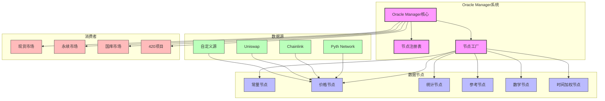
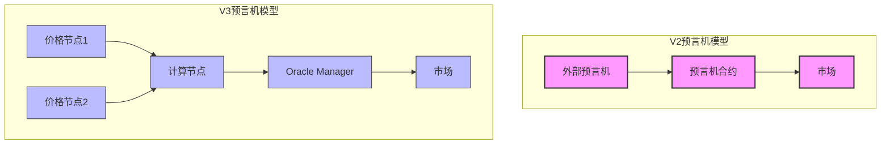
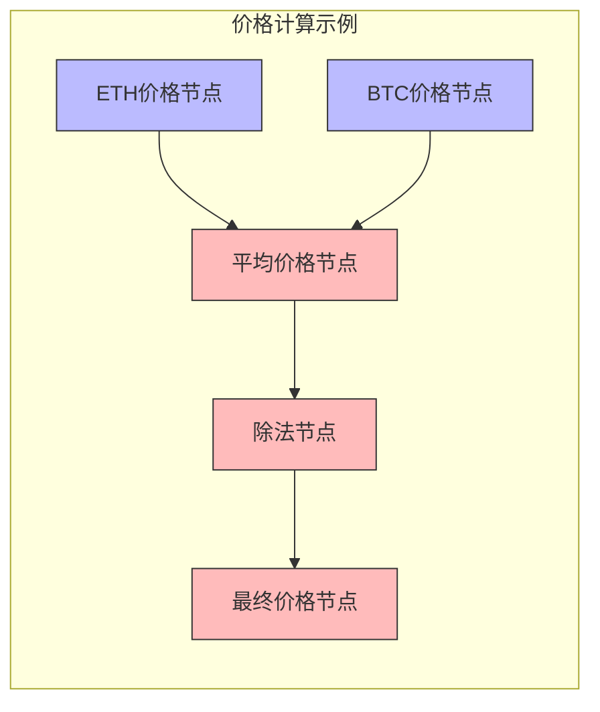
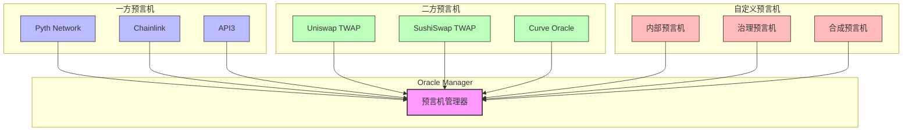
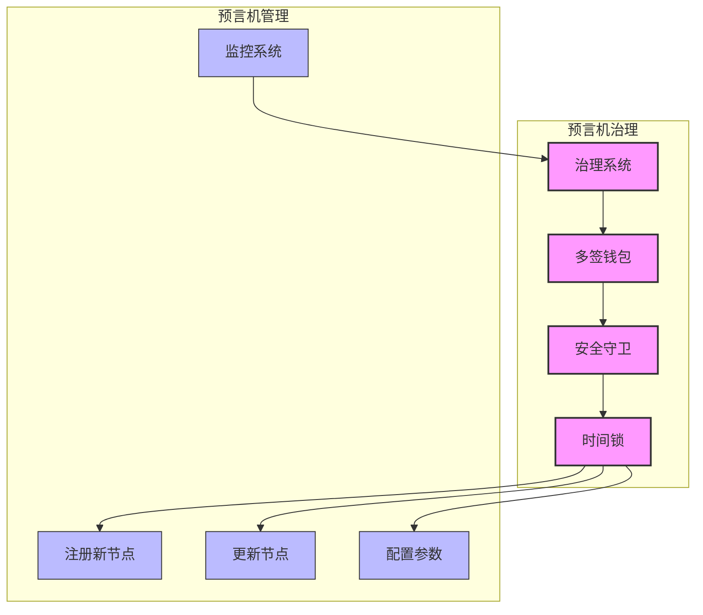
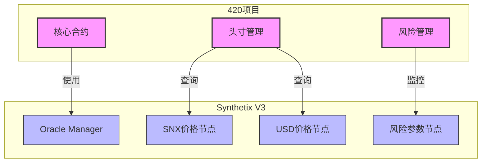
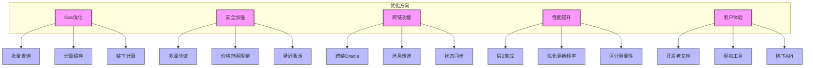

# Synthetix V3预言机系统分析

## 1. 预言机系统概述

Synthetix V3的预言机系统是整个协议的关键基础设施，负责提供可靠的价格数据，支持系统的所有金融操作。V3采用了一种高度灵活、可组合的预言机架构，称为Oracle Manager（预言机管理器）。

### 1.1 预言机架构概览



### 1.2 预言机系统的核心原则

Synthetix V3的预言机系统基于以下关键原则：

1. **可组合性**：支持复杂的预言机数据流和处理逻辑
2. **可扩展性**：易于添加新的数据源和节点类型
3. **安全性**：多层防御机制和去中心化数据源
4. **透明性**：价格路径和计算逻辑在链上可验证
5. **灵活性**：不同市场可配置不同的价格源和处理逻辑

### 1.3 与V2预言机系统的比较



V3预言机系统与V2的主要区别：

1. **数据处理能力**：
   - V2：基本的价格数据传递
   - V3：复杂的数据聚合和处理能力

2. **组合逻辑**：
   - V2：有限的价格操作
   - V3：支持丰富的价格计算和组合

3. **错误处理**：
   - V2：基本的有效性检查
   - V3：高级的错误检测和容错机制

4. **可扩展性**：
   - V2：固定的预言机接口
   - V3：动态可扩展的节点系统

## 2. Oracle Manager核心设计

### 2.1 核心组件

Oracle Manager由三个主要组件组成：

1. **核心合约**：管理节点注册和数据查询
2. **节点注册表**：维护所有已注册节点的目录
3. **节点工厂**：负责部署新的节点合约

```solidity
// Oracle Manager核心合约简化示例
contract OracleManager {
    NodeRegistry public registry;
    NodeFactory public factory;
    
    // 注册新节点
    function registerNode(NodeType nodeType, bytes calldata parameters) external returns (uint nodeId) {
        // 通过工厂创建节点
        address nodeAddress = factory.createNode(nodeType, parameters);
        
        // 在注册表中注册节点
        nodeId = registry.registerNode(nodeAddress);
        
        return nodeId;
    }
    
    // 获取节点值
    function processNodeOutput(uint nodeId) external view returns (bytes memory) {
        address nodeAddress = registry.getNodeAddress(nodeId);
        INode node = INode(nodeAddress);
        return node.process();
    }
    
    // 获取节点价格数据
    function getPrice(uint nodeId) external view returns (uint price, uint timestamp) {
        bytes memory output = this.processNodeOutput(nodeId);
        (price, timestamp) = abi.decode(output, (uint, uint));
        return (price, timestamp);
    }
}
```

### 2.2 节点类型系统

Oracle Manager支持多种节点类型，每种类型执行特定功能：

1. **常量节点**：提供固定值，用于测试或特殊计算
2. **价格节点**：连接外部预言机获取资产价格
3. **统计节点**：执行统计计算（平均值、中位数等）
4. **参考节点**：引用其他节点的输出
5. **数学节点**：执行数学运算（加、减、乘、除等）
6. **时间加权节点**：根据时间对价格数据进行加权

```solidity
// 节点接口简化示例
interface INode {
    // 处理节点数据并返回结果
    function process() external view returns (bytes memory);
    
    // 获取节点依赖
    function getDependencies() external view returns (uint[] memory);
    
    // 节点描述
    function getDescription() external view returns (string memory);
}

// 价格节点示例实现
contract PriceNode is INode {
    address public oracleAddress;
    bytes32 public priceId;
    
    constructor(address _oracle, bytes32 _priceId) {
        oracleAddress = _oracle;
        priceId = _priceId;
    }
    
    function process() external view override returns (bytes memory) {
        // 从外部预言机获取价格
        (uint price, uint timestamp) = IExternalOracle(oracleAddress).getPrice(priceId);
        
        // 验证价格有效性
        require(timestamp > block.timestamp - 1 hours, "Price too old");
        require(price > 0, "Invalid price");
        
        // 编码并返回结果
        return abi.encode(price, timestamp);
    }
    
    function getDependencies() external view override returns (uint[] memory) {
        // 价格节点通常没有内部依赖
        return new uint[](0);
    }
    
    function getDescription() external view override returns (string memory) {
        return string(abi.encodePacked("Price from ", addressToString(oracleAddress)));
    }
}
```

### 2.3 数据流与计算图



Oracle Manager使用有向无环图（DAG）来表示价格计算逻辑。每个节点可以有多个输入，但只有一个输出。这种设计允许：

1. **复杂表达式**：构建任意复杂的价格计算表达式
2. **重用组件**：节点可以被多个其他节点引用
3. **透明性**：完整的计算路径在链上可审计
4. **灵活更新**：单个节点可以更新而不影响整体结构

## 3. 数据源集成

### 3.1 支持的预言机提供商

Synthetix V3的预言机系统设计为可与多种外部预言机提供商集成：



目前集成的主要数据源：

1. **Pyth Network**：高性能的跨链预言机
2. **Chainlink**：去中心化预言机网络
3. **去中心化交易所**：Uniswap、SushiSwap等的TWAP价格
4. **内部预言机**：由Synthetix治理管理的价格源

### 3.2 数据验证与聚合策略

为确保价格数据的可靠性，Oracle Manager实现了多种验证和聚合策略：

1. **多源验证**：比较多个来源的价格数据
2. **时间验证**：确保价格数据在可接受的时间范围内
3. **偏差检测**：识别异常偏离的价格数据
4. **统计聚合**：使用中位数或加权平均等方法聚合价格
5. **容错机制**：在部分数据源失败时继续运行

```solidity
// 中位数聚合节点示例
contract MedianNode is INode {
    uint[] public dependencies;
    
    constructor(uint[] memory _dependencies) {
        dependencies = _dependencies;
    }
    
    function process() external view override returns (bytes memory) {
        OracleManager manager = OracleManager(msg.sender);
        
        // 收集所有依赖节点的价格
        uint[] memory prices = new uint[](dependencies.length);
        uint[] memory timestamps = new uint[](dependencies.length);
        
        for (uint i = 0; i < dependencies.length; i++) {
            (prices[i], timestamps[i]) = manager.getPrice(dependencies[i]);
        }
        
        // 计算中位数价格
        uint medianPrice = calculateMedian(prices);
        
        // 获取最新时间戳
        uint latestTimestamp = getMaxTimestamp(timestamps);
        
        return abi.encode(medianPrice, latestTimestamp);
    }
    
    function getDependencies() external view override returns (uint[] memory) {
        return dependencies;
    }
    
    // 计算中位数
    function calculateMedian(uint[] memory values) internal pure returns (uint) {
        // 排序数组
        quickSort(values, 0, values.length - 1);
        
        // 计算中位数
        if (values.length % 2 == 0) {
            return (values[values.length / 2 - 1] + values[values.length / 2]) / 2;
        } else {
            return values[values.length / 2];
        }
    }
    
    // ... 其他辅助函数
}
```

### 3.3 价格有效性和陈旧性控制

价格数据的有效性和及时性至关重要：

1. **最大陈旧性**：每个节点可配置价格的最大允许年龄
2. **价格范围检查**：验证价格是否在合理范围内
3. **突变检测**：识别异常的价格变动
4. **黑天鹅保护**：在极端市场条件下的特殊处理

```solidity
// 价格保护节点示例
contract PriceGuardNode is INode {
    uint public sourceNodeId;
    uint public maxDeviation;
    uint public maxAge;
    
    constructor(uint _sourceNodeId, uint _maxDeviation, uint _maxAge) {
        sourceNodeId = _sourceNodeId;
        maxDeviation = _maxDeviation;
        maxAge = _maxAge;
    }
    
    function process() external view override returns (bytes memory) {
        OracleManager manager = OracleManager(msg.sender);
        
        // 获取源价格
        (uint price, uint timestamp) = manager.getPrice(sourceNodeId);
        
        // 验证时间戳
        require(block.timestamp - timestamp <= maxAge, "Price too old");
        
        // 可以添加更多验证...
        // 例如，与历史价格比较，检查突然变化等
        
        return abi.encode(price, timestamp);
    }
    
    function getDependencies() external view override returns (uint[] memory) {
        uint[] memory deps = new uint[](1);
        deps[0] = sourceNodeId;
        return deps;
    }
}
```

## 4. 系统集成与使用模式

### 4.1 市场集成模式

各种Synthetix V3市场通过不同方式使用Oracle Manager：

1. **现货市场**：获取资产价格用于铸造、交易和清算
2. **永续市场**：获取指数价格和资金费率
3. **国库市场**：获取SNX和其他抵押品价格
4. **自定义市场**：根据特定需求获取相关价格

```solidity
// 市场使用Oracle Manager的简化示例
contract SpotMarket {
    OracleManager public oracleManager;
    mapping(address => uint) public assetPriceNodeIds;
    
    function setAssetPriceNodeId(address asset, uint nodeId) external onlyOwner {
        assetPriceNodeIds[asset] = nodeId;
    }
    
    function getAssetPrice(address asset) public view returns (uint) {
        uint nodeId = assetPriceNodeIds[asset];
        require(nodeId != 0, "Price feed not configured");
        
        (uint price, uint timestamp) = oracleManager.getPrice(nodeId);
        require(block.timestamp - timestamp <= 1 hours, "Price too old");
        
        return price;
    }
    
    function calculateCollateralValue(address collateral, uint amount) external view returns (uint) {
        uint price = getAssetPrice(collateral);
        return (amount * price) / 1e18;
    }
    
    // ... 其他市场功能
}
```

### 4.2 治理与管理

Oracle Manager的管理涉及以下关键方面：

1. **节点注册**：添加新的价格节点和计算节点
2. **节点更新**：更新现有节点的配置和逻辑
3. **权限控制**：管理谁可以添加或修改节点
4. **参数调整**：调整验证参数和容错机制
5. **监控与审计**：观察预言机系统的性能和可靠性



### 4.3 开发者接口

为方便开发者使用，Oracle Manager提供了清晰的API：

1. **价格查询API**：简单的价格查询接口
2. **节点部署API**：用于添加新节点的接口
3. **节点配置API**：配置现有节点的参数
4. **批量查询API**：一次获取多个价格
5. **历史数据访问**：查询过去的价格数据（主要链下）

```solidity
// Oracle Manager开发者接口简化示例
interface IOracleManager {
    // 基本价格查询
    function getPrice(uint nodeId) external view returns (uint price, uint timestamp);
    
    // 批量价格查询
    function getPrices(uint[] calldata nodeIds) external view returns (uint[] memory prices, uint[] memory timestamps);
    
    // 注册新节点
    function registerNode(NodeType nodeType, bytes calldata parameters) external returns (uint nodeId);
    
    // 更新节点参数
    function updateNodeParameters(uint nodeId, bytes calldata parameters) external;
    
    // 获取节点信息
    function getNodeInfo(uint nodeId) external view returns (address nodeAddress, NodeType nodeType, string memory description);
}
```

## 5. 420项目的预言机集成

### 5.1 当前集成状态

420项目与Synthetix V3预言机系统的集成主要通过以下方式：



420项目主要在以下场景中使用预言机数据：

1. **质押管理**：获取SNX价格计算抵押价值
2. **风险监控**：监控抵押率和清算阈值
3. **收益计算**：计算用户收益和系统费用
4. **用户界面**：显示实时价格和市场数据

### 5.2 定制价格节点示例

为满足特定需求，420项目可以创建定制的价格节点：

```solidity
// 420项目定制价格节点示例
contract Pool420PriceNode is INode {
    uint public snxPriceNodeId;
    uint public totalPoolFactor;
    
    constructor(uint _snxPriceNodeId, uint _totalPoolFactor) {
        snxPriceNodeId = _snxPriceNodeId;
        totalPoolFactor = _totalPoolFactor;
    }
    
    function process() external view override returns (bytes memory) {
        OracleManager manager = OracleManager(msg.sender);
        
        // 获取SNX价格
        (uint snxPrice, uint timestamp) = manager.getPrice(snxPriceNodeId);
        
        // 获取池子特定数据（简化示例）
        Pool420 pool = Pool420(getPool420Address());
        uint totalStaked = pool.getTotalStaked();
        uint totalDebt = pool.getTotalDebt();
        
        // 计算池子单位价值
        uint poolUnitValue = calculatePoolValue(snxPrice, totalStaked, totalDebt, totalPoolFactor);
        
        return abi.encode(poolUnitValue, timestamp);
    }
    
    function getDependencies() external view override returns (uint[] memory) {
        uint[] memory deps = new uint[](1);
        deps[0] = snxPriceNodeId;
        return deps;
    }
    
    function calculatePoolValue(uint snxPrice, uint totalStaked, uint totalDebt, uint factor) internal pure returns (uint) {
        // 池子价值计算逻辑
        if (totalStaked == 0) return 0;
        uint grossValue = (snxPrice * totalStaked) / 1e18;
        uint netValue = grossValue > totalDebt ? grossValue - totalDebt : 0;
        return (netValue * factor) / totalStaked;
    }
}
```

### 5.3 风险监控集成

420项目可以使用预言机数据进行高级风险监控：

```solidity
// 风险监控集成示例
contract Risk420Monitor {
    OracleManager public oracleManager;
    uint public snxPriceNodeId;
    uint public ethPriceNodeId;
    
    uint public minCollateralRatio;
    uint public warningCollateralRatio;
    
    function checkPositionHealth(uint accountId) external view returns (HealthStatus) {
        // 获取价格数据
        (uint snxPrice, ) = oracleManager.getPrice(snxPriceNodeId);
        
        // 获取账户数据
        Position420 position = getPosition(accountId);
        uint collateralValue = (position.collateralAmount * snxPrice) / 1e18;
        uint debtValue = position.debtAmount;
        
        // 计算抵押率
        uint collateralRatio = debtValue > 0 ? (collateralValue * 1e18) / debtValue : type(uint).max;
        
        // 返回健康状态
        if (collateralRatio < minCollateralRatio) {
            return HealthStatus.LIQUIDATABLE;
        } else if (collateralRatio < warningCollateralRatio) {
            return HealthStatus.WARNING;
        } else {
            return HealthStatus.HEALTHY;
        }
    }
    
    // 价格突变检测示例
    function detectPriceAnomaly() external view returns (bool) {
        // 实现价格突变检测逻辑
        // 例如，比较当前价格与移动平均线，识别异常波动等
    }
    
    // ... 其他风险管理功能
}
```

### 5.4 预言机数据显示

420项目的用户界面可以展示丰富的预言机数据：

1. **资产价格面板**：显示主要资产的实时价格
2. **价格历史图表**：展示价格的历史趋势
3. **风险指标显示**：根据预言机数据计算的风险指标
4. **价格来源透明度**：显示价格数据的来源和计算方法
5. **警报系统**：基于预言机数据的风险警报

## 6. 挑战与优化方向

### 6.1 当前挑战

Oracle Manager系统面临的主要挑战：

1. **gas成本优化**：复杂节点网络可能导致高昂的gas成本
2. **价格操纵风险**：抵御DEX价格操纵和闪电贷攻击
3. **跨链一致性**：确保多链部署中的价格一致性
4. **延迟与陈旧性**：在高波动市场中的价格延迟问题
5. **黑天鹅事件**：处理极端市场事件和价格断崖

### 6.2 优化策略

针对预言机系统的潜在优化方向：



主要优化策略包括：

1. **架构优化**：
   - 实现节点计算结果缓存
   - 批量价格查询接口优化
   - 按需计算而非全局更新

2. **安全增强**：
   - 改进价格验证算法
   - 多级防护机制
   - 异常检测自动化

3. **性能提升**：
   - 层2解决方案集成
   - 优化计算路径
   - 调整更新频率

4. **开发者体验**：
   - 改进SDK和工具
   - 更好的文档和示例
   - 提供测试网络环境

### 6.3 对420项目的建议

基于预言机系统分析，对420项目的建议：

1. **定制节点开发**：创建特定于420的预言机节点
2. **多层价格验证**：实现多源价格验证以增加安全性
3. **预言机监控系统**：开发专用的预言机监控工具
4. **gas优化策略**：优化预言机查询的gas使用
5. **用户透明度**：增强价格信息在UI中的透明度

## 7. 未来演进趋势

### 7.1 预言机技术趋势

预言机技术的未来发展方向可能包括：

1. **ZK预言机**：使用零知识证明提高安全性和隐私
2. **预言机网络互操作性**：不同预言机网络之间的互操作标准
3. **链下计算验证**：使用验证层验证链下计算
4. **自适应聚合算法**：根据市场条件自动调整聚合方法
5. **AI/ML增强**：使用机器学习技术优化价格预测

### 7.2 Synthetix V3预言机路线图

Synthetix V3预言机系统的可能演进方向：

1. **更多节点类型**：支持更复杂的计算和逻辑
2. **改进的跨链支持**：实现更无缝的跨链价格同步
3. **高级风险模型**：内置更复杂的风险评估模型
4. **低延迟价格更新**：优化价格更新的延迟
5. **扩展数据类型**：支持价格以外的更多数据类型

### 7.3 420项目的机遇

随着预言机技术的发展，420项目可以考虑：

1. **专用价格索引**：创建特定于420生态的价格指数
2. **预言机即服务**：为其他项目提供价格服务
3. **风险管理产品**：基于预言机数据的高级风险管理
4. **预言机治理参与**：参与Synthetix预言机治理
5. **跨链预言机桥**：为用户提供跨链价格服务

## 8. 总结

### 8.1 核心价值与创新

Synthetix V3的Oracle Manager系统代表了DeFi预言机设计的重大进步：

1. **极高的可组合性**：支持任意复杂的价格计算逻辑
2. **模块化设计**：可插拔节点系统和可扩展接口
3. **透明的数据流**：完全可追踪和验证的价格路径
4. **渐进式去中心化**：支持多种去中心化程度的数据源
5. **适应性与弹性**：能够适应不同市场条件的自适应系统

### 8.2 420项目的预言机集成价值

420项目通过与V3预言机系统的深度集成获得了显著价值：

1. **增强的安全性**：利用高质量价格数据增强系统安全
2. **优化的用户体验**：为用户提供准确、及时的价格信息
3. **高级风险管理**：基于可靠价格数据的风险控制
4. **定制化可能性**：创建特定于420需求的价格节点
5. **创新基础**：为未来创新提供坚实的数据基础

### 8.3 预言机系统的角色与重要性

在DeFi生态系统中，预言机作为链下与链上世界的桥梁扮演着关键角色：

1. **真实世界数据接入点**：为智能合约提供外部数据
2. **金融操作基础**：支持所有价格相关的金融操作
3. **安全的关键组件**：系统安全的核心支柱
4. **创新的使能器**：使更复杂的金融产品成为可能
5. **互操作性促进者**：促进不同系统之间的数据共享

Synthetix V3的Oracle Manager以其创新的设计展示了预言机系统的未来发展方向，而420项目通过有效集成这一系统，为用户提供了安全、高效的DeFi体验。 