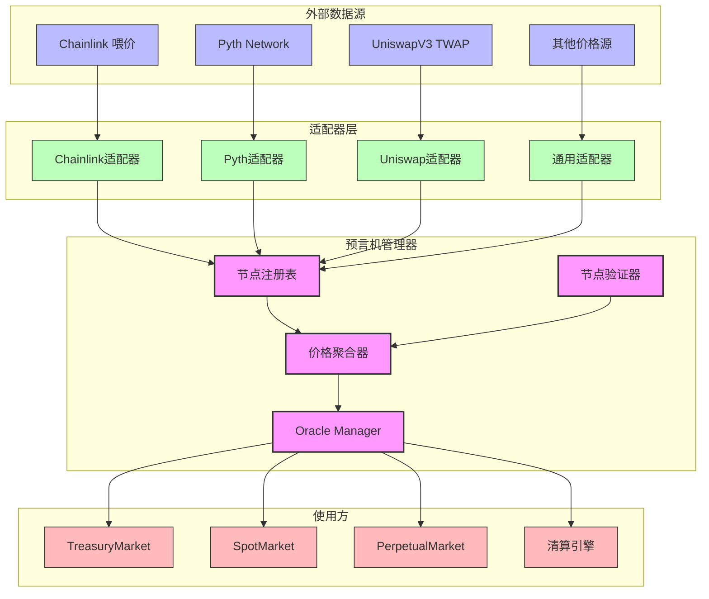
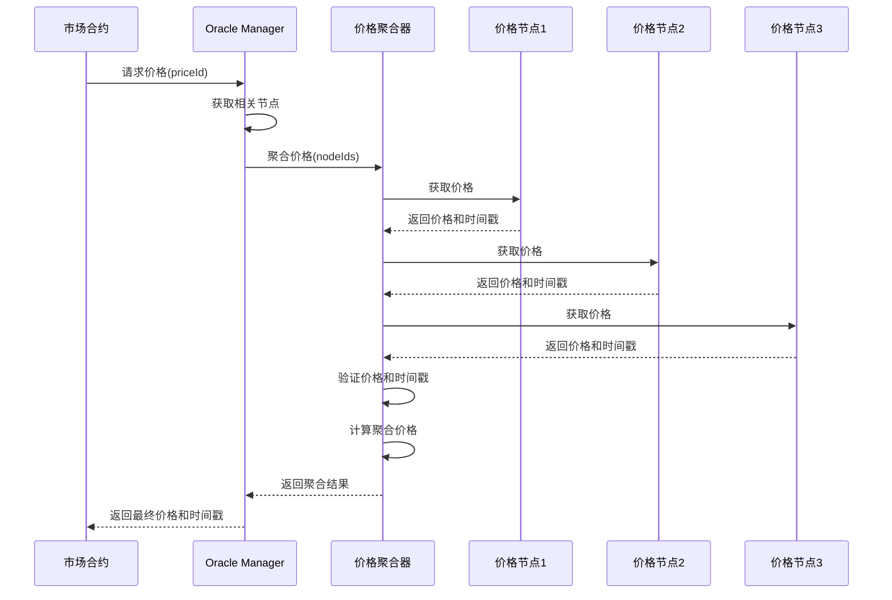
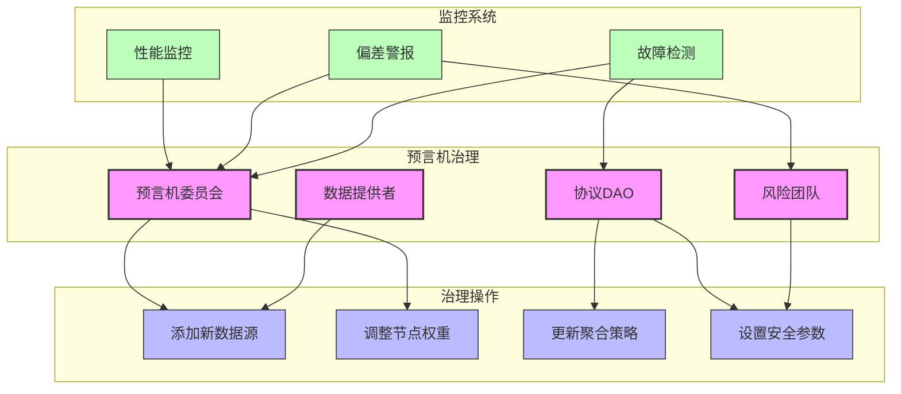
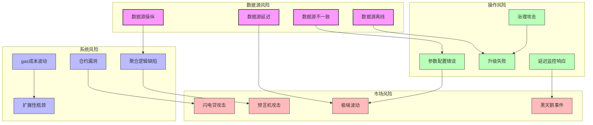
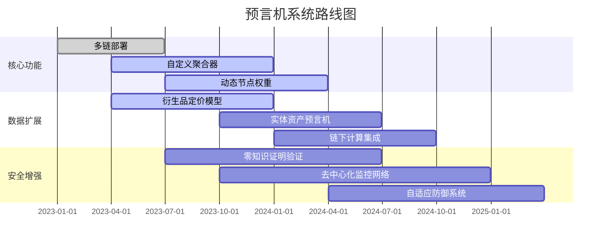

# SynthetixV3 预言机系统详解

## 1. 预言机架构概述

SynthetixV3的预言机系统是整个协议的关键基础设施，负责提供准确、及时的价格数据来支持各种市场操作。V3采用了一种高度模块化和可扩展的预言机架构，支持多源数据聚合和复杂的价格计算逻辑。

### 1.1 整体架构



## 2. 核心组件详解

### 2.1 Oracle Manager

Oracle Manager是预言机系统的中央协调组件，负责管理节点注册、处理价格请求和维护系统配置。

```solidity
// Oracle Manager简化结构
contract OracleManager {
    // 存储所有注册的价格节点
    mapping(bytes32 => NodeDefinition) public nodes;
    
    // 价格ID到节点ID的映射
    mapping(bytes32 => bytes32[]) public priceNodeIds;
    
    // 获取价格的主要接口
    function getPrice(bytes32 priceId) external view returns (uint price, uint timestamp) {
        bytes32[] memory nodeIds = priceNodeIds[priceId];
        require(nodeIds.length > 0, "No nodes for price ID");
        
        // 如果只有一个节点，直接返回该节点的价格
        if (nodeIds.length == 1) {
            NodeDefinition memory node = nodes[nodeIds[0]];
            return node.adapter.getPrice();
        }
        
        // 否则需要聚合多个节点的价格
        return _aggregatePrices(nodeIds);
    }
    
    // 注册新的价格节点
    function registerNode(
        bytes32 nodeId,
        address adapter,
        bytes32 priceId,
        uint weight
    ) external onlyOwner {
        // 验证适配器接口
        require(IPriceAdapter(adapter).supportsInterface(type(IPriceAdapter).interfaceId), "Invalid adapter");
        
        // 注册节点
        nodes[nodeId] = NodeDefinition({
            adapter: IPriceAdapter(adapter),
            weight: weight,
            stalenessPeriod: DEFAULT_STALENESS_PERIOD
        });
        
        // 将节点关联到价格ID
        priceNodeIds[priceId].push(nodeId);
        
        emit NodeRegistered(nodeId, adapter, priceId, weight);
    }
    
    // 内部函数：聚合多个节点的价格
    function _aggregatePrices(bytes32[] memory nodeIds) internal view returns (uint, uint) {
        // 实现逻辑在具体的聚合策略中
        return priceAggregator.aggregate(nodeIds);
    }
}
```

### 2.2 价格适配器

价格适配器是连接外部数据源和Oracle Manager的桥梁，每种数据源都有专门的适配器实现。

```solidity
// 价格适配器接口
interface IPriceAdapter {
    // 获取价格数据
    function getPrice() external view returns (uint price, uint timestamp);
    
    // 检查接口兼容性
    function supportsInterface(bytes4 interfaceId) external view returns (bool);
    
    // 获取适配器元数据
    function getAdapterInfo() external view returns (AdapterInfo memory);
}

// Chainlink适配器实现示例
contract ChainlinkAdapter is IPriceAdapter {
    AggregatorV3Interface public immutable aggregator;
    uint public immutable decimalsNormalizer;
    
    constructor(address _aggregator) {
        aggregator = AggregatorV3Interface(_aggregator);
        
        // 标准化为18位小数
        uint8 decimals = aggregator.decimals();
        if (decimals < 18) {
            decimalsNormalizer = 10 ** (18 - decimals);
        } else {
            decimalsNormalizer = 1;
        }
    }
    
    function getPrice() external view override returns (uint price, uint timestamp) {
        (, int256 answer, , uint256 updatedAt, ) = aggregator.latestRoundData();
        require(answer > 0, "Invalid price");
        
        // 转换价格格式并标准化小数位
        price = uint(answer) * decimalsNormalizer;
        timestamp = updatedAt;
        
        return (price, timestamp);
    }
    
    // 其他接口实现...
}
```

### 2.3 价格聚合策略

SynthetixV3支持多种价格聚合策略，根据不同的需求场景选择适当的策略。

```solidity
// 聚合策略接口
interface IPriceAggregator {
    function aggregate(bytes32[] memory nodeIds) external view returns (uint price, uint timestamp);
}

// 中位数聚合策略
contract MedianPriceAggregator is IPriceAggregator {
    OracleManager public immutable oracleManager;
    
    constructor(address _oracleManager) {
        oracleManager = OracleManager(_oracleManager);
    }
    
    function aggregate(bytes32[] memory nodeIds) external view override returns (uint price, uint timestamp) {
        require(nodeIds.length > 0, "Empty node IDs");
        
        // 收集所有节点的价格
        uint[] memory prices = new uint[](nodeIds.length);
        uint[] memory timestamps = new uint[](nodeIds.length);
        uint[] memory weights = new uint[](nodeIds.length);
        
        uint validNodeCount = 0;
        
        for (uint i = 0; i < nodeIds.length; i++) {
            NodeDefinition memory node = oracleManager.nodes(nodeIds[i]);
            
            try node.adapter.getPrice() returns (uint nodePrice, uint nodeTimestamp) {
                // 检查价格有效性和新鲜度
                if (_isValidPrice(nodePrice) && _isFreshPrice(nodeTimestamp, node.stalenessPeriod)) {
                    prices[validNodeCount] = nodePrice;
                    timestamps[validNodeCount] = nodeTimestamp;
                    weights[validNodeCount] = node.weight;
                    validNodeCount++;
                }
            } catch {
                // 忽略失败的节点
            }
        }
        
        require(validNodeCount >= MIN_VALID_NODES, "Not enough valid nodes");
        
        // 计算加权中位数价格
        price = _computeWeightedMedian(prices, weights, validNodeCount);
        
        // 使用最新的时间戳
        timestamp = _findMaxTimestamp(timestamps, validNodeCount);
        
        return (price, timestamp);
    }
    
    // 其他辅助函数...
}
```

## 3. 价格更新与验证流程

### 3.1 价格获取流程



### 3.2 价格验证机制

SynthetixV3实施了多层次的价格验证机制，确保只有有效的价格数据才会被系统采用：

1. **数据有效性检查**：验证价格是否为正数且在合理范围内
2. **时效性检查**：确保价格数据不超过最大允许的过时时间
3. **偏差检查**：检测与历史价格或其他数据源的重大偏差
4. **异常值过滤**：在聚合前过滤掉明显的异常值
5. **共识检查**：要求多个数据源达成一定程度的共识

```solidity
// 价格验证逻辑示例
function _validatePrice(uint price, uint timestamp, bytes32 priceId) internal view returns (bool) {
    // 基本有效性检查
    if (price == 0 || timestamp == 0) {
        return false;
    }
    
    // 时效性检查
    if (block.timestamp > timestamp + getMaxStaleness(priceId)) {
        return false;
    }
    
    // 获取历史价格进行对比
    (uint prevPrice, ) = getPreviousPrice(priceId);
    if (prevPrice > 0) {
        // 计算价格变化百分比
        uint changePercentage;
        if (price > prevPrice) {
            changePercentage = ((price - prevPrice) * PERCENTAGE_PRECISION) / prevPrice;
        } else {
            changePercentage = ((prevPrice - price) * PERCENTAGE_PRECISION) / prevPrice;
        }
        
        // 检查变化是否超过允许的最大变动
        if (changePercentage > getMaxPriceDeviation(priceId)) {
            // 对于大幅波动，需要进一步验证
            return _validateLargeDeviation(price, prevPrice, timestamp, priceId);
        }
    }
    
    return true;
}
```

## 4. 特殊价格类型处理

### 4.1 合成资产价格

合成资产的价格通常通过一组规则或计算公式从基础资产价格导出。

```solidity
// 指数合成资产价格计算
contract IndexPriceAdapter is IPriceAdapter {
    struct Component {
        bytes32 priceId;
        uint weight;
    }
    
    OracleManager public immutable oracleManager;
    Component[] public components;
    uint public constant TOTAL_WEIGHT = 1e18;
    
    constructor(address _oracleManager, Component[] memory _components) {
        oracleManager = OracleManager(_oracleManager);
        
        // 验证权重总和
        uint totalWeight = 0;
        for (uint i = 0; i < _components.length; i++) {
            totalWeight += _components[i].weight;
            components.push(_components[i]);
        }
        require(totalWeight == TOTAL_WEIGHT, "Invalid weights");
    }
    
    function getPrice() external view override returns (uint price, uint timestamp) {
        uint weightedSum = 0;
        uint latestTimestamp = 0;
        
        for (uint i = 0; i < components.length; i++) {
            Component memory component = components[i];
            
            // 获取组件价格
            (uint componentPrice, uint componentTimestamp) = oracleManager.getPrice(component.priceId);
            
            // 计算加权价格
            weightedSum += (componentPrice * component.weight) / TOTAL_WEIGHT;
            
            // 跟踪最新时间戳
            if (componentTimestamp > latestTimestamp) {
                latestTimestamp = componentTimestamp;
            }
        }
        
        return (weightedSum, latestTimestamp);
    }
}
```

### 4.2 派生价格计算

某些市场需要复杂的派生价格计算，例如期权的隐含波动率或资金费率：

```solidity
// 波动率计算适配器示例
contract VolatilityAdapter is IPriceAdapter {
    OracleManager public immutable oracleManager;
    bytes32 public immutable underlyingPriceId;
    uint public immutable windowSize;
    
    constructor(address _oracleManager, bytes32 _underlyingPriceId, uint _windowSize) {
        oracleManager = OracleManager(_oracleManager);
        underlyingPriceId = _underlyingPriceId;
        windowSize = _windowSize;
    }
    
    function getPrice() external view override returns (uint volatility, uint timestamp) {
        // 获取历史价格数据
        (uint[] memory prices, uint[] memory timestamps) = getPriceHistory(underlyingPriceId, windowSize);
        
        // 计算对数收益率
        int[] memory returns = new int[](prices.length - 1);
        for (uint i = 0; i < prices.length - 1; i++) {
            returns[i] = _calculateLogReturn(prices[i], prices[i + 1]);
        }
        
        // 计算标准差（波动率）
        volatility = _calculateStandardDeviation(returns);
        
        // 年化处理
        volatility = _annualize(volatility, timestamps);
        
        return (volatility, block.timestamp);
    }
    
    // 其他辅助函数...
}
```

## 5. 预言机安全机制

### 5.1 价格延迟机制

为防止闪电贷攻击和价格操纵，重大价格变动可能需要经过延迟确认：

```solidity
// 价格延迟保护机制
contract PriceDeviationCircuitBreaker {
    struct CircuitBreaker {
        uint threshold;      // 触发阈值（百分比）
        uint delay;          // 延迟时间（秒）
        bool isTriggered;    // 是否已触发
        uint triggerTime;    // 触发时间
        uint proposedPrice;  // 提议的新价格
    }
    
    mapping(bytes32 => CircuitBreaker) public circuitBreakers;
    mapping(bytes32 => uint) public lastConfirmedPrices;
    
    OracleManager public immutable oracleManager;
    
    constructor(address _oracleManager) {
        oracleManager = OracleManager(_oracleManager);
    }
    
    // 获取安全价格（可能应用延迟）
    function getSafePrice(bytes32 priceId) external returns (uint price, uint timestamp) {
        // 获取当前原始价格
        (uint rawPrice, uint rawTimestamp) = oracleManager.getPrice(priceId);
        
        CircuitBreaker storage breaker = circuitBreakers[priceId];
        uint lastPrice = lastConfirmedPrices[priceId];
        
        // 如果是首次获取价格，直接确认
        if (lastPrice == 0) {
            lastConfirmedPrices[priceId] = rawPrice;
            return (rawPrice, rawTimestamp);
        }
        
        // 计算价格变动百分比
        uint deviation = calculateDeviation(rawPrice, lastPrice);
        
        // 检查是否超过阈值
        if (deviation > breaker.threshold) {
            // 如果断路器尚未触发，则触发它
            if (!breaker.isTriggered) {
                breaker.isTriggered = true;
                breaker.triggerTime = block.timestamp;
                breaker.proposedPrice = rawPrice;
                
                emit CircuitBreakerTriggered(priceId, lastPrice, rawPrice, deviation);
                
                // 返回最后确认的价格
                return (lastPrice, rawTimestamp);
            } 
            // 如果断路器已触发但延迟尚未过期
            else if (block.timestamp < breaker.triggerTime + breaker.delay) {
                // 更新提议价格但继续返回上一个确认价格
                breaker.proposedPrice = rawPrice;
                return (lastPrice, rawTimestamp);
            }
            // 延迟已过，确认新价格
            else {
                breaker.isTriggered = false;
                lastConfirmedPrices[priceId] = rawPrice;
                
                emit PriceConfirmedAfterDelay(priceId, lastPrice, rawPrice);
                
                return (rawPrice, rawTimestamp);
            }
        }
        // 价格变动在阈值内，重置断路器并确认价格
        else {
            if (breaker.isTriggered) {
                breaker.isTriggered = false;
            }
            
            lastConfirmedPrices[priceId] = rawPrice;
            return (rawPrice, rawTimestamp);
        }
    }
    
    // 其他辅助函数...
}
```

### 5.2 多层防御策略

SynthetixV3预言机系统采用了多层防御策略来抵御各种攻击和故障：

1. **多源数据聚合**：不依赖单一价格源，降低单点故障风险
2. **权重动态调整**：根据数据源的历史表现动态调整其权重
3. **备用数据机制**：在主要数据源失效时启用备用数据源
4. **自动异常检测**：使用统计方法自动识别和处理异常数据
5. **节点信誉系统**：跟踪节点的历史表现并相应调整其影响力

## 6. 预言机治理与维护

### 6.1 预言机治理结构



### 6.2 预言机升级流程

预言机系统的升级遵循严格的流程，确保安全性和连续性：

1. **提案阶段**：提出升级方案并详细说明变更内容
2. **审查阶段**：由预言机委员会和安全团队审查代码和影响
3. **测试阶段**：在测试网络或分叉环境中全面测试变更
4. **投票阶段**：由相关治理实体投票批准变更
5. **通知阶段**：向社区和依赖系统公告即将发生的变更
6. **实施阶段**：执行升级，通常采用渐进式部署策略
7. **监控阶段**：升级后密切监控系统性能和数据质量

## 7. 自定义预言机功能

### 7.1 创建自定义价格源

SynthetixV3允许创建自定义价格源，扩展系统支持的资产类型：

```solidity
// 自定义价格源工厂
contract CustomPriceAdapterFactory {
    OracleManager public immutable oracleManager;
    
    event AdapterCreated(address adapter, bytes32 priceId);
    
    constructor(address _oracleManager) {
        oracleManager = OracleManager(_oracleManager);
    }
    
    // 创建自定义公式价格适配器
    function createFormulaAdapter(
        bytes32 priceId,
        bytes32[] memory inputPriceIds,
        uint8 formulaType,
        bytes memory formulaParams
    ) external returns (address) {
        // 部署新的公式适配器
        FormulaPriceAdapter adapter = new FormulaPriceAdapter(
            address(oracleManager),
            inputPriceIds,
            formulaType,
            formulaParams
        );
        
        // 设置适配器权限
        adapter.transferOwnership(msg.sender);
        
        emit AdapterCreated(address(adapter), priceId);
        
        return address(adapter);
    }
    
    // 创建自定义预言机适配器
    function createCustomAdapter(
        bytes32 priceId,
        address implementation,
        bytes memory initData
    ) external returns (address) {
        // 验证实现合约
        require(
            IPriceAdapter(implementation).supportsInterface(type(IPriceAdapter).interfaceId),
            "Invalid implementation"
        );
        
        // 部署适配器代理
        TransparentUpgradeableProxy proxy = new TransparentUpgradeableProxy(
            implementation,
            address(this),
            initData
        );
        
        emit AdapterCreated(address(proxy), priceId);
        
        return address(proxy);
    }
}
```

### 7.2 自定义聚合策略

除了内置的聚合策略外，SynthetixV3还允许实现和部署自定义聚合策略：

```solidity
// TWAP聚合策略示例
contract TWAPAggregator is IPriceAggregator {
    struct TimeWeightedPrice {
        uint timestamp;
        uint price;
        uint weight;
    }
    
    OracleManager public immutable oracleManager;
    uint public immutable windowSize;
    
    constructor(address _oracleManager, uint _windowSize) {
        oracleManager = OracleManager(_oracleManager);
        windowSize = _windowSize;
    }
    
    function aggregate(bytes32[] memory nodeIds) external view override returns (uint price, uint timestamp) {
        // 初始化累计值
        uint weightedSum = 0;
        uint totalWeight = 0;
        uint lastTimestamp = 0;
        
        // 获取历史价格快照
        TimeWeightedPrice[] memory snapshots = getPriceSnapshots(nodeIds);
        
        // 计算时间加权平均价格
        for (uint i = 0; i < snapshots.length - 1; i++) {
            TimeWeightedPrice memory current = snapshots[i];
            TimeWeightedPrice memory next = snapshots[i + 1];
            
            // 计算时间权重
            uint timeWeight = next.timestamp - current.timestamp;
            
            // 累加加权价格
            weightedSum += current.price * timeWeight;
            totalWeight += timeWeight;
            
            // 跟踪最新时间戳
            if (current.timestamp > lastTimestamp) {
                lastTimestamp = current.timestamp;
            }
        }
        
        // 计算最终TWAP
        if (totalWeight > 0) {
            price = weightedSum / totalWeight;
        } else {
            revert("No valid price points");
        }
        
        timestamp = lastTimestamp;
        
        return (price, timestamp);
    }
    
    // 其他辅助函数...
}
```

## 8. 预言机性能与可扩展性

### 8.1 性能优化策略

SynthetixV3预言机系统实施了多种优化策略以提高性能和减少gas消耗：

1. **缓存机制**：在短时间内复用价格结果，减少外部调用
2. **批量查询**：支持一次性请求多个价格，减少交易数量
3. **存储优化**：精心设计存储布局，减少存储操作
4. **计算优化**：优化数学计算，特别是聚合算法
5. **懒加载模式**：只在实际需要时获取和处理价格数据

```solidity
// 预言机缓存示例
contract OracleCache {
    struct CachedPrice {
        uint price;
        uint timestamp;
        uint cacheTimestamp;
    }
    
    mapping(bytes32 => CachedPrice) public cachedPrices;
    OracleManager public immutable oracleManager;
    uint public immutable cacheValidPeriod;
    
    constructor(address _oracleManager, uint _cacheValidPeriod) {
        oracleManager = OracleManager(_oracleManager);
        cacheValidPeriod = _cacheValidPeriod;
    }
    
    function getPrice(bytes32 priceId) external returns (uint price, uint timestamp) {
        CachedPrice storage cached = cachedPrices[priceId];
        
        // 检查缓存是否仍然有效
        if (cached.price > 0 && block.timestamp <= cached.cacheTimestamp + cacheValidPeriod) {
            return (cached.price, cached.timestamp);
        }
        
        // 缓存无效，获取新价格
        (price, timestamp) = oracleManager.getPrice(priceId);
        
        // 更新缓存
        cached.price = price;
        cached.timestamp = timestamp;
        cached.cacheTimestamp = block.timestamp;
        
        return (price, timestamp);
    }
    
    // 批量获取价格
    function getPrices(bytes32[] calldata priceIds) external returns (uint[] memory prices, uint[] memory timestamps) {
        prices = new uint[](priceIds.length);
        timestamps = new uint[](priceIds.length);
        
        for (uint i = 0; i < priceIds.length; i++) {
            (prices[i], timestamps[i]) = this.getPrice(priceIds[i]);
        }
        
        return (prices, timestamps);
    }
}
```

### 8.2 Layer 2扩展性

SynthetixV3预言机系统设计为支持Layer 2扩展，减少主网上的gas成本：

1. **跨链预言机**：支持在不同链上同步价格数据
2. **证明系统**：使用加密证明验证跨链价格数据
3. **批处理更新**：在L2上批量处理和更新价格数据
4. **压缩技术**：使用数据压缩减少跨链传输成本

## 9. 预言机风险与挑战

### 9.1 主要风险点



### 9.2 风险缓解策略

SynthetixV3实施了多种策略来缓解预言机相关风险：

1. **多源数据聚合**：降低单一数据源失败的影响
2. **渐进式价格更新**：大幅价格变动需要经过延迟确认
3. **故障检测系统**：自动检测和应对数据异常
4. **备份预言机**：在主要预言机失效时启用备用系统
5. **经济激励**：激励准确报告和及时更新
6. **安全预算**：为处理预言机相关安全事件预留资金
7. **常规审计**：定期安全审计和压力测试

## 10. 未来发展方向

### 10.1 技术发展路线图



### 10.2 创新研究方向

SynthetixV3预言机系统的未来研究方向包括：

1. **去中心化预言机网络**：创建完全去中心化的专用预言机网络
2. **机器学习价格预测**：将机器学习应用于预测和异常检测
3. **零知识证明集成**：使用零知识证明验证价格数据正确性
4. **分片预言机网络**：使用分片技术提高预言机系统吞吐量
5. **自适应聚合算法**：根据市场条件动态调整聚合策略
6. **预言机经济模型**：设计可持续的经济模型激励准确数据提供

## 总结

SynthetixV3的预言机系统通过其模块化设计、多源数据聚合和强大的安全机制，为整个协议提供了可靠的价格数据基础设施。系统在保持高度安全性和可靠性的同时，也提供了灵活的扩展性，支持各种自定义价格源和聚合策略。随着持续的发展和优化，SynthetixV3预言机有望成为DeFi生态系统中最先进的价格数据解决方案之一。 