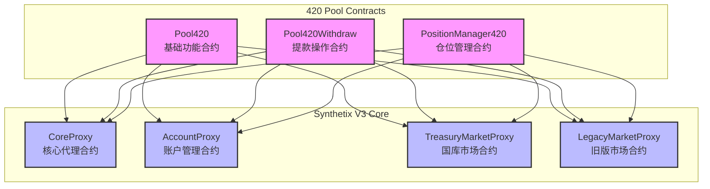

# Synthetix 420 Pool 合约架构图

## 合约关系图

```mermaid
graph TB
    subgraph "420 Pool Contracts"
        Pool420[Pool420<br/>基础功能合约]
        Pool420Withdraw[Pool420Withdraw<br/>提款操作合约]
        PositionManager420[PositionManager420<br/>仓位管理合约]
    end

    subgraph "Synthetix V3 Core"
        CoreProxy[CoreProxy<br/>核心代理合约]
        AccountProxy[AccountProxy<br/>账户管理合约]
        TreasuryMarketProxy[TreasuryMarketProxy<br/>国库市场合约]
        LegacyMarketProxy[LegacyMarketProxy<br/>旧版市场合约]
    end

    Pool420 --> CoreProxy
    Pool420 --> AccountProxy
    Pool420 --> TreasuryMarketProxy
    Pool420 --> LegacyMarketProxy

    Pool420Withdraw --> CoreProxy
    Pool420Withdraw --> AccountProxy
    Pool420Withdraw --> TreasuryMarketProxy
    Pool420Withdraw --> LegacyMarketProxy

    PositionManager420 --> CoreProxy
    PositionManager420 --> AccountProxy
    PositionManager420 --> TreasuryMarketProxy
    PositionManager420 --> LegacyMarketProxy

    style Pool420 fill:#f9f,stroke:#333,stroke-width:2px
    style Pool420Withdraw fill:#f9f,stroke:#333,stroke-width:2px
    style PositionManager420 fill:#f9f,stroke:#333,stroke-width:2px
    style CoreProxy fill:#bbf,stroke:#333,stroke-width:2px
    style AccountProxy fill:#bbf,stroke:#333,stroke-width:2px
    style TreasuryMarketProxy fill:#bbf,stroke:#333,stroke-width:2px
    style LegacyMarketProxy fill:#bbf,stroke:#333,stroke-width:2px
```

## 说明
- **420 Pool Contracts**: 项目的三个主要合约
- **Synthetix V3 Core**: Synthetix V3的核心合约
- 所有420合约都依赖于V3核心合约提供的功能 