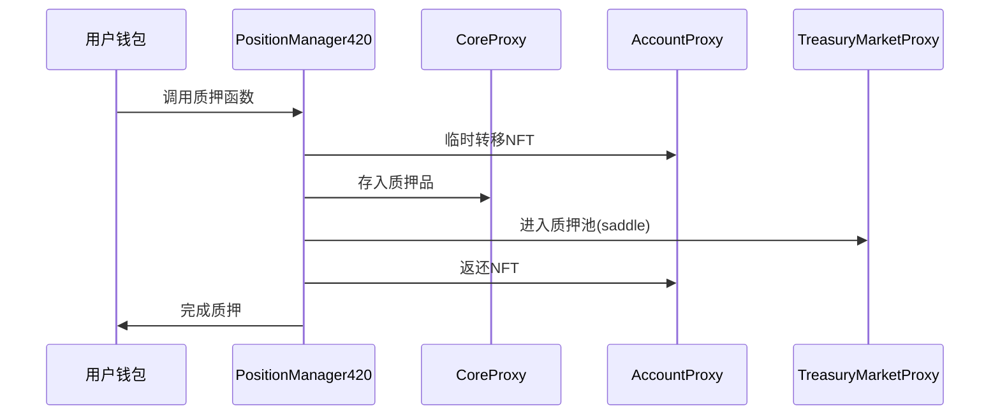
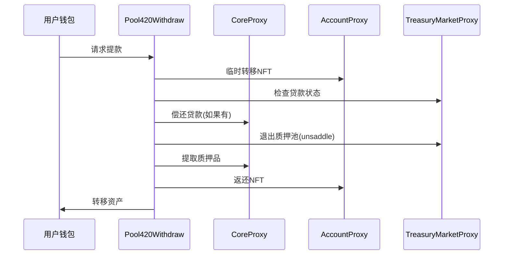
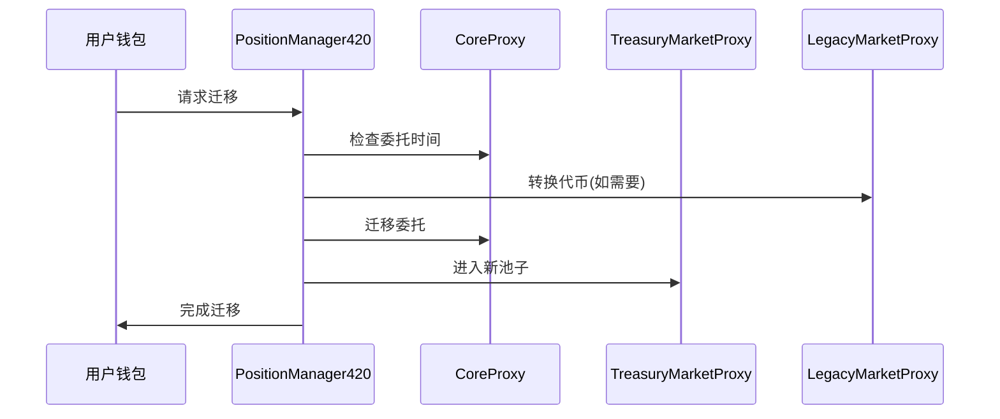
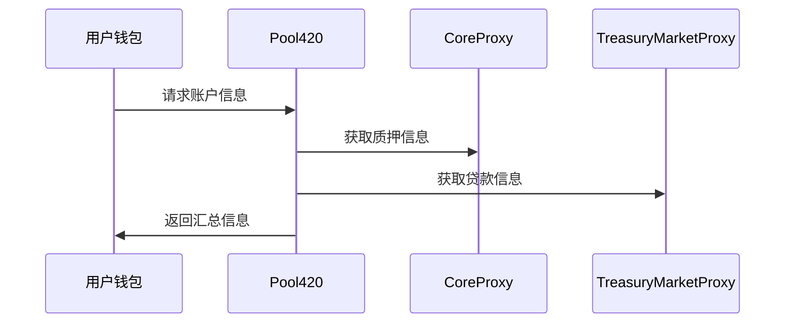

# Synthetix 420 Pool 功能流程图

## 质押流程

```mermaid
sequenceDiagram
    participant User as 用户钱包
    participant PM as PositionManager420
    participant Core as CoreProxy
    participant Account as AccountProxy
    participant Treasury as TreasuryMarketProxy

    User->>PM: 调用质押函数
    PM->>Account: 临时转移NFT
    PM->>Core: 存入质押品
    PM->>Treasury: 进入质押池(saddle)
    PM->>Account: 返还NFT
    PM->>User: 完成质押
```

## 提款流程

```mermaid
sequenceDiagram
    participant User as 用户钱包
    participant PW as Pool420Withdraw
    participant Core as CoreProxy
    participant Account as AccountProxy
    participant Treasury as TreasuryMarketProxy

    User->>PW: 请求提款
    PW->>Account: 临时转移NFT
    PW->>Treasury: 检查贷款状态
    PW->>Core: 偿还贷款(如果有)
    PW->>Treasury: 退出质押池(unsaddle)
    PW->>Core: 提取质押品
    PW->>Account: 返还NFT
    PW->>User: 转移资产
```

## 迁移流程

```mermaid
sequenceDiagram
    participant User as 用户钱包
    participant PM as PositionManager420
    participant Core as CoreProxy
    participant Treasury as TreasuryMarketProxy
    participant Legacy as LegacyMarketProxy

    User->>PM: 请求迁移
    PM->>Core: 检查委托时间
    PM->>Legacy: 转换代币(如需要)
    PM->>Core: 迁移委托
    PM->>Treasury: 进入新池子
    PM->>User: 完成迁移
```

## 查询流程

```mermaid
sequenceDiagram
    participant User as 用户钱包
    participant Pool as Pool420
    participant Core as CoreProxy
    participant Treasury as TreasuryMarketProxy

    User->>Pool: 请求账户信息
    Pool->>Core: 获取质押信息
    Pool->>Treasury: 获取贷款信息
    Pool->>User: 返回汇总信息
``` 