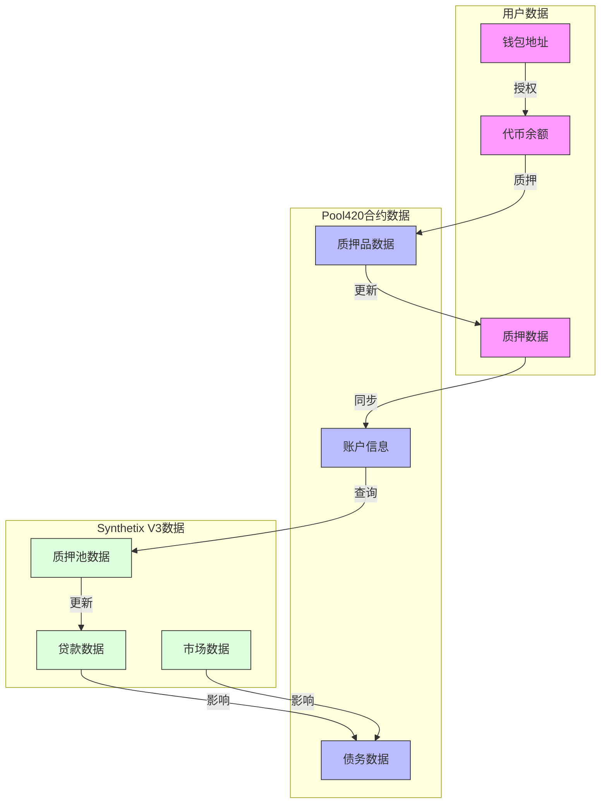
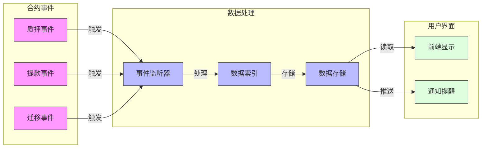

# Synthetix 420 Pool 数据流图

## 质押数据流

## 事件数据流

## 说明
1. **质押数据流**
   - 展示了从用户钱包到最终质押池的完整数据流动过程
   - 包括授权、质押、更新等关键步骤
   - 显示了各个合约之间的数据同步关系

2. **事件数据流**
   - 展示了合约事件如何被处理和使用
   - 包括事件监听、数据索引和存储流程
   - 展示了数据如何最终呈现给用户 