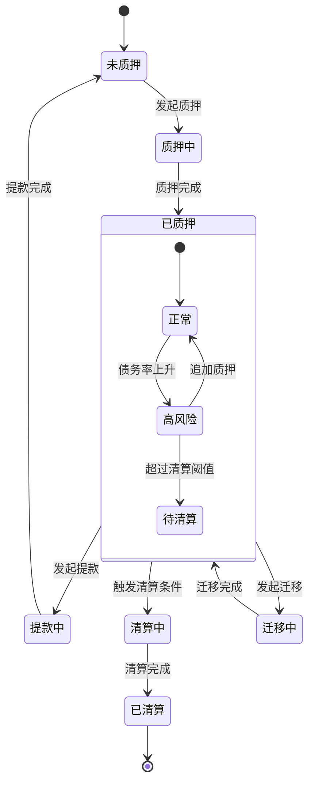
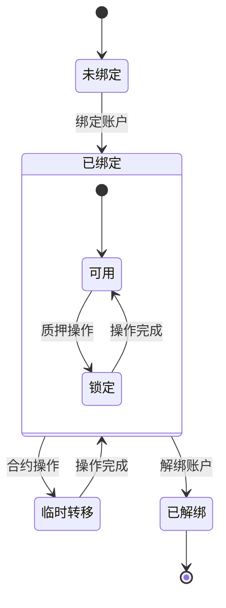
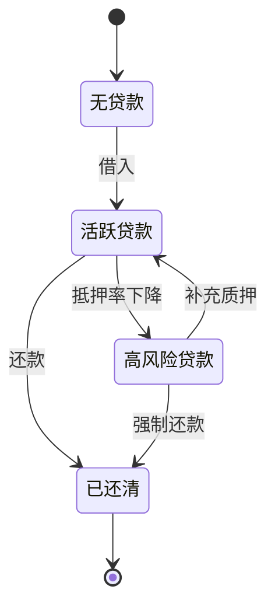

# Synthetix 420 Pool 状态转换图

## 质押仓位状态图

## NFT状态图

## 贷款状态图

## 说明
1. **质押仓位状态**
   - 展示了质押仓位从创建到结束的完整生命周期
   - 包括正常操作流程和异常情况处理
   - 展示了嵌套状态（已质押状态下的细分状态）

2. **NFT状态**
   - 展示了NFT在系统中的各种状态
   - 包括绑定、临时转移等操作状态
   - 展示了NFT在已绑定状态下的可用性状态

3. **贷款状态**
   - 展示了贷款从发起到结束的状态变化
   - 包括风险状态的转换
   - 展示了不同还款方式的状态流转 