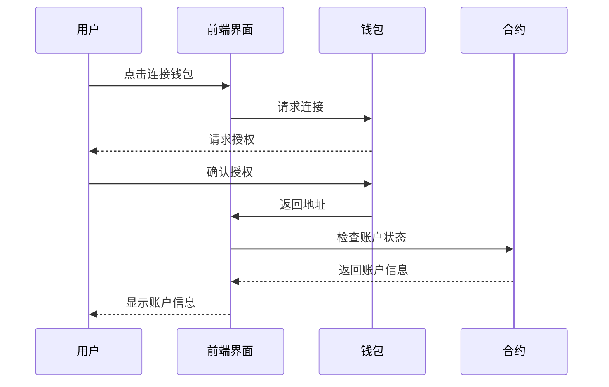
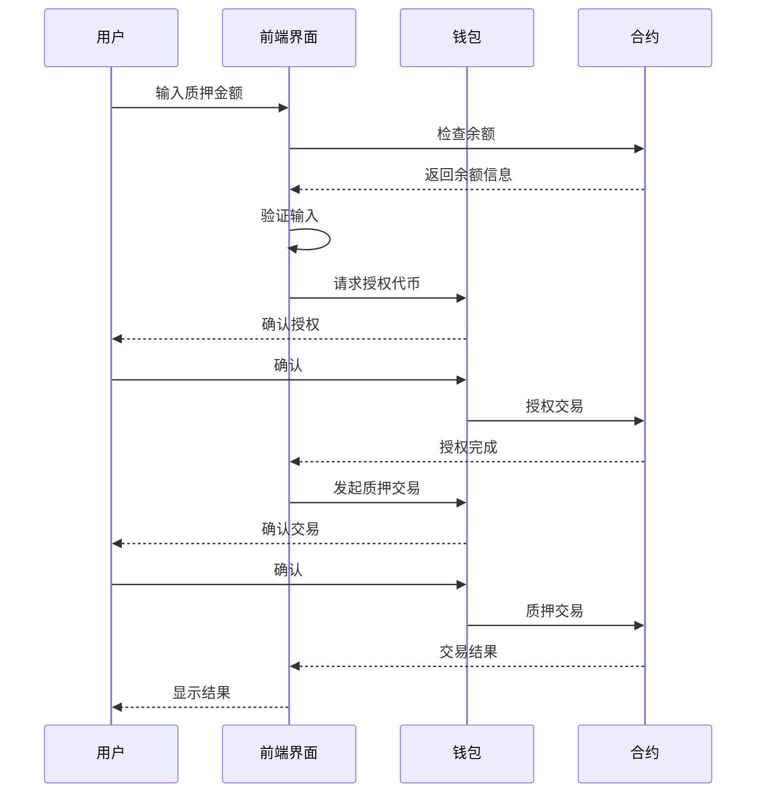
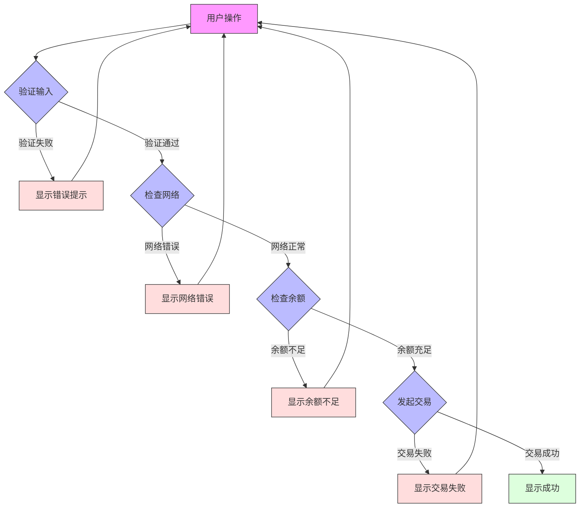
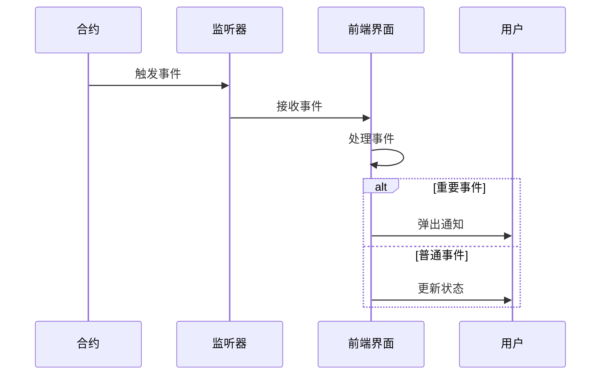

# Synthetix 420 Pool 用户交互流程图

## 钱包连接流程

## 质押操作流程

## 错误处理流程

## 通知系统流程

## 说明
1. **钱包连接流程**
   - 展示了用户如何连接钱包
   - 包括授权确认步骤
   - 展示了账户信息的获取过程

2. **质押操作流程**
   - 展示了完整的质押操作步骤
   - 包括输入验证、授权和交易确认
   - 展示了多步交易的流程

3. **错误处理流程**
   - 展示了各种可能的错误情况
   - 包括输入验证、网络检查、余额检查等
   - 展示了错误恢复流程

4. **通知系统流程**
   - 展示了事件通知的处理方式
   - 区分了重要事件和普通事件
   - 展示了不同的通知方式 