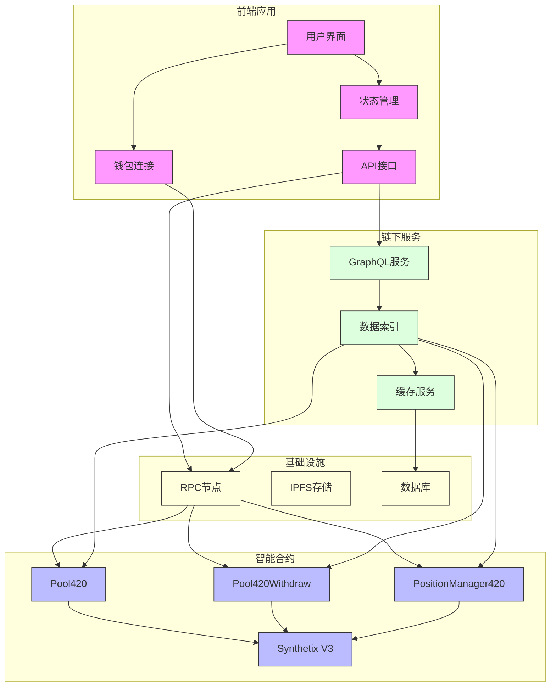
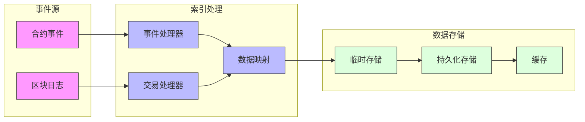
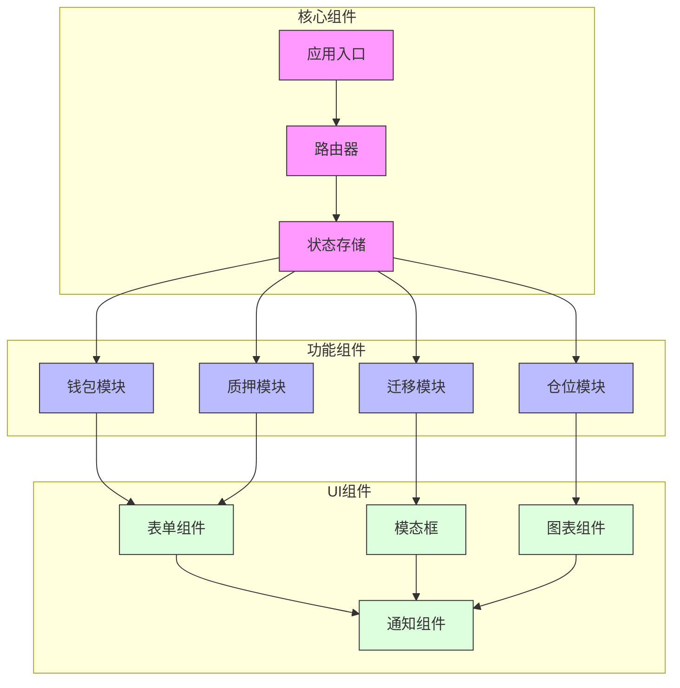

# Synthetix 420 Pool 系统组件图

## 整体架构图

## 数据索引架构

## 前端组件架构

## 说明
1. **整体架构图**
   - 展示了系统的四个主要部分：前端应用、智能合约、链下服务和基础设施
   - 展示了各组件之间的交互关系
   - 清晰显示了数据流向

2. **数据索引架构**
   - 展示了事件数据的处理流程
   - 包括数据的临时存储和持久化
   - 展示了缓存策略

3. **前端组件架构**
   - 展示了前端应用的模块化结构
   - 包括核心组件、功能组件和UI组件
   - 展示了组件之间的依赖关系 