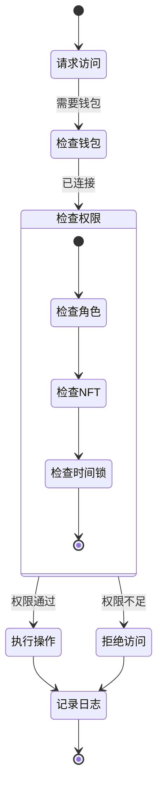
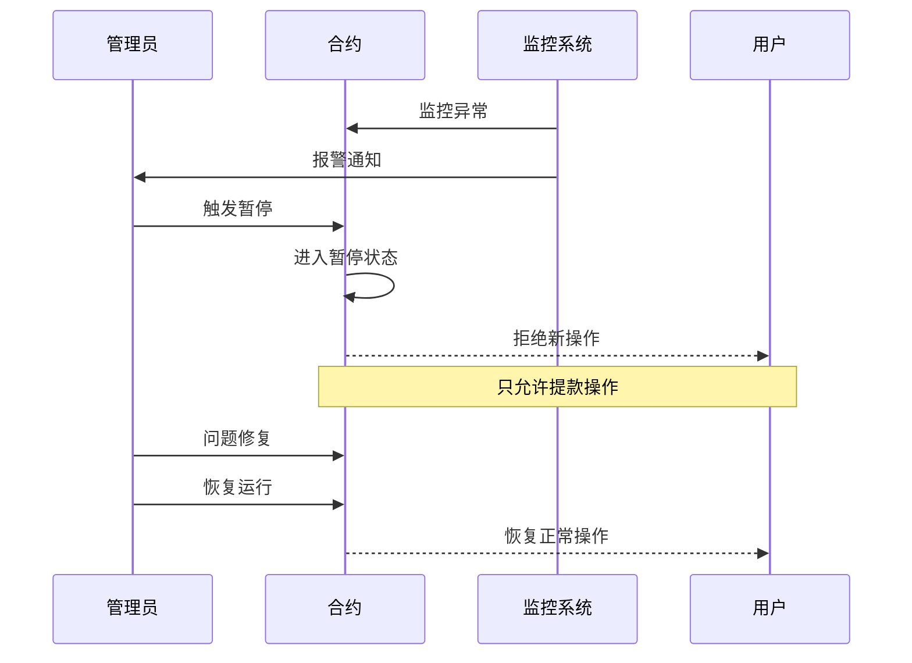
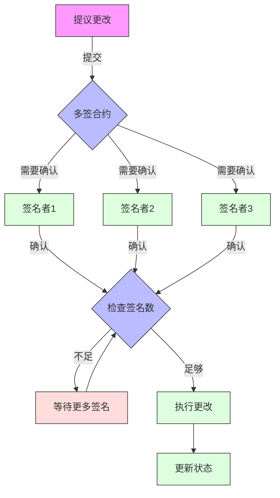
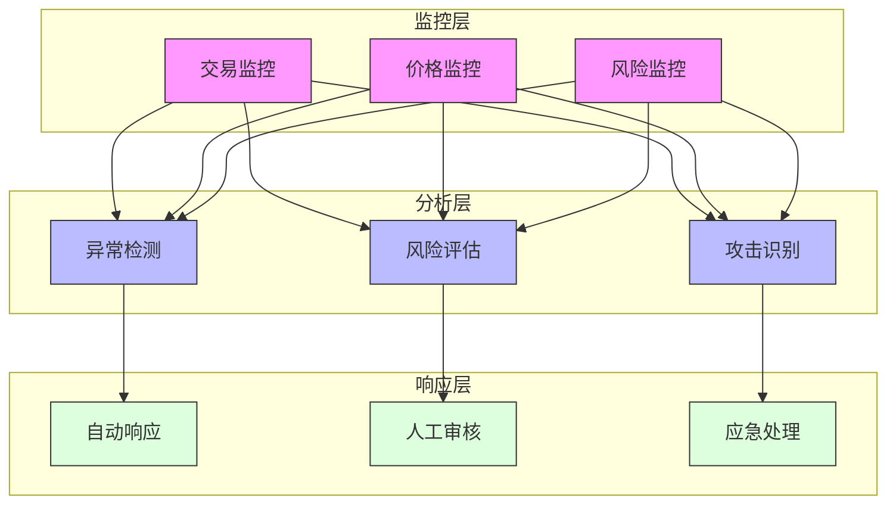

# Synthetix 420 Pool 安全流程图

## 权限控制流程

## 紧急暂停机制

## 多重签名流程

## 安全监控流程

## 说明
1. **权限控制流程**
   - 展示了系统的权限检查机制
   - 包括钱包连接、角色检查、NFT验证等
   - 展示了完整的访问控制流程

2. **紧急暂停机制**
   - 展示了系统的紧急暂停流程
   - 包括监控、报警、暂停和恢复
   - 展示了用户操作的限制

3. **多重签名流程**
   - 展示了合约更改的多重签名机制
   - 包括提议、确认和执行流程
   - 展示了安全控制机制

4. **安全监控流程**
   - 展示了系统的安全监控架构
   - 包括监控、分析和响应三个层次
   - 展示了自动化和人工干预机制 