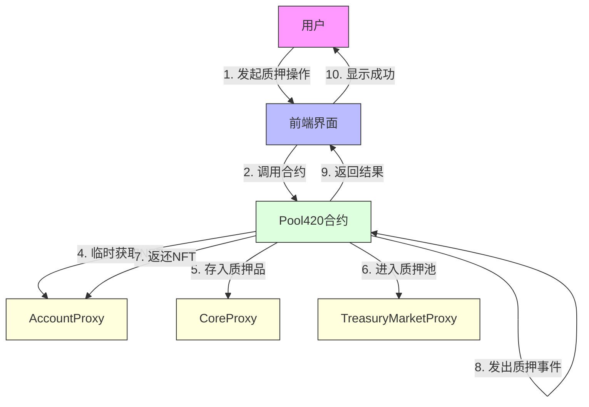
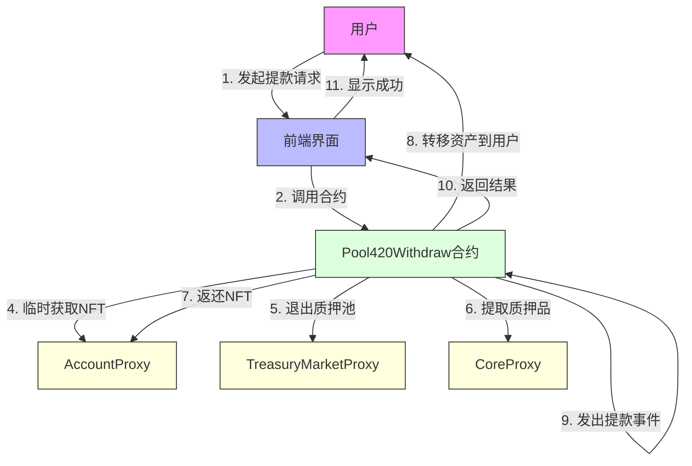
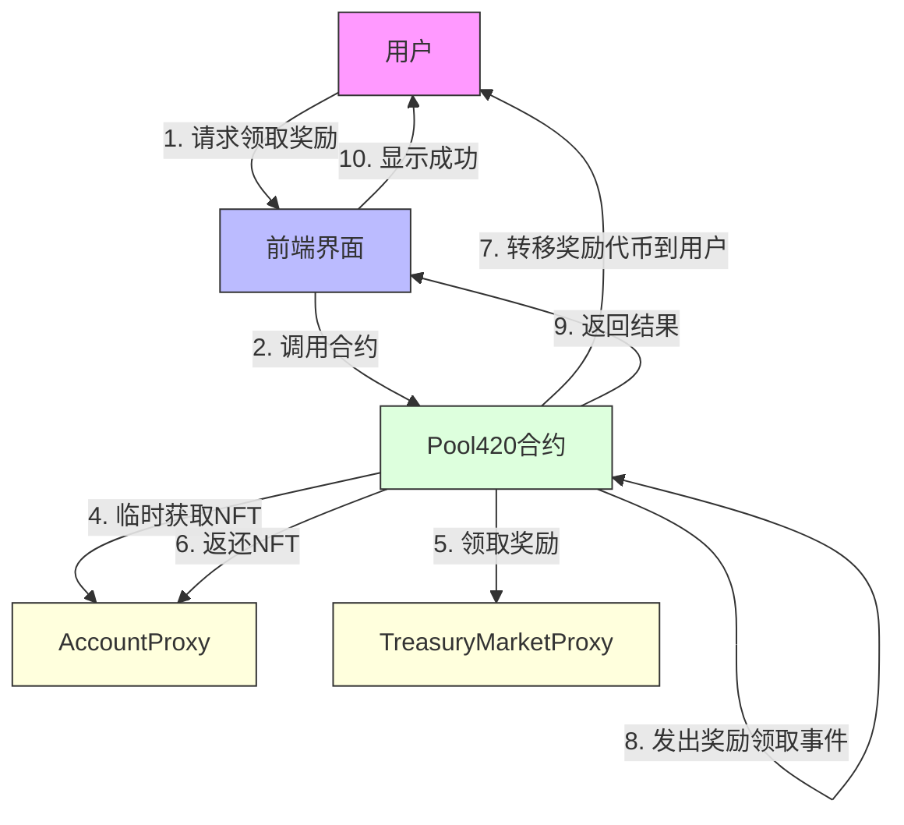
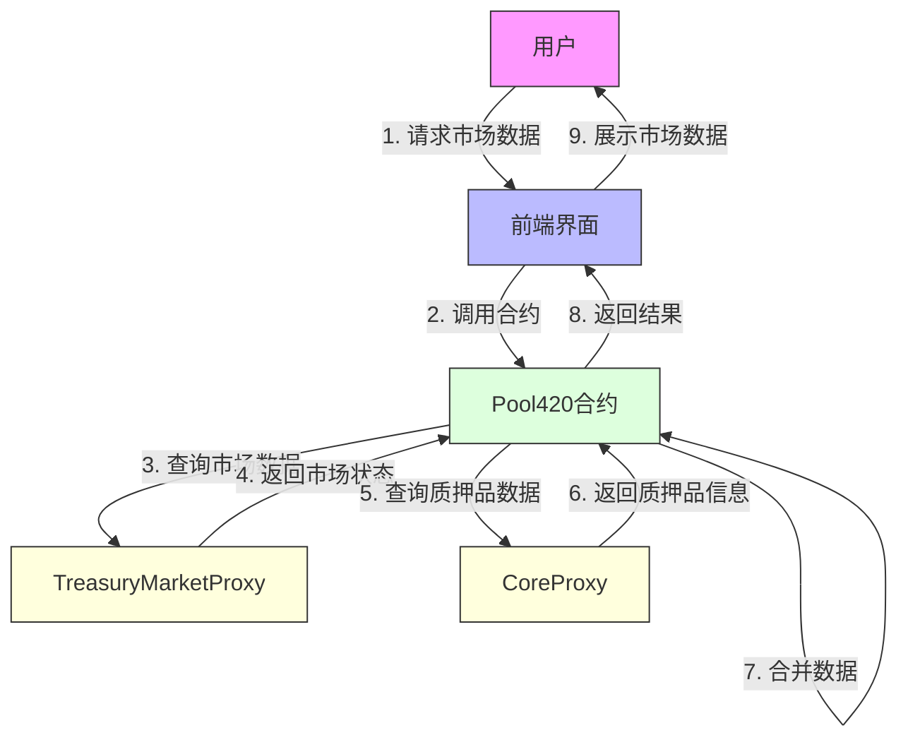
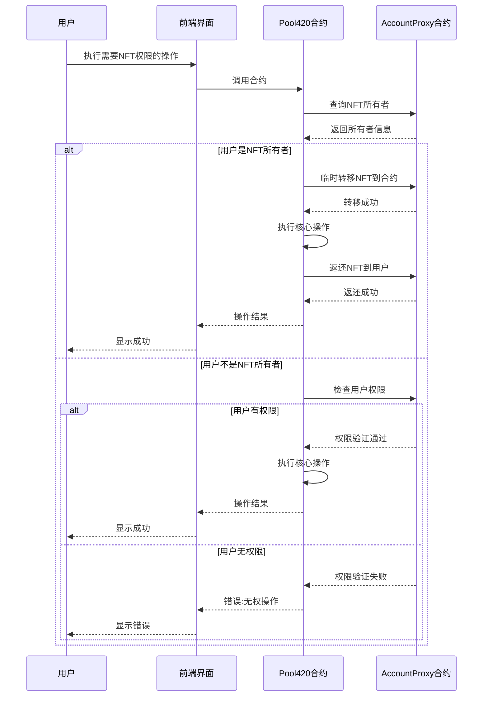
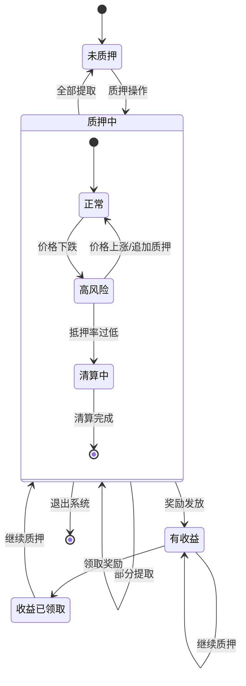
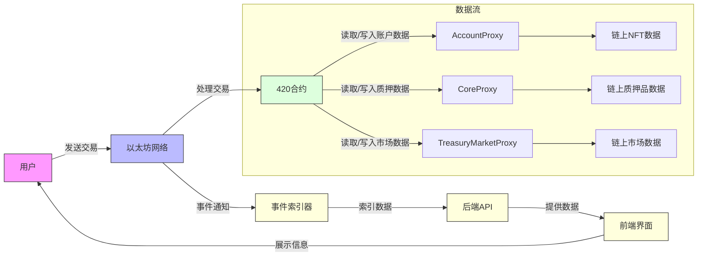
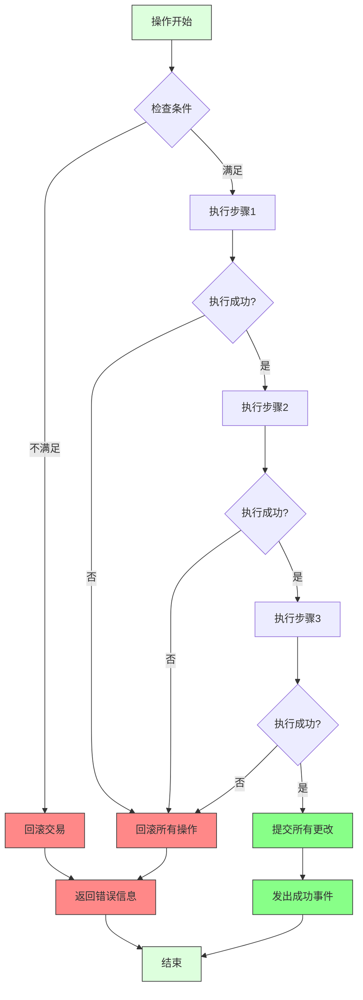
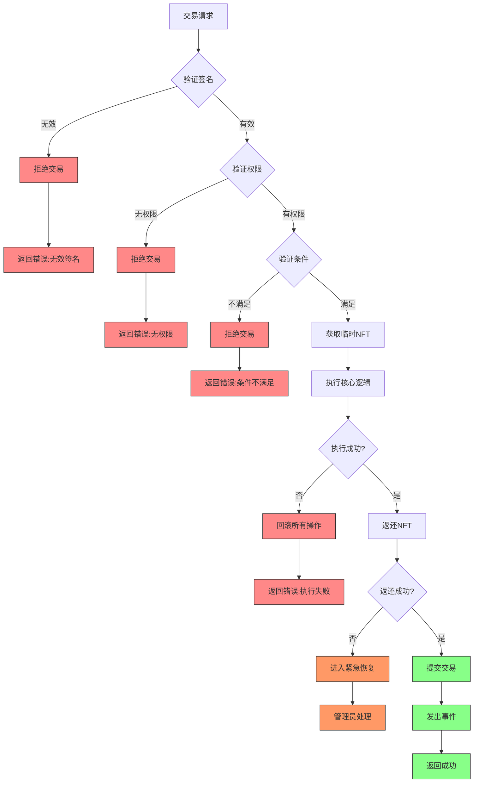
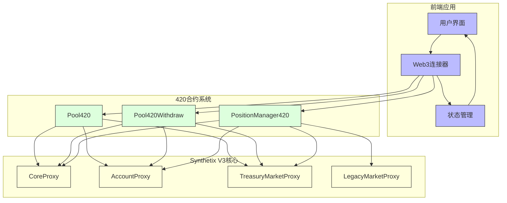

# Synthetix V3与420合约交互流程图

## 质押流程

```mermaid
graph TD
    A[用户] -->|1. 发起质押操作| B[前端界面]
    B -->|2. 调用合约| C[Pool420合约]
    C -->|3. 检查授权| C
    C -->|4. 临时获取NFT| D[AccountProxy]
    C -->|5. 存入质押品| E[CoreProxy]
    C -->|6. 进入质押池| F[TreasuryMarketProxy]
    C -->|7. 返还NFT| D
    C -->|8. 发出质押事件| C
    C -->|9. 返回结果| B
    B -->|10. 显示成功| A

    style A fill:#f9f,stroke:#333
    style B fill:#bbf,stroke:#333
    style C fill:#dfd,stroke:#333
    style D fill:#ffd,stroke:#333
    style E fill:#ffd,stroke:#333
    style F fill:#ffd,stroke:#333
```

## 提款流程

```mermaid
graph TD
    A[用户] -->|1. 发起提款请求| B[前端界面]
    B -->|2. 调用合约| C[Pool420Withdraw合约]
    C -->|3. 验证请求| C
    C -->|4. 临时获取NFT| D[AccountProxy]
    C -->|5. 退出质押池| E[TreasuryMarketProxy]
    C -->|6. 提取质押品| F[CoreProxy]
    C -->|7. 返还NFT| D
    C -->|8. 转移资产到用户| A
    C -->|9. 发出提款事件| C
    C -->|10. 返回结果| B
    B -->|11. 显示成功| A

    style A fill:#f9f,stroke:#333
    style B fill:#bbf,stroke:#333
    style C fill:#dfd,stroke:#333
    style D fill:#ffd,stroke:#333
    style E fill:#ffd,stroke:#333
    style F fill:#ffd,stroke:#333
```

## 领取奖励流程

```mermaid
graph TD
    A[用户] -->|1. 请求领取奖励| B[前端界面]
    B -->|2. 调用合约| C[Pool420合约]
    C -->|3. 检查奖励| C
    C -->|4. 临时获取NFT| D[AccountProxy]
    C -->|5. 领取奖励| E[TreasuryMarketProxy]
    C -->|6. 返还NFT| D
    C -->|7. 转移奖励代币到用户| A
    C -->|8. 发出奖励领取事件| C
    C -->|9. 返回结果| B
    B -->|10. 显示成功| A

    style A fill:#f9f,stroke:#333
    style B fill:#bbf,stroke:#333
    style C fill:#dfd,stroke:#333
    style D fill:#ffd,stroke:#333
    style E fill:#ffd,stroke:#333
```

## 市场查询流程

```mermaid
graph TD
    A[用户] -->|1. 请求市场数据| B[前端界面]
    B -->|2. 调用合约| C[Pool420合约]
    C -->|3. 查询市场数据| D[TreasuryMarketProxy]
    D -->|4. 返回市场状态| C
    C -->|5. 查询质押品数据| E[CoreProxy]
    E -->|6. 返回质押品信息| C
    C -->|7. 合并数据| C
    C -->|8. 返回结果| B
    B -->|9. 展示市场数据| A

    style A fill:#f9f,stroke:#333
    style B fill:#bbf,stroke:#333
    style C fill:#dfd,stroke:#333
    style D fill:#ffd,stroke:#333
    style E fill:#ffd,stroke:#333
```

## NFT账户操作流程

```mermaid
sequenceDiagram
    participant User as 用户
    participant UI as 前端界面
    participant Pool420 as Pool420合约
    participant AccountProxy as AccountProxy合约
    
    User->>UI: 执行需要NFT权限的操作
    UI->>Pool420: 调用合约
    Pool420->>AccountProxy: 查询NFT所有者
    AccountProxy-->>Pool420: 返回所有者信息
    
    alt 用户是NFT所有者
        Pool420->>AccountProxy: 临时转移NFT到合约
        AccountProxy-->>Pool420: 转移成功
        Pool420->>Pool420: 执行核心操作
        Pool420->>AccountProxy: 返还NFT到用户
        AccountProxy-->>Pool420: 返还成功
        Pool420-->>UI: 操作结果
        UI-->>User: 显示成功
    else 用户不是NFT所有者
        Pool420->>AccountProxy: 检查用户权限
        
        alt 用户有权限
            AccountProxy-->>Pool420: 权限验证通过
            Pool420->>Pool420: 执行核心操作
            Pool420-->>UI: 操作结果
            UI-->>User: 显示成功
        else 用户无权限
            AccountProxy-->>Pool420: 权限验证失败
            Pool420-->>UI: 错误:无权操作
            UI-->>User: 显示错误
        end
    end
```

## 状态转换流程

```mermaid
stateDiagram-v2
    [*] --> 未质押
    未质押 --> 质押中: 质押操作
    质押中 --> 质押中: 追加质押
    质押中 --> 质押中: 部分提取
    质押中 --> 未质押: 全部提取
    质押中 --> 有收益: 奖励发放
    有收益 --> 有收益: 继续质押
    有收益 --> 收益已领取: 领取奖励
    收益已领取 --> 质押中: 继续质押
    质押中 --> [*]: 退出系统
    
    state 质押中 {
        [*] --> 正常
        正常 --> 高风险: 价格下跌
        高风险 --> 正常: 价格上涨/追加质押
        高风险 --> 清算中: 抵押率过低
        清算中 --> [*]: 清算完成
    }
```

## 数据流图

```mermaid
graph LR
    A[用户] -->|发送交易| B[以太坊网络]
    B -->|处理交易| C[420合约]
    
    subgraph "数据流"
        C -->|读取/写入账户数据| D[AccountProxy]
        C -->|读取/写入质押数据| E[CoreProxy]
        C -->|读取/写入市场数据| F[TreasuryMarketProxy]
        
        D --> G[链上NFT数据]
        E --> H[链上质押品数据]
        F --> I[链上市场数据]
    end
    
    B -->|事件通知| J[事件索引器]
    J -->|索引数据| K[后端API]
    K -->|提供数据| L[前端界面]
    L -->|展示信息| A
    
    style A fill:#f9f,stroke:#333
    style B fill:#bbf,stroke:#333
    style C fill:#dfd,stroke:#333
    style J fill:#ffd,stroke:#333
    style K fill:#ffd,stroke:#333
    style L fill:#ffd,stroke:#333
```

## 异常处理流程

```mermaid
graph TD
    A[操作开始] --> B{检查条件}
    B -->|不满足| C[回滚交易]
    C --> D[返回错误信息]
    D --> Z[结束]
    
    B -->|满足| E[执行步骤1]
    E --> F{执行成功?}
    F -->|否| G[回滚所有操作]
    G --> D
    
    F -->|是| H[执行步骤2]
    H --> I{执行成功?}
    I -->|否| G
    I -->|是| J[执行步骤3]
    J --> K{执行成功?}
    K -->|否| G
    K -->|是| L[提交所有更改]
    L --> M[发出成功事件]
    M --> Z
    
    style A fill:#dfd,stroke:#333
    style Z fill:#dfd,stroke:#333
    style C fill:#f88,stroke:#333
    style G fill:#f88,stroke:#333
    style D fill:#f88,stroke:#333
    style L fill:#8f8,stroke:#333
    style M fill:#8f8,stroke:#333
```

## 安全防护流程

```mermaid
graph TD
    A[交易请求] --> B{验证签名}
    B -->|无效| C[拒绝交易]
    C --> D[返回错误:无效签名]
    
    B -->|有效| E{验证权限}
    E -->|无权限| F[拒绝交易]
    F --> G[返回错误:无权限]
    
    E -->|有权限| H{验证条件}
    H -->|不满足| I[拒绝交易]
    I --> J[返回错误:条件不满足]
    
    H -->|满足| K[获取临时NFT]
    K --> L[执行核心逻辑]
    L --> M{执行成功?}
    M -->|否| N[回滚所有操作]
    N --> O[返回错误:执行失败]
    
    M -->|是| P[返还NFT]
    P --> Q{返还成功?}
    Q -->|否| R[进入紧急恢复]
    R --> S[管理员处理]
    
    Q -->|是| T[提交交易]
    T --> U[发出事件]
    U --> V[返回成功]
    
    style C fill:#f88,stroke:#333
    style D fill:#f88,stroke:#333
    style F fill:#f88,stroke:#333
    style G fill:#f88,stroke:#333
    style I fill:#f88,stroke:#333
    style J fill:#f88,stroke:#333
    style N fill:#f88,stroke:#333
    style O fill:#f88,stroke:#333
    style R fill:#f96,stroke:#333
    style S fill:#f96,stroke:#333
    style T fill:#8f8,stroke:#333
    style U fill:#8f8,stroke:#333
    style V fill:#8f8,stroke:#333
```

## 系统组件依赖图

```mermaid
flowchart TB
    subgraph "前端应用"
        UI[用户界面]
        Web3[Web3连接器]
        State[状态管理]
    end
    
    subgraph "420合约系统"
        Pool[Pool420]
        Withdraw[Pool420Withdraw]
        Position[PositionManager420]
    end
    
    subgraph "Synthetix V3核心"
        Core[CoreProxy]
        Account[AccountProxy]
        Market[TreasuryMarketProxy]
        Legacy[LegacyMarketProxy]
    end
    
    UI --> Web3
    Web3 --> State
    State --> UI
    
    Web3 --> Pool
    Web3 --> Withdraw
    Web3 --> Position
    
    Pool --> Core
    Pool --> Account
    Pool --> Market
    
    Withdraw --> Core
    Withdraw --> Account
    Withdraw --> Market
    
    Position --> Core
    Position --> Account
    Position --> Market
    Position --> Legacy
    
    style UI fill:#bbf,stroke:#333
    style Web3 fill:#bbf,stroke:#333
    style State fill:#bbf,stroke:#333
    
    style Pool fill:#dfd,stroke:#333
    style Withdraw fill:#dfd,stroke:#333
    style Position fill:#dfd,stroke:#333
    
    style Core fill:#ffd,stroke:#333
    style Account fill:#ffd,stroke:#333
    style Market fill:#ffd,stroke:#333
    style Legacy fill:#ffd,stroke:#333
``` 