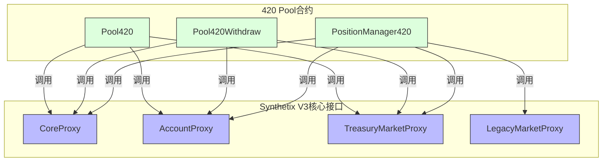
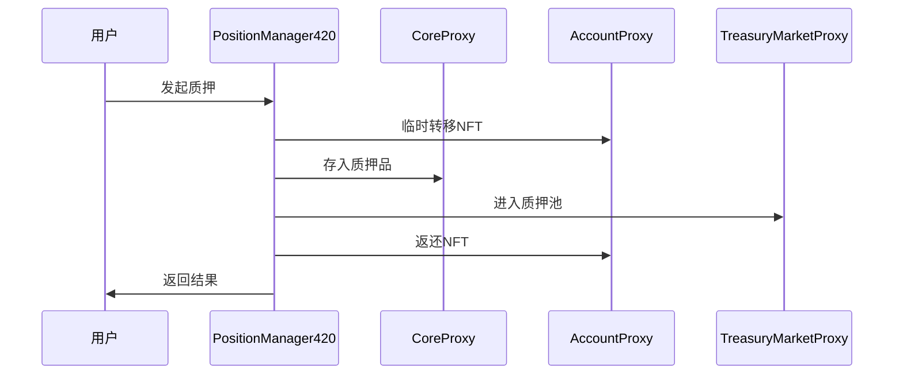
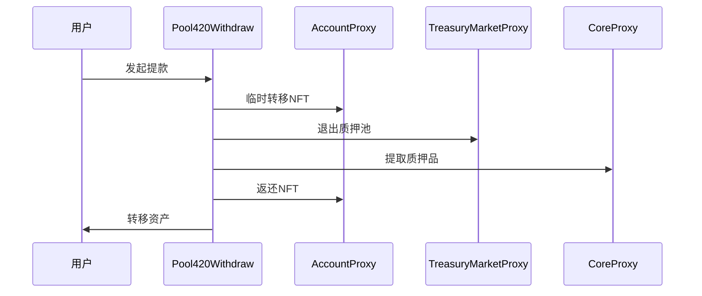
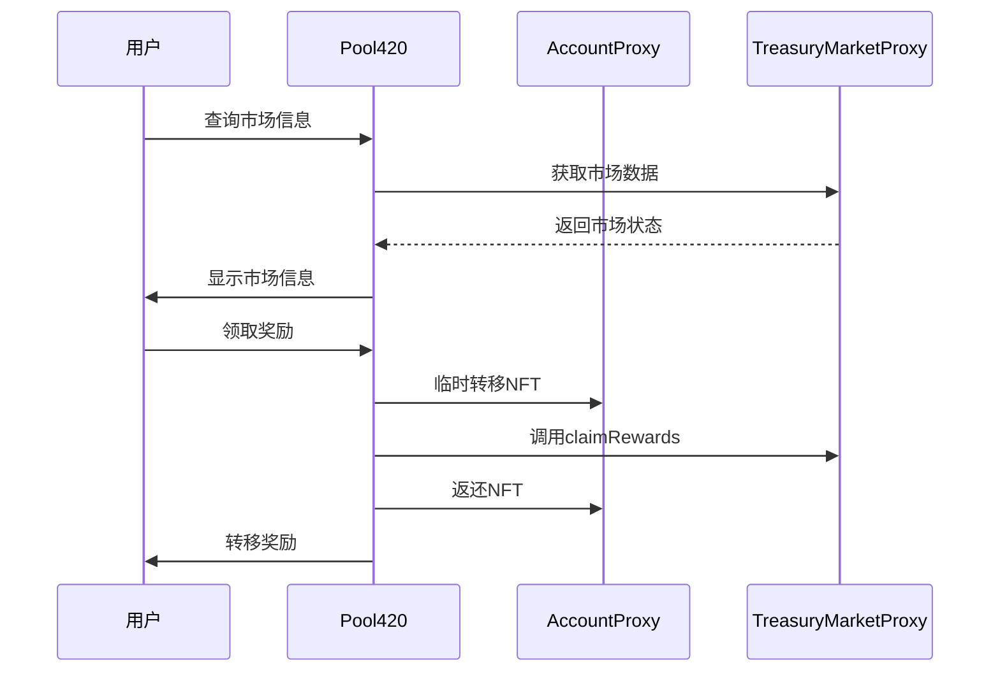

# Synthetix V3 核心接口学习指南

## 接口概览



## 1. CoreProxy 接口

### 功能概述
CoreProxy是Synthetix V3的核心接口，负责系统的基本功能，包括质押品管理、系统配置和全局状态。

### 关键方法
| 方法名 | 功能描述 | 使用场景 |
|-------|---------|---------|
| `depositCollateral` | 存入质押品到系统中 | 用户质押资产时 |
| `withdrawCollateral` | 从系统提取质押品 | 用户提取资产时 |
| `getAccountCollateral` | 获取账户质押品信息 | 查询用户质押状态 |
| `getSystemCollaterals` | 获取系统支持的所有质押品 | 系统初始化和信息展示 |
| `issueSynths` | 铸造合成资产 | 借贷功能使用 |
| `burnSynths` | 销毁合成资产 | 还款功能使用 |

### 代码示例
```solidity
// 存入质押品
function depositCollateralToPool(address account, uint128 poolId, address collateralType, uint256 amount) external {
    // 转移用户token到合约
    IERC20(collateralType).transferFrom(msg.sender, address(this), amount);
    
    // 授权CoreProxy使用token
    IERC20(collateralType).approve(address(coreProxy), amount);
    
    // 调用CoreProxy存入质押品
    ICoreProxy(coreProxy).depositCollateral(
        account,
        poolId,
        collateralType,
        amount
    );
    
    emit CollateralDeposited(account, poolId, collateralType, amount);
}
```

### 调用注意事项
- 存入质押品前需确保合约已获得足够授权
- 提取质押品时需验证用户拥有足够的债务比率
- 质押品操作会触发系统范围的价格更新

## 2. AccountProxy 接口

### 功能概述
AccountProxy负责管理用户账户，包括账户创建、权限管理和账户信息查询。在Synthetix V3中，账户是以NFT形式存在的。

### 关键方法
| 方法名 | 功能描述 | 使用场景 |
|-------|---------|---------|
| `createAccount` | 创建新账户并铸造NFT | 新用户入场 |
| `getAccountOwner` | 获取账户NFT的所有者 | 权限验证 |
| `getAccountPermissions` | 获取账户的权限设置 | 操作授权验证 |
| `grantPermission` | 授予地址操作账户的权限 | 授权第三方操作 |
| `revokePermission` | 撤销地址的账户操作权限 | 移除第三方授权 |
| `transferAccountOwnership` | 转移账户所有权 | 账户转让 |

### 代码示例
```solidity
// 临时转移NFT执行操作
function executeWithTemporaryNFT(uint256 accountId, bytes calldata data) external returns (bytes memory) {
    // 检查权限
    address owner = IAccountProxy(accountProxy).getAccountOwner(accountId);
    require(owner == msg.sender, "Not the account owner");
    
    // 临时转移NFT到合约
    IAccountProxy(accountProxy).transferAccountOwnership(
        accountId,
        address(this)
    );
    
    // 执行操作
    bytes memory result = executeCall(accountId, data);
    
    // 返回NFT
    IAccountProxy(accountProxy).transferAccountOwnership(
        accountId,
        owner
    );
    
    return result;
}
```

### 调用注意事项
- 账户操作需要验证调用者是所有者或有权限的地址
- NFT转移会更改账户的所有权，需谨慎操作
- 临时转移NFT后必须确保在所有情况下都能返回给用户

## 3. TreasuryMarketProxy 接口

### 功能概述
TreasuryMarketProxy管理质押池市场，处理用户参与质押池、获取奖励和管理债务的功能。

### 关键方法
| 方法名 | 功能描述 | 使用场景 |
|-------|---------|---------|
| `saddle` | 进入质押池 | 质押资产参与挖矿 |
| `unsaddle` | 退出质押池 | 提取质押资产 |
| `claimRewards` | 领取奖励 | 收获质押收益 |
| `getPosition` | 获取用户在池中的仓位 | 查询用户质押状态 |
| `getMarketCollateral` | 获取市场质押品信息 | 查询市场状态 |
| `getMarketDebt` | 获取市场债务信息 | 风险评估 |

### 代码示例
```solidity
// 进入质押池
function enterStakingPool(uint256 accountId, uint128 poolId, uint256 amount) external {
    // 检查授权
    require(hasPoolPermission(accountId, poolId), "No permission");
    
    // 确保已有足够质押品
    require(hasEnoughCollateral(accountId, poolId, amount), "Insufficient collateral");
    
    // 调用Treasury Market进入质押池
    ITreasuryMarketProxy(treasuryMarketProxy).saddle(
        accountId,
        poolId,
        amount
    );
    
    emit PoolEntered(accountId, poolId, amount);
}

// 退出质押池
function exitStakingPool(uint256 accountId, uint128 poolId, uint256 amount) external {
    // 检查授权
    require(hasPoolPermission(accountId, poolId), "No permission");
    
    // 调用Treasury Market退出质押池
    ITreasuryMarketProxy(treasuryMarketProxy).unsaddle(
        accountId,
        poolId,
        amount
    );
    
    emit PoolExited(accountId, poolId, amount);
}
```

### 调用注意事项
- 进入质押池前需确保账户有足够的质押品
- 退出质押池可能受到锁定期限制
- 债务变化会影响用户的抵押率和风险水平

## 4. LegacyMarketProxy 接口

### 功能概述
LegacyMarketProxy提供与Synthetix V2兼容的接口，主要用于处理从旧版本迁移的资产和处理遗留功能。

### 关键方法
| 方法名 | 功能描述 | 使用场景 |
|-------|---------|---------|
| `migrateDebt` | 迁移旧版债务 | V2到V3迁移 |
| `migrateCollateral` | 迁移旧版质押品 | V2到V3迁移 |
| `getLegacyPosition` | 获取旧版仓位信息 | 迁移前查询 |
| `convertLegacyToken` | 转换旧版代币 | 代币迁移 |
| `getV2Market` | 获取V2市场信息 | 迁移决策 |

### 代码示例
```solidity
// 从V2迁移到V3
function migrateFromV2(uint256 accountId, address v2Position) external {
    // 验证所有权
    require(isAccountOwner(accountId, msg.sender), "Not owner");
    
    // 获取V2仓位信息
    (uint256 collateral, uint256 debt) = ILegacyMarketProxy(legacyMarketProxy).getLegacyPosition(v2Position);
    
    // 迁移质押品
    ILegacyMarketProxy(legacyMarketProxy).migrateCollateral(
        accountId,
        v2Position,
        collateral
    );
    
    // 迁移债务
    ILegacyMarketProxy(legacyMarketProxy).migrateDebt(
        accountId,
        v2Position,
        debt
    );
    
    emit V2MigrationCompleted(accountId, v2Position, collateral, debt);
}
```

### 调用注意事项
- 迁移操作是不可逆的，需谨慎执行
- 迁移前应全面评估旧版仓位状态
- 迁移过程中可能有代币转换比率变化

## 5. 组合调用模式

### 质押流程



### 提款流程



### 市场交互流程



## 6. 实用工具函数

### 账户检查
```javascript
// 检查账户权限
async function checkAccountPermission(accountId, address) {
  const accountProxy = new ethers.Contract(ACCOUNT_PROXY_ADDRESS, AccountProxyABI, provider);
  
  // 检查所有权
  const owner = await accountProxy.getAccountOwner(accountId);
  if (owner === address) return true;
  
  // 检查权限
  const hasPermission = await accountProxy.hasPermission(accountId, address, "0x00000000");
  return hasPermission;
}

// 获取账户质押品
async function getAccountCollateral(accountId, collateralType) {
  const coreProxy = new ethers.Contract(CORE_PROXY_ADDRESS, CoreProxyABI, provider);
  
  const collateralData = await coreProxy.getAccountCollateral(
    accountId,
    collateralType
  );
  
  return {
    amount: collateralData.amount,
    value: collateralData.value,
    ratio: collateralData.ratio
  };
}
```

### 池操作辅助
```javascript
// 计算可提取金额
async function calculateWithdrawableAmount(accountId, poolId) {
  const treasuryMarket = new ethers.Contract(TREASURY_MARKET_ADDRESS, TreasuryMarketABI, provider);
  
  // 获取仓位信息
  const position = await treasuryMarket.getPosition(accountId, poolId);
  
  // 获取市场信息
  const marketData = await treasuryMarket.getMarketData(poolId);
  
  // 计算可提取金额
  const withdrawable = calculateMaxWithdraw(position, marketData);
  
  return withdrawable;
}

// 估算质押收益
async function estimateStakingRewards(accountId, poolId, amount, duration) {
  const treasuryMarket = new ethers.Contract(TREASURY_MARKET_ADDRESS, TreasuryMarketABI, provider);
  
  // 获取池信息
  const poolData = await treasuryMarket.getPoolData(poolId);
  
  // 计算预期收益
  const estimatedReward = calculateReward(amount, poolData.rewardRate, duration);
  
  return estimatedReward;
}
```

## 7. 学习路径建议

### 基础阶段
1. 了解Synthetix V3的核心概念和设计目标
2. 研究NFT账户模型的工作原理
3. 学习CoreProxy的基本质押品管理功能

### 进阶阶段
1. 深入TreasuryMarketProxy的质押池机制
2. 学习LegacyMarketProxy的迁移功能
3. 研究系统的债务管理和风险控制

### 高级阶段
1. 分析多池交互的复杂场景
2. 研究高效的批量操作模式
3. 学习系统的紧急停止和恢复机制

## 8. 常见问题与解决方案

### 权限问题
- **问题**: 调用合约方法时提示权限不足
- **解决方案**: 检查NFT所有权和权限设置，确保调用者有相应权限或使用临时转移NFT模式

### 质押品不足
- **问题**: 质押或借贷操作失败，提示质押品不足
- **解决方案**: 检查用户质押品价值和当前债务比率，确保符合系统要求

### 交易失败
- **问题**: 交易发送后失败
- **解决方案**: 检查Gas估算、滑点设置和网络状态，确保交易参数合理

### 迁移错误
- **问题**: 从V2迁移至V3过程中出错
- **解决方案**: 分步执行迁移过程，先迁移质押品再迁移债务，确保每步都成功 