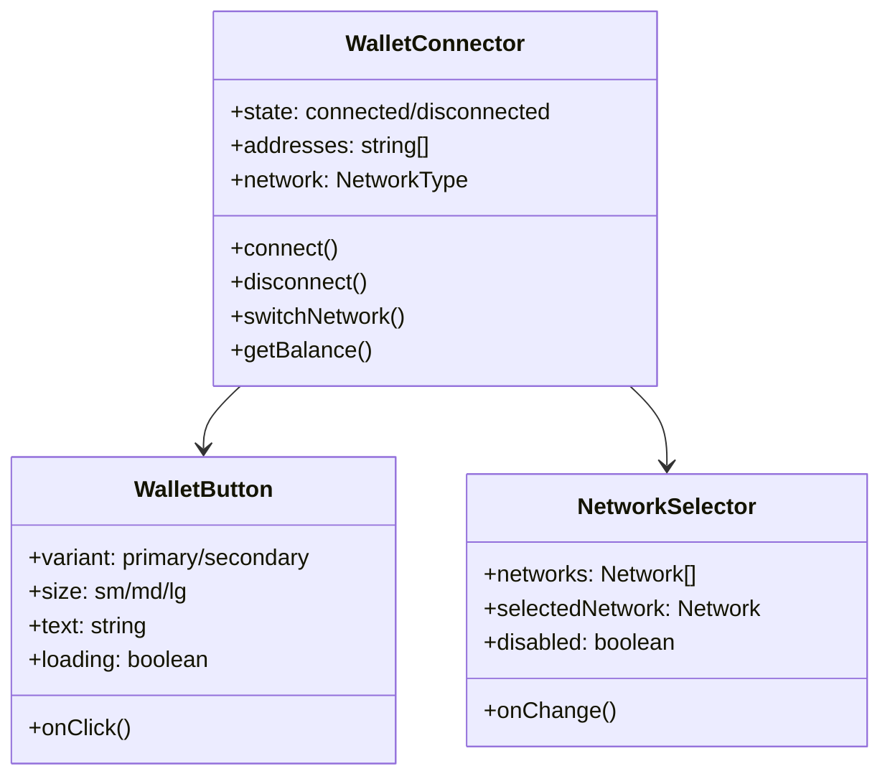
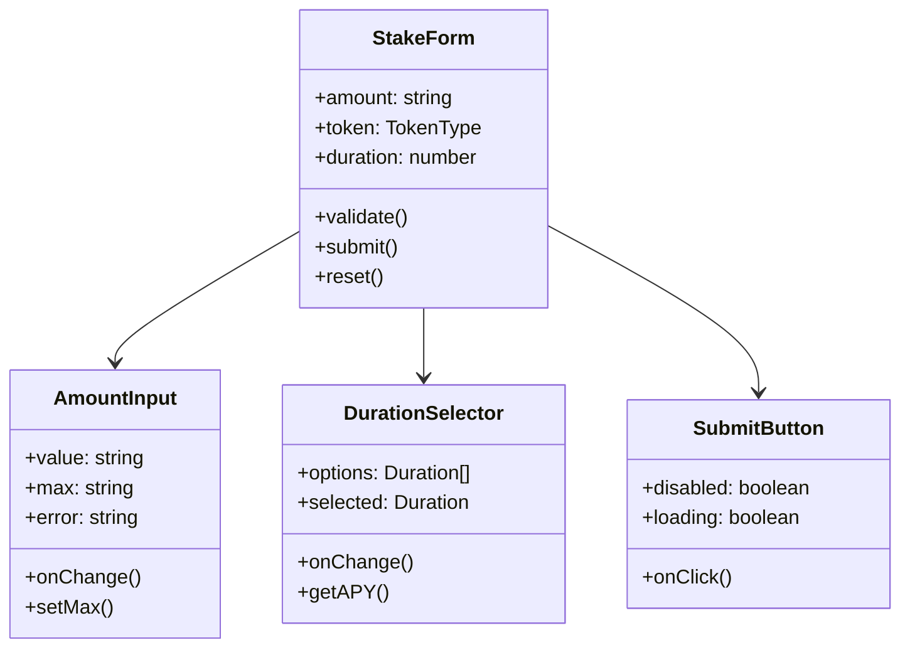
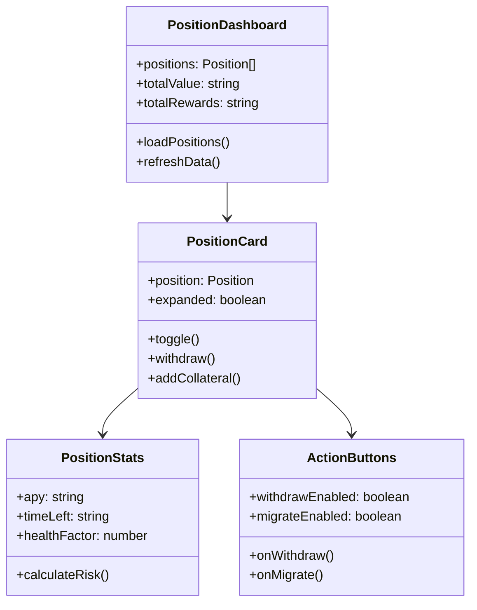
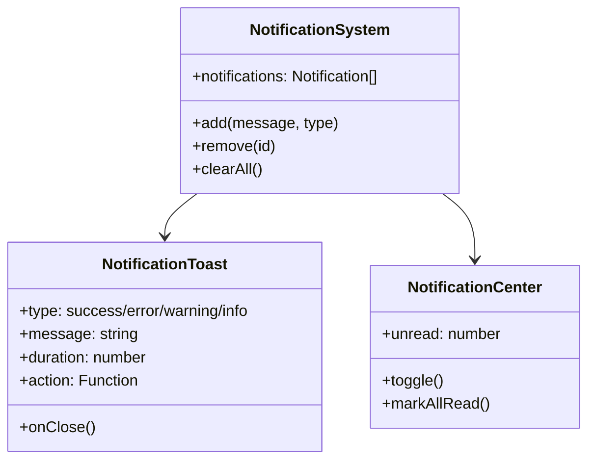

# Synthetix 420 Pool UI组件详细说明

## 1. 钱包连接组件规范

### 组件结构

### 交互规范
- **初始状态**：显示"连接钱包"按钮
- **点击连接**：弹出钱包选择弹窗 (Metamask, WalletConnect, Coinbase Wallet等)
- **连接成功**：显示简化地址 (0x123...789) 和下拉菜单
- **下拉菜单**：包含切换网络、复制地址、断开连接等选项
- **错误处理**：连接失败时显示错误提示，并提供重试选项

### 样式指南
- **按钮颜色**：未连接时使用主色调 (#5F45BA)，连接后使用成功色调 (#27AE60)
- **悬停效果**：透明度降低10%，添加轻微阴影
- **文本**：白色文本，字体大小16px，字重500
- **边角弧度**：8px (与全局按钮保持一致)
- **加载动画**：白色旋转圆环，宽度2px

### 响应式设计
- **桌面端**：完整显示"连接钱包"文本和图标
- **平板端**：保持按钮宽度，略微减小内边距
- **移动端**：仅显示钱包图标，省略文本，点击展开完整功能

## 2. 质押操作表单设计

### 组件结构

### 表单验证规则
- **金额**：必须大于0且不超过用户余额
- **精度**：最多支持6位小数
- **最小值**：不低于0.01 token (防止粉尘攻击)
- **最大值**：不超过用户余额的100%
- **时长**：必须选择有效的质押时长选项

### 用户操作流程
1. **输入金额**：手动输入或点击"最大值"按钮
2. **选择时长**：从预设选项中选择 (30天、90天、180天、365天)
3. **查看奖励**：根据输入计算预估年化收益率
4. **确认交易**：点击"质押"按钮提交交易
5. **等待确认**：显示交易等待和确认状态

### 错误处理
- **余额不足**：显示红色错误提示"余额不足"
- **网络错误**：显示"网络错误，请重试"并提供重试按钮
- **交易失败**：显示具体错误原因，如Gas不足、滑点过大等
- **输入无效**：实时验证并显示错误信息

### 移动端优化
- **简化布局**：单列垂直排列所有元素
- **大号输入框**：增大触摸区域，提高输入准确性
- **键盘优化**：设置数字键盘输入

## 3. 仓位管理界面布局

### 组件结构

### 布局设计
- **顶部摘要**：显示总质押价值、总奖励和整体健康因子
- **过滤选项**：按状态(活跃/已结束)、时间、价值等过滤仓位
- **仓位列表**：卡片式布局，显示关键信息和操作按钮
- **卡片展开**：点击卡片展开查看详细信息和图表
- **空状态**：无仓位时显示"开始质押"引导

### 数据可视化
- **健康因子**：使用颜色渐变条(红-黄-绿)直观显示风险
- **时间进度**：环形进度条显示质押期剩余时间
- **价值变化**：折线图显示仓位价值随时间变化
- **奖励累计**：柱状图显示奖励累积情况

### 交互功能
- **一键操作**：提供直接的提款、追加质押、迁移按钮
- **批量操作**：支持选择多个仓位进行批量操作
- **拖拽排序**：支持拖拽排序仓位列表
- **实时更新**：通过websocket实时更新仓位数据

### 响应式设计
- **桌面端**：网格布局，每行显示3个仓位卡片
- **平板端**：每行显示2个仓位卡片
- **移动端**：单列布局，全宽卡片，简化信息显示

## 4. 通知消息组件设计

### 组件结构

### 通知类型
- **成功通知**：绿色背景，显示✓图标，自动消失(5秒)
- **错误通知**：红色背景，显示✗图标，需手动关闭
- **警告通知**：黄色背景，显示⚠图标，自动消失(8秒)
- **信息通知**：蓝色背景，显示ℹ图标，自动消失(5秒)
- **进度通知**：带进度条，显示操作完成百分比

### 显示位置
- **桌面端**：默认右上角弹出
- **移动端**：底部弹出，避免遮挡内容
- **通知中心**：点击顶部图标展开，显示历史通知

### 交互行为
- **悬停暂停**：鼠标悬停时暂停自动消失计时
- **点击展开**：简短通知可点击展开查看完整内容
- **操作按钮**：支持添加快捷操作按钮，如"查看交易"
- **滑动关闭**：移动端支持左右滑动关闭通知
- **声音提示**：重要通知可配置声音提示

### 分组与优先级
- **交易通知**：优先级最高，置顶显示
- **系统通知**：次优先级，如网络状态变化
- **活动通知**：低优先级，如奖励发放
- **分组折叠**：同类型多条通知可折叠显示
- **最大显示数**：同时最多显示3条通知，其余进入队列 