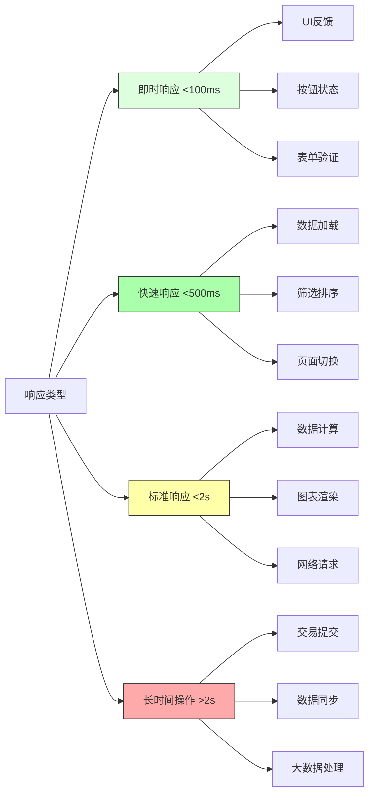
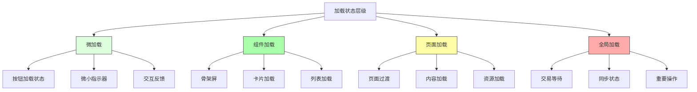
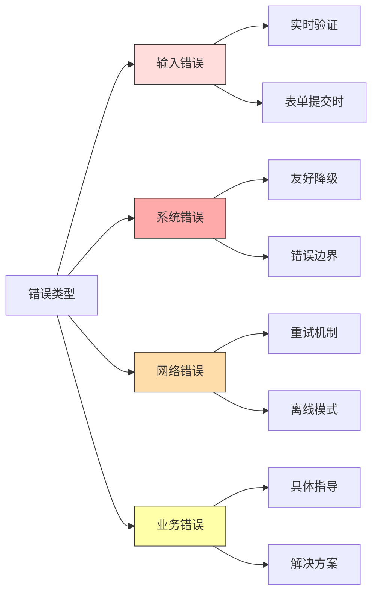
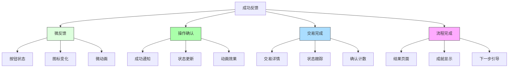

# Synthetix 420 Pool 交互响应规范

## 1. 操作响应时间标准

### 响应时间目标

### 性能指标
| 操作类型 | 目标响应时间 | 可接受范围 | 超时处理 |
|---------|------------|-----------|---------|
| UI交互反馈 | <100ms | <200ms | 立即反馈 |
| 页面导航 | <300ms | <500ms | 过渡动画 |
| 数据加载 | <500ms | <1s | 骨架屏 |
| 表单提交 | <1s | <2s | 加载指示器 |
| 交易确认 | 视区块时间 | 视网络情况 | 详细进度 |

### 优化策略
1. **预加载数据**：页面加载时预先请求可能需要的数据
2. **渐进式加载**：先加载关键内容，再加载次要内容
3. **本地缓存**：使用localStorage/IndexedDB缓存不频繁变化的数据
4. **防抖和节流**：对频繁触发的事件应用防抖和节流技术
5. **分批处理**：大量数据分批加载和处理

### 延迟处理
- **短延迟(300-500ms)**：显示微加载指示器，如按钮内圆点旋转
- **中延迟(500ms-2s)**：显示加载状态，但允许用户继续其他操作
- **长延迟(>2s)**：显示进度指示器，提供取消选项和进度估计

## 2. 加载状态显示规则

### 加载状态层级

### 加载组件规范
1. **微加载指示器**
   - 大小：16x16px内
   - 位置：内嵌于控件内部
   - 颜色：继承控件主色
   - 动画：简单旋转或脉动，不超过300ms周期

2. **组件级加载**
   - 骨架屏：保持与实际内容相同的布局和尺寸
   - 颜色：使用浅灰色(#F0F0F0)到中灰色(#E0E0E0)的渐变动画
   - 圆角：4px(与组件保持一致)
   - 动画：呼吸效果，透明度0.5-0.8循环

3. **页面级加载**
   - 覆盖区域：仅覆盖正在加载的内容区域
   - 背景：半透明白色(rgba(255,255,255,0.7))
   - 指示器大小：48x48px
   - 附加信息：可选择性显示"正在加载..."文字

4. **全局加载**
   - 覆盖区域：整个应用界面
   - 背景：深色半透明(rgba(0,0,0,0.5))
   - 指示器：中央大型加载指示器(64x64px)+描述文字
   - 附加功能：长时间加载提供取消选项和进度百分比

### 加载状态转换规则
- **连续操作**：如分页或筛选，仅加载变化的部分，保留其他内容
- **重新加载**：数据完全刷新时，保留旧数据直到新数据可用
- **首次加载**：显示骨架屏而非空白页
- **长时间加载**：超过5秒提供操作反馈，超过10秒给予明确提示
- **加载失败**：保留上一状态，显示错误提示和重试选项

## 3. 错误提示规范

### 错误分类和处理策略

### 错误显示规则
1. **输入错误**
   - 位置：表单字段下方
   - 颜色：错误红色(#E53935)
   - 图标：小型警告图标
   - 时机：实时验证或提交时
   - 指导性：提供明确的更正建议

2. **操作错误**
   - 位置：操作区域附近
   - 方式：临时通知或提示气泡
   - 持续时间：5秒或用户交互后消失
   - 操作性：提供重试或替代操作按钮

3. **系统错误**
   - 位置：页面中央或顶部通知
   - 样式：引人注意但不干扰
   - 详细程度：对用户友好的摘要+技术详情(可展开)
   - 行动建议：刷新、联系支持或尝试替代方案

4. **交易错误**
   - 位置：交易流程内
   - 详细度：错误代码解析和具体原因
   - 指导：下一步建议(增加Gas、检查余额等)
   - 记录：保存到交易历史中

### 错误文案规范
- **积极语气**：避免责备用户，使用"我们无法..."而非"你做错了..."
- **具体明确**：准确描述问题而非泛泛而谈
- **指导性强**：明确告知用户应采取的行动
- **简洁直接**：使用简单语言，避免技术术语
- **一致性**：相同错误应有相同的描述和处理方式

### 错误恢复策略
- **自动重试**：网络错误自动重试(最多3次)
- **状态保存**：错误发生时保存用户输入和操作状态
- **部分完成**：对于批处理，明确哪些成功，哪些失败
- **降级服务**：核心功能不可用时提供替代有限功能
- **恢复建议**：清晰的故障恢复路径和预计时间

## 4. 成功反馈机制

### 成功反馈层级

### 反馈类型和应用场景
1. **微反馈**
   - 按钮状态变化：点击→加载→完成
   - 表单字段验证通过：绿色对勾
   - 微交互动效：波纹、跳动、淡入淡出
   - 应用场景：简单操作、UI交互

2. **操作确认**
   - 成功通知：右上角/底部弹出
   - 动画效果：完成对勾、成功图标
   - 颜色变化：绿色成功状态
   - 应用场景：设置修改、数据提交

3. **交易完成**
   - 详细确认：交易哈希、区块确认
   - 状态跟踪：从待确认→确认中→完成
   - 视觉反馈：明显的成功页面
   - 应用场景：质押、提款、迁移操作

4. **流程完成**
   - 成就展示：完成动画、成功插图
   - 结果汇总：操作结果摘要
   - 下一步引导：推荐后续行动
   - 应用场景：多步骤操作、首次使用

### 成功反馈设计原则
- **及时性**：操作完成后立即给予反馈
- **明确性**：清晰表达成功的内容和结果
- **比例适当**：反馈强度与操作重要性匹配
- **愉悦感**：创造积极、愉悦的用户体验
- **实用性**：提供实际有用的信息，避免仅为装饰

### 成功反馈元素
- **颜色**：主要使用绿色(#27AE60)表示成功
- **图标**：对勾、完成、星形等积极符号
- **动画**：从小到大、淡入、弹跳等愉悦动画
- **声音**：可选的微妙成功音效(默认关闭)
- **触觉**：移动设备上的轻微振动反馈 