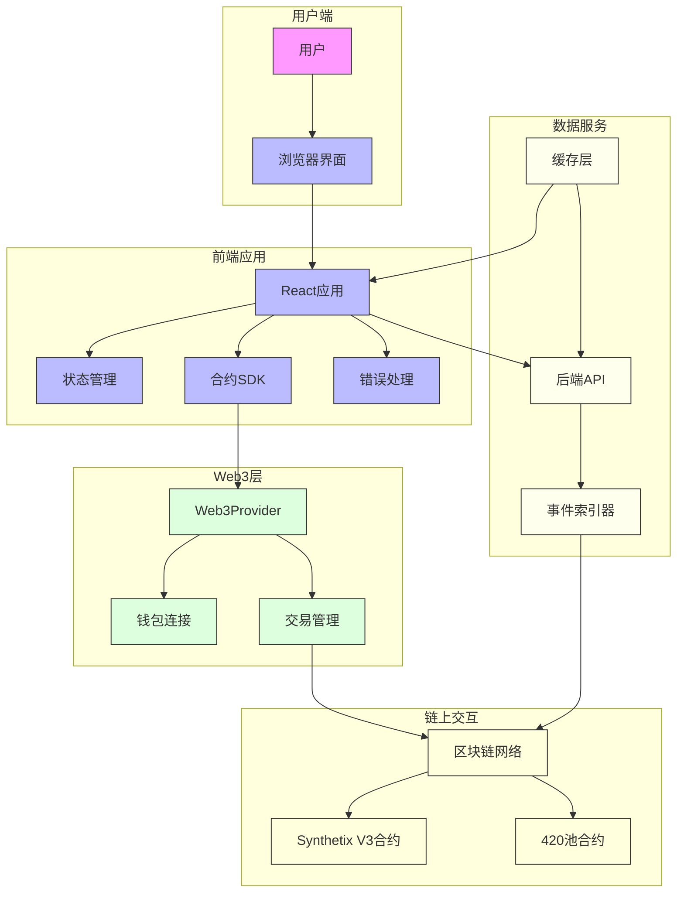
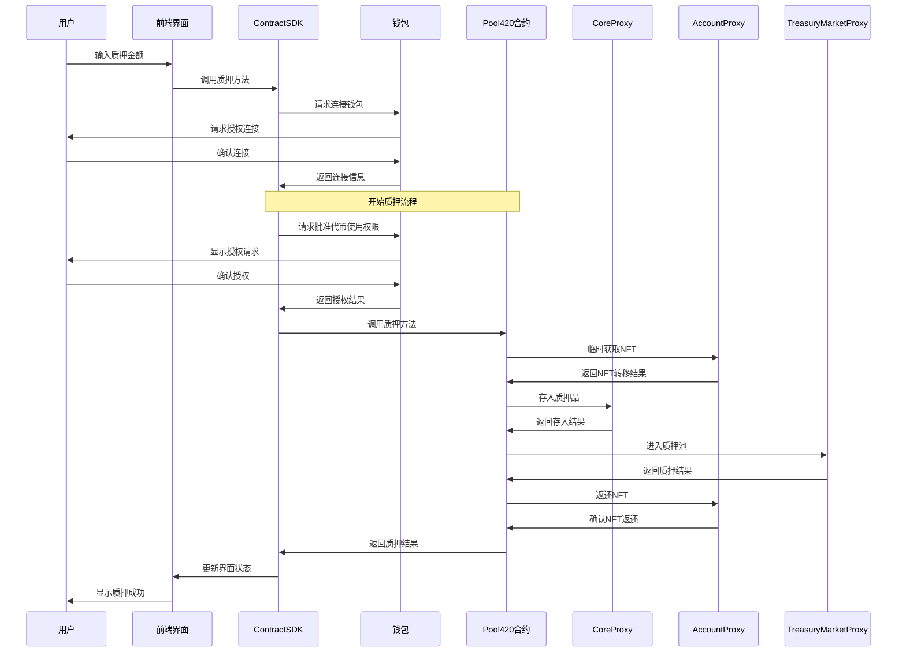
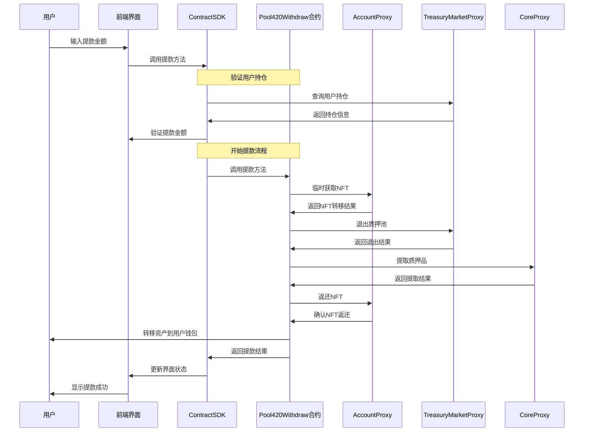
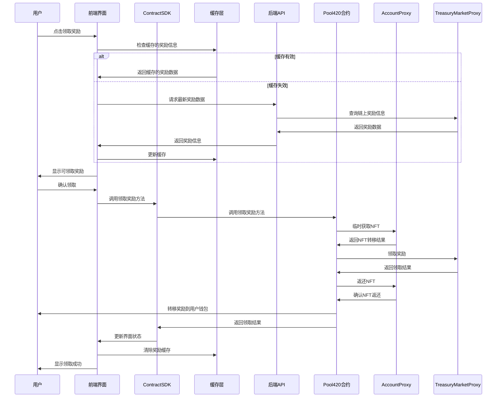
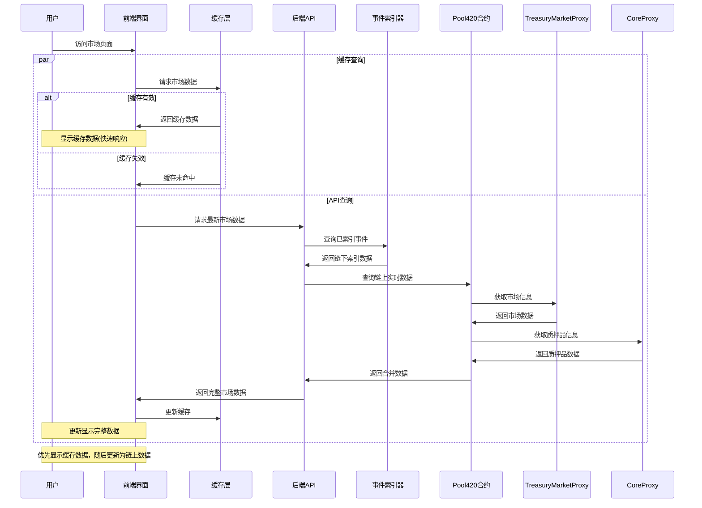
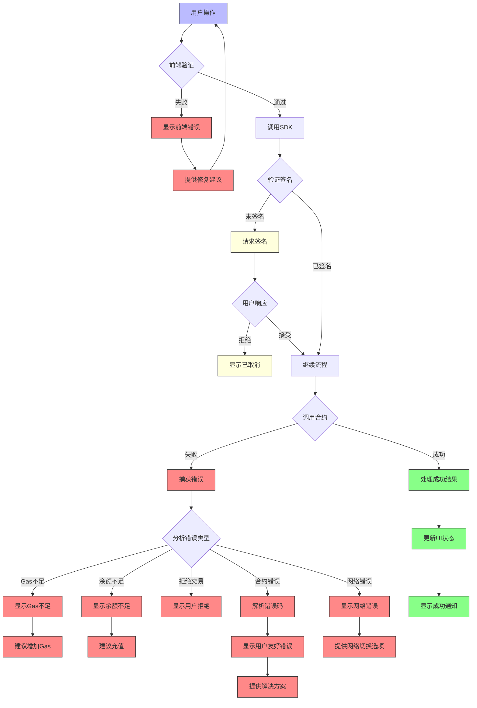
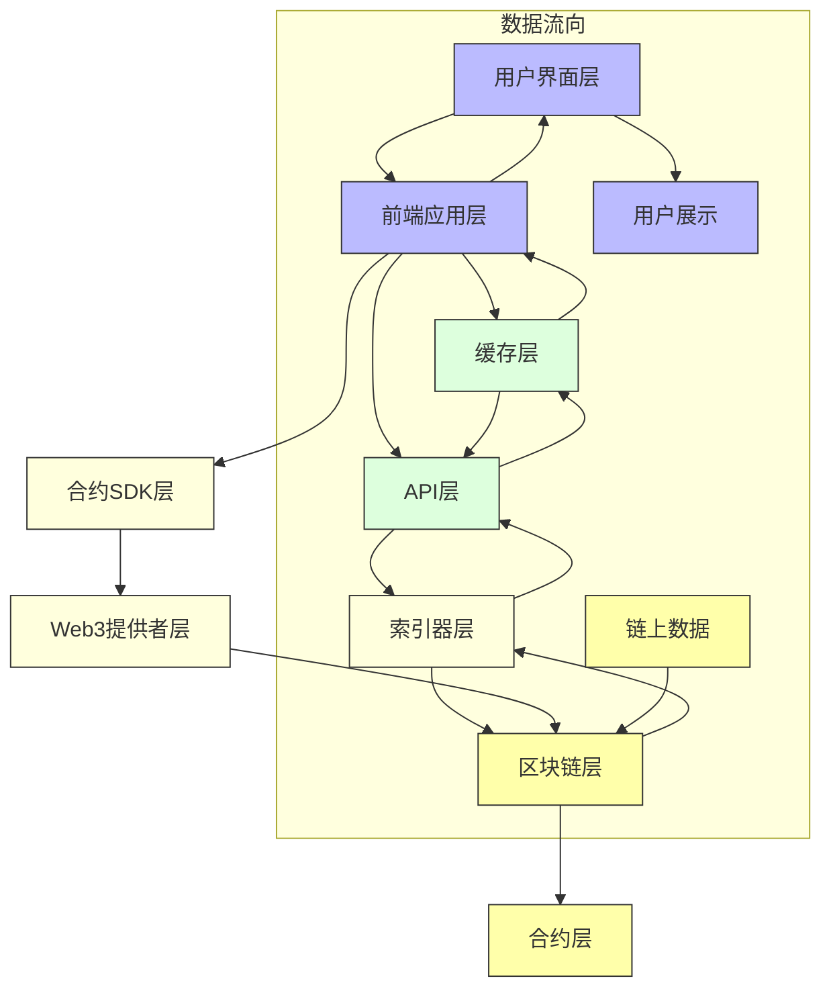
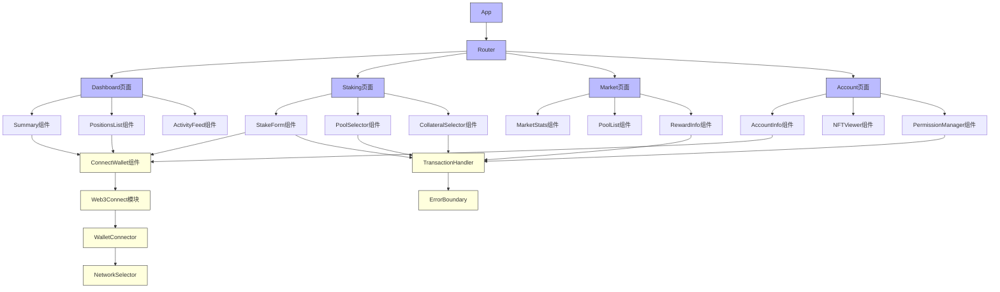
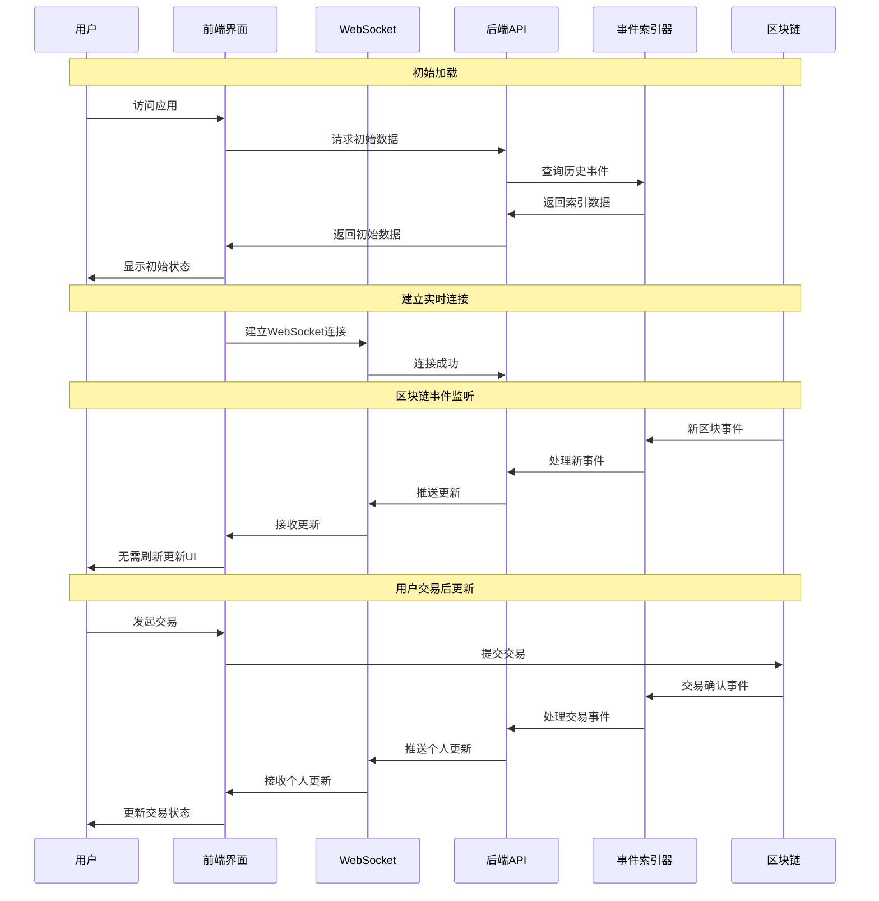
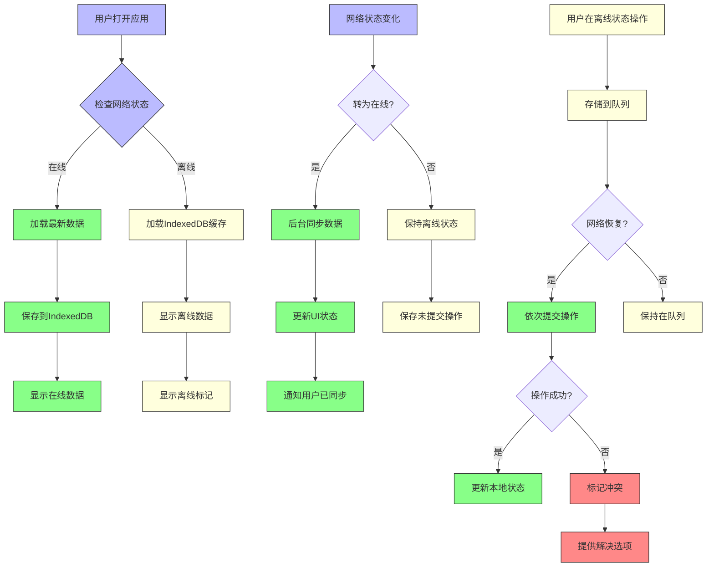

# 420池前后端交互流程图

## 总体架构

```mermaid
graph TD
    subgraph "用户端"
        User[用户] --> UI[浏览器界面]
    end
    
    subgraph "前端应用"
        UI --> WebApp[React应用]
        WebApp --> StateManager[状态管理]
        WebApp --> ContractSDK[合约SDK]
        WebApp --> ErrorHandler[错误处理]
    end
    
    subgraph "Web3层"
        ContractSDK --> Provider[Web3Provider]
        Provider --> Wallet[钱包连接]
        Provider --> TransactionManager[交易管理]
    end
    
    subgraph "链上交互"
        TransactionManager --> Blockchain[区块链网络]
        Blockchain --> SynthetixV3[Synthetix V3合约]
        Blockchain --> Pool420[420池合约]
    end
    
    subgraph "数据服务"
        Indexer[事件索引器] --> Blockchain
        API[后端API] --> Indexer
        WebApp --> API
        Cache[缓存层] --> API
        Cache --> WebApp
    end
    
    style User fill:#f9f,stroke:#333
    style UI fill:#bbf,stroke:#333
    style WebApp fill:#bbf,stroke:#333
    style StateManager fill:#bbf,stroke:#333
    style ContractSDK fill:#bbf,stroke:#333
    style ErrorHandler fill:#bbf,stroke:#333
    style Provider fill:#dfd,stroke:#333
    style Wallet fill:#dfd,stroke:#333
    style TransactionManager fill:#dfd,stroke:#333
    style Blockchain fill:#ffd,stroke:#333
    style SynthetixV3 fill:#ffd,stroke:#333
    style Pool420 fill:#ffd,stroke:#333
    style Indexer fill:#ffe,stroke:#333
    style API fill:#ffe,stroke:#333
    style Cache fill:#ffe,stroke:#333
```

## 用户质押流程

```mermaid
sequenceDiagram
    participant User as 用户
    participant UI as 前端界面
    participant SDK as ContractSDK
    participant Wallet as 钱包
    participant Pool as Pool420合约
    participant Core as CoreProxy
    participant Account as AccountProxy
    participant Market as TreasuryMarketProxy
    
    User->>UI: 输入质押金额
    UI->>SDK: 调用质押方法
    SDK->>Wallet: 请求连接钱包
    Wallet->>User: 请求授权连接
    User->>Wallet: 确认连接
    Wallet->>SDK: 返回连接信息

    Note over SDK,Pool: 开始质押流程
    
    SDK->>Wallet: 请求批准代币使用权限
    Wallet->>User: 显示授权请求
    User->>Wallet: 确认授权
    Wallet->>SDK: 返回授权结果
    
    SDK->>Pool: 调用质押方法
    
    Pool->>Account: 临时获取NFT
    Account->>Pool: 返回NFT转移结果
    
    Pool->>Core: 存入质押品
    Core->>Pool: 返回存入结果
    
    Pool->>Market: 进入质押池
    Market->>Pool: 返回质押结果
    
    Pool->>Account: 返还NFT
    Account->>Pool: 确认NFT返还
    
    Pool->>SDK: 返回质押结果
    SDK->>UI: 更新界面状态
    UI->>User: 显示质押成功
```

## 用户提款流程

```mermaid
sequenceDiagram
    participant User as 用户
    participant UI as 前端界面
    participant SDK as ContractSDK
    participant Pool as Pool420Withdraw合约
    participant Account as AccountProxy
    participant Market as TreasuryMarketProxy
    participant Core as CoreProxy
    
    User->>UI: 输入提款金额
    UI->>SDK: 调用提款方法
    
    Note over SDK,Pool: 验证用户持仓
    SDK->>Market: 查询用户持仓
    Market->>SDK: 返回持仓信息
    SDK->>UI: 验证提款金额
    
    Note over SDK,Pool: 开始提款流程
    SDK->>Pool: 调用提款方法
    
    Pool->>Account: 临时获取NFT
    Account->>Pool: 返回NFT转移结果
    
    Pool->>Market: 退出质押池
    Market->>Pool: 返回退出结果
    
    Pool->>Core: 提取质押品
    Core->>Pool: 返回提取结果
    
    Pool->>Account: 返还NFT
    Account->>Pool: 确认NFT返还
    
    Pool->>User: 转移资产到用户钱包
    
    Pool->>SDK: 返回提款结果
    SDK->>UI: 更新界面状态
    UI->>User: 显示提款成功
```

## 领取奖励流程

```mermaid
sequenceDiagram
    participant User as 用户
    participant UI as 前端界面
    participant SDK as ContractSDK
    participant Cache as 缓存层
    participant API as 后端API
    participant Pool as Pool420合约
    participant Account as AccountProxy
    participant Market as TreasuryMarketProxy
    
    User->>UI: 点击领取奖励
    UI->>Cache: 检查缓存的奖励信息
    
    alt 缓存有效
        Cache->>UI: 返回缓存的奖励数据
    else 缓存失效
        UI->>API: 请求最新奖励数据
        API->>Market: 查询链上奖励信息
        Market->>API: 返回奖励数据
        API->>UI: 返回奖励信息
        UI->>Cache: 更新缓存
    end
    
    UI->>User: 显示可领取奖励
    User->>UI: 确认领取
    
    UI->>SDK: 调用领取奖励方法
    SDK->>Pool: 调用领取奖励方法
    
    Pool->>Account: 临时获取NFT
    Account->>Pool: 返回NFT转移结果
    
    Pool->>Market: 领取奖励
    Market->>Pool: 返回领取结果
    
    Pool->>Account: 返还NFT
    Account->>Pool: 确认NFT返还
    
    Pool->>User: 转移奖励到用户钱包
    
    Pool->>SDK: 返回领取结果
    SDK->>UI: 更新界面状态
    UI->>Cache: 清除奖励缓存
    UI->>User: 显示领取成功
```

## 市场数据查询流程

```mermaid
sequenceDiagram
    participant User as 用户
    participant UI as 前端界面
    participant Cache as 缓存层
    participant API as 后端API
    participant Indexer as 事件索引器
    participant Pool as Pool420合约
    participant Market as TreasuryMarketProxy
    participant Core as CoreProxy
    
    User->>UI: 访问市场页面
    
    par 缓存查询
        UI->>Cache: 请求市场数据
        alt 缓存有效
            Cache->>UI: 返回缓存数据
            Note over UI,User: 显示缓存数据(快速响应)
        else 缓存失效
            Cache->>UI: 缓存未命中
        end
    and API查询
        UI->>API: 请求最新市场数据
        API->>Indexer: 查询已索引事件
        Indexer->>API: 返回链下索引数据
        
        API->>Pool: 查询链上实时数据
        Pool->>Market: 获取市场信息
        Market->>Pool: 返回市场数据
        Pool->>Core: 获取质押品信息
        Core->>Pool: 返回质押品数据
        Pool->>API: 返回合并数据
        
        API->>UI: 返回完整市场数据
        UI->>Cache: 更新缓存
        Note over UI,User: 更新显示完整数据
    end
    
    Note over UI,User: 优先显示缓存数据，随后更新为链上数据
```

## 错误处理流程

```mermaid
graph TD
    A[用户操作] --> B{前端验证}
    B -->|失败| C[显示前端错误]
    C --> D[提供修复建议]
    D --> A
    
    B -->|通过| E[调用SDK]
    E --> F{验证签名}
    F -->|未签名| G[请求签名]
    G --> H{用户响应}
    H -->|拒绝| I[显示已取消]
    H -->|接受| J[继续流程]
    
    F -->|已签名| J
    J --> K{调用合约}
    
    K -->|失败| L[捕获错误]
    L --> M{分析错误类型}
    
    M -->|Gas不足| N[显示Gas不足]
    N --> O[建议增加Gas]
    
    M -->|余额不足| P[显示余额不足]
    P --> Q[建议充值]
    
    M -->|拒绝交易| R[显示用户拒绝]
    
    M -->|合约错误| S[解析错误码]
    S --> T[显示用户友好错误]
    T --> U[提供解决方案]
    
    M -->|网络错误| V[显示网络错误]
    V --> W[提供网络切换选项]
    
    K -->|成功| X[处理成功结果]
    X --> Y[更新UI状态]
    Y --> Z[显示成功通知]
    
    style A fill:#bbf,stroke:#333
    style C fill:#f88,stroke:#333
    style D fill:#f88,stroke:#333
    style G fill:#ffd,stroke:#333
    style I fill:#ffd,stroke:#333
    style L fill:#f88,stroke:#333
    style N fill:#f88,stroke:#333
    style O fill:#f88,stroke:#333
    style P fill:#f88,stroke:#333
    style Q fill:#f88,stroke:#333
    style R fill:#f88,stroke:#333
    style S fill:#f88,stroke:#333
    style T fill:#f88,stroke:#333
    style U fill:#f88,stroke:#333
    style V fill:#f88,stroke:#333
    style W fill:#f88,stroke:#333
    style X fill:#8f8,stroke:#333
    style Y fill:#8f8,stroke:#333
    style Z fill:#8f8,stroke:#333
```

## 数据流层次

```mermaid
graph TD
    A[用户界面层] --> B[前端应用层]
    B --> C[缓存层]
    B --> D[API层]
    B --> E[合约SDK层]
    
    C --> D
    D --> F[索引器层]
    E --> G[Web3提供者层]
    
    F --> H[区块链层]
    G --> H
    
    H --> I[合约层]
    
    subgraph "数据流向"
        J[链上数据] --> H
        H --> F
        F --> D
        D --> C
        C --> B
        B --> A
        A --> K[用户展示]
    end
    
    style A fill:#bbf,stroke:#333
    style B fill:#bbf,stroke:#333
    style C fill:#dfd,stroke:#333
    style D fill:#dfd,stroke:#333
    style E fill:#ffd,stroke:#333
    style F fill:#ffd,stroke:#333
    style G fill:#ffd,stroke:#333
    style H fill:#ffa,stroke:#333
    style I fill:#ffa,stroke:#333
    style J fill:#ffa,stroke:#333
    style K fill:#bbf,stroke:#333
```

## 前端组件交互

```mermaid
graph TD
    A[App] --> B[Router]
    
    B --> C[Dashboard页面]
    B --> D[Staking页面]
    B --> E[Market页面]
    B --> F[Account页面]
    
    C --> G[Summary组件]
    C --> H[PositionsList组件]
    C --> I[ActivityFeed组件]
    
    D --> J[StakeForm组件]
    D --> K[PoolSelector组件]
    D --> L[CollateralSelector组件]
    
    E --> M[MarketStats组件]
    E --> N[PoolList组件]
    E --> O[RewardInfo组件]
    
    F --> P[AccountInfo组件]
    F --> Q[NFTViewer组件]
    F --> R[PermissionManager组件]
    
    G --> S[ConnectWallet组件]
    H --> S
    J --> S
    P --> S
    
    S --> T[Web3Connect模块]
    T --> U[WalletConnector]
    U --> V[NetworkSelector]
    
    J --> W[TransactionHandler]
    K --> W
    L --> W
    O --> W
    R --> W
    
    W --> X[ErrorBoundary]
    
    style A fill:#bbf,stroke:#333
    style B fill:#bbf,stroke:#333
    style C fill:#bbf,stroke:#333
    style D fill:#bbf,stroke:#333
    style E fill:#bbf,stroke:#333
    style F fill:#bbf,stroke:#333
    style S fill:#ffd,stroke:#333
    style T fill:#ffd,stroke:#333
    style U fill:#ffd,stroke:#333
    style V fill:#ffd,stroke:#333
    style W fill:#ffd,stroke:#333
    style X fill:#ffd,stroke:#333
```

## 实时数据更新流程

```mermaid
sequenceDiagram
    participant User as 用户
    participant UI as 前端界面
    participant Socket as WebSocket
    participant API as 后端API
    participant Indexer as 事件索引器
    participant Blockchain as 区块链
    
    Note over User,Blockchain: 初始加载
    
    User->>UI: 访问应用
    UI->>API: 请求初始数据
    API->>Indexer: 查询历史事件
    Indexer->>API: 返回索引数据
    API->>UI: 返回初始数据
    UI->>User: 显示初始状态
    
    Note over User,Blockchain: 建立实时连接
    
    UI->>Socket: 建立WebSocket连接
    Socket->>API: 连接成功
    
    Note over User,Blockchain: 区块链事件监听
    
    Blockchain->>Indexer: 新区块事件
    Indexer->>API: 处理新事件
    API->>Socket: 推送更新
    Socket->>UI: 接收更新
    UI->>User: 无需刷新更新UI
    
    Note over User,Blockchain: 用户交易后更新
    
    User->>UI: 发起交易
    UI->>Blockchain: 提交交易
    Blockchain->>Indexer: 交易确认事件
    Indexer->>API: 处理交易事件
    API->>Socket: 推送个人更新
    Socket->>UI: 接收个人更新
    UI->>User: 更新交易状态
```

## 离线支持与数据同步

```mermaid
graph TD
    A[用户打开应用] --> B{检查网络状态}
    
    B -->|在线| C[加载最新数据]
    C --> D[保存到IndexedDB]
    D --> E[显示在线数据]
    
    B -->|离线| F[加载IndexedDB缓存]
    F --> G[显示离线数据]
    G --> H[显示离线标记]
    
    I[网络状态变化] --> J{转为在线?}
    J -->|是| K[后台同步数据]
    K --> L[更新UI状态]
    L --> M[通知用户已同步]
    
    J -->|否| N[保持离线状态]
    N --> O[保存未提交操作]
    
    P[用户在离线状态操作] --> Q[存储到队列]
    Q --> R{网络恢复?}
    R -->|是| S[依次提交操作]
    S --> T{操作成功?}
    T -->|是| U[更新本地状态]
    T -->|否| V[标记冲突]
    V --> W[提供解决选项]
    
    R -->|否| X[保持在队列]
    
    style A fill:#bbf,stroke:#333
    style B fill:#bbf,stroke:#333
    style C fill:#8f8,stroke:#333
    style D fill:#8f8,stroke:#333
    style E fill:#8f8,stroke:#333
    style F fill:#ffd,stroke:#333
    style G fill:#ffd,stroke:#333
    style H fill:#ffd,stroke:#333
    style I fill:#bbf,stroke:#333
    style K fill:#8f8,stroke:#333
    style L fill:#8f8,stroke:#333
    style M fill:#8f8,stroke:#333
    style N fill:#ffd,stroke:#333
    style O fill:#ffd,stroke:#333
    style P fill:#ffd,stroke:#333
    style Q fill:#ffd,stroke:#333
    style S fill:#8f8,stroke:#333
    style U fill:#8f8,stroke:#333
    style V fill:#f88,stroke:#333
    style W fill:#f88,stroke:#333
    style X fill:#ffd,stroke:#333
``` 