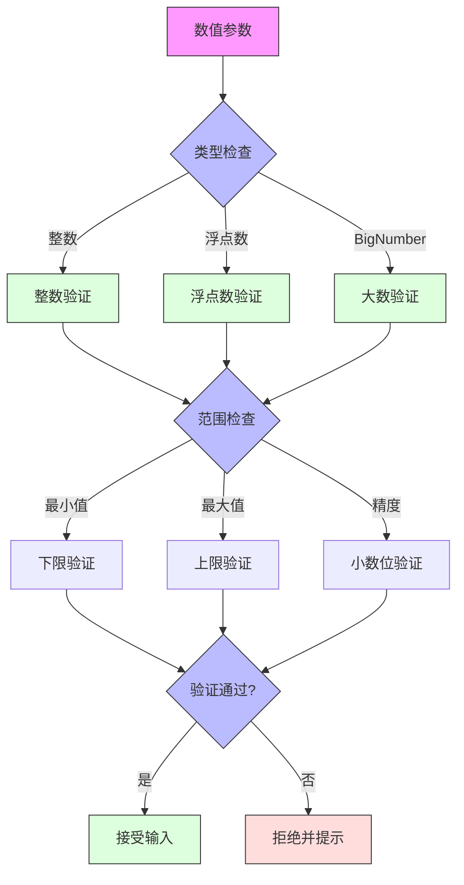
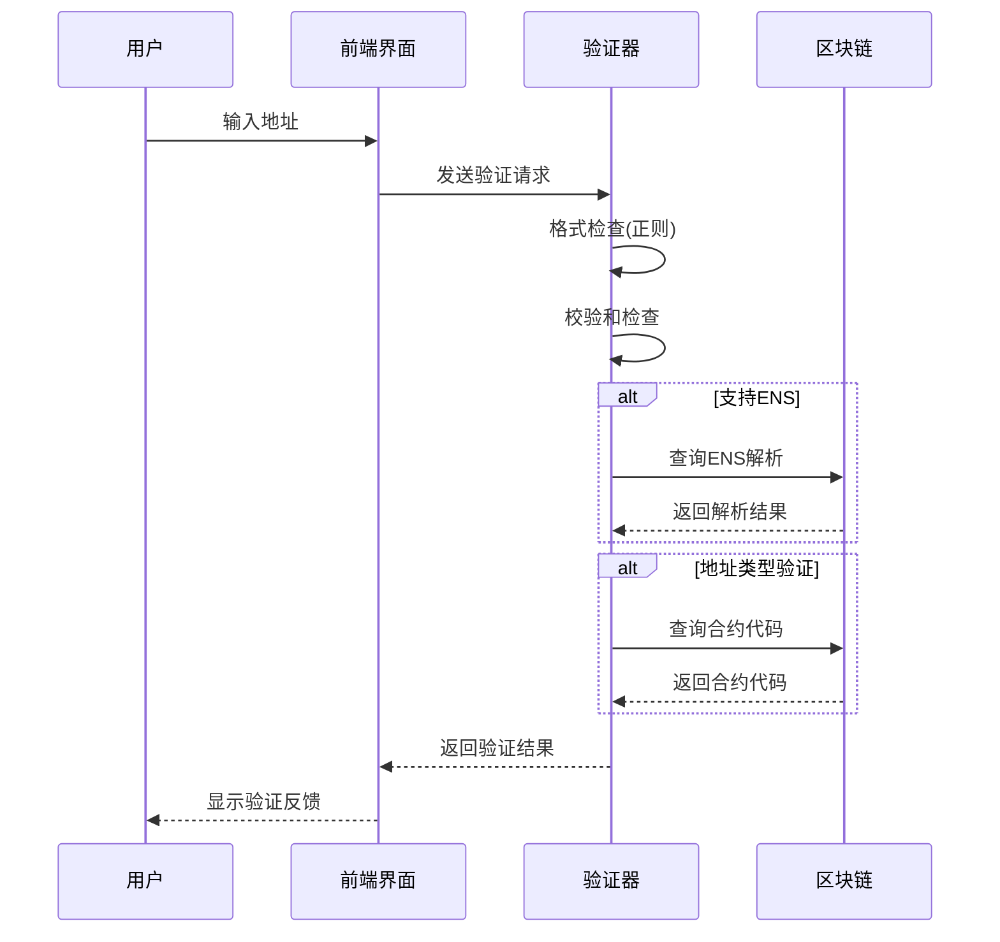
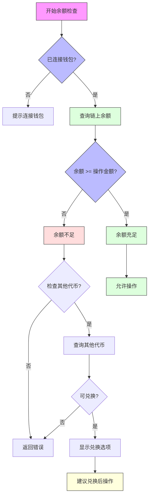
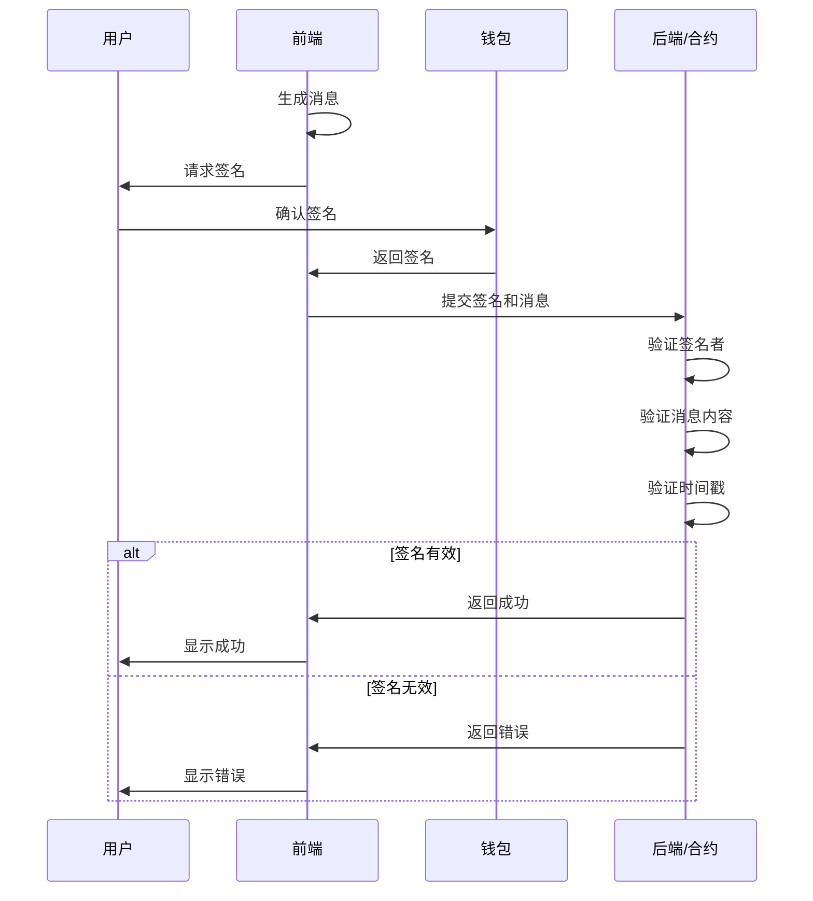

# Synthetix 420 Pool 参数验证规则

## 1. 输入值范围限制

### 数值类型参数限制


### 质押金额验证规则
| 参数 | 最小值 | 最大值 | 精度 | 验证规则 |
|------|-------|------|------|---------|
| 质押金额 | 0.01 | 用户余额 | 6位小数 | 必须为正数，不超过用户余额 |
| 质押时长 | 1天 | 365天 | 整数天 | 必须为预设选项值(30/90/180/365) |
| 提款金额 | 0.01 | 用户质押总额 | 6位小数 | 不超过可提取金额 |
| Gas价格 | 网络最低 | 用户设置上限 | 整数 Gwei | 必须大于等于网络最低值 |

### 验证实现伪代码
```javascript
function validateStakeAmount(amount, userBalance) {
  // 类型检查
  if (typeof amount !== 'number' && !BigNumber.isBigNumber(amount)) {
    return { valid: false, error: '金额必须为数字' };
  }
  
  // 转换为统一格式
  const amountBN = BigNumber.isBigNumber(amount) ? amount : new BigNumber(amount);
  
  // 范围检查
  if (amountBN.isLessThan(MIN_STAKE)) {
    return { valid: false, error: `质押金额不能小于 ${MIN_STAKE}` };
  }
  
  if (amountBN.isGreaterThan(userBalance)) {
    return { valid: false, error: '质押金额不能超过余额' };
  }
  
  // 精度检查
  if (getDecimalPlaces(amountBN) > MAX_DECIMALS) {
    return { valid: false, error: `最多支持 ${MAX_DECIMALS} 位小数` };
  }
  
  return { valid: true };
}
```

### 前端即时验证策略
- **输入时验证**：用户输入时即时检查格式
- **失焦验证**：输入框失去焦点时验证范围
- **提交验证**：表单提交前进行完整验证
- **可视化反馈**：使用颜色和图标直观显示验证状态
- **自动修正**：可选择性地自动修正精度问题

## 2. 地址格式验证

### 地址验证流程


### 地址格式标准
| 地址类型 | 格式规则 | 检查方法 |
|---------|---------|---------|
| 以太坊地址 | 0x + 40个十六进制字符 | 正则表达式 + 校验和 |
| ENS域名 | *.eth 格式 | DNS解析验证 |
| 多签钱包 | Safe/Gnosis格式 | 合约代码检查 |
| 合约地址 | 普通ETH地址格式 | 合约代码长度检查 |

### 验证实现伪代码
```javascript
function validateEthAddress(address) {
  // 基本格式验证
  if (!address.match(/^0x[0-9a-fA-F]{40}$/)) {
    // 检查是否可能是ENS
    if (address.endsWith('.eth')) {
      return validateENS(address);
    }
    return { valid: false, error: '无效的地址格式' };
  }
  
  // 校验和验证
  if (address.match(/^0x[0-9a-f]{40}$/) || address.match(/^0x[0-9A-F]{40}$/)) {
    // 纯大写或纯小写，跳过校验和
    return { valid: true };
  }
  
  // 混合大小写，验证校验和
  const checksumAddress = toChecksumAddress(address);
  if (checksumAddress !== address) {
    return { valid: false, error: '地址校验和无效' };
  }
  
  return { valid: true };
}
```

### 高级验证选项
- **安全检查**：检查地址是否在已知黑名单中
- **钱包集成**：通过钱包API获取和验证地址
- **地址类型检测**：区分个人地址、合约地址和多签钱包
- **最近使用**：与用户最近交互的地址匹配提示
- **地址簿集成**：与用户保存的地址簿匹配并显示昵称

## 3. 余额检查规则

### 余额检查流程


### 余额检查策略
| 检查类型 | 触发时机 | 检查内容 | 处理方式 |
|---------|---------|---------|---------|
| 预检查 | 页面加载时 | 基本余额状态 | 决定界面展示状态 |
| 交互检查 | 输入金额时 | 针对输入值的实时检查 | 显示即时反馈 |
| 确认检查 | 提交操作前 | 最终余额确认 | 阻止或允许提交 |
| 交易检查 | 交易执行时 | 链上检查 | 回滚或执行交易 |

### 验证实现伪代码
```javascript
async function checkBalance(userAddress, requiredAmount, tokenAddress) {
  try {
    // 查询用户余额
    const balance = await getTokenBalance(userAddress, tokenAddress);
    
    // 转换为同一单位进行比较
    const requiredAmountBN = ethers.utils.parseUnits(requiredAmount.toString(), 18);
    
    // 比较余额和所需金额
    if (balance.lt(requiredAmountBN)) {
      // 余额不足，查询其他可用资产
      const otherAssets = await getOtherAssets(userAddress);
      const swappableAssets = filterSwappableAssets(otherAssets, tokenAddress);
      
      if (swappableAssets.length > 0) {
        return {
          sufficient: false,
          error: '余额不足',
          swappableAssets,
          suggestSwap: true
        };
      }
      
      return { sufficient: false, error: '余额不足' };
    }
    
    // 余额充足
    return { sufficient: true };
  } catch (error) {
    return { error: '余额检查失败', details: error.message };
  }
}
```

### 多资产余额处理
- **多代币支持**：同时检查多种代币余额
- **优先级顺序**：设置代币使用优先级
- **自动兑换**：提供余额不足时的自动兑换选项
- **Gas费检查**：同时检查操作需要的Gas费用
- **流动性检查**：评估代币的可交易性和流动性

## 4. 签名验证流程

### 签名验证流程


### 签名类型与应用场景
| 签名类型 | 应用场景 | 安全特点 |
|---------|---------|---------|
| 普通消息签名 | 用户认证、操作确认 | 简单、直观 |
| EIP-712类型签名 | 结构化数据签名、批准操作 | 用户可读、防钓鱼 |
| 离线签名 | 延迟执行、多签操作 | 可保存和传递 |
| 批量签名 | 多笔交易一次签名 | 提高效率、降低手续费 |

### 验证实现伪代码
```javascript
// 前端生成签名请求
async function requestSignature(operation, params) {
  try {
    // 构建EIP-712结构化数据
    const domain = {
      name: 'Synthetix 420 Pool',
      version: '1',
      chainId: await getChainId(),
      verifyingContract: POOL_ADDRESS
    };
    
    const types = {
      Operation: [
        { name: 'action', type: 'string' },
        { name: 'params', type: 'string' },
        { name: 'deadline', type: 'uint256' }
      ]
    };
    
    // 设置过期时间为10分钟后
    const deadline = Math.floor(Date.now() / 1000) + 600;
    
    const value = {
      action: operation,
      params: JSON.stringify(params),
      deadline
    };
    
    // 请求签名
    const signature = await wallet._signTypedData(domain, types, value);
    
    return {
      signature,
      message: { domain, types, value }
    };
  } catch (error) {
    throw new Error(`签名请求失败: ${error.message}`);
  }
}

// 后端验证签名
function verifySignature(signature, domain, types, value) {
  try {
    // 验证过期时间
    const now = Math.floor(Date.now() / 1000);
    if (value.deadline < now) {
      return { valid: false, error: '签名已过期' };
    }
    
    // 恢复签名者地址
    const recovered = ethers.utils.verifyTypedData(domain, types, value, signature);
    
    // 验证签名者权限
    if (!isAuthorized(recovered, value.action)) {
      return { valid: false, error: '签名者无权执行此操作' };
    }
    
    // 签名验证通过
    return { valid: true, signer: recovered };
  } catch (error) {
    return { valid: false, error: `签名验证失败: ${error.message}` };
  }
}
```

### 签名安全增强措施
- **时间戳**：包含过期时间防止重放攻击
- **操作ID**：唯一操作ID防止重复执行
- **链ID**：包含链ID防止跨链攻击
- **权限检查**：验证签名者是否有权执行操作
- **签名日志**：记录已使用的签名防止重用

### 签名验证最佳实践
- **用户提示**：清晰展示待签名内容和目的
- **安全提醒**：提醒用户验证签名内容防钓鱼
- **错误处理**：详细的签名错误提示和恢复建议
- **并发处理**：支持多签名并发验证场景
- **降级方案**：提供签名失败时的替代验证方式 