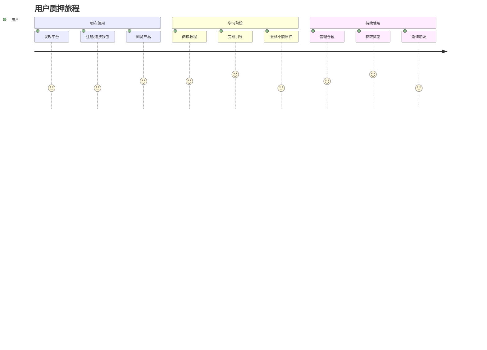
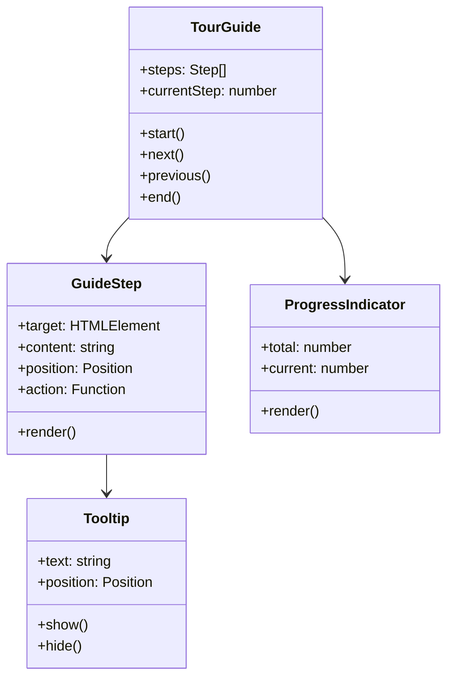
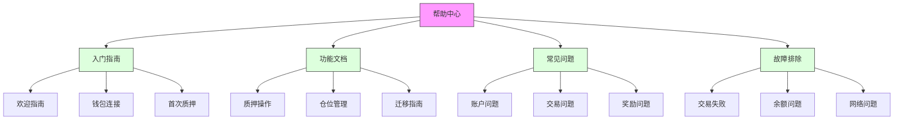
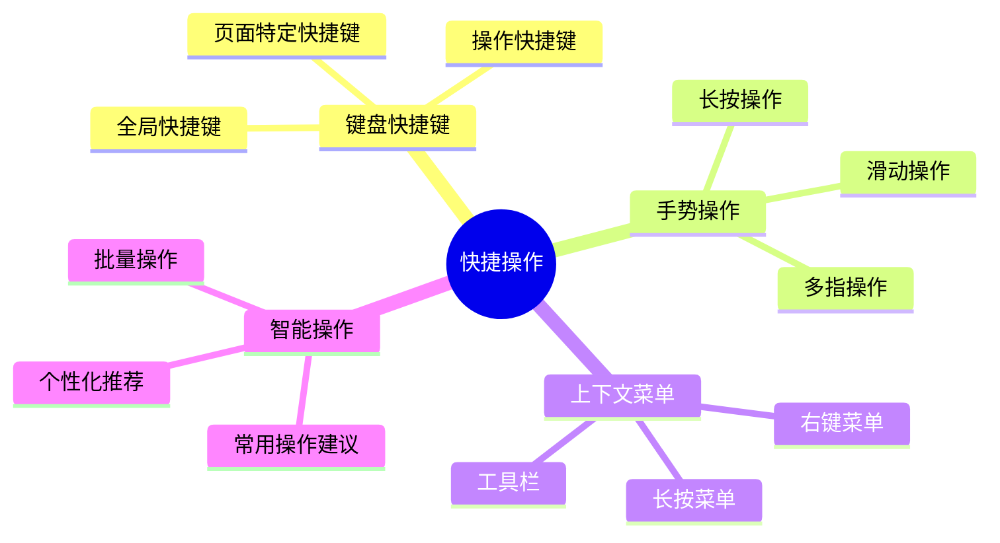
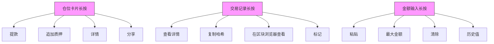
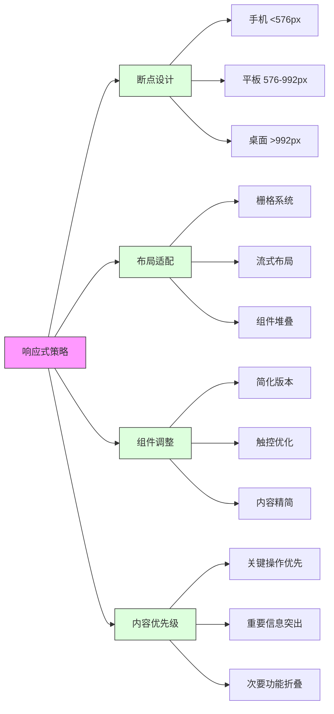

# Synthetix 420 Pool 用户体验优化

## 1. 操作引导设计

### 用户旅程地图

### 引导层级设计
1. **首次访问引导**
   - 欢迎页面：简短介绍平台功能和价值
   - 主要功能导览：3-5个关键功能点的引导
   - 钱包连接教程：引导用户连接钱包的步骤
   - 完成标识：记录用户已完成首次引导

2. **功能引导**
   - 质押流程引导：从选择金额到确认交易
   - 仓位管理引导：如何查看和管理仓位
   - 提款流程引导：如何安全提取资金
   - 迁移教程：如何从旧版迁移到新版

3. **上下文提示**
   - 悬停提示：鼠标悬停时显示功能说明
   - 内联说明：关键字段旁的帮助文本
   - 示例值：输入框中的示例数值
   - 校验提示：输入验证时的指导性提示

### 引导组件规范

### 引导设计原则
- **渐进式引导**：按用户熟悉度逐步展示复杂功能
- **非侵入式**：不强制用户完成所有步骤，允许跳过
- **上下文相关**：根据用户当前操作提供相关引导
- **进度感知**：显示引导完成进度，提升成就感
- **视觉一致性**：引导样式与整体UI保持一致

### 引导触发机制
- **自动触发**：首次访问、新功能上线时
- **用户请求**：通过"帮助"或"引导"按钮触发
- **智能提示**：检测到用户犹豫或错误操作时
- **进度提醒**：完成部分引导后的续步提醒
- **场景式触发**：特定操作流程的引导（如首次质押）

## 2. 帮助文档集成

### 文档架构

### 集成方式
1. **上下文帮助**
   - 内嵌帮助图标：每个功能区域的"?"图标
   - 悬停卡片：简短清晰的功能说明
   - 扩展阅读：链接到详细文档的"了解更多"
   - 智能搜索：根据当前页面优先展示相关结果

2. **帮助中心**
   - 全局入口：导航栏的"帮助"按钮
   - 搜索优先：突出的搜索框，自动补全
   - 分类浏览：清晰的分类导航
   - 最近查看：记录用户最近浏览的文档

3. **交互式指南**
   - 视频教程：关键操作的简短视频
   - 动画演示：关键流程的交互式动画
   - 操作示例：可交互的模拟环境
   - 分步教程：带截图的详细步骤

### 内容策略
- **分层信息**：从简单概述到详细说明逐层展开
- **视觉辅助**：使用截图、图表和动画辅助理解
- **简明语言**：避免专业术语，使用简洁明了的语言
- **实例说明**：通过具体例子解释抽象概念
- **持续更新**：根据用户反馈和功能更新持续优化

### 反馈机制
- **文档评价**：每篇文档底部的有用/无用反馈
- **详细反馈**：允许用户提交详细改进建议
- **搜索分析**：分析用户搜索词，优化内容覆盖
- **使用追踪**：识别最常查看的帮助主题
- **问题上报**：未解决问题的直接上报通道

## 3. 快捷操作设计

### 快捷操作类型

### 键盘快捷键设计
| 功能分类 | 操作 | 快捷键 |
|---------|------|-------|
| **导航** | 打开仪表盘 | D |
| | 查看仓位列表 | P |
| | 打开质押页面 | S |
| | 返回首页 | H |
| **常用操作** | 连接钱包 | C |
| | 刷新数据 | R |
| | 最大金额 | M |
| | 确认操作 | Enter |
| **辅助功能** | 打开帮助 | ? |
| | 搜索 | / |
| | 设置 | , |
| | 通知中心 | N |

### 移动端手势设计
- **左右滑动**：切换仓位卡片或页面选项卡
- **下拉刷新**：更新数据
- **上滑加载**：加载更多历史记录
- **长按元素**：打开上下文操作菜单
- **双指缩放**：调整图表显示范围

### 上下文操作菜单

### 智能操作建议
- **常用操作**：根据用户历史行为推荐常用操作
- **上下文建议**：根据当前状态推荐下一步操作
- **快捷入口**：个性化的快捷入口组合
- **批量处理**：自动识别可批量处理的操作
- **智能默认值**：根据历史操作设置智能默认值

### 快捷操作原则
- **一致性**：保持与平台和行业标准的一致
- **发现性**：确保用户能轻松发现快捷操作
- **可学习**：复杂操作有清晰的学习路径
- **灵活性**：允许用户自定义部分快捷操作
- **反馈**：执行快捷操作时提供明确的反馈

## 4. 移动端适配方案

### 响应式设计策略

### 移动优先设计
1. **基础原则**
   - 从小屏幕设计开始，逐步扩展到大屏幕
   - 优先实现核心功能，确保在所有设备上可用
   - 关注触控体验，确保所有元素有足够的触控区域
   - 最小化输入需求，简化表单和操作流程

2. **触控优化**
   - 最小触控目标尺寸：48x48px
   - 元素间距：至少8px，避免误触
   - 主要操作按钮：置于拇指易触及区域
   - 重要操作：添加确认步骤，防止误触

3. **简化交互**
   - 减少复杂操作步骤
   - 使用原生移动组件和手势
   - 避免悬停状态依赖
   - 替代多级菜单为单层导航

### 核心页面适配
| 页面 | 桌面版 | 移动版调整 |
|------|-------|-----------|
| **首页** | 多栏布局，信息丰富 | 单列布局，关键信息优先 |
| **质押页面** | 并排表单和信息 | 上下堆叠，简化表单 |
| **仓位管理** | 表格视图，详细数据 | 卡片视图，关键数据 |
| **交易历史** | 完整表格，多列信息 | 简化列表，点击展开详情 |

### 性能优化
- **图像处理**：根据设备分辨率和网络提供不同尺寸图像
- **懒加载**：视口外内容延迟加载
- **代码分割**：按需加载功能模块
- **缓存策略**：合理利用本地存储减少网络请求
- **离线支持**：关键功能支持离线查看

### 测试策略
- **设备测试**：覆盖主流iOS和Android设备
- **模拟器测试**：使用Chrome DevTools模拟不同设备
- **真机测试**：在真实设备上测试用户体验
- **网络测试**：模拟不同网络条件下的性能
- **用户测试**：收集真实用户在移动设备上的使用反馈 